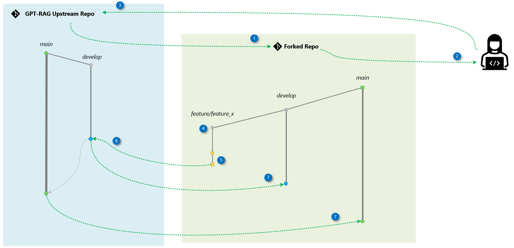

# Contributing

We appreciate contributions and suggestions for this project! Before contributing, you'll need to sign a Contributor License Agreement (CLA) to confirm that you have the rights to, and do, grant us permission to use your contribution. More details can be found at [Microsoft CLA](https://cla.opensource.microsoft.com).

This project adheres to the [Microsoft Open Source Code of Conduct](https://opensource.microsoft.com/codeofconduct/). For more information, please visit the [Code of Conduct FAQ](https://opensource.microsoft.com/codeofconduct/faq/) or contact [opencode@microsoft.com](mailto:opencode@microsoft.com) with any questions or comments.

Below, you'll find details on how our code update process works and instructions on how to contribute.

## Contribution Guidelines

To maintain project quality, the following items will be considered during the PR review.

> [!IMPORTANT]
> Adhering to these best practices will streamline the review process.

- **Target the `develop` Branch:** Always direct your pull request to the `develop` branch to ensure that changes are properly integrated into the project's development workflow.
 
- **Keep Pull Requests Small:** Aim to make your pull requests as focused and concise as possible. This makes it easier to review and ensures quicker integration into the codebase.
  
- **Associate with Prioritized Issues:** Ensure that each pull request is linked to a specific, prioritized issue in the project backlog. This helps maintain alignment with project goals and ensures that work is being done on tasks of the highest importance.

- **Include Documentation:** Every new feature or functionality must be accompanied by clear documentation explaining its purpose and configuration. This ensures others can use it independently in a self-service manner.

- **Bugs and Documentation Corrections:** Pull requests that address bugs or correct documentation do not need to be associated with prioritized issues. These can be submitted directly to maintain the quality and accuracy of the project.

- **Multi-Repo Dependencies:** If your pull request has dependencies on updates in other repositories, make sure to mention this in the pull request description. Additionally, create a corresponding pull request in the other repository to ensure synchronized updates across all related projects.


## Code Update Workflow

We use a simplified version of the [Fork and Branch Workflow](https://blog.scottlowe.org/2015/01/27/using-fork-branch-git-workflow/) alongside [Git Flow](https://nvie.com/posts/a-successful-git-branching-model/). The `main` branch always contains deployment-ready code, while the `develop` branch serves as our integration branch.

Contributors create feature branches from `develop` in their forks. Once changes are completed, they submit a pull request to the `develop` branch in the upstream repository. After review and approval, reviewers merge the changes into `develop`. Weekly, maintainers group these changes into a pull request from `develop` to `main` for final review and merging.

### Step-by-Step Process Overview

This section outlines the contribution process, highlighting the key actions for both contributors and reviewers. The accompanying diagram visually represents the workflow.



#### Contributor

1. **Fork the Repository**: Create a copy of the original repository in your GitHub account.
2. **Clone Locally**: Download the forked repository to your machine.
3. **Add Upstream**: Link the original repository as "upstream" to keep your fork synced.
4. **Create a Feature Branch**: Start a new branch for your changes.
5. **Commit and Push Changes**: Implement your changes and push them to your GitHub fork.
6. **Open a Pull Request**: Submit your changes for review. If approved, they’ll be merged into the `develop` branch and later into `main` based on the project’s release process.
7. **Keep Your Fork Updated**: Regularly sync your fork with the original repository to stay current.

## Contributor's Step-by-Step Guide

Here’s an example of how to implement a feature called `conversation-metadata` in the `gpt-rag-orchestrator` repository. The process is similar for other repositories, such as `gpt-rag-ingestion`.

1. **Create a Fork** by clicking the **Fork** button on the repository page on GitHub. Be sure to include all branches.

   `https://github.com/placerda/gpt-rag-orchestrator.git`

2. **Clone Your Fork Locally** using the standard clone command.

   `git clone https://github.com/placerda/gpt-rag-orchestrator.git`

3. **Set Upstream Remote**: Link the original repository as "upstream" for future use.

   `git remote add upstream git@github.com:Azure/gpt-rag-orchestrator.git`

4. **Create a Feature Branch** in your forked repository.

   `git checkout -b feature/conversation-metadata`

5. **Make Changes Locally**: Modify the code in your local clone. Commit your changes and push them to your fork on GitHub.

   ```bash
   git add .
   git commit -m 'Implemented conversation metadata'
   git push origin feature/conversation-metadata
   ```

6. **Create a Pull Request**: Go to your fork on GitHub and click "Pull Request." This request, aimed at the `develop` branch, will be reviewed and potentially merged by the repository maintainers.

   **Done!** Now, wait for the review and approval of your pull request. Changes may be requested.
 
#### Keeping Your Fork Updated

It’s recommended that you update your local clone after your pull request is approved. Follow these steps:

```bash
git pull upstream main
git push origin main
git pull upstream develop
git push origin develop
```

#### Cleaning Your Repo After PR Acceptance

Once your changes are merged, you can delete the feature branch from your local clone using these commands:

```bash
git switch develop
git branch -d feature/conversation-metadata
git push --delete origin feature/conversation-metadata
```