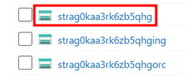
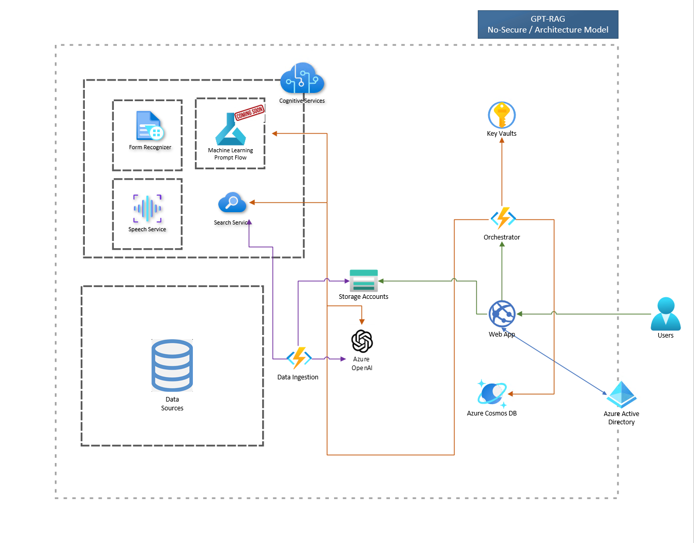
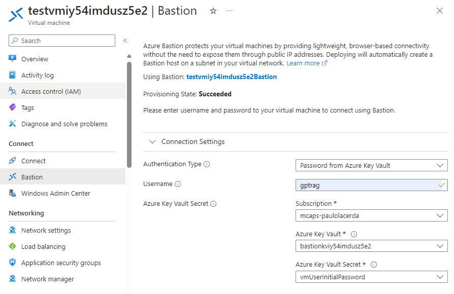

# README

The **RAG pattern** enables businesses to use the reasoning capabilities of LLMs, using their existing models to process and generate responses based on new data. RAG facilitates periodic data updates without the need for fine-tuning, thereby streamlining the integration of LLMs into businesses.

The **Enterprise RAG** Solution Accelerator (GPT-RAG) offers a robust architecture tailored for enterprise-grade deployment of the RAG pattern. It ensures grounded responses and is built on Zero-trust security and Responsible AI, ensuring availability, scalability, and auditability. Ideal for organizations transitioning from exploration and PoC stages to full-scale production and MVPs.

### Enterprise RAG Community

* [Discord Channel](https://discord.gg/28VMVKawgk) Enterprise RAG - Connected Community

### Components

* [Data ingestion](https://github.com/Azure/gpt-rag-ingestion) Optimizes data preparation for Azure OpenAI.
* [Orchestrator](https://github.com/Azure/gpt-rag-orchestrator) The system's dynamic backbone ensuring scalability and a consistent user experience.
* [App Front-End](https://github.com/Azure/gpt-rag-frontend) Built with Azure App Services and the Backend for Front-End pattern, offers a smooth and scalable user interface.
* [Teams-BOT](https://github.com/Azure/gpt-rag-bot) Constructed using Azure BOT Services, this platform enables users to engage with the Orchestrator seamlessly through the Microsoft Teams interface.

### GPT-RAG Integration HUB

* [SQL Integration](https://github.com/Azure/gpt-rag-int-sql) Connect the GPT-RAG Infrastructure to SQL using NL2SQL (Coming Soon).

### Concepts

* [RAG Pattern: What and Why?](README\_RAG.md)
* [Solution Architecture Overview](README\_ARCHITECTURE.md)
* [Enterprise RAG +Prompt Engineering+Finetuning+Train (Video in Spanish)](https://www.youtube.com/watch?v=ICsf4yirieA)

## Getting Started

To deploy Enterprise RAG and get your solution up and running, you will use **azd**, **Python**, **Git**, **Node.js 16+**, and **PowerShell 7** (only if you are using Windows).

### Prerequisites links:

* Azure Developer CLI: [Download azd for Windows](https://github.com/Azure/azure-dev/releases/download/azure-dev-cli\_1.8.1/azd-windows-amd64.msi), [Other OS's](https://learn.microsoft.com/en-us/azure/developer/azure-developer-cli/install-azd).
* Powershell (Windows only): [Powershell](https://learn.microsoft.com/en-us/powershell/scripting/install/installing-powershell-on-windows?view=powershell-7.4#installing-the-msi-package)
* Git: [Download Git](https://git-scm.com/downloads)
* Node.js 16+ [windows/mac](https://nodejs.dev/en/download/) [linux/wsl](https://nodejs.dev/en/download/package-manager/)
* Python 3.11: [Download Python](https://www.python.org/downloads/release/python-3118/)
* Initiate an [Azure AI service creation](https://portal.azure.com/#create/Microsoft.CognitiveServicesAllInOne) and agree to the Responsible AI terms (If you have not created an Azure AI service resource before)

### Installation Types

<details>

<summary>Basic Installation</summary>

After installing the pre-requirements, you just need to execute the next four steps using [Azure Developer CLI (azd)](https://aka.ms/azure-dev/install) in a terminal:

**1** Download the Repository:

```sh
azd init -t azure/gpt-rag
```

**2** Login to Azure:

```sh
azd auth login
```

**3** Start Building the infrastructure and components deployment:

```sh
azd up
```

**4** Add source documents to object storage

Upload your documents to the 'documents' folder located in the storage account. The name of this account should start with 'strag'. This is the default storage account, as shown in the sample image below.



**5** Standard Architecture:

&#x20;

</details>

<details>

<summary>Zero Trust Installation</summary>

To deploy the zero trust implementation, follow the same steps, but with the following additional steps.

**1** Download the Repository

```sh
azd init -t azure/gpt-rag
```

**2** Make sure to run the following line:

```sh
azd env set AZURE_NETWORK_ISOLATION true 
```

**3** Login to Azure:

```sh
azd auth login

```

**4** Start Building the infrastructure and components deployment:

```sh
azd up
```

After the infrastructure is provisioned and before starting the deployment of the components, you will be asked the following question:

Zero Trust Infrastructure enabled. Confirm you are using a connection where resources are reachable (like VM+Bastion)? \[Y/n]:

Initially, you will not be connected to the same vnet where the resources can be accessed, so answer `n`.

**5** Next, you will use the Virtual Machine with the Bastion connection (created during step 4) to continue the deployment.

Log into the created VM with the user **gptrag** and authenticate with the password stored in the keyvault, similar to the figure below:

\


**6** Upon accessing Windows, install [Powershell](https://learn.microsoft.com/en-us/powershell/scripting/install/installing-powershell-on-windows?view=powershell-7.4#installing-the-msi-package), as the other prerequisites are already installed on the VM.

**7** Open the command prompt and run the following command to update azd to the latest version:

```
choco upgrade azd  
```

After updating azd, simply close and reopen the terminal.

**8** Create a new directory, for example, `gptrag` then enter the created directory.

```
mkdir gptrag  
cd gptrag  
```

To finalize the procedure, execute the subsequent commands in the command prompt to successfully complete the deployment:

```
azd init -t azure/gpt-rag  
azd auth login   
azd env refresh  
azd package  
azd deploy  
```

Note: when running the `azd init ...` and `azd env refresh`, use the same environment name, subscription, and region used in the initial provisioning of the infrastructure.

Done! Zero trust deployment is completed.

**9** Zero Trust Architecture:&#x20;


</details>

<details>

<summary>Zero Trust Multi Project Scale Installation</summary>

Multi Project Architecture

.png>)

</details>

### Additional Customizations

Consult the [Custom Deployment section](README\_CUSTOM\_DEPLOY.md) for detailed instructions on personalizing installations, including the modification of names, tags, and Responsable AI policies to align with company specific standards.

### Additional Resources

#### Troubleshooting

Look at the [Troubleshooting](TROUBLESHOOTING.md) page in case you face some error in the deployment process.

#### Pricing Estimation

* [Pricing Model](https://github.com/Azure/GPT-RAG/wiki/GPT%E2%80%90RAG-%E2%80%90-Pricing-Model)

#### Governance

* [Governance Model](https://share.mindmanager.com/#publish/9ogrdWqzmAzZB6ilgURohV4lj1LriKjOWc0w\_u2U)

### Contributing

This project welcomes contributions and suggestions. Most contributions require you to agree to a Contributor License Agreement (CLA) declaring that you have the right to, and actually do, grant us the rights to use your contribution. For details, visit https://cla.opensource.microsoft.com.

When you submit a pull request, a CLA bot will automatically determine whether you need to provide a CLA and decorate the PR appropriately (e.g., status check, comment). Simply follow the instructions provided by the bot. You will only need to do this once across all repos using our CLA.

This project has adopted the [Microsoft Open Source Code of Conduct](https://opensource.microsoft.com/codeofconduct/). For more information see the [Code of Conduct FAQ](https://opensource.microsoft.com/codeofconduct/faq/) or contact [opencode@microsoft.com](mailto:opencode@microsoft.com) with any additional questions or comments.

### Trademarks

This project may contain trademarks or logos for projects, products, or services. Authorized use of Microsoft trademarks or logos is subject to and must follow [Microsoft's Trademark & Brand Guidelines](https://www.microsoft.com/en-us/legal/intellectualproperty/trademarks/usage/general). Use of Microsoft trademarks or logos in modified versions of this project must not cause confusion or imply Microsoft sponsorship. Any use of third-party trademarks or logos are subject to those third-party's policies.
