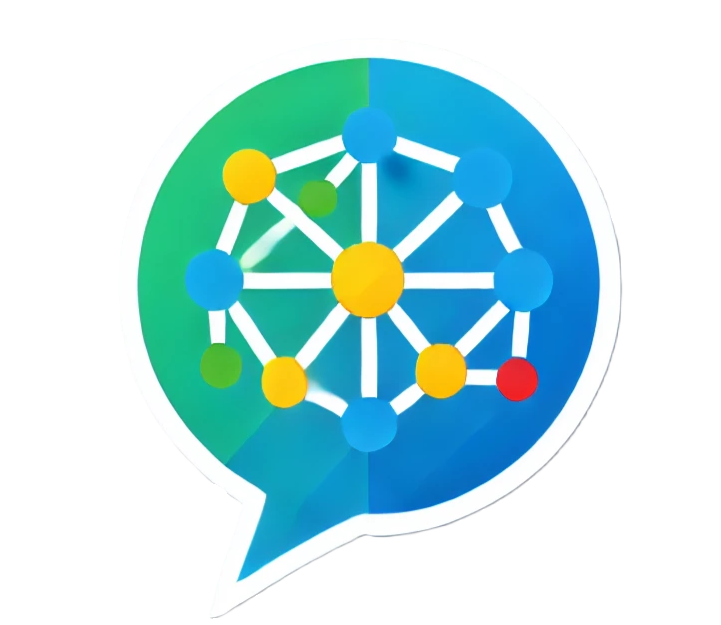
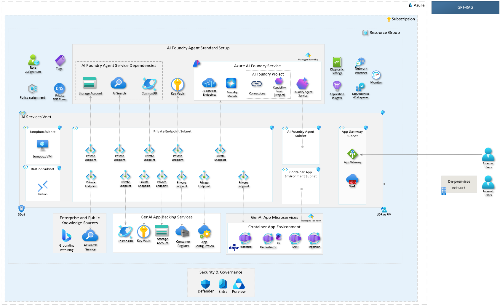

<!-- 
page_type: sample
languages:
- azdeveloper
- powershell
- bicep
products:
- azure
- azure-openai
- azure-ai-search
urlFragment: GPT-RAG
name: Multi-repo ChatGPT and Enterprise data with Azure OpenAI and AI Search
description: GPT-RAG core is a Retrieval-Augmented Generation pattern running in Azure, using Azure AI Search for retrieval and Azure OpenAI large language models to power ChatGPT-style and Q&A experiences.
-->
<!-- YAML front-matter schema: https://review.learn.microsoft.com/en-us/help/contribute/samples/process/onboarding?branch=main#supported-metadata-fields-for-readmemd -->

# GPT-RAG Solution Accelerator

The **RAG pattern** enables businesses to use the reasoning capabilities of LLMs, using their existing models to process and generate responses based on new data. RAG facilitates periodic data updates without the need for fine-tuning, thereby streamlining the integration of LLMs into businesses. 

The **Enterprise RAG** Solution Accelerator (GPT-RAG) offers a robust architecture tailored for enterprise-grade deployment of the RAG pattern. It ensures grounded responses and is built on Zero-trust security and Responsible AI, ensuring availability, scalability, and auditability. Ideal for organizations transitioning from exploration and PoC stages to full-scale production and MVPs.

### Zero Trust Architecture Deployment

For more secure and isolated deployments, you can opt for the Zero Trust architecture. This architecture is ideal for production environments where network isolation and stringent security measures are highly valued.

 

## Contributing

We appreciate your interest in contributing to this project! Please refer to the [CONTRIBUTING.md](./CONTRIBUTING.md) page for detailed guidelines on how to contribute, including information about the Contributor License Agreement (CLA), code of conduct, and the process for submitting pull requests.

Thank you for your support and contributions!

## Trademarks

This project may contain trademarks or logos for projects, products, or services. Authorized use of Microsoft 
trademarks or logos is subject to and must follow 
[Microsoft's Trademark & Brand Guidelines](https://www.microsoft.com/en-us/legal/intellectualproperty/trademarks/usage/general).
Use of Microsoft trademarks or logos in modified versions of this project must not cause confusion or imply Microsoft sponsorship.
Any use of third-party trademarks or logos are subject to those third-party's policies.
