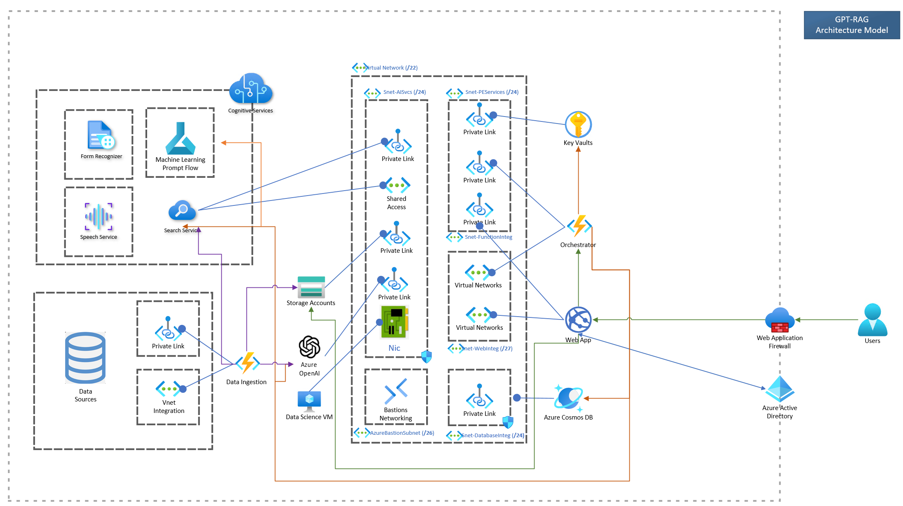

<!-- 
page_type: sample
languages:
- azdeveloper
- powershell
- bicep
products:
- azure
- azure-openai
- azure-ai-search
urlFragment: GPT-RAG
name: Multi-repo ChatGPT and Enterprise data with Azure OpenAI and AI Search
description: GPT-RAG core is a Retrieval-Augmented Generation pattern running in Azure, using Azure AI Search for retrieval and Azure OpenAI large language models to power ChatGPT-style and Q&A experiences.
-->
<!-- YAML front-matter schema: https://review.learn.microsoft.com/en-us/help/contribute/samples/process/onboarding?branch=main#supported-metadata-fields-for-readmemd -->


# GPT-RAG Solution Accelerator

The **RAG pattern** enables businesses to use the reasoning capabilities of LLMs, using their existing models to process and generate responses based on new data. RAG facilitates periodic data updates without the need for fine-tuning, thereby streamlining the integration of LLMs into businesses. 

The **Enterprise RAG** Solution Accelerator (GPT-RAG) offers a robust architecture tailored for enterprise-grade deployment of the RAG pattern. It ensures grounded responses and is built on Zero-trust security and Responsible AI, ensuring availability, scalability, and auditability. Ideal for organizations transitioning from exploration and PoC stages to full-scale production and MVPs.

✨ See our [User & Admin Guide](docs/GUIDE.md) for complete setup and usage details.

## Application Components

GPT-RAG follows a modular approach, consisting of three components, each with a specific function.

* **[Data Ingestion](https://github.com/Azure/gpt-rag-ingestion)** - Optimizes data chunking and indexing for the RAG retrieval step.

* **Orchestrator** - Manages information retrieval and response generation. Choose between **[Functional](https://github.com/Azure/gpt-rag-orchestrator)** using Semantic Kernel functions or **[Agentic](https://github.com/Azure/gpt-rag-agentic)** powered by AutoGen. Refer to the deployment instructions to switch.

* **App Front-End** – Provides the user interface. Choose between the **[React Front-End](https://github.com/Azure/gpt-rag-frontend)**, the original interface built with React, or the **[Chainlit Front-End](https://github.com/Azure/gpt-rag-ui)**, supporting streaming and easy customization, used exclusively with the agentic orchestrator. Both follow the [Backend for Front-End](https://learn.microsoft.com/en-us/azure/architecture/patterns/backends-for-frontends) pattern.


<!-- * [Teams-BOT](https://github.com/Azure/gpt-rag-bot) Constructed using Azure BOT Services, this platform enables users to engage with the Orchestrator seamlessly through the Microsoft Teams interface. -->

<!-- 
Removing temporarily while not finished
## GPT-RAG Integration HUB
* [SQL Integration](https://github.com/Azure/gpt-rag-int-sql) Connect the GPT-RAG Infrastructure to SQL using NL2SQL. -->

## Concepts

If you want to learn more about the RAG Pattern and GPT-RAG architecture.

* [RAG Pattern: What and Why?](docs/RAG_CONCEPTS.md)

* [Solution Architecture Overview](docs/ARCHITECTURE.md)

<!--  -->

*  [Enterprise RAG +Prompt Engineering+Finetuning+Train (Video in Spanish)](https://www.youtube.com/watch?v=ICsf4yirieA)

<!-- ## Administration Guide

For detailed instructions on managing and configuring the system, please refer to the [Administration Guide](docs/ADMINISTRATION_GUIDE.md) 📖. -->

<!-- <a href="https://www.youtube.com/watch?v=ICsf4yirieA"></a> -->


## Setup Guide

1) **Basic Architecture Deployment:** *for quick demos with no network isolation*⚙️

Learn how to **quickly set up** the basic architecture for scenarios without network isolation. [Click the link to proceed](#basic-architecture-deployment).

2) **Standard Zero-Trust Architecture Deployment:** *fastest Zero-Trust deployment option*⚡

Deploy the solution accelerator using the standard zero-trust architecture with pre-configured solution settings. No customization needed. [Click the link to proceed](#zero-trust-architecture-deployment).

3) **Custom Zero-Trust Architecture Setup:** *most used* ⭐

Explore options for customizing the deployment of the solution accelerator with a zero-trust architecture, adjusting solution settings to your needs. [Click the link to proceed](docs/AUTOMATED_INSTALLATION.md).

4) **Step-by-Step Manual Setup: Zero-Trust Architecture:** *hands-on approach* 🛠️**

For those who prefer complete control, follow this detailed guide to manually set up the solution accelerator with a zero-trust architecture. [Click the link to proceed](docs/MANUAL_INSTALLATION.md).


## Getting Started

This guide will walk you through the deployment process of Enterprise RAG. There are two deployment options available, **Basic Architecture** and **Zero Trust Architecture**. Before beginning the deployment, please ensure you have prepared all the necessary tools and services as outlined in the **Pre-requisites** section.

**Pre-requisites**

- Azure Developer CLI: [Download azd for Windows](https://azdrelease.azureedge.net/azd/standalone/release/1.5.0/azd-windows-amd64.msi), [Other OS's](https://learn.microsoft.com/en-us/azure/developer/azure-developer-cli/install-azd).
 - Powershell 7+ (Windows only): [Powershell](https://learn.microsoft.com/en-us/powershell/scripting/install/installing-powershell-on-windows?view=powershell-7.4#installing-the-msi-package).
 - Git: [Download Git](https://git-scm.com/downloads).
 - Node.js 16+ [windows/mac](https://nodejs.dev/en/download/)  [linux/wsl](https://nodejs.dev/en/download/package-manager/)
 - Python 3.11: [Download Python](https://www.python.org/downloads/release/python-3118/).
 - Initiate an [Azure AI services creation](https://portal.azure.com/#create/Microsoft.CognitiveServicesAllInOne) and agree to the Responsible AI terms **

<!-- [AZ Module](https://learn.microsoft.com/en-us/powershell/azure/what-is-azure-powershell?view=azps-11.6.0#the-az-powershell-module) -->

** If you have not created an Azure AI service resource in the subscription before

### Basic Architecture Deployment

For quick demonstrations or proof-of-concept projects without network isolation requirements, you can deploy the accelerator using its basic architecture.


The deployment procedure is quite simple, just install the prerequisites mentioned above and follow these four steps using [Azure Developer CLI (azd)](https://aka.ms/azure-dev/install) in a terminal:


**1** Download the Repository:

```sh
azd init -t azure/gpt-rag
```

> [!Note]
> Add `-b agentic` if using the Agentic AutoGen-based orchestrator.
> ```sh
> azd init -t azure/gpt-rag -b agentic
> ```

**2** Login to Azure:

**2.a** Azure Developer CLI:

```sh
azd auth login
```

**2.b** Azure CLI:

```sh
az login
```

**3** Start Building the infrastructure and components deployment:

```sh
azd up
```

**4** Add source documents to object storage

Upload your documents to the 'documents' folder located in the storage account. The name of this account should start with 'strag'. This is the default storage account, as shown in the sample image below.

 

> [!Note]
> If you want to upload documents for ingestion into the GPT-RAG storage account, you must have the **Storage Blob Data Contributor** role assigned in Azure Entra ID.

**Done! Basic deployment is completed.**

**Recommended**: [Add app authentication](https://learn.microsoft.com/en-us/azure/app-service/scenario-secure-app-authentication-app-service). [Watch this quick tutorial](https://youtu.be/sA-an25jMB4) for step-by-step guidance.


### Zero Trust Architecture Deployment

For more secure and isolated deployments, you can opt for the Zero Trust architecture. This architecture is ideal for production environments where network isolation and stringent security measures are highly valued.

 

Before deploying the Zero Trust architecture, make sure to review the prerequisites. It's important to note that you will only need Node.js and Python for the second part of the process, which will be carried out on the VM created during the deployment of this architecture.

The deployment procedure is similar to that of the Basic Architecture, but with some additional steps. For a detailed guide on deploying this option, refer to the instructions below:

**1** Download the Repository

```sh
azd init -t azure/gpt-rag
```

> **Note**: Add `-b agentic` if using the Agentic AutoGen-based orchestrator.
> ```sh
> azd init -t azure/gpt-rag -b agentic
> ```

**2** Enable network isolation
   
```sh  
azd env set AZURE_NETWORK_ISOLATION true  
```  
 
**3** Login to Azure:

**2.a** Azure Developer CLI:

```sh
azd auth login
```

**2.b** Azure CLI:

```sh
az login
```

**4** Start Building the infrastructure and components deployment:

```sh
azd provision
```
> [!TIP]  
> The regions we test most often are  `eastus`, `eastus2`, `westus3`.

**5** Next, you will use the Virtual Machine with the Bastion connection (created during step 4) to continue the deployment.  
   
Log into the created VM with the user **gptrag** and authenticate with the password stored in the keyvault, similar to the figure below:  

<BR>   

   
**6**  Upon accessing Windows, install [Powershell](https://learn.microsoft.com/en-us/powershell/scripting/install/installing-powershell-on-windows?view=powershell-7.4#installing-the-msi-package), as the other prerequisites are already installed on the VM.  
   
**7** Open the command prompt and run the following command to update azd to the latest version:  
   
```  
choco upgrade azd  
```  
   
After updating azd, simply close and reopen the terminal.  
   
**8** Create a new directory, for example, `deploy` then enter the created directory.  
   
```  
mkdir deploy  
cd deploy  
```  
To finalize the procedure, execute the subsequent commands in the command prompt to successfully complete the deployment:

```  
azd init -t azure/gpt-rag  
azd auth login
az login 
azd env refresh
azd deploy  
```  
   
> [!Note]
> When running the ```azd init ...``` and ```azd env refresh```, use the same environment name, subscription, and region used in the initial provisioning of the infrastructure.  

> [!Note]
> Add `-b agentic` if using the Agentic AutoGen-based orchestrator.
> ```sh
> azd init -t azure/gpt-rag -b agentic
> ```

 
**Done! Zero trust deployment is completed.**

> [!Note]
> If you want to upload documents for ingestion into the GPT-RAG storage account, you must have the **Storage Blob Data Contributor** role assigned in Azure Entra ID.

**Recommended**: [Add app authentication](https://learn.microsoft.com/en-us/azure/app-service/scenario-secure-app-authentication-app-service). [Watch this quick tutorial](https://youtu.be/sA-an25jMB4) for step-by-step guidance.

## How to?

This section provides quick guides for customizing, managing, and troubleshooting your deployment.

### Customize Your Deployment

The standard deployment process sets up Azure resources and deploys the accelerator components with a standard configuration. To tailor the deployment to your specific needs, follow the steps in the [Custom Deployment](docs/CUSTOMIZATIONS.md) section for further customization options.

<!-- 

Commenting out this section as the integration hub needs to be reviewed.

### Integrate with Additional Data Sources
  
Expand your data retrieval capabilities by integrating new data sources such as Bing Custom Search, SQL Server, and Teradata. For detailed instructions, refer to the [AI Integration Hub](docs/AI_INTEGRATION_HUB.md) page. -->

### Multi-Environment Deployment

Once you've successfully deployed the GPT-RAG solution as a proof of concept and you're ready to formalize the deployment using a proper CI/CD process to accelerate your deployment to production, refer to the multi-environment deployment guides for either [Azure DevOps](./docs/AZDO-SETUP.md) or [GitHub](./docs/GH-SETUP.md).
 
### Troubleshoot Deployment Issues

If you encounter any errors during the deployment process, consult the [Troubleshooting](docs/TROUBLESHOOTING.md) page for guidance on resolving common issues.

### Evaluate Performance

To assess the performance of your deployment, refer to the [Performance Testing](docs/PERFTEST.md) guide for testing methodologies and best practices.

### Query the Conversation History

Learn how to query and analyze conversation data by following the steps outlined in the [How to Query and Analyze Conversations](docs/QUERYING_CONVERSATIONS.md) document.

### Estimate Pricing

Understand the cost implications of your deployment by reviewing the [Pricing Model](docs/CALCULATOR.md) for detailed pricing estimation.

### Manage Governance

Ensure proper governance of your deployment by following the guidelines provided in the [Governance Model](https://share.mindmanager.com/#publish/9ogrdWqzmAzZB6ilgURohV4lj1LriKjOWc0w_u2U).

## Enterprise RAG Community

* [Discord Channel](https://discord.gg/28VMVKawgk) Enterprise RAG - Connected Community

## Contributing

We appreciate your interest in contributing to this project! Please refer to the [CONTRIBUTING.md](./CONTRIBUTING.md) page for detailed guidelines on how to contribute, including information about the Contributor License Agreement (CLA), code of conduct, and the process for submitting pull requests.

Thank you for your support and contributions!

## Trademarks

This project may contain trademarks or logos for projects, products, or services. Authorized use of Microsoft 
trademarks or logos is subject to and must follow 
[Microsoft's Trademark & Brand Guidelines](https://www.microsoft.com/en-us/legal/intellectualproperty/trademarks/usage/general).
Use of Microsoft trademarks or logos in modified versions of this project must not cause confusion or imply Microsoft sponsorship.
Any use of third-party trademarks or logos are subject to those third-party's policies.
