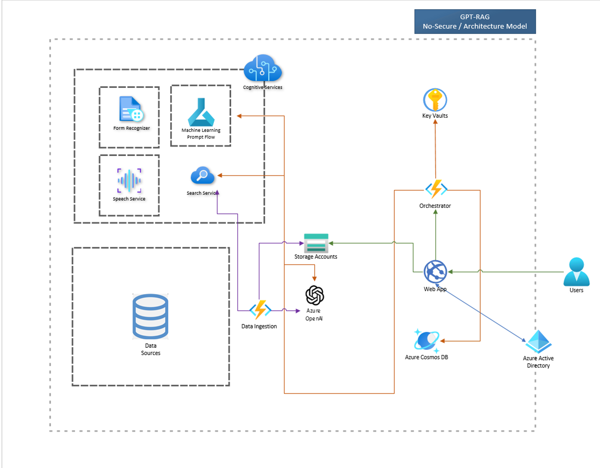
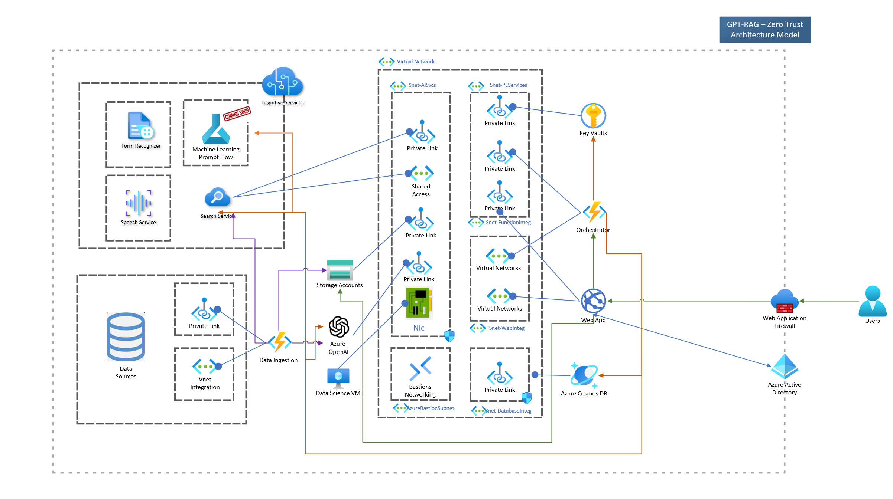
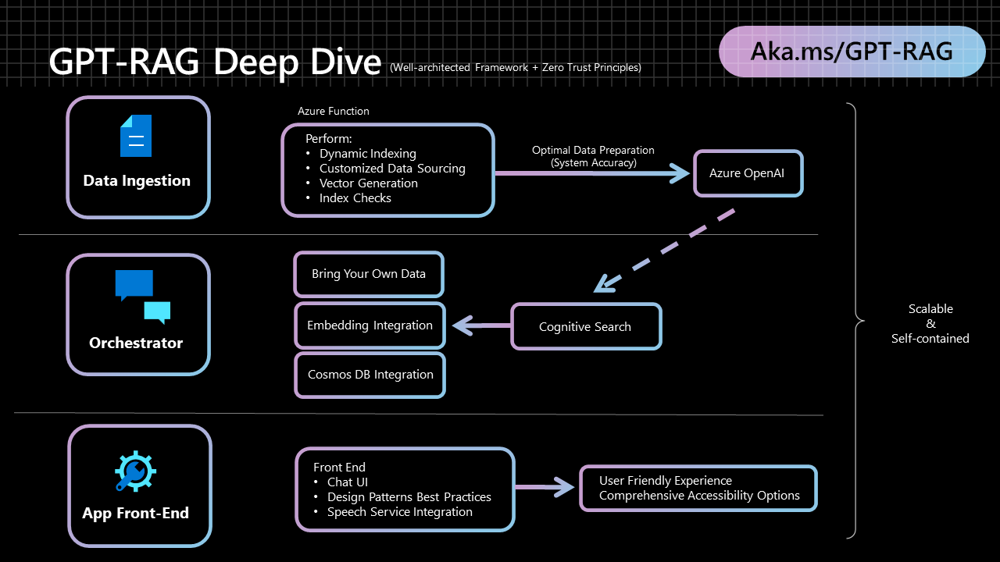

# Components

**1** [Data ingestion](https://github.com/Azure/gpt-rag-ingestion)

**2** [Orchestrator](https://github.com/Azure/gpt-rag-orchestrator)

**3** [App Front-End](https://github.com/Azure/gpt-rag-frontend)

# Video GPT-RAG+Prompt Engineering+Finetuning+Train (Spanish)

[](https://www.youtube.com/watch?v=ICsf4yirieA)

# What is a RAG pattern?


Reference implementation of the Retrieval-Augmented Generation (RAG) pattern. 

# Why to start with RAG pattern?


## GPT-RAG / Simple Architecture (NoSecure) Architecture Overview




## GPT-RAG / Zero Trust Architecture Overview



**Connectivity Components:**

- Azure Virtual Network (vnet) to Secure Data Flow (Isolated, Internal inbound & outbound connections).
- Azure Front Door (LB L7) + Web Application Firewall (WAF) to Secure Internet Facing Components.
- Bastion (RDP/SSH over TLS), secure remote desktop access solution for VMs in the virtual network.
- Jumpbox, a secure jump host to access VMs in private subnets.

**AI Workloads:** 

- Azure Open AI, a managed AI service for running advanced language models like GPT-4.
- Private DNS Zones for name resolution within the virtual network and between VNets.
- Cosmos DB, a globally distributed, multi-model database service to support AI applications with Analytical Storage enabled for future usage.
- Web applications in Azure Web App.
- Azure AI services for building intelligent applications.
- High Availability & Disaster Recovery Ready Solution.
- Audit Logs, Monitoring & Observability (App Insight)
- Continuous Operational Improvement

## Architecture Deep Dive



**1** [Data ingestion](https://github.com/Azure/gpt-rag-ingestion) Optimizes data preparation for Azure OpenAI

**2** [Orchestrator](https://github.com/Azure/gpt-rag-orchestrator) The system's dynamic backbone ensuring scalability and a consistent user experience

**3** [App Front-End](https://github.com/Azure/gpt-rag-frontend) Built with Azure App Services and the Backend for Front-End pattern, offers a smooth and scalable user interface

<!-- ## Prerequisites

- [Azure Developer CLI](https://aka.ms/azure-dev/install) -->

## How to Deploy GPT-RAG

To deploy this solution you just need to execute the next steps:

**1) Provision required Azure services**

You can do it by clicking on the following button

[](https://portal.azure.com/#create/Microsoft.Template/uri/https%3A%2F%2Fraw.githubusercontent.com%2Fazure%2Fgpt-rag%2Fmain%2Finfra%2Fmain.json)

or by using [Azure Developer CLI (azd)](https://aka.ms/azure-dev/install) executing the following lines in terminal

```
azd auth login
azd init -t azure/gpt-rag
azd up
```

Important: when selecting the target location check [here](https://learn.microsoft.com/en-us/azure/cognitive-services/openai/concepts/models) the regions that currently support the Azure OpenAI models you want to use.

**2) Ingestion Component** 

Use [Data ingestion](https://github.com/Azure/gpt-rag-ingestion) repo template to create your data ingestion git repo and execute the steps in its **Deploy** section.

**3) Orchestrator Component**

Use [Orchestrator](https://github.com/Azure/gpt-rag-orchestrator) repo template to create your orchestrator git repo and execute the steps in its **Deploy** section.

**4) Front-end Component**

Use [App Front-end](https://github.com/Azure/gpt-rag-frontend) repo template to create your own frontend git repo and execute the steps in its **Deploy** section.

<!-- ## Main components

1) [Data ingestion](https://github.com/Azure/gpt-rag-ingestion)

2) [Orchestrator](https://github.com/Azure/gpt-rag-orchestrator)

3) [App Front-End](https://github.com/Azure/gpt-rag-frontend) Built with Azure App Services and the Backend for Front-End pattern, offers a smooth and scalable user interface -->

# Project-Addons

## Pricing Estimation

* [Pricing Model](https://github.com/Azure/GPT-RAG/wiki/GPT%E2%80%90RAG-%E2%80%90-Pricing-Model)

## Governance

* [Governance Model](https://share.mindmanager.com/#publish/9ogrdWqzmAzZB6ilgURohV4lj1LriKjOWc0w_u2U)

## Technical References

* [Get started with the Cloud Adoption Framework](https://learn.microsoft.com/en-us/azure/cloud-adoption-framework/get-started/index)

* [What is an Azure landing zone?](https://learn.microsoft.com/en-us/azure/cloud-adoption-framework/ready/landing-zone/index)

* [Azure OpenAI Service](https://learn.microsoft.com/azure/cognitive-services/openai/overview)

* [Azure Cognitive Search](https://learn.microsoft.com/azure/search/search-what-is-azure-search)

* [Retrieval Augmented Generation (RAG) Paper](https://arxiv.org/abs/2005.11401)

* [Retrieval Augmented Generation (RAG) in Azure Cognitive Search](https://learn.microsoft.com/en-us/azure/search/retrieval-augmented-generation-overview)

* [Build and maintain your company Copilot with Azure ML and GPT-4](https://www.youtube.com/watch?si=B2tjsq4z4R7rksEw&v=2meEvuWAyXs)

* [Revolutionize your Enterprise Data with ChatGPT: Next-gen Apps w/ Azure OpenAI and Cognitive Search](https://aka.ms/entgptsearchblog)
  
* [Introducing Azure OpenAI Service On Your Data in Public Preview](https://techcommunity.microsoft.com/t5/ai-cognitive-services-blog/introducing-azure-openai-service-on-your-data-in-public-preview/ba-p/3847000)
  
* [Grounding LLMs](https://techcommunity.microsoft.com/t5/fasttrack-for-azure/grounding-llms/ba-p/3843857#:~:text=What%20is%20Grounding%3F,relevance%20of%20the%20generated%20output.)

* [Check Your Facts and Try Again: Improving Large Language Models with External Knowledge and Automated Feedback](https://www.microsoft.com/en-us/research/group/deep-learning-group/articles/check-your-facts-and-try-again-improving-large-language-models-with-external-knowledge-and-automated-feedback/)

* [Microsoft Guidance Validation and Robustness of responses](https://lnkd.in/ggeSQmsV)

*  [RAG vs Finetuning](https://towardsdatascience.com/rag-vs-finetuning-which-is-the-best-tool-to-boost-your-llm-application-94654b1eaba7)


## Contributing 

This project welcomes contributions and suggestions.  Most contributions require you to agree to a
Contributor License Agreement (CLA) declaring that you have the right to, and actually do, grant us
the rights to use your contribution. For details, visit https://cla.opensource.microsoft.com.

When you submit a pull request, a CLA bot will automatically determine whether you need to provide
a CLA and decorate the PR appropriately (e.g., status check, comment). Simply follow the instructions
provided by the bot. You will only need to do this once across all repos using our CLA.

This project has adopted the [Microsoft Open Source Code of Conduct](https://opensource.microsoft.com/codeofconduct/).
For more information see the [Code of Conduct FAQ](https://opensource.microsoft.com/codeofconduct/faq/) or
contact [opencode@microsoft.com](mailto:opencode@microsoft.com) with any additional questions or comments.

## Trademarks

This project may contain trademarks or logos for projects, products, or services. Authorized use of Microsoft 
trademarks or logos is subject to and must follow 
[Microsoft's Trademark & Brand Guidelines](https://www.microsoft.com/en-us/legal/intellectualproperty/trademarks/usage/general).
Use of Microsoft trademarks or logos in modified versions of this project must not cause confusion or imply Microsoft sponsorship.
Any use of third-party trademarks or logos are subject to those third-party's policies.
