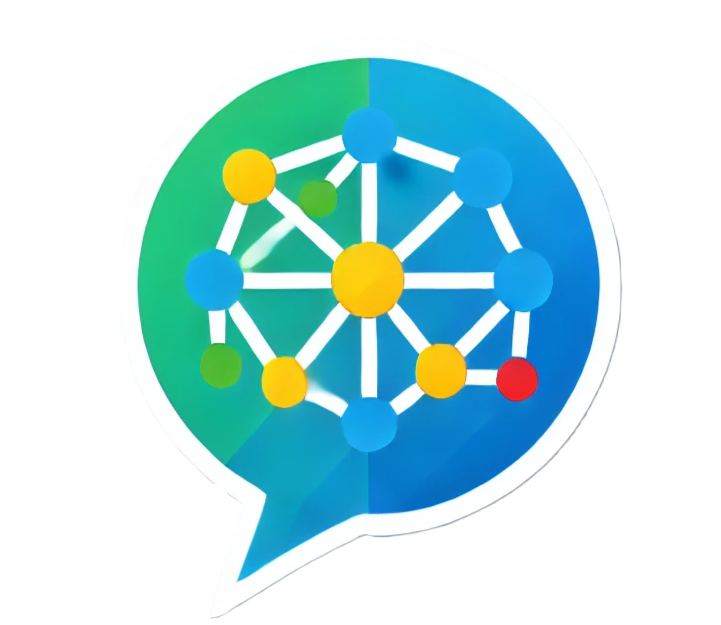
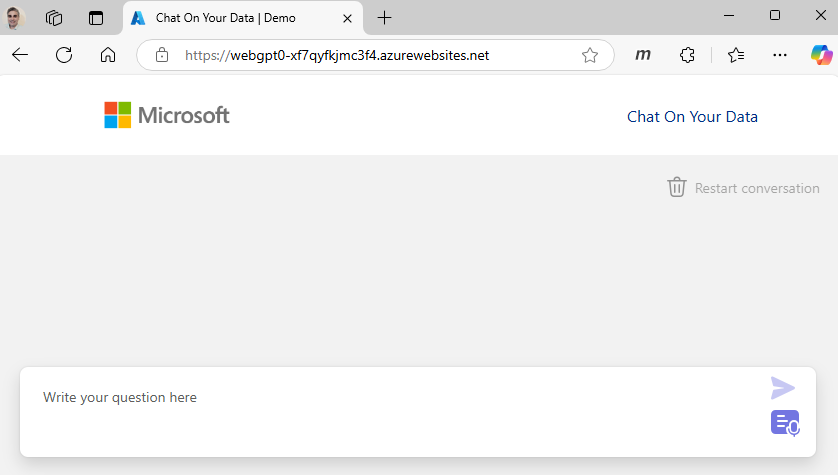

<!-- 
page_type: sample
languages:
- azdeveloper
- powershell
- bicep
products:
- azure
- azure-ai-foundry
- azure-openai
- azure-ai-search
urlFragment: GPT-RAG
name: Multi-repo ChatGPT and Enterprise data with Azure OpenAI and AI Search
description: GPT-RAG core is a Retrieval-Augmented Generation pattern running in Azure, using Azure AI Search for retrieval and Azure OpenAI large language models to power ChatGPT-style and Q&A experiences.
-->

# GPT-RAG Solution Accelerator

This solution accelerator provides architecture templates and deployment assets to help organizations build secure, scalable, and enterprise-ready **Retrieval-Augmented Generation (RAG)** solutions powered by **AI Agents**. It applies proven Azure design patterns and incorporates **Zero-Trust security**, **Responsible AI**, and **end-to-end observability**, enabling teams to operationalize Generative AI with confidence.

For full documentation, visit the **[GPT-RAG documentation site](https://azure.github.io/GPT-RAG/)**.

GPT-RAG is built on a Zero-Trust architecture to ensure that all components operate within a controlled, isolated environment. Network access is tightly governed, and communication between services follows least-privilege principles.

## Network-isolated deployments

When deploying with `NETWORK_ISOLATION=true`, run `azd provision` from your workstation, then run `scripts/postProvision.ps1` and `azd deploy` from the provisioned jumpbox or another host with VNet access. The deployment hook treats `NETWORK_ISOLATION` as the source of truth: workstation deploys are blocked for isolated environments unless `RUN_FROM_JUMPBOX=true` is set inside the VNet.

`azd provision` runs the AI Landing Zone preflight (`infra/scripts/Invoke-PreflightChecks.ps1`, shipped by the [landing-zone submodule](https://github.com/Azure/bicep-ptn-aiml-landing-zone) at `ailz_tag` v2.0.6 or newer) before Azure Resource Manager deployment starts. It validates parameter shape and BYO references, then runs a regional readiness pass: subscription drift, provider/location support for every resource the topology will create (AI Search, Cosmos DB, Container Apps, AI Foundry/Cognitive Services, Key Vault, Storage, App Configuration, Log Analytics, Application Insights), jumpbox VM SKU availability when `deployJumpbox=true`, and Azure OpenAI model quota for every entry in `modelDeploymentList`. Transient regional capacity failures (for example AI Search `InsufficientResourcesAvailable` or Cosmos DB `ServiceUnavailable`) cannot be pre-checked by Azure APIs; the preflight surfaces explicit warnings so provisioning can continue but operators understand a later failure is not a template bug. Bypass with `PREFLIGHT_SKIP=true`; bypass only the regional block with `LZ_PREFLIGHT_REGIONAL_SKIP=true`. For automated workstation provisions, set `AZURE_SKIP_NETWORK_ISOLATION_WARNING=true` so the local post-provision hook skips data-plane work without prompting; then rerun post-provision from the jumpbox with `RUN_FROM_JUMPBOX=true`.

Component image builds use Azure Container Registry remote builds in isolated environments, so Docker does not need to be installed on the jumpbox. Set `ACR_TASK_AGENT_POOL` to the landing-zone ACR task agent pool name (for example `build-pool`) before deploying from the jumpbox.

For unattended provisioning, set `AZURE_SKIP_NETWORK_ISOLATION_WARNING=true` to skip only the provisioning warning prompt. Do not use `AZURE_ZERO_TRUST`; it is no longer part of the deployment flow.

## Architecture

*Zero-Trust Architecture*

## AI Agent Capabilities

The accelerator supports a broad range of enterprise scenarios—from customer support to decision automation—by enabling systems to process complex queries across large data collections. It is designed for seamless integration into existing environments and can be adapted to both straightforward and advanced operational patterns.

A key capability of GPT-RAG is its support for **AI Agents**, enabling scenarios such as **NL2SQL query generation** and other context-aware interactions. This extensibility allows organizations to build intelligent workflows that retrieve, interpret, and act on data with contextual precision.

*GPT-RAG UI*

## Contributing

We welcome contributions! See the [contribution guidelines](https://azure.github.io/GPT-RAG/contributing/) for details on how to contribute.

## Trademarks

This project may contain trademarks or logos. Authorized use of Microsoft trademarks or logos must follow [Microsoft’s Trademark & Brand Guidelines](https://www.microsoft.com/en-us/legal/intellectualproperty/trademarks/usage/general). Modified versions must not imply sponsorship or cause confusion. Third-party trademarks are subject to their own policies.
