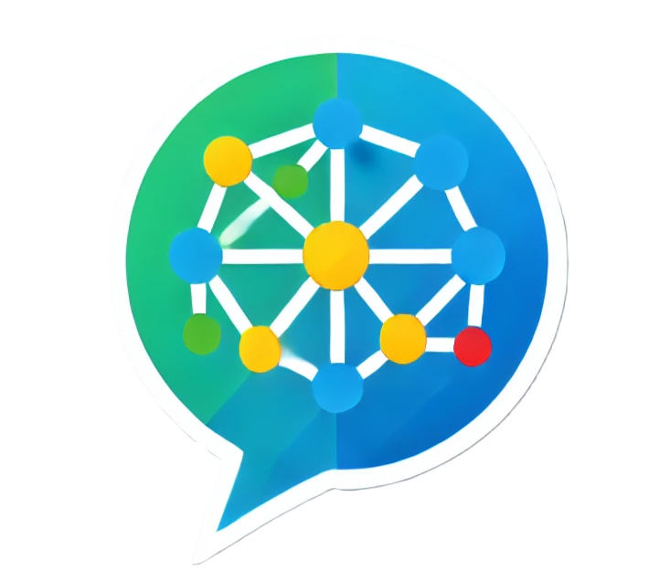

<!-- 
page_type: sample
languages:
- azdeveloper
- powershell
- bicep
products:
- azure
- azure-ai-foundry
- azure-openai
- azure-ai-search
urlFragment: GPT-RAG
name: Multi-repo ChatGPT and Enterprise data with Azure OpenAI and AI Search
description: GPT-RAG core is a Retrieval-Augmented Generation pattern running in Azure, using Azure AI Search for retrieval and Azure OpenAI large language models to power ChatGPT-style and Q&A experiences.
-->

> [!CAUTION]
> **This version is deprecated and should not be deployed.**
>
> It contains a known ingestion defect that can reprocess the same documents repeatedly, resulting in unexpected Document Intelligence consumption ([issue #437](https://github.com/Azure/GPT-RAG/issues/437)).
>
> Please deploy the [latest release](https://github.com/Azure/GPT-RAG/releases/latest) instead.

# GPT-RAG Solution Accelerator

GPT-RAG provides architecture templates and deployment assets to build and integrate Azure resources for **Retrieval-Augmented Generation (RAG)** solutions. It delivers a secure, scalable, and enterprise-grade environment based on proven Azure architecture patterns, integrating **Zero-Trust security**, **Responsible AI practices**, and **observability**. Setup and usage guidance are available in the [official GPT-RAG documentation](https://azure.github.io/GPT-RAG/).

### Contributing

We welcome contributions! See the [contribution guidelines](./CONTRIBUTING.md) for details on how to contribute.

### Trademarks

This project may contain trademarks or logos. Authorized use of Microsoft trademarks or logos must follow [Microsoft’s Trademark & Brand Guidelines](https://www.microsoft.com/en-us/legal/intellectualproperty/trademarks/usage/general). Modified versions must not imply sponsorship or cause confusion. Third-party trademarks are subject to their own policies.
