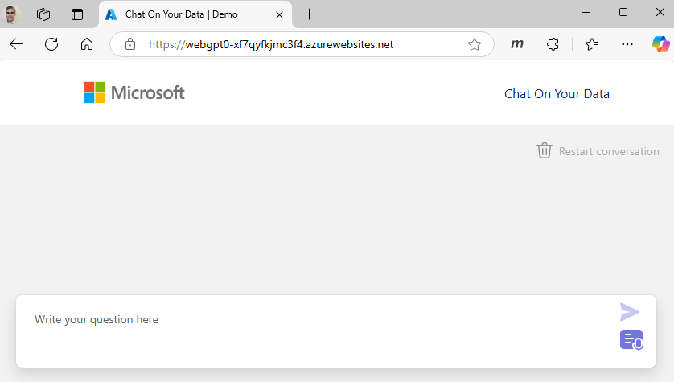

<!-- 
page_type: sample
languages:
- azdeveloper
- powershell
- bicep
products:
- azure
- azure-ai-foundry
- azure-openai
- azure-ai-search
urlFragment: GPT-RAG
name: Multi-repo ChatGPT and Enterprise data with Azure OpenAI and AI Search
description: GPT-RAG core is a Retrieval-Augmented Generation pattern running in Azure, using Azure AI Search for retrieval and Azure OpenAI large language models to power ChatGPT-style and Q&A experiences.
-->

# GPT-RAG Solution Accelerator

This solution accelerator provides architecture templates and deployment assets to help organizations build secure, scalable, and enterprise-ready **Retrieval-Augmented Generation (RAG)** solutions powered by **AI Agents**. It applies proven Azure design patterns and incorporates **Zero-Trust security**, **Responsible AI**, and **end-to-end observability**, enabling teams to operationalize Generative AI with confidence.

For full documentation, visit the **[GPT-RAG documentation site](https://azure.github.io/GPT-RAG/)**.

GPT-RAG is built on a Zero-Trust architecture to ensure that all components operate within a controlled, isolated environment. Network access is tightly governed, and communication between services follows least-privilege principles.

## Getting started

Head to the documentation site for the complete guides:

- **[Deployment Guide](https://azure.github.io/GPT-RAG/deploy/)** covers Basic, Zero Trust, and network-isolated deployments, preflight checks, jumpbox workflow, and container image builds.
- **[Grounding sources overview](https://azure.github.io/GPT-RAG/howto_grounding_overview/)** covers Foundry IQ, Azure AI Search, Work IQ, and how to pick a source. Deeper how-tos for each source are linked from the overview.
- **[What's New](https://azure.github.io/GPT-RAG/whatisnew/)** highlights the notable features added over time.

## Architecture

*Zero-Trust Architecture*

### Hosted conversation continuity

Hosted continuity uses Responses protocol 2.0.0 with delegated
`x-ms-user-identity` ownership from the trusted UI BFF. Activation fails closed
until the UI identity has the exact Foundry Agent Consumer role and GPT-RAG
user-identity impersonation role directly at the individual agent scope. The
hosted container receives neither role, no ownership key, and no Cosmos DB in
the no-panel topology. See the [shared ownership contract](contracts/README.md)
for role IDs, validation rules, and the disabled capability fallback.

## AI Agent Capabilities

The accelerator supports a broad range of enterprise scenarios, from customer support to decision automation, by enabling systems to process complex queries across large data collections. It is designed for seamless integration into existing environments and can be adapted to both straightforward and advanced operational patterns.

A key capability of GPT-RAG is its support for **AI Agents**, enabling scenarios such as **NL2SQL query generation** and other context-aware interactions. This extensibility allows organizations to build intelligent workflows that retrieve, interpret, and act on data with contextual precision.

*GPT-RAG UI*

## Contributing

We welcome contributions! See the [contribution guidelines](https://azure.github.io/GPT-RAG/contributing/) for details on how to contribute.

## Trademarks

This project may contain trademarks or logos. Authorized use of Microsoft trademarks or logos must follow [Microsoft’s Trademark & Brand Guidelines](https://www.microsoft.com/en-us/legal/intellectualproperty/trademarks/usage/general). Modified versions must not imply sponsorship or cause confusion. Third-party trademarks are subject to their own policies.
