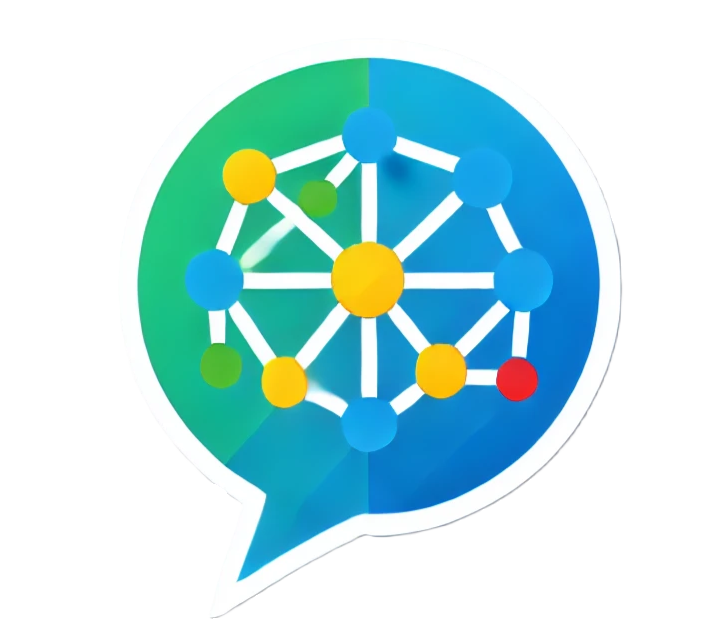
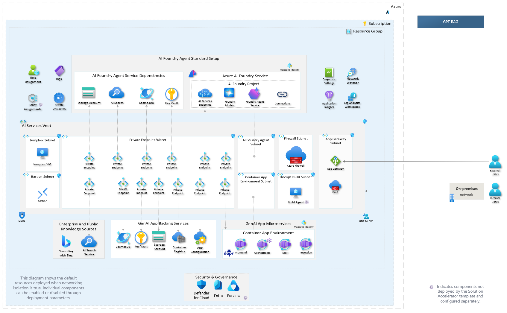

<!--
page_type: sample
languages:
- azdeveloper
- powershell
- bicep
products:
- azure
- azure-ai-foundry
- azure-openai
- azure-ai-search
urlFragment: agent-landing-zone
name: Agent Landing Zone
description: Secure, enterprise-ready landing zone for deploying AI agent applications on Microsoft Foundry, with Zero-Trust networking and IaC-first deployment.
-->

# Agent Landing Zone

Secure, enterprise-ready landing zone for deploying AI agent applications on Microsoft Foundry.

> [!NOTE]
> Version 4.0.0 and later support new deployments only. Environments created with releases earlier than 4.0.0 are not upgraded in place; redeploy into a new environment. Earlier release tags remain available.

## Architecture

## Deploy

Choose one of two options:

| Option | Commands | What you get |
|---|---|---|
| Full stack | `azd up` | Infrastructure plus the UI, orchestrator, and ingestion applications. |
| Infrastructure only | `azd provision`, then `azd deploy` later | The landing zone infrastructure now; deploy applications when you are ready. |

To deploy your own application instead of the default components, describe it in `app-definition.json`. See `samples/custom-app` for an example.

Prerequisites, network-isolated deployment, and configuration are covered in the [central documentation](#documentation).

## Components

Component versions for this release are pinned in [manifest.json](manifest.json).

| Component | Repository | Version |
|---|---|---|
| UI | [Azure/agent-app-ui](https://github.com/Azure/agent-app-ui) | see `manifest.json` |
| Orchestrator | [Azure/agent-app-orchestrator](https://github.com/Azure/agent-app-orchestrator) | see `manifest.json` |
| Ingestion | [Azure/agent-app-ingestion](https://github.com/Azure/agent-app-ingestion) | see `manifest.json` |

## Documentation

The full documentation lives in the Agent Landing Zone section of the [AI Landing Zones documentation site](https://azure.github.io/AI-Landing-Zones/agent-landing-zone/).

## Contributing

See [CONTRIBUTING.md](CONTRIBUTING.md), [SECURITY.md](SECURITY.md), and [SUPPORT.md](SUPPORT.md). Release history is in [CHANGELOG.md](CHANGELOG.md).

## Trademarks

This project may contain trademarks or logos for projects, products, or services. Authorized use of Microsoft trademarks or logos is subject to and must follow [Microsoft's Trademark & Brand Guidelines](https://www.microsoft.com/legal/intellectualpropertyandcustomerinfo/trademarks/usage/general). Use of Microsoft trademarks or logos in modified versions of this project must not cause confusion or imply Microsoft sponsorship. Any use of third-party trademarks or logos is subject to those third-party's policies.
