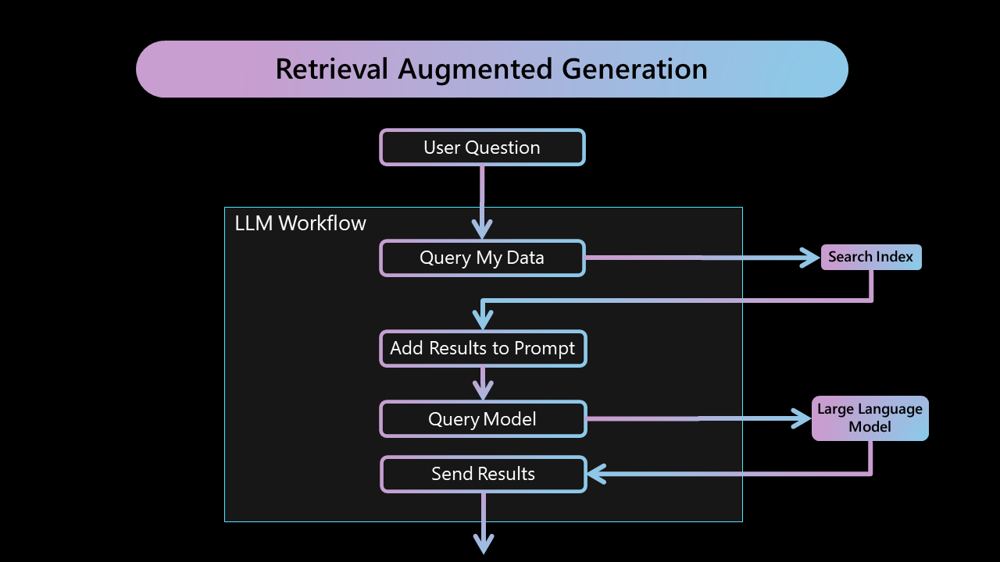
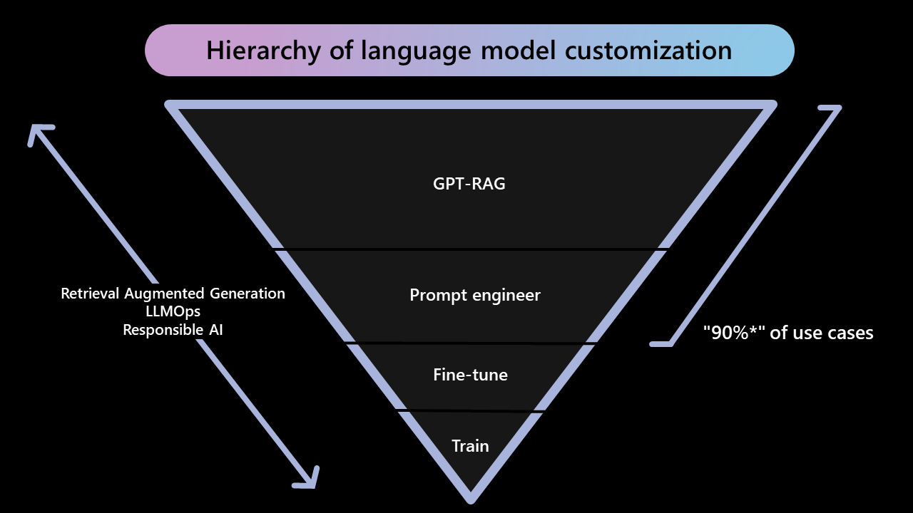

This section provides information about the Retrieval-Augmented Generation (RAG) pattern. It includes a description of the pattern, reasons for starting with it, and technical references related to RAG.

## What is a RAG pattern?

Reference implementation of the Retrieval-Augmented Generation (RAG) pattern. 

## Why to start with RAG pattern?

### Technical References

* [Retrieval Augmented Generation (RAG) Paper](https://arxiv.org/abs/2005.11401)

* [Retrieval Augmented Generation (RAG) in Azure Cognitive Search](https://learn.microsoft.com/en-us/azure/search/retrieval-augmented-generation-overview)

* [Build and maintain your company Copilot with Azure ML and GPT-4](https://www.youtube.com/watch?si=B2tjsq4z4R7rksEw&v=2meEvuWAyXs)

* [Revolutionize your Enterprise Data with ChatGPT: Next-gen Apps w/ Azure OpenAI and Cognitive Search](https://aka.ms/entgptsearchblog)
  
* [Introducing Azure OpenAI Service On Your Data in Public Preview](https://techcommunity.microsoft.com/t5/ai-cognitive-services-blog/introducing-azure-openai-service-on-your-data-in-public-preview/ba-p/3847000)
  
* [Grounding LLMs](https://techcommunity.microsoft.com/t5/fasttrack-for-azure/grounding-llms/ba-p/3843857#:~:text=What%20is%20Grounding%3F,relevance%20of%20the%20generated%20output.)

* [Check Your Facts and Try Again: Improving Large Language Models with External Knowledge and Automated Feedback](https://www.microsoft.com/en-us/research/group/deep-learning-group/articles/check-your-facts-and-try-again-improving-large-language-models-with-external-knowledge-and-automated-feedback/)

* [Microsoft Guidance Validation and Robustness of responses](https://lnkd.in/ggeSQmsV)

* [RAG vs Finetuning](https://towardsdatascience.com/rag-vs-finetuning-which-is-the-best-tool-to-boost-your-llm-application-94654b1eaba7)
