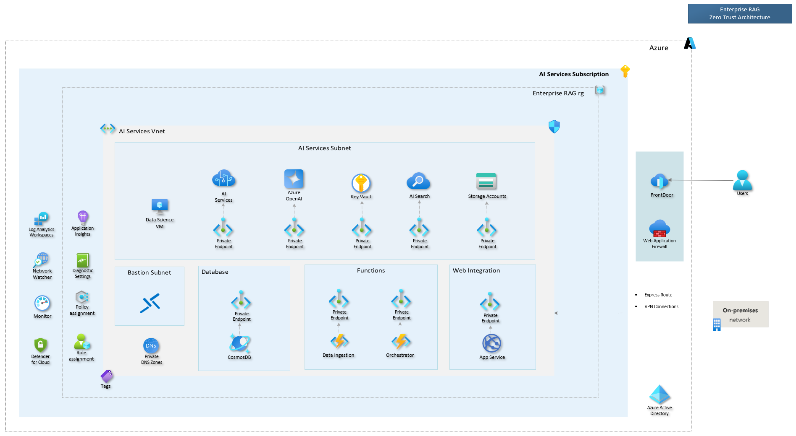

This section provides more information about the GPT-RAG architecture. It includes an overview of the GPT-RAG/Basic Architecture and GPT-RAG/Zero Trust architectures. The connectivity components and AI workloads involved in each architecture are described. Additionally, there is an architecture deep dive section that explains the data ingestion, orchestrator, and app front-end components of the system. There are also technical references related to the Architecture.

## Enterprise RAG (GPT-RAG) Architecture

### Basic Architecture

The Basic Architecture is an ideal choice for quick demonstrations or Proof of Concept (PoC) scenarios where network isolation is not a primary concern. This model allows for a swift deployment of the accelerator, providing a straightforward and efficient way to test its capabilities.

### Zero Trust Architecture

The Zero Trust Architecture is designed for deployments that require a higher level of security and network isolation. This model is particularly suitable for production environments where stringent security measures are paramount. It ensures that every request is authenticated and authorized, thereby significantly reducing the risk of internal threats.

 

**Connectivity Components:**

- Azure Virtual Network (vnet) to Secure Data Flow (Isolated, Internal inbound & outbound connections).
- Azure Front Door (LB L7) + Web Application Firewall (WAF) to Secure Internet Facing Components.
- Bastion (RDP/SSH over TLS), secure remote desktop access solution for VMs in the virtual network.
- Jumpbox, a secure jump host to access VMs in private subnets.

**AI Workloads:** 

- Azure Open AI, a managed AI service for running advanced language models like GPT-4.
- Private DNS Zones for name resolution within the virtual network and between VNets.
- Cosmos DB, a globally distributed, multi-model database service to support AI applications with Analytical Storage enabled for future usage.
- Web applications in Azure Web App.
- Azure AI services for building intelligent applications.
- High Availability & Disaster Recovery Ready Solution.
- Audit Logs, Monitoring & Observability (App Insight)
- Continuous Operational Improvement

### Zero Trust Architecture - Multi Project

The Multi-Project Architecture is an idea that facilitates the reuse of common components across different projects. This concept is aimed at enhancing efficiency and consistency, while also fostering a modular approach to system design. It is especially beneficial for larger organizations managing multiple projects, as it enables streamlined operations and minimizes the need for redundant resources.

 

<!-- 

Commenting out this section temporarily, as the content has become outdated.

### Architecture Deep Dive

**1** [Data ingestion](https://github.com/Azure/gpt-rag-ingestion) Optimizes data preparation for Azure OpenAI

**2** [Orchestrator](https://github.com/Azure/gpt-rag-orchestrator) The system's dynamic backbone ensuring scalability and a consistent user experience

**3** [App Front-End](https://github.com/Azure/gpt-rag-frontend) Built with Azure App Services and the Backend for Front-End pattern, offers a smooth and scalable user interface -->

### Technical References

* [Get started with the Cloud Adoption Framework](https://learn.microsoft.com/en-us/azure/cloud-adoption-framework/get-started/index)

* [What is an Azure landing zone?](https://learn.microsoft.com/en-us/azure/cloud-adoption-framework/ready/landing-zone/index)

* [Azure OpenAI Service](https://learn.microsoft.com/azure/cognitive-services/openai/overview)

* [Azure Cognitive Search](https://learn.microsoft.com/azure/search/search-what-is-azure-search)

* [Check Your Facts and Try Again: Improving Large Language Models with External Knowledge and Automated Feedback](https://www.microsoft.com/en-us/research/group/deep-learning-group/articles/check-your-facts-and-try-again-improving-large-language-models-with-external-knowledge-and-automated-feedback/)
