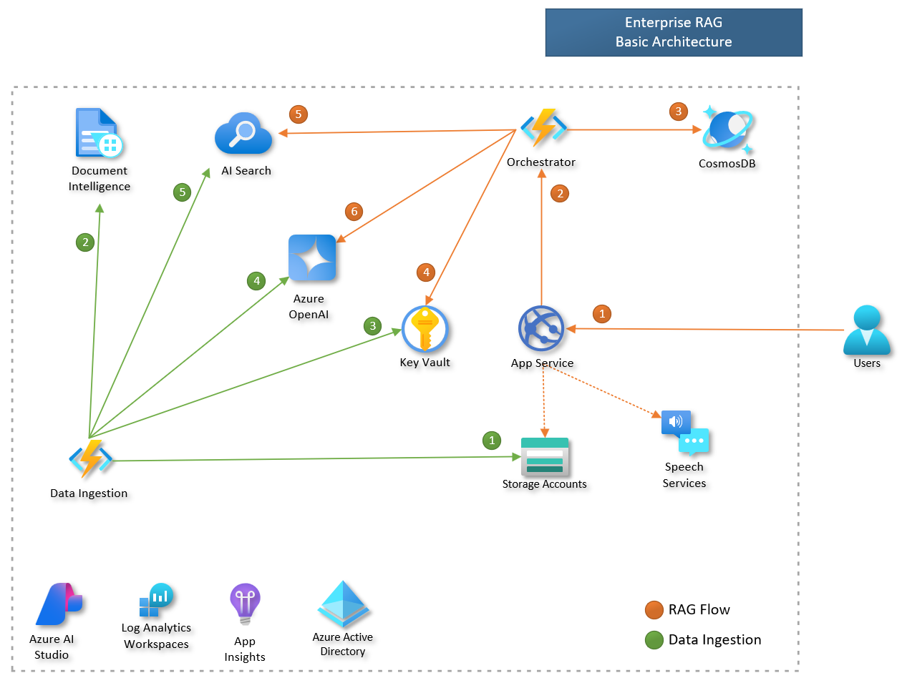
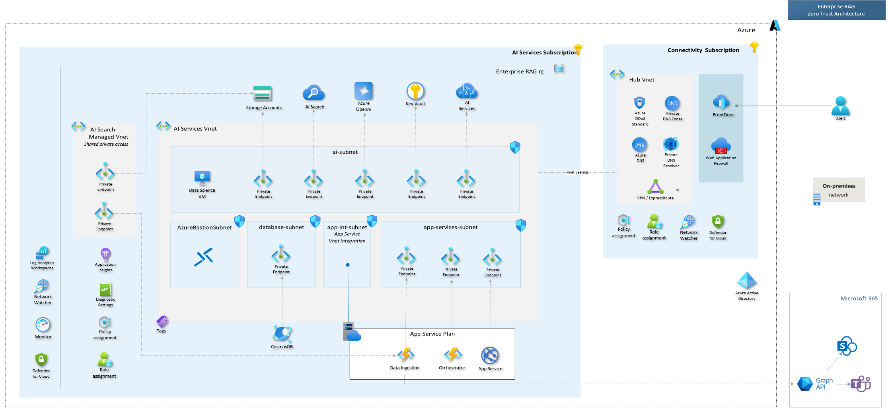
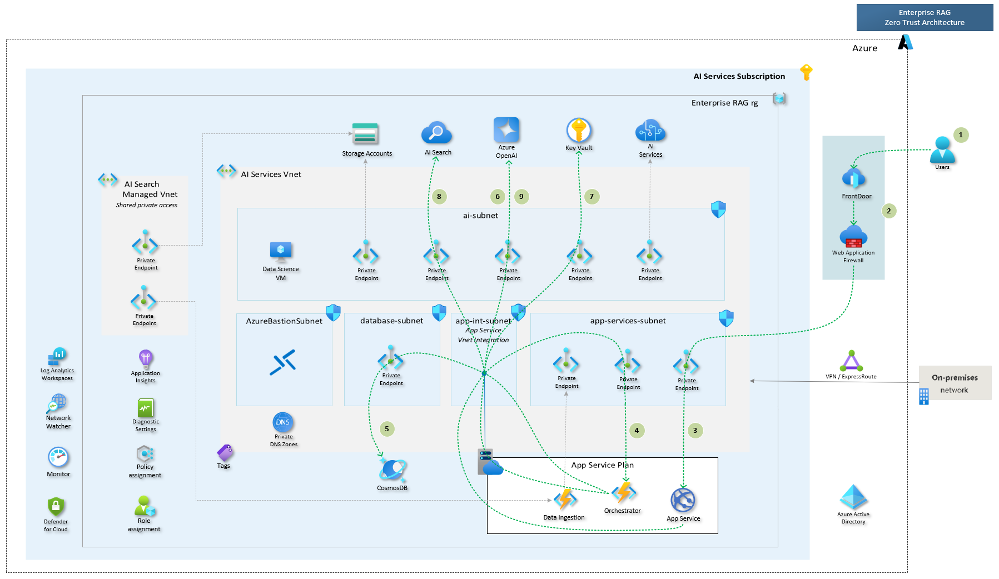
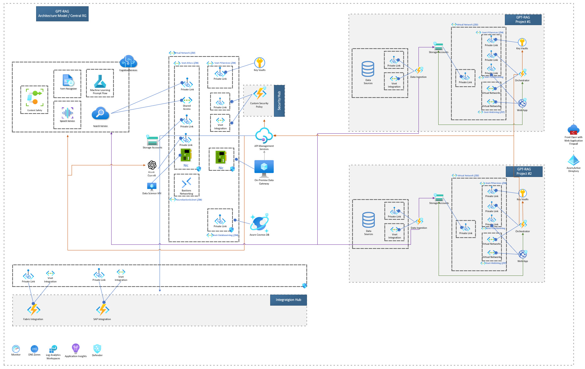

This page provides a comprehensive overview of the GPT-RAG architecture, including the Basic and Zero Trust deployment options. It details the connectivity components and AI services. The document also includes diagrams to illustrate the architecture and communication flow, and provides technical references for further understanding.

## Enterprise RAG (GPT-RAG) Architecture

The GPT-RAG, also known as the Enterprise RAG, is a model implementation of the RAG pattern, utilizing Azure Services like Azure OpenAI, AI Search, and Azure App Service. It offers two deployment options: Basic, ideal for quick demonstrations and proof-of-concepts, and Zero Trust, which provides a setup more in line with enterprise-level security needs and responsible AI principles.

GPT-RAG initiates a conversation flow with a user interaction on the frontend web app. From this point, an orchestrator manages the flow, supervising various stages of orchestration and retrieval to generate a response. The orchestrator assesses the context and intent to determine if the query is within the system's scope. If affirmative, a vector search is employed, supported by an AI search index that routinely indexes data from a storage account, to gather relevant information. This information is then used to construct an answer. If the answer is validated and aligns with Responsible AI guidelines, a response is crafted and relayed back to the frontend.

### Basic Architecture

The Basic Architecture is an ideal choice for quick demonstrations or Proof of Concept (PoC) scenarios where network isolation is not a primary concern. This model allows for a swift deployment of the accelerator, providing a straightforward and efficient way to test its capabilities.

### Zero Trust Architecture

The Zero Trust Architecture is designed for deployments that require a higher level of security and network isolation. This model is particularly suitable for production environments where stringent security measures are paramount. It ensures that every request is authenticated and authorized, thereby significantly reducing the risk of internal threats. This architecture guarantees secure, isolated, and efficient communication among the components, adhering to a zero-trust model.

 

The following Azure services are incorporated into this Zero Trust architecture.

#### Azure Connectivity Components

- **Front Door**: A scalable and secure entry point for fast delivery of your global applications. It ensures high availability and performance for your applications.

- **Web Application Firewall (WAF)**: Provides centralized protection of your web applications from common threats and vulnerabilities. It helps secure your applications against threats and attacks.

- **Azure Virtual Network (VNet)**: a logical isolation of the Azure cloud dedicated to your subscription. It provides a secure environment to deploy Azure resources, such as virtual machines (VMs) and services.
  
- **Private Endpoints**: network interfaces that connect you privately and securely to Azure services via a private link, enhancing security by avoiding exposure to the public internet.

- **Azure Bastion**: a fully managed service that provides secure and seamless RDP and SSH access to virtual machines directly through the Azure portal. It allows secure management of VMs without exposing them to the public internet.

- **DNS Private Zones**: a DNS service for managing and resolving domain names in a private VNet. It facilitates name resolution for resources within the VNet, enabling easier management and access.

- **ExpressRoute**: provides a private connection between your on-premises networks and Microsoft Azure datacenters. It ensures a more reliable and secure connection compared to typical internet connections.

- **VPN Connections**: enables the creation of secure tunnels to connect on-premises networks to Azure VNets. It provides secure communication between on-premises infrastructure and Azure resources.

#### AI Services

- **Azure AI Search**: a powerful cloud search service that helps with the Retrieval part of RAG by indexing and querying large datasets, featuring vector search capabilities.

- **Azure OpenAI**: provides access to powerful language models used to generate vector embeddings and responses for users.

#### Backend Services

- **Azure Key Vault**: a cloud service for securely storing and accessing secrets, such as API keys and passwords. It enhances security by centralizing the storage of application secrets, reducing the risk of exposure.

- **Azure Cosmos DB**: a fully managed NoSQL database service designed to provide high availability and low latency for globally distributed applications. It is used to store conversation history and metadata.

- **Azure App Service**: a fully managed platform for building, deploying, and scaling web apps. It hosts the web applications and APIs that are part of the overall GPT-RAG architecture.

#### Operational Services

- **Data Science VM**: a specially configured VM in Azure that comes pre-installed with popular data science tools. It is used to set up and access the solution in an isolated network environment.

- **Log Analytics Workspaces**: a centralized repository for collecting and analyzing log data from various sources. It enables monitoring, diagnosing, and gaining insights into the system's operations.

- **Application Insights**: a feature of Azure Monitor that provides application performance management (APM) and monitoring capabilities. It tracks and monitors the performance and usage of applications.

- **Network Watcher**: a network performance monitoring, diagnostic, and analytics service in Azure. It helps monitor and diagnose network issues, ensuring the reliability of the network.

- **Diagnostic Settings**: enables the collection of diagnostic data such as logs and metrics from Azure resources. It facilitates the monitoring and troubleshooting of resources.

- **Policy and Role Assignment**: tools for defining and enforcing organizational policies and assigning roles to users and groups. They ensure compliance and proper access control within the Azure environment.

> Note: Front Door and Web Application Firewall (WAF) are not automatically provisioned with the provided Bicep templates. They need to be configured manually.

#### Conversation Flow with the Zero Trust Architecture

In a conversation flow with the Enterprise RAG using Zero Trust Architecture, each step is tightly secured to ensure safe communication. The user request originates from their device and passes through Azure Front Door for global routing and security checks via the Web Application Firewall. It then reaches the application's frontend, hosted on an App Service through a private endpoint within the VNet, ensuring limited access. The frontend communicates with an Orchestrator Azure Function, also within the VNet, which interacts with the database, Azure OpenAI for vector embeddings, and the Azure Key Vault for API keys—all through private endpoints within designated subnets. The Orchestrator retrieves documents from the AI Search service and uses Azure OpenAI to generate a response, maintaining secure, private communication throughout. The response is then routed back to the user through the same secure path, ensuring the protection and integrity of the data flow. Azure Front Door and WAF are not provisioned by the solution's Bicep templates but can be added later after the solution deployment.

 

The sequence of steps for the communication to happen is as follows:

1. **User Interaction**: The user initiates a request from their device to the application.

2. **FrontDoor and WAF**: The request first goes to Azure FrontDoor, which provides global routing and load balancing. It directs traffic to the appropriate backend service. The request then passes through the Web Application Firewall for security checks and threat protection.

3. **App Service (Frontend)**: The secured request from the WAF is routed to the App Service running the application's frontend through its private endpoint, ensuring that the App Service is accessible only within the Virtual Network (VNet).

4. **Orchestrator (App Function)**: The frontend Web App communicates with the Orchestrator, which is an Azure Function within the same App Service Plan. The Orchestrator is also accessed via a private endpoint within the VNet.

5. **Database Access**: The Orchestrator needs to access the database to retrieve the conversation history. It connects to the database within the `database-subnet` via a private endpoint.

6. **Azure OpenAI (Vector Embedding)**: After obtaining the conversation history, the Orchestrator requests Azure OpenAI to create the vector embedding from the user's question. This communication occurs through a private endpoint within the `ai-subnet`.

7. **Key Vault (API Key)**: The Orchestrator then needs the AI Search API key. It accesses the Azure Key Vault through another private endpoint within the `ai-subnet` to securely retrieve the key.

8. **AI Search (Document Retrieval)**: With the API key, the Orchestrator makes a request to the AI Search service to obtain relevant documents. This service is also accessed via a private endpoint in the `ai-subnet`.

9. **Azure OpenAI (Response Generation)**: Finally, the Orchestrator uses the retrieved documents and sends them to Azure OpenAI to generate the response. This communication happens through the same private endpoint used earlier within the `ai-subnet`.

10. **Response Back to User**: The generated response is sent back to the frontend Web App. The App Service then delivers the response to the user through the FrontDoor.

> The diagram emphasizes inbound communication and component interactions. The return path in step 10, being straightforward, is omitted for clarity.

### Zero Trust Architecture - Multi Project

The Multi-Project Architecture is an idea that facilitates the reuse of common components across different projects. This concept is aimed at enhancing efficiency and consistency, while also fostering a modular approach to system design. It is especially beneficial for larger organizations managing multiple projects, as it enables streamlined operations and minimizes the need for redundant resources.

 

### Technical References

* [Get started with the Cloud Adoption Framework](https://learn.microsoft.com/en-us/azure/cloud-adoption-framework/get-started/index)

* [What is an Azure landing zone?](https://learn.microsoft.com/en-us/azure/cloud-adoption-framework/ready/landing-zone/index)

* [Azure OpenAI Service](https://learn.microsoft.com/azure/cognitive-services/openai/overview)

* [Azure AI Search](https://learn.microsoft.com/azure/search/search-what-is-azure-search)

* [Enhancing LLMs with Knowledge and Feedback](https://www.microsoft.com/en-us/research/group/deep-learning-group/articles/check-your-facts-and-try-again-improving-large-language-models-with-external-knowledge-and-automated-feedback/)
