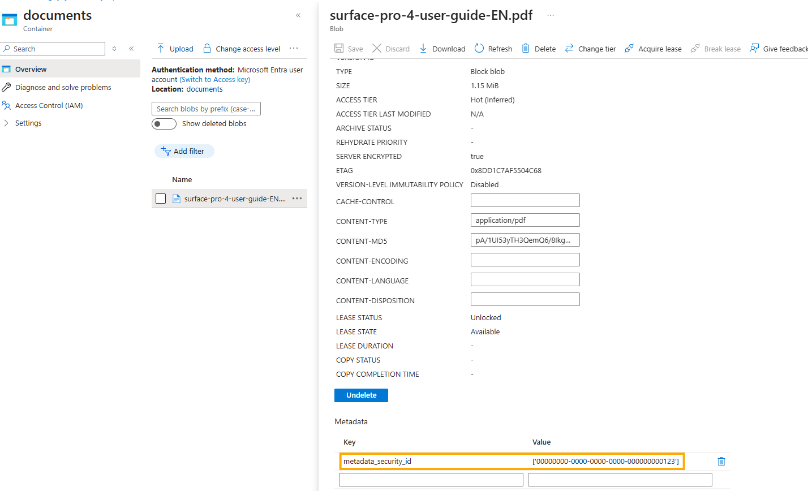

# Filter Files with AI Search Using Security Trimming

This customization allows the GPT-RAG solution to filter information during searches in AI Search based on a specific field defined in the index schema. By setting the environment variable `AZURE_SEARCH_TRIMMING` to `true`, the system will create Function Apps for Ingestion and Orchestration with this variable set, enabling the AI Search setup to create an index with a `security_id` field. This field is then mapped in the skillset for use during indexing, allowing for secure, targeted searches.

## General Instructions

In the following sections, we will provide detailed instructions on how to configure and use the `AZURE_SEARCH_TRIMMING` variable to enable this functionality.

**Pre-requisites**:

- Storage Metadata: Ensure that the files in the storage container to be indexed include a `security_id` field in their metadata. This field should contain a list of `object_ids`, separated by comma, corresponding to the Entra ID users authorized to view each document.



**General Instruction Steps**:

1. Set the `AZURE_SEARCH_TRIMMING` Variable:
Prior to deploying the solution, define the `AZURE_SEARCH_TRIMMING` environment variable as true using the following PowerShell command:

```sh
azd env set AZURE_SEARCH_TRIMMING true
```
* [Azure AI Search - Security Trimming Documentation](https://learn.microsoft.com/en-us/azure/search/search-security-trimming-for-azure-search)

2. Deploy the Solution: Deploy the GPT-RAG solution. The Function Apps for Ingestion and Orchestration will be set up with the `AZURE_SEARCH_TRIMMING` variable enabled. This will ensure that the AI Search index includes the `security_id` field and that the skillset is correctly mapped.

3. Verify Metadata: Ensure that all files in the storage container have the `security_id` metadata field populated with the relevant `object_ids`. This is crucial for restricting document access to authorized users only.

4. Check Deployment: After deployment, verify that the AI Search index has been created with the `security_id` field and that the skillset mappings are functioning correctly.