# GPT-RAG User & Admin Guide

*This comprehensive guide provides both users and administrators with detailed instructions on deploying, configuring, and managing the GPT-RAG solution within a Zero Trust Architecture.*

## Table of Contents

1. [**Overview**](#overview)
2. [**Concepts**](#concepts)
   - [2.1 Solution Architecture](#solution-architecture)
   - [2.2 Data Ingestion](#data-ingestion)
   - [2.3 Orchestration Flow](#orchestration-flow)
   - [2.4 Network Components](#network-components)
   - [2.5 Access Control](#access-control)
   - [2.6 Provision and Deployment](#provision-and-deployment)   
3. [**How-to: User**](#how-to-user)
   - [3.1 Accessing the Application](#accessing-the-application)
   - [3.2 Upload Content](#uploading-documents-for-ingestion)
   - [3.3 Reindexing Data](#reindexing-documents-in-ai-search)
4. [**How-to: Administration**](#how-to-administration)
   - [4.1 Deploying the Solution Accelerator](#deploying-the-solution-accelerator)
   - [4.2 Network Configuration Scenarios](#network-configuration-scenarios)
   - [4.3 Accessing the Data Science VM](#accessing-the-data-science-vm-via-bastion)
   - [4.4 Internal User Access](#internal-user-access)
     - [4.4.1 VNet Peering](#configuring-vnet-peering)
     - [4.4.2 Private Endpoints](#configuring-private-endpoints)
   - [4.5 External User Access](#external-user-access)
     - [4.5.1 Front Door & WAF](#configuring-front-door-and-web-application-firewall-waf)
     - [4.5.2 IP Allowlist](#configuring-ip-allowlist)
   - [4.6 Entra Authentication](#configuring-entra-authentication)
   - [4.7 Authorization Setup](#configuring-authorization) 
   - [4.8 NL2SQL and Fabric Setup](#nl2sql-and-fabric-setup)
   - [4.9 Enabling Multimodality](#enabling-multimodality)
   - [4.10 Sharepoint Indexing](#sharepoint-setup)
   - [4.11 Speech Avatar Integration](#speech-avatar-integration)
   - [4.12 Search Trimming](#search-trimming)
   - [4.13 Bringing Your Own Resources](#bring-your-own-resources)   
   - [4.14 Setting Up Git Repos](#setting-up-git-repos)
   - [4.15 Creating a Teams App Interface](#creating-a-teams-app-interface)
5. [**Reference**](#reference)
   - [5.1 Azure Resources](#azure-resources)
   - [5.2 Permissions](#permissions)    
   - [5.3 Useful Links](#useful-links) 
6. [**Troubleshooting**](#troubleshooting)

---

## Overview

The **GPT-RAG Solution Accelerator** enables organizations to enhance customer support, decision-making, and data-driven processes with **Generative AI**, empowering systems to handle complex inquiries across extensive datasets. It offers **secure, efficient deployment** for easy integration with existing operations, adaptable for both simple and advanced information retrieval.

Beyond classical **Retrieval-Augmented Generation (RAG)** capabilities, the accelerator incorporates **agents** that support sophisticated scenarios such as **NL2SQL query generation** and other context-aware data interactions. This flexibility enables advanced use cases where AI can seamlessly retrieve and interpret information, meeting diverse technical requirements.

The GPT-RAG Solution Accelerator follows a **modular approach**, consisting of three components: **[Data Ingestion](https://github.com/Azure/gpt-rag-ingestion)**, **[Orchestrator](https://github.com/Azure/gpt-rag-agentic)**, and **[App Front-End](https://github.com/Azure/gpt-rag-frontend)**, which utilizes the [Backend for Front-End](https://learn.microsoft.com/en-us/azure/architecture/patterns/backends-for-frontends) pattern to provide a scalable and efficient web interface.

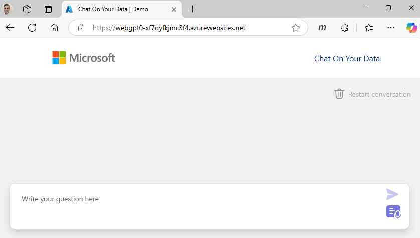
<br>*GPT-RAG UI*

### Protected Data Access with Zero Trust Design

Adopting a **Zero Trust** approach in Azure, as implemented by the GPT-RAG Solution Accelerator, provides a strong **security foundation** to safeguard your organization’s data and resources. Instead of using public endpoints, which expose services to the internet and increase susceptibility to cyber threats, this architecture ensures all access occurs within a **secure, isolated network** environment, reducing the attack surface and mitigating the risk of unauthorized access.

GPT-RAG's **Zero Trust** architecture with **private endpoints** ensures **network isolation** for sensitive data, enabling efficient Azure service integration without public IP exposure. This approach mitigates risks like data breaches and unauthorized access, creating a controlled environment that strengthens **data integrity** and confidentiality.

### Tailored Orchestration and Chunking

The GPT-RAG Solution Accelerator's **agentic orchestration** allows organizations to design **tailored orchestration flows** that coordinate multiple specialized agents. This customization ensures that complex queries are handled with precision and efficiency, leading to more accurate and contextually relevant AI responses.

Additionally, the solution’s **custom chunking strategy** tailors content segmentation to fit the unique characteristics of different data types and document structures. Aligning chunking methods to data specifics enhances retrieval speed, accuracy, and AI responsiveness, ensuring information is precise and contextually relevant.

## Concepts

### Solution Architecture

The solution leverages a **Zero Trust Architecture** to ensure maximum security and compliance. All components are securely integrated within a virtual network, and communication between services is strictly controlled.


*Zero Trust Architecture*

The diagram above illustrates the Zero Trust architecture. The **GPT-RAG Solution Accelerator** scope encompasses components within the **Enterprise RAG** resource group, providing essential Zero Trust functionalities.

### Key Resources

- **Virtual Network (VNet):** Isolates resources and controls inbound and outbound traffic.
- **Azure App Service:** Hosts the front-end application.
- **Azure Functions:** Executes serverless functions for data ingestion and orchestration.
- **Azure Storage Account:** Stores data blobs for retrieval.
- **Azure AI Search:** Indexes and searches data efficiently.
- **Azure OpenAI:** Generates responses and vector embeddings.
- **Azure AI Services:** Reads documents for data Ingestion.
- **Azure CosmosDB:** Stores conversation history and metadata to improve quality.
- **Azure Key Vault:** Manages secrets used by the solution.
- **Azure Private Endpoints:** Secures network communication between services.
- **Data Science VM:** Provides a secure Bastion environment for admins and developers to configure the solution.

For more information about Zero Trust architecture, see the [Enterprise RAG (GPT-RAG) Architecture](ARCHITECTURE.md) page.


## Data Ingestion

Data ingestion is a crucial part of the solution, enabling the system to retrieve accurate and up-to-date information.

### How It Works

1. **Data Collection:** Documents are ingested from `documents` blob container in the GPT-RAG storage account.
2. **Data Preprocessing:** The documents are prepared for indexing in AI Search Index, including breaking them into smaller chunks and optimizing them for efficient searchability.
3. **Indexing for Search:** The chunks are then indexed within Azure AI Search, allowing for efficient retrieval during query processing.

> [!NOTE]  
> The ingestion process uses a pull approach: an Azure AI Search indexer checks blob storage hourly, triggering a Function App to preprocess and chunk new documents for indexing. Execution frequency is configurable.

For more information about the data ingestion process take a look at the [GPT-RAG ingestion](https://github.com/Azure/gpt-rag-ingestion) function app repo.

## Orchestration Flow

The solution uses an **Agentic Orchestration** approach, enabling agents to operate autonomously for efficient handling of user requests. The orchestration flow described below provides a typical structure but can be tailored to meet specific requirements.

### How It Works

1. **User Interaction:** The user submits a query through the front-end application.
2. **Orchestration Process:** The Orchestrator initiates a group chat with specialized agents to address the query.
   - Agents retrieve relevant data from an AI Search index or a SQL database.
   - The GPT model generates a response based on the collected information.
3. **Response Delivery:** The front-end application returns a grounded answer to the user.

> [!NOTE]  
> Running as a Function App, the orchestrator offers scalable and efficient management of agent operations.

For more information about the agentic orchestration take a look at the [GPT-RAG orchestration](https://github.com/Azure/gpt-rag-agentic) function app repo.

## Network Components

The networking architecture for the GPT-RAG solution leverages Azure’s advanced features to ensure a secure, flexible, and isolated environment, adhering to Zero Trust principles through the use of private endpoints and stringent access controls.

1. **Azure Virtual Network (VNet):** Provides a logically isolated network environment, segmented into subnets for different application tiers, ensuring organized and secure deployment of resources.
    
2. **Azure Private Link and Private Endpoints:** Establish secure, private connections to Azure services, keeping traffic within the Microsoft backbone network and minimizing exposure to the public internet.
    
3. **Private DNS Zones:** Enable internal name resolution within the Virtual Network, ensuring secure communication between services without public exposure.
    
4. **Network Security Groups (NSGs):** Control and restrict inbound and outbound traffic to Azure resources with granular security rules, enhancing the protection of your network.
    
5. **Azure Bastion:** Provides secure access for the development team to the VM used for GPT-RAG deployment via the Azure portal, without exposing it to the internet, ensuring secure and controlled deployment activities.

> [!NOTE]  
> The Infrastructure as Code (IaC) Bicep templates included in this solution accelerator allow you to automatically provision networking resources. The templates support customization so you can follow your organization's naming conventions and address range standards. Alternatively, if you prefer, you can choose to set up these resources manually.

**External users** can connect securely via **Azure Front Door** with WAF. **Internal users** can access through **VPN** or **ExpressRoute**. **VNet Peering** or **Private Endpoints** can be configured to connect GPT-RAG resources to your VNet. Further configuration details will follow. 

<!-- *Refer to the Solution Architecture diagram for a visual representation.* -->

## Access Control

### Authentication

The solution utilizes **Azure Entra ID** (formerly Azure Active Directory) for authenticating users accessing the front-end application. This ensures secure access control and integration with organizational identity management.

### Authorization

Authorization is managed by defining specific Entra ID users and groups that are permitted to use the application. These allowed users and groups are configured directly in the App Service settings, ensuring that only authorized individuals have access to the application.

## Provision and Deployment

The provisioning and deployment processes are integral to setting up and maintaining the solution. For a comprehensive understanding of how these processes are executed in this project, please refer to the dedicated [Provisioning and Deployment](PROVISION_DEPLOYMENT.md) page.

## How-to: User

This section guides users through essential tasks required to interact with the GPT-RAG Solution Accelerator. This section is divided into three main parts:

1. **Accessing the Application**
2. **Managing Document Uploads**
3. **Reindexing Documents in AI Search**

### Accessing the Application

To connect to the web frontend of the GPT-RAG Solution Accelerator:

- **Navigate to the Web Application:**
  - Open your preferred web browser.
  - Enter the web application endpoint URL provided by your administrator. The endpoint will follow a format similar to `webgpt0-[random_suffix].azurewebsites.net`, where `[random_suffix]` is a unique identifier assigned during deployment.
  - **Example:** `https://webgpt0-abc123.azurewebsites.net`
  - Log in using your authorized credentials to access the application's interface.


<br>*GPT-RAG Front-end UI*

### Uploading Documents for Ingestion

*This task updates documents to be indexed and is intended for users responsible for performing these updates. Users who are not involved in updating documents do not need to handle this task.*

#### **Prerequisites**

Before uploading documents, ensure that you have the necessary permissions in Azure:

- **Azure Role Required:** You must have the **Storage Blob Data Contributor** role assigned in Azure Entra ID for the storage account you will be accessing. This role allows you to upload and manage blobs within the storage containers.

> [!NOTE]
> If you do not have the required role, contact your Azure administrator to obtain the necessary permissions.

#### Procedure

1. **Log in to the Azure Portal:**
   - Navigate to [Azure Portal](https://portal.azure.com/) and sign in with your Azure credentials.

2. **Locate the Storage Account:**
   - In the Azure Portal, go to the **Storage Accounts** section.

   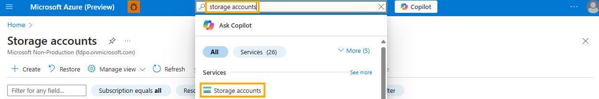
   <br>*Selecting documents storage account*
   
3. **Select the storage account name provided by your administrator.**

   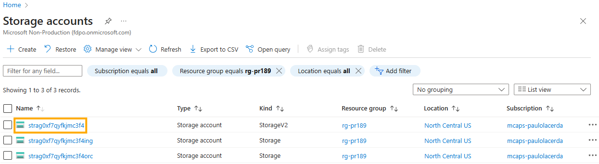
   <br>*Selecting documents storage account*

> [!TIP]
> It is the storage account **without** the suffixes **"ing"** or **"orc"**.

4. **Navigate to the Documents Container:**
   - Within the selected storage account, click on **Containers** in the left-hand menu.
   - Locate and select the **Documents** container from the list.

5. **Upload Your Files:**
   - Click the **Upload** button at the top of the container view.
   - In the upload pane, click **Browse** to select the files you wish to upload from your local machine.
   - After selecting the files, click **Upload** to begin the process.
   - Wait for the upload to complete. Once finished, your documents will be available in the **Documents** container for ingestion.

   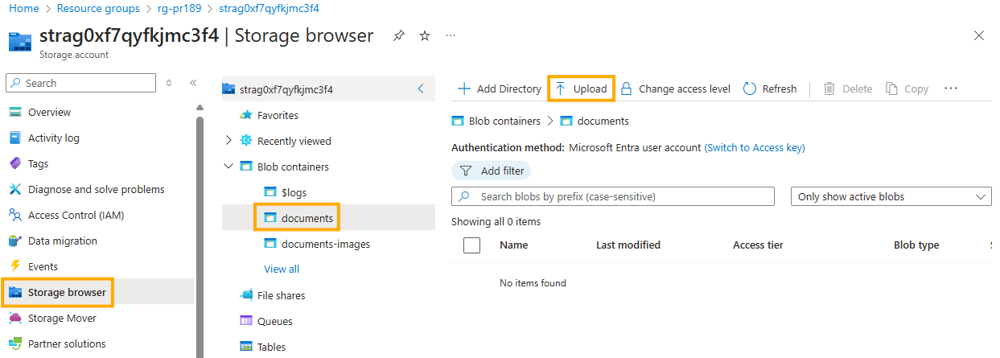
   <br>*Sample document upload screen - Azure Portal*

   > **Automatic Indexing:** The AI Search indexer automatically checks for new documents every hour, ensuring that uploaded documents are indexed without manual intervention. If you prefer to index documents immediately, refer to the **Reindexing Content in AI Search** section.

#### **Alternative Method: Using Azure Storage Explorer**

If you need to perform updates frequently, consider using **Azure Storage Explorer** for a more streamlined experience. [Visit the Azure Storage Explorer page](https://azure.microsoft.com/en-us/products/storage/storage-explorer/) to download and learn more about this convenient tool.

### Reindexing Documents in AI Search

*This task updates the retrieval index to ensure that search results remain accurate and efficient. It is designated for users responsible for indexing operations. Users who are not handling the retrieval index do not need to perform this task.*

#### **Prerequisites**

Before reindexing, ensure that you have the necessary permissions:

- **Azure Role Required:** You must have the **Search Service Contributor** or **Search Index Data Contributor** role assigned in Azure Entra ID for the AI Search resource.

> [!NOTE]
> If you do not have the required role, contact your Azure administrator to obtain the necessary permissions.

#### **Procedure**

1. **Log in to the Azure Portal:**
   - Navigate to [Azure Portal](https://portal.azure.com/) and sign in with your Azure credentials.

2. **Navigate to AI Search:**
   - In the Azure Portal, go to the **Resource Groups** section.
   - Select the resource group associated with your application.
   - Within the resource group, locate and select the **AI Search** resource.

3. **Open Search Management:**
   - In the AI Search resource overview, click on **Search Management** in the left-hand menu.

4. **Access GPT-RAG Indexer:**
   - Click on **Indexers** to view the list of available indexers.
   - Locate and select the **ragindex-indexer-chunk-documents**.

   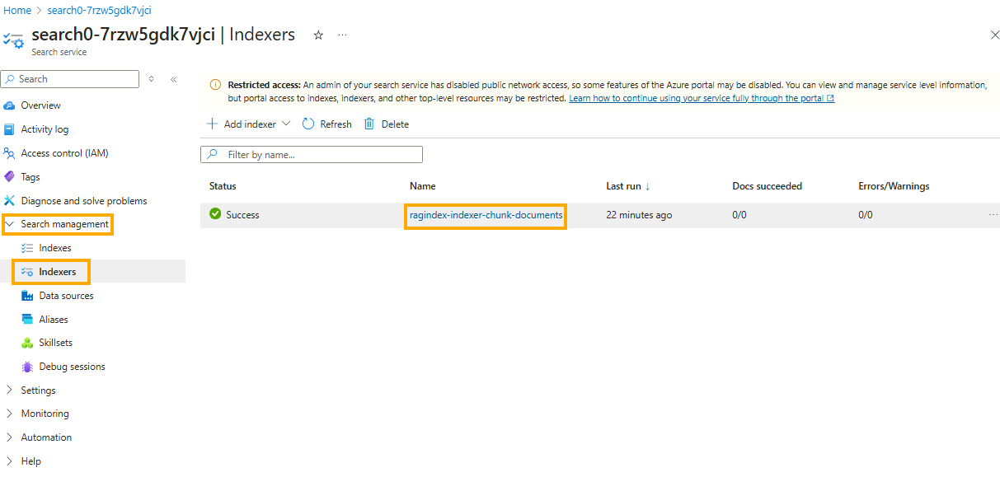
   <br>*GPT-RAG Indexer in Search Management*

5. **Run the Search Index:**
   - Click the **Run** button to initiate the reindexing process for **ragindex-indexer-chunk-documents** indxer.

   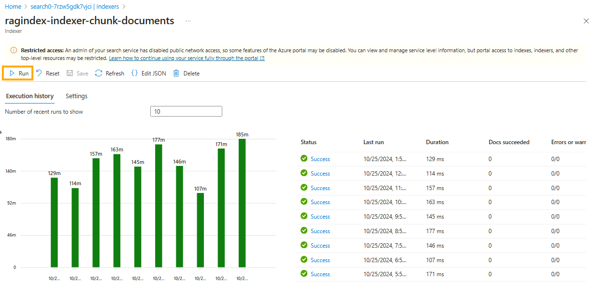
   <br>*AI Search Indexer UI*

> [!TIP]
> If you wish to reindex all content, click **Reset** before running the search index.

# How-to: Administration

This section provides step-by-step guides for common administrative tasks.

## Deploying the Solution Accelerator

This setup guide provides step-by-step instructions for provisioning a resource group with all the necessary components to ensure the solution operates efficiently. The diagram below highlights the resource group and its corresponding components, outlined in red, that will be provisioned during this process. 

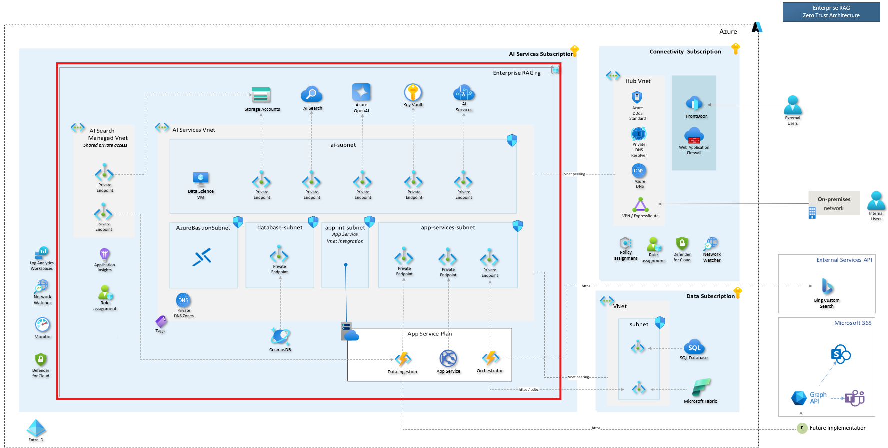
<br>*GPT-RAG Zero Trust Architecture*

### Pre-requisites

- Azure subscription with access to **Azure OpenAI**.
- You need either the **Owner** role or both the **Contributor** and **User Access Administrator** roles at the subscription level. Alternatively, you can create a custom role. [Learn how to create a **Custom Role** here](MANUAL_CUSTOM_ROLE.md).
- Confirm you have the required quota to provision resources in the chosen Azure region for deployment. <BR>For details on resources and SKUs, refer to the [Azure Resources](#azure-resources).
- Agree to the Responsible AI terms by initiating the creation of an [Azure AI service](https://portal.azure.com/#create/Microsoft.CognitiveServicesAllInOne) resource in the portal. 

> [!NOTE]
> The last step is unnecessary if an Azure AI service resource already exists in the subscription. 

#### Software pre-reqs

- Azure Developer CLI: [Download azd for Windows](https://azdrelease.azureedge.net/azd/standalone/release/1.5.0/azd-windows-amd64.msi), [Other OS's](https://learn.microsoft.com/en-us/azure/developer/azure-developer-cli/install-azd).
 - Powershell 7+ (Windows only): [Powershell](https://learn.microsoft.com/en-us/powershell/scripting/install/installing-powershell-on-windows?view=powershell-7.4#installing-the-msi-package) 
 - Git: [Download Git](https://git-scm.com/downloads)
 - Node.js 16+ [windows/mac](https://nodejs.dev/en/download/)  [linux/wsl](https://nodejs.dev/en/download/package-manager/)
 - Python 3.11: [Download Python](https://www.python.org/downloads/release/python-3118/)

<!-- [AZ Module](https://learn.microsoft.com/en-us/powershell/azure/what-is-azure-powershell?view=azps-11.6.0#the-az-powershell-module) -->

### Deployment Overview

This guide will walk you through each step required to deploy the GPT-RAG solution in a Zero Trust architecture. Follow these steps to ensure a smooth and successful deployment. You can check the [Installation and Post-Installation Checklist](INSTALLATION_CHECKLIST.md) to verify that everything is as expected.

1. **Plan Your Deployment**
2. **Download the Repository**
3. **Select Zero Trust Installation**
4. **Define Your Network Creation Scenario**
5. **Set Network Address Range (Optional)**
6. **Customize Resource Names (Optional)**
7. **Reuse Existing Resources (Optional)**
8. **Log In to Azure**
9. **Provision Infrastructure Components**
10. **Manually Configure Network Resources (Optional)**
11. **Deploy Application Components**

---

### 1. Plan Your Deployment

#### Gather Basic Information

Ensure you have the following details before starting:

- **Subscription Name**
- **Resource Group Name**
- **Azure Region**
- **Azure Environment Name** (e.g., gpt-rag-dev, gpt-rag-poc)

### Selecting the Azure Region

When selecting the Azure region for your deployment, consider the availability and quota of the resources required by the solution in the chosen region. A detailed list of resources is available in the [Azure Resources](#azure-resources) section of this guide.

As of December 19, 2024, the solution has been tested in the following regions with the default service configurations:  `eastus`, `eastus2`, `westus3`. You can select a different region if needed, but you must carefully verify the deployment compatibility for Azure OpenAI models and the availability of Semantic Ranking in Azure Cognitive Search.

#### Azure OpenAI Model Support

By default, the solution deploys a **Global Deployment** of the GPT-4o model (version 2024-11-20) and a **Standard Deployment** of the text-embedding-3-large model for embedding generation. To ensure compatibility, refer to the Azure OpenAI model summary table and region availability at the following link:  
[Azure OpenAI Model Availability](https://learn.microsoft.com/en-us/azure/ai-services/openai/concepts/models?tabs=global-standard%2Cstandard-chat-completions#model-summary-table-and-region-availability).

If your selected region does not support these default models, you have two options:

1. **Change the Default Models:**  

Before proceeding with the [Provision Infrastructure Components](#9-provision-infrastructure-components) step, you can update the default models by setting the following environment variables:

   For the Chat Completions model:
   ```bash
   azd env set AZURE_CHAT_GPT_MODEL_NAME gpt-4o
   azd env set AZURE_CHAT_GPT_MODEL_VERSION 2024-11-20
   azd env set AZURE_CHAT_GPT_DEPLOYMENT_TYPE GlobalStandard
   ```

   For the Embeddings model:
   ```bash
   azd env set AZURE_EMBEDDINGS_MODEL_NAME text-embedding-3-large
   azd env set AZURE_EMBEDDINGS_VERSION 1
   azd env set AZURE_EMBEDDINGS_VECTOR_SIZE 3072
   ```

2. **Reuse an Existing Deployment:**  
   If you prefer to reuse an existing Azure OpenAI resource, refer to the instructions in the [Reuse Azure Resources](#7-reuse-azure-resources-optional) step. 

#### Regions Without Semantic Ranking

By default, the Azure AI resource created during deployment has the [Semantic Ranking](https://learn.microsoft.com/en-us/azure/search/semantic-search-overview) feature enabled. To verify if your selected region supports this feature, refer to the region availability list for Semantic Ranking: [Azure Search Region Support](https://learn.microsoft.com/en-us/azure/search/search-region-support#azure-public-regions).

If Semantic Ranking is not available in your region, you have two options:

1. **Disable Semantic Ranking:**  
   Before proceeding with the [Provision Infrastructure Components](#9-provision-infrastructure-components) step, you can disable Semantic Ranking by setting the following environment variable:
   ```bash
   azd env set AZURE_USE_SEMANTIC_RERANKING false
   ```

2. **Reuse an Existing AI Search Resource:**  
   Similar to Azure OpenAI, you can reuse a pre-existing AI Search resource in a supported region. Detailed instructions are provided in the [Reuse Azure Resources](#7-reuse-azure-resources-optional) step.

#### Identify Your Network Setup Scenario

Select your preferred network setup:

1. **Automatic Setup with Default Address Range**  
   Automatically creates network resources with default address ranges in the GPT-RAG resource group.

   | **Network Item**        | **Address Range** |
   |-------------------------|-------------------|
   | **ai-vnet**             | 10.0.0.0/23       |
   | **ai-subnet**           | 10.0.0.0/26       |
   | **app-services-subnet** | 10.0.0.192/26     |
   | **database-subnet**     | 10.0.1.0/26       |
   | **app-int-subnet**      | 10.0.0.128/26     |
   | **AzureBastionSubnet**  | 10.0.0.64/26      |

> [!NOTE] 
> Each `/26` subnet provides 59 usable IP addresses, with Azure reserving 5 addresses per subnet.

2. **Automatic Setup with Custom Address Ranges**  
   If custom addressing is required, you can adjust address ranges in the configuration files to prevent overlap with existing networks.

> [!TIP]
> Choose this option if you want custom addressing to avoid overlap with existing networks. This helps prevent issues with direct connections using VNet peering, VPN gateways, or ExpressRoute.

3. **Manual Network Setup**  
   If you prefer to manually create the VNet, subnets, and other network resources, you can configure these outside of the Bicep templates, which will then deploy only the non-network resources.

> [!TIP]
> Choose this option if deploying across subscriptions (e.g., Connectivity subscription) or if you want to adopt a network topology different from the provided architecture.

#### Reusing Existing Resources

To optimize your setup, you can reuse non-networking resources already deployed within the same subscription, such as Azure OpenAI, Cosmos DB, and Key Vault. If you choose to reuse any of these resources, ensure you have their names and resource group details ready.

> [!IMPORTANT]
> If you’re reusing an existing Virtual Network (VNet), you must manually create all related network resources. This includes configuring subnets, private endpoints, and network interfaces as outlined in the **Manual Network Setup** scenario. In this case, the Bicep templates will not deploy network resources automatically when an existing VNet is reused.

#### Resource Naming and Tagging

By default, `azd` generates a unique, random name for each resource based on the environment name, subscription, and location. You can customize resource names during solution provisioning if desired, so this is a good time to note down your preferred names.

If you use tags to manage resources (e.g., `business-unit`, `cost-center`), define them in advance to apply during installation.

### 2. Download the Repository

Initialize the repository:

```sh
azd init -t azure/gpt-rag
```

> **Note**: Add `-b agentic` if using the Agentic AutoGen-based orchestrator.
>
> ```sh
> azd init -t azure/gpt-rag -b agentic
> ```

### 3. Select Zero Trust Installation

Enable network isolation:

```sh
azd env set AZURE_NETWORK_ISOLATION true
```

### 4. Define Your Network Creation Scenario

Select a network setup option:

- For **Automatic Setup with Default Address Ranges**, skip to Step 6.
- For **Automatic Setup with Custom Address Ranges**, proceed to Step 5.
- For **Manual Network Setup**, run the following command before continuing to Step 6.  
  More details on manual setup are provided later:

```sh
azd env set VNET_REUSE true
```

### 5. Set Custom Address Range (Optional)

To set custom address ranges, use the variables below with `azd env set`:

| **Environment Variable**               | **Network Item**      |
|----------------------------------------|-----------------------|
| `AZURE_VNET_ADDRESS`                   | AI VNet               |
| `AZURE_AI_SUBNET_PREFIX`               | AI Subnet             |
| `AZURE_APP_INT_SUBNET_PREFIX`          | App Internal Subnet   |
| `AZURE_APP_SERVICES_SUBNET_PREFIX`     | App Services Subnet   |
| `AZURE_BASTION_SUBNET_PREFIX`          | Bastion Subnet        |
| `AZURE_DATABASE_SUBNET_PREFIX`         | Database Subnet       |

Example:

```sh
azd env set AZURE_VNET_ADDRESS 10.1.0.0/23
azd env set AZURE_AI_SUBNET_PREFIX 10.1.0.0/26
azd env set AZURE_APP_SERVICES_SUBNET_PREFIX 10.1.0.64/26
azd env set AZURE_DATABASE_SUBNET_PREFIX 10.1.1.0/26
azd env set AZURE_APP_INT_SUBNET_PREFIX 10.1.0.128/26
azd env set AZURE_BASTION_SUBNET_PREFIX 10.1.0.192/26
```

### 6. Customize Resource Names (Optional)

To customize names, set environment variables for each resource. For example, the following command set the name of the Storage Account:

```sh
azd env set AZURE_STORAGE_ACCOUNT_NAME <yourResourceName>
```

See [Customizing resource names](CUSTOMIZATIONS_RESOURCE_NAMES.md) to find out which variables correspond to each resource.

### 7. Reuse Azure Resources (Optional)

You can set environment variables if you want to reuse existing resources in the same subscription.

Example for AI Services:

```sh
azd env set AI_SERVICES_REUSE true
azd env set AI_SERVICES_RESOURCE_GROUP_NAME rg-gptrag-common
azd env set AI_SERVICES_NAME my-shared-ai-service
```

More details at [Bring Your Own Resources](CUSTOMIZATIONS_BYOR.md).

### 8. Log In to Azure

Azure Developer CLI:

```sh
azd auth login
```

Azure CLI:

```sh
az login
```

### 9. Provision Infrastructure Components

Run:

```sh
azd provision
```

### 10. Manually Configure Network Resources (Optional)

This section is intended for those who have chosen to manually create their network resources. If this is not the case, skip to Step 11.

#### 10.1. Create Virtual Networks and Subnets

- Create your VNet and subnets based on your organization's network architecture.
- Ensure that address ranges do not overlap with existing VNets to maintain connectivity.
- Check this reference to learn how to create VNets and Subnets in the Azure Portal:<BR>[Quickstart: Create a virtual network using the Azure portal](https://learn.microsoft.com/azure/virtual-network/quick-create-portal)

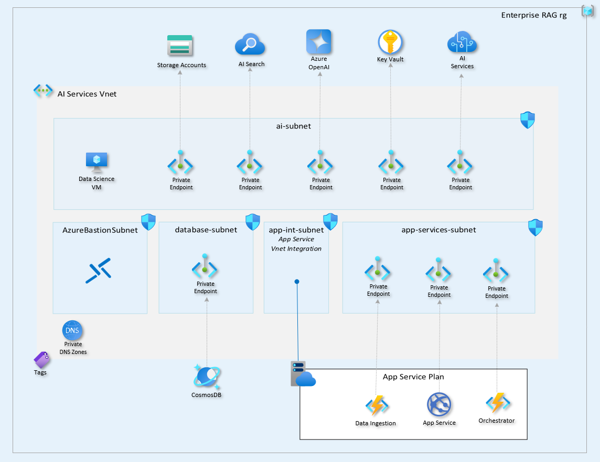

We recommend following this network topology to align with the Zero Trust architecture. However, you may use your organization’s VNet and subnet standards if preferred. For reference, the default addressing used in the Bicep template is shown below:

| **Name**                 | **Address Range** |
|--------------------------|-------------------|
| ai-vnet                  | 10.0.0.0/23       |
| ai-subnet                | 10.0.0.0/26       |
| app-services-subnet      | 10.0.0.192/26     |
| database-subnet          | 10.0.1.0/26       |
| app-int-subnet           | 10.0.0.128/26     |
| AzureBastionSubnet       | 10.0.0.64/26      |

> [!IMPORTANT]
> Use network addressing that avoids overlaps with your existing VNets. Overlapping address ranges prevent direct connections via VNet peering, VPN gateways, or ExpressRoute.

#### 10.2. Set Up Private Endpoints

- Manually create private endpoints for the following Azure services:
  - **Data Ingestion Function App**
  - **Azure Storage Account**
  - **Azure Cosmos DB**
  - **Azure Key Vault**
  - **Orchestrator Function App**
  - **Frontend Web App**
  - **Azure AI Services**
  - **Azure OpenAI**
  - **Azure Search**
- Ensure they are correctly associated with the appropriate subnets.
- Check this reference to learn how to create Private Endpoints in Azure Portal: <BR>[Create a private endpoint using the Azure portal](https://learn.microsoft.com/en-us/azure/private-link/create-private-endpoint-portal?tabs=dynamic-ip#create-a-private-endpoint)
- When creating the private endpoint in the portal, a Private DNS Zone for name resolution will also be set up. Ensure that all Private DNS Zones are created correctly.

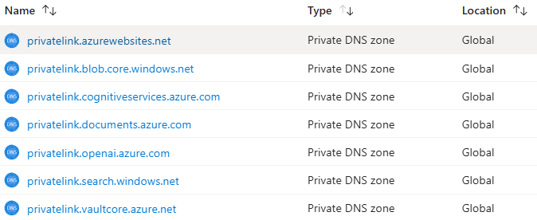

#### 10.3. Create Network Security Groups

- Define NSGs with rules that align with your security policies.
- Apply NSGs to the five subnets to control traffic flow.
- Check this reference to learn how to create Network Security Groups in Azure Portal: <BR>[Filter network traffic with a network security group using the Azure portal](https://learn.microsoft.com/azure/virtual-network/tutorial-filter-network-traffic)

#### 10.4. Configure Search Shared Private Access

Azure AI Search will access the Blob Storage Account and the Function App where the chunking function is located.

- Configure Shared Private Link with the Storage Account.
- Configure Shared Private Link with the Function App that performs the chunking.
- Check this reference to learn how to [Configure shared private link for Azure AI Search](https://learn.microsoft.com/en-us/azure/search/search-indexer-howto-access-private?tabs=portal-create)

#### 10.5. Configure App Service Plan VNet Integration

The App Service Plan supporting GPT-RAG Function Apps needs integration with the `ai-vnet`.

- Configure VNet integration for the App Service Plan.
- Check this reference to learn how to [Integrate your app with an Azure virtual network](https://learn.microsoft.com/azure/app-service/configure-vnet-integration-enable)

#### 10.6. Data Science Virtual Machine (Test VM)

- Create a Data Science Virtual Machine and configure a bastion for VM Access.
- Check this reference to learn how to [Provision a Data Science Virtual Machine](https://learn.microsoft.com/azure/machine-learning/data-science-virtual-machine/provision-vm)
- Check this reference to learn how to [Connect to a Windows VM using Azure Bastion](https://learn.microsoft.com/azure/bastion/bastion-connect-vm-rdp)

Use this configuration for the VM:
   - **Operating System**: Windows (Windows Server 2019 Datacenter)
   - **SKU**: Standard_D4s_v3 (4 vCPUs, 16 GiB memory)
   - **Image Publisher**: `microsoft-dsvm` (Data Science VM)
   - **Image Offer**: `dsvm-win-2019`


### Validation

- Ensure all network resources are deployed successfully.
- Verify that access controls and network configurations align with Zero Trust principles.

### 11. Deploy Application Components

Deploy the application components by connecting through the Data Science VM with Bastion (Step 9 or manual setup in Step 10) or by directly accessing the VNet via a secure connection like ExpressRoute or VPN.

> [!NOTE]
> If you have direct VNet access, you can deploy from your own machine, eliminating the need for a Bastion VM. Instructions for both options are below.

**Access VNet from Your Machine**:

```sh
azd deploy
```

**Access VNet from the Data Science VM (Bastion)**:

1. Log in to the VM using the password stored in Key Vault.
2. Update `azd`:

   ```sh
   choco upgrade azd
   ```

3. Create a new directory and initialize deployment:

> [!Important]  
> Use the same environment name, subscription, and region as initial provisioning.

   ```sh
   mkdir deploy
   cd deploy
   azd init -t azure/gpt-rag
   azd auth login
   az login
   azd env refresh
   azd deploy
   ```

🎉 **Congratulations! Your Zero Trust deployment is now complete.**

> [!Note]
> If you want to upload documents for ingestion into the GPT-RAG storage account, you must have the **Storage Blob Data Contributor** role assigned in Azure Entra ID.

> [!Note]  
> After the initial deployment, you may choose to customize or update specific features, such as adjusting prompts, adding a logo to the frontend, testing different chunking strategies, or configuring a custom orchestration strategy like NL2SQL. For detailed guidance on these optional customizations, refer to the deployment section in each component's repository. [Orchestrator](https://github.com/azure/gpt-rag-agentic), [Front-end](https://github.com/azure/gpt-rag-frontend), [Data Ingestion](https://github.com/Azure/gpt-rag-ingestion).

## Network Configuration Scenarios

This section outlines the various network configuration scenarios for deploying the GPT-RAG Solution Accelerator. Depending on your requirements and existing infrastructure, you can choose one of the following approaches to manage network resources:

1. **Automatic Network Creation**
2. **Automatic Creation with Custom Addressing**
3. **Manual Network Setup**

### 1. Automatic Network Creation

For a straightforward deployment, GPT-RAG can automatically create all essential network resources. Simply set `azd env set NETWORK_ISOLATION` before running `azd provision` to enable this option.

The setup includes a VNet, five subnets, a Network Security Group (NSG) for each subnet, a private endpoint for each service, a private DNS Zone, and a Network Interface for each private endpoint.

**Default Address Ranges:**

| **Network Item**         | **Address Range**    |
|--------------------------|----------------------|
| **ai-vnet**              | **10.0.0.0/23**      |
| **ai-subnet**            | **10.0.0.0/26**      |
| **app-services-subnet**  | **10.0.0.192/26**    |
| **database-subnet**      | **10.0.1.0/26**      |
| **app-int-subnet**       | **10.0.0.128/26**    |
| **AzureBastionSubnet**   | **10.0.0.64/26**     |

This option is ideal for users who want a hassle-free setup with optimal security and connectivity configurations predefined by GPT-RAG.

> [!NOTE]  
> **DNS Configuration:** When allowing GPT-RAG to create Private DNS Zones automatically, they will be created within the GPT-RAG resource group. If you prefer to configure them in your Connectivity subscription, choose the manual network configuration option (Scenario 3).

### 2. Automatic Creation with Custom Addressing

For deployments integrating with existing infrastructure, GPT-RAG allows you to adjust **network addressing** in the configuration files, preventing address overlaps while automating resource creation.

Adjust network addressing to avoid overlaps with existing VNets, as overlapping address ranges prevent direct connections via VNet peering, VPN gateways, or ExpressRoute. The default address ranges are:

| **Network Item**         | **Address Range**    |
|--------------------------|----------------------|
| **AI VNet**              | **10.0.0.0/23**      |
| **ai-subnet**            | **10.0.0.0/26**      |
| **app-services-subnet**  | **10.0.0.192/26**    |
| **database-subnet**      | **10.0.1.0/26**      |
| **app-int-subnet**       | **10.0.0.128/26**    |
| **AzureBastionSubnet**   | **10.0.0.64/26**     |

Each `/26` subnet offers 59 usable IP addresses, as Azure reserves 5 IP addresses in each subnet. The `/23` VNet allows 507 usable IP addresses. To customize address ranges, set the following environment variables:

| **Environment Variable**               | **Network Item**      |
|----------------------------------------|-----------------------|
| `AZURE_VNET_ADDRESS`                   | AI VNet               |
| `AZURE_AI_SUBNET_PREFIX`               | AI Subnet             |
| `AZURE_APP_INT_SUBNET_PREFIX`          | App Internal Subnet   |
| `AZURE_APP_SERVICES_SUBNET_PREFIX`     | App Services Subnet   |
| `AZURE_BASTION_SUBNET_PREFIX`          | Bastion Subnet        |
| `AZURE_DATABASE_SUBNET_PREFIX`         | Database Subnet       |

Set the desired address range with `azd env` command after `azd int` and before `az provision`. 

Example: `azd env set AZURE_AI_SUBNET_PREFIX 10.0.0.16/26`.

### 3. Manual Network Setup

If you need full control over network resources or are integrating GPT-RAG into a complex environment, you can manually create the necessary network resources. This approach is ideal for organizations with specific networking requirements or strict security policies. Refer to [Manually Configure Network Resources](#10-manually-configure-network-resources-optional) in the deployment procedure for more details on setting up your network.

> [!NOTE]
> **User Connectivity:** Regardless of the network configuration approach you select, you may need to configure additional network settings to enable connectivity for external or internal users. Refer to the **Internal User Access** and **Internal User Access** sections in this guide for detailed instructions tailored to your specific access requirements.

## Accessing the Data Science VM via Bastion

After deploying the Solution Accelerator, administrators and dev teams may need to access a Test Virtual Machine (VM) for configuration, customization, or deployment tasks. This section outlines the procedure for connecting to the Data Science VM using Azure Bastion.

> [!NOTE]
> If these users already have secure access to the VNet through ExpressRoute or VPN, they can perform the required tasks directly from their own machines, removing the need for a Bastion VM and making its creation optional.

### **Prerequisites**

- **Azure Permissions:**
  - **Virtual Machine Contributor** role or higher on the resource group containing the Bastion and VM.
  
- **Access Credentials:**
  - Access to the Azure Key Vault containing the Bastion credentials.
  
### **Procedure**

Follow these steps to securely connect to the Data Science VM through Azure Bastion:

#### **Step 1: Access the Azure Portal**

#### **Step 2: Locate the Virtual Machine Resource**

1. **Go to the Bastion blade:**
   
   - In the Azure Bastion overview page, log into the created VM with the user **gptrag** and authenticate with the password stored in the key vault, similar to the figure below:  

   
   <br>*Bastion Connection Interface*

> [!NOTE]
> The Data Science VM accessed through Bastion is intended solely for administrators and configuration personnel and is not meant for end-users. It is designed for individuals responsible for configuring, customizing, or updating the solution.

## Internal User Access

After deploying GPT-RAG, you may want to configure additional network settings to allow secure access for internal users. You can achieve this by setting up one of two network configurations designed for internal connectivity.

1. **VNet Peering:**  
   Connects your internal network to the GPT-RAG VNet, allowing users to access services through existing Private Endpoints.

2. **Private Endpoints:**  
   Create Private Endpoints within a VNet that your internal users already use, such as a Hub VNet, enabling secure access without the need for VNet peering.

Choose the option that best fits your network setup and security requirements.

### Configuring VNet Peering

Establish VNet Peering to enable secure and efficient communication between virtual networks for users connected through ExpressRoute or VPN. This setup ensures that internal users can securely access your **App Service**, **Storage Accounts**, and **Search Service**

The following diagram illustrates a scenario using VNet Peering to allow internal users to access the application, along with a DNS configuration based on Azure DNS Private Resolver. This setup ensures that devices on the private network can resolve the Private Endpoints associated with the services.

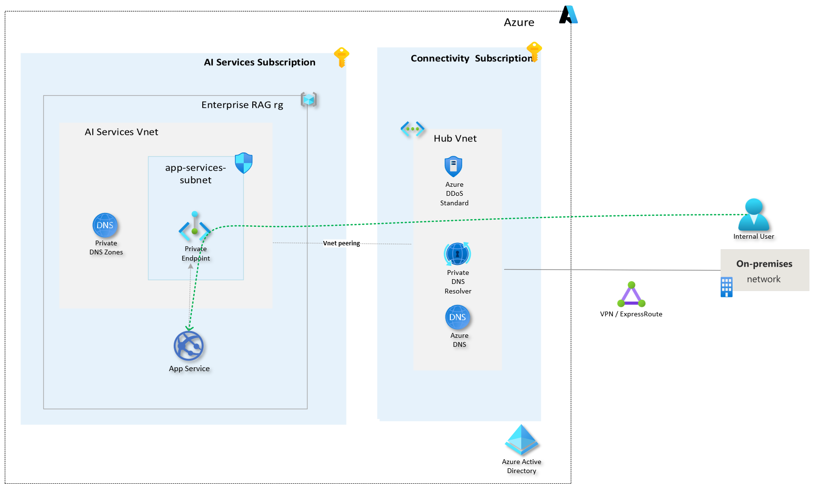
<br>*VNet Peering*

To simplify, the diagram only includes the App Service frontend’s Private Endpoint and DNS configuration **azurewebsites.net**. Uploading documents requires DNS setup for the Storage Account **blob.core.windows.net**, and reindexing the AI Search index needs DNS configuration for the search service domain **search.windows.net**.

#### Pre-requisites

- **Azure Permissions:**
  - **Network Contributor** role or higher on both virtual networks involved in the peering.

- **Network Configuration:**
  - Ensure that the virtual networks do not have overlapping IP address spaces.
  - Both virtual networks must reside within the same Azure region or in regions that support peering.

#### Procedure

For step-by-step configuration instructions, refer to the [Create a VNet Peering Procedure](https://learn.microsoft.com/en-us/azure/virtual-network/virtual-network-manage-peering?tabs=peering-portal).

VNet Peering will enable connectivity with your Private Endpoint. However, to configure name resolution for the Private Endpoint address, DNS settings must be adjusted according to the Private Endpoint DNS Integration Scenarios you intend to use. For more information on scenarios and how to configure them, please see [Private Endpoint DNS Integration Scenarios](https://github.com/dmauser/PrivateLink/tree/master/DNS-Integration-Scenarios).

### Configuring Private Endpoints

Implement Private Endpoints for your **App Service**, **Storage Accounts**, and **Search Service** to ensure secure, direct access for users connected through ExpressRoute or VPN. This setup offers an alternative to VNet Peering by allowing these Private Endpoints to reside in your Connectivity subscription. As a result, DNS will resolve directly to these Private Endpoints, eliminating the need for VNet Peering.

The following diagram illustrates a scenario using Private Endpoints within your Connectivity subscription and a DNS configuration based on Azure DNS Private Resolver. This ensures that devices on the private network can resolve the Private Endpoints associated with the services.

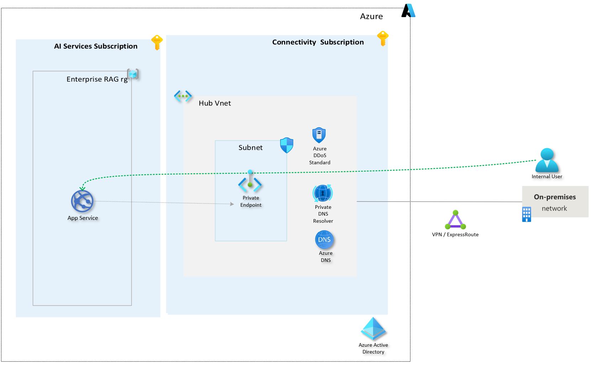  
<br>*Private Endpoints in Your Connectivity Subscription*

To keep things simple, the diagram only includes the Private Endpoint and DNS setup for the App Service that runs the application's frontend using azurewebsites.net. If users need to upload documents, you'll also need to configure DNS for the Storage Account service at blob.core.windows.net. Additionally, if there's a need to reindex the AI Search index, you'll have to set up DNS for the search service domain at search.windows.net.

#### Pre-requisites

- **Azure Permissions:**
  - **Network Contributor** or **Private Endpoint Contributor** role on the virtual network where the Private Endpoint will be deployed.
  - **Contributor** role or higher on the App Service and Storage Account resources.

- **Network Configuration:**
  - Ensure DNS settings are configured to resolve the Private Endpoints correctly.
  - Verify that the virtual network has sufficient IP address space to accommodate the Private Endpoints.

#### Procedure

For detailed configuration guidance for the App Service, see [Connect privately to an App Service app using a Private Endpoint](https://learn.microsoft.com/en-us/azure/app-service/overview-private-endpoint). The steps for creating a Private Endpoint for a Storage Account and Search Service are similar to those for the App Service.

The previous steps explain how to create the Private Endpoint and provide guidance on DNS configuration. If you need more information about DNS integration scenarios with Private Endpoints and how to configure them, please refer to [Private Endpoint DNS Integration Scenarios](https://github.com/dmauser/PrivateLink/tree/master/DNS-Integration-Scenarios).

## External User Access

Provide user access to external users via secure network configurations.

### Configuring Front Door and Web Application Firewall (WAF)

Configure **Azure Front Door** in conjunction with a **Web Application Firewall (WAF)** to manage external user access. This setup provides global load balancing, ensures high availability, and protects the application from common web threats and vulnerabilities.

<!--  -->

#### **Pre-requisites**

- **Azure Permissions:**
  - **Contributor** role or higher on the Azure subscription or the specific resource group where Front Door and WAF will be deployed, in general deployed in a **Connectivity Subscription**.

- **Configuration Requirements:**
  - Custom domain ownership if you plan to use custom domains with Front Door.
  - SSL certificates for securing HTTPS traffic, if applicable.

#### Procedure

To set up Front Door and WAF, follow the instructions in the [Create an Azure Front Door using Azure portal](https://learn.microsoft.com/en-us/azure/frontdoor/create-front-door-portal) page.

> [!NOTE]
> Alternatively, Front Door and WAF can be deployed within the same Subscription and resource group as GPT-RAG to streamline the configuration process.


### Configuring IP Allowlist

With the **Private Endpoint** already set up for **App Service**, you can still configure an IP allowlist for specific cases, such as temporary access to the frontend for quick testing. This setup ensures that only trusted sources with pre-approved IPs can access the service publicly when necessary.

> [!IMPORTANT]  
> Use this approach for short-term access, such as quick testing or setup for a small group of users. It’s a simple control but relies on a public endpoint, so apply it only when necessary for specific cases.

#### **Pre-requisites**

- **Azure Permissions:**
  - **Contributor** role or higher on the Azure subscription or the specific resource group containing the App Service.

- **Network Configuration:**
  - A list of trusted IP addresses or ranges that will be allowed access to the public endpoints.

#### **Procedure**

1. **Access the Azure Portal:**
   - Sign in to the [Azure Portal](https://portal.azure.com).

2. **Restrict Access to App Services:**
   - Navigate to **App Services** and select the target App Service.
   - Go to **Networking** and configure **Access Restrictions** by adding rules to allow specific IP addresses with assigned priorities.
   - Save the changes to enforce the restrictions.

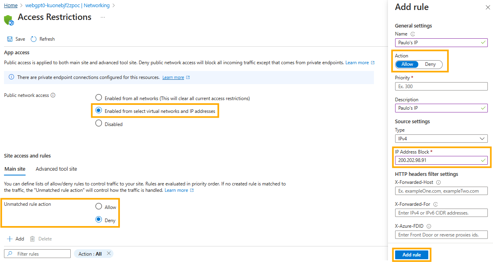
<br>*Configuring IP Allowlist for Public Endpoints*

#### Validation

- Test access to the App Service and Storage Account from both permitted and non-permitted IP addresses.
- Monitor access logs regularly to ensure only authorized IPs have access.

## Configuring Entra Authentication

This section outlines the steps to configure a custom MSAL-based authentication flow based on Azure Entra authentication for your [front-end App Service](https://github.com/azure/gpt-rag-frontend), this can also be used to configure the authentication to you [Avatar service](https://github.com/azure/gpt-rag-avatar).

### Prerequisites
1. The Front-end or Avatar app deployed in Azure App Service. 

   > From this point on, I will refer to it as the Front-end, but the same procedure applies if you are using Avatar as the UI.  

2. The ability (permissions) to register an application in Azure Entra ID.  
   - You must have one of these Azure Entra roles:  
     **Application Administrator**, **Cloud Application Administrator**, or **Global Administrator**.

### 1. Create an App Registration in Azure Entra ID

1. Sign in to the [Azure Portal](https://portal.azure.com) and go to **Azure Active Directory**.  
2. Under **App registrations**, choose **New registration**.  
3. Enter a **Name** for your application (e.g., *FrontEndMSALApp*) and set the **Supported account types** as needed.  
4. For **Redirect URI**, specify the exact path where your application expects the authentication response. For example:  
   ```
   https://<your-frontend-app-url>/getAToken
   ```
   This path must match the environment variable `REDIRECT_PATH` configured in your code (defaults to `/getAToken`).  
5. Click **Register**.  

> **Note**: After registration, copy the **Application (client) ID**—you will set it in the environment as `CLIENT_ID`.

### 2. Create and Store the Client Secret

1. In your newly created app registration, go to **Certificates & secrets**.  
2. Under **Client secrets**, select **New client secret**.  
3. Provide a description and expiration. Click **Add** to generate the secret.  
4. **Copy** the secret value (once you leave the page, you will no longer have access to it).  

#### Store in Key Vault

1. Go to your **Azure Key Vault**, select **Secrets**, then **Generate/Import**.  
2. Name this secret something meaningful, for example: **appServiceClientSecretKey**.  
3. Paste the client secret value into the **Value** field.  
4. Click **Create**.  

> **Important**: In your front-end app, set the environment variable `APP_SERVICE_CLIENT_SECRET_NAME` to reference the **name** of the secret in Key Vault, not the secret value itself. Your code retrieves the secret value at runtime.

### 3. Configure the Required Environment Variables

Below are the key environment variables that must be set in your front-end App Service for custom MSAL-based authentication. In Azure Portal, go to your App Service > **Configuration** > **Application settings**, and add/update the following:

| **Variable**                         | **Description**                                                                                                           | **Example Value**                                                    |
|-------------------------------------|---------------------------------------------------------------------------------------------------------------------------|-----------------------------------------------------------------------|
| **ENABLE_AUTHENTICATION**           | Controls if MSAL-based authentication is enabled. Set to `"true"` or `"false"`.                                          | `"true"`                                                              |
| **CLIENT_ID**                       | The Client ID (Application ID) of your Azure AD app registration.                                                         | `"00000000-0000-0000-0000-000000000000"`                             |
| **APP_SERVICE_CLIENT_SECRET_NAME**  | Name of the secret in Key Vault that stores your app registration’s client secret.                                        | `"appServiceClientSecretKey"`                                        |
| **AUTHORITY**                       | The authority / tenant ID for Azure AD.                                                                                  | `"https://login.microsoftonline.com/your_tenant_id"`                 |
| **REDIRECT_PATH**                   | The path the identity provider will redirect back to after sign-in.                                                      | `"/getAToken"`                                                        |
| **OTHER_AUTH_SCOPES**               | A comma-separated list of additional API scopes (beyond "User.Read").                                                    | `"https://analysis.windows.net/powerbi/api/.default,SomeOther.Scope"` |
| **FLASK_SECRET_KEY_NAME**           | Name of the secret in Key Vault that stores your Flask session key (only if you’re using Flask-based sessions). | `"flaskSecretKey"` |  
| **SESSION_SECRET_KEY**              | Name of the secret in Key Vault that stores your FastAPI session key (only if you’re using a FastAPI-based front-end). | `"sessionSecretKey"` |  
| **FORWARD_ACCESS_TOKEN_TO_ORCHESTRATOR** | A boolean indicating whether the user's access token should be included in the payload sent to the orchestrator. This is only required when the app registration must access APIs on behalf of the user (e.g., Power BI REST API, where permissions are delegated from the user rather than the app). When set to `"true"`, the payload sent to the orchestrator (`/chatgpt` endpoint) will include the following fields: <br> - **`client_principal_id`**: The user’s Object ID in Azure AD. <br> - **`client_principal_name`**: The user’s UPN or preferred username. <br> - **`access_token`**: The valid access token for additional APIs (included only if acquired). | `"true"` |


> **Important**: If you plan to use the Power BI REST API, you must include the following scope in `OTHER_AUTH_SCOPES`:
> ```
> https://analysis.windows.net/powerbi/api/.default
> ```
> This ensures that your front-end can request an access token to call the Power BI API on behalf of the signed-in user.

### 4. Update Your Redirect URIs and Reply URLs in App Registration

In the Azure AD app registration:
- Go to **Authentication**.  
- Under **Redirect URIs**, ensure the URI you used in step 1.4 is listed (e.g., `https://<your-frontend-app-url>/getAToken`).  
- If needed, add additional reply URLs that match your deployment’s domain(s).  

### 5. Validation and Testing

1. **Enable authentication** in your front-end app by setting `ENABLE_AUTHENTICATION = "true"`.  
2. Navigate to your front-end URL.  
   - If you are not signed in, you will be redirected to the Microsoft login page.  
   - After successful sign-in, you will be redirected back to your application’s `REDIRECT_PATH` (e.g., `/getAToken`).  
3. If you have included extra scopes in `OTHER_AUTH_SCOPES` (e.g., Power BI), the code attempts to silently acquire tokens for those scopes as well.  
4. Confirm that the necessary tokens are being retrieved by observing the logs or the session state.

## Configuring Authorization

Control user access within front-end application using **user principal IDs**, **usernames**, or **groups**.

#### Prerequisites

- **Configured Authentication**: Ensure that Entra ID authentication is properly set up in your app service.
- **List of Authorized Entities**: Compile lists of authorized user principal IDs, usernames and/or group names.
- **Delegated Microsoft Graph Permissions** *(To define allowed groups)*: Permission to consent your application the **Microsoft Graph `Group.Read.All`** permission in Entra ID.

*\* Use one of these Entra roles: **Application Administrator**, **Cloud Application Administrator**, or **Global Administrator**.*

#### Procedure

1. **Identify Authorized Users and Groups**

   - **User Principal IDs**: Unique identifiers for users (e.g., `user-principal-id-1`).
   - **Usernames**: Typically the user's email address (e.g., `user1@example.com`).
   - **Group Names** *(Optional)*: Entra ID group names.

2. **Configure Microsoft Graph Permissions (If you are allowing Access to Groups)**

   If you plan to use group-based authorization:

   - **Navigate to API Permissions**:

     - In the registered application, go to **API permissions**.

   - **Add `Group.Read.All` Permission**:

     - Click **Add a permission** > **Microsoft Graph** > **Application permissions**.
     - Search for and select **`Group.Read.All`**.
     - Click **Add permissions**.

   - **Grant Admin Consent**:

     - Click on **Grant admin consent for [Your Tenant Name]**.
     - Confirm the action.

   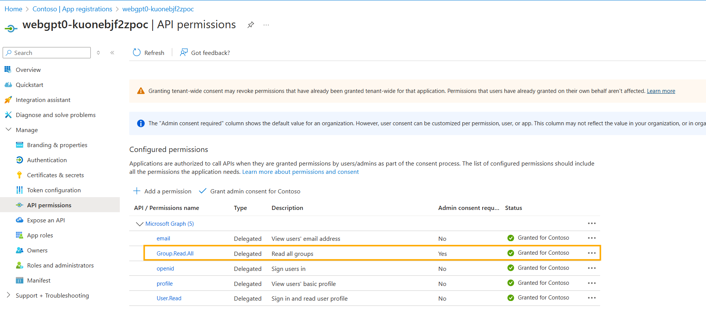
   <br>*Example of consenting Microsoft Graph permission*     

3. **Set Environment Variables**

   In your application's settings, populate the environment variables needed to define which users or groups can access the application. You don’t need to create all three—just the ones relevant to your authorization setup:

   - Use `AUTHORIZED_USER_PRINCIPALS` if you want to specify user principal IDs (e.g., `user-principal-id-1`).
   - Use `AUTHORIZED_USER_NAMES` if you want to specify usernames (e.g., `user1@example.com,user2@example.com`).
   - Use `AUTHORIZED_GROUP_NAMES` if you want to specify group names.

   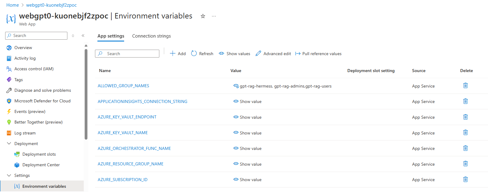
   *Example of configuring allowed groups*

4. **Restart the Application**

   After making changes to environment variables and permissions, restart your application to apply the updates.

#### Validation

Based on your authorization setup, validate access:

- **User Principal ID**: Log in as a user in `AUTHORIZED_USER_PRINCIPALS` to check access.
- **Username**: Log in as a username in `AUTHORIZED_USER_NAMES` and confirm access.
- **Group Membership**: Log in as a group member from `AUTHORIZED_GROUP_NAMES` to ensure access.

> [!NOTE]
> Use and test only the methods you have configured to ensure access controls are functioning correctly.

## NL2SQL and Fabric Setup

The **NL2SQL and Fabric scenarios** extend GPT-RAG beyond traditional Retrieval-Augmented Generation (RAG). While RAG retrieves information from an indexed corpus using AI Search, these scenarios use **Generative AI models to construct SQL or other structured queries**, enabling AI-driven data retrieval from databases for precise answers.  

To learn how this scenario works and configure it, check the [NL2SQL and Fabric Guide](NL2SQL_GUIDE.md).

## Enabling Multimodality

To enable GPT-RAG to use multimodal capabilities, such as those provided by GPT-4o, set the `MULTIMODAL` environment variable to `true` in the data ingestion and set the `multimodal_rag` agent strategy in agentic orchestration Function Apps. For more details on how multimodality works and image data is ingested, refer to [Multimodal RAG Overview](MULTIMODAL_RAG.md) and the documentation in the data ingestion repository: [Multimodal Ingestion](https://github.com/Azure/gpt-rag-ingestion?tab=readme-ov-file#multimodal-ingestion) respectively.

> [!NOTE]
> Currently, only the Agentic Orchestrator supports this feature.

## SharePoint Setup

The SharePoint connector indexes and purges files using scheduled Azure Functions to maintain an up-to-date Azure AI Search Index. For more information on how this works, see the Sharepoint section on the [Data Ingestion Page](https://github.com/Azure/gpt-rag-ingestion?tab=readme-ov-file#sharepoint-indexing). For detailed instructions on setting up SharePoint for data ingestion, please refer to the [SharePoint Setup Guide](INGESTION_SHAREPOINT_SETUP.md).

## Speech Avatar Integration

GPT-RAG supports the integration of an interactive **Speech Avatar** that enhances user interaction by combining GenAI-powered responses with voice recognition and text-to-speech capabilities. This optional feature is available through a dedicated repository and can be added as an alternative user interface alongside the standard front end.

The Speech Avatar leverages Azure Speech Services, Azure Key Vault, and Azure App Service to provide secure and engaging conversational experiences. For detailed information on how the Speech Avatar works and instructions on configuring and deploying it, visit the [Enterprise RAG Avatar repository](https://github.com/azure/gpt-rag-avatar).

## Search Trimming

This customization is particularly valuable in scenarios where sensitive documents need to be accessed by specific groups or individuals within an organization. With this feature you can ensure that AI Search returns results tailored to each user’s access (no RBAC permissions), please take a look at the [Filter Files with AI Search Using Security Trimming](CUSTOMIZATIONS_SEARCH_TRIMMING.md) page.

## Bring Your Own Resources

In some cases, you may want to use one or more pre-existing resources in your subscription instead of creating new ones. Our Bicep template allows you to do this. For detailed instructions on how this can be achieved, please take a look at the [Bring Your Own Resources](CUSTOMIZATIONS_BYOR.md) page.

## Setting Up Git Repos

The GPT-RAG Solution Accelerator comprises four Git repositories, each housing the code for specific application components. Whether you're using GitHub, Azure Repos in Azure DevOps, or another Git service, this section outlines the organization of the codebase and provides instructions for integrating it into your own Git repositories. You can incorporate the Solution Accelerator's code into your Git repositories either by using the repositories as templates or by forking and then creating pull requests in case you want to contribute to the GPT-RAG repo.

### Codebase Organization

The Solution Accelerator is structured across four primary Git repositories:

1. **gpt-rag**: The main repository containing Infrastructure as Code (IaC) templates and comprehensive documentation for the Solution Accelerator.
2. **gpt-rag-ingestion**: Manages the Data Ingestion component, optimizing data chunking and indexing for the Retrieval-Augmented Generation (RAG) retrieval step.
3. **gpt-rag-agentic**: Serves as the orchestrator, coordinating the flow to retrieve information and generate user responses using agents.
4. **gpt-rag-frontend**: Provides the front-end application, delivering a scalable and efficient web interface for the Solution Accelerator.

### Option 1: Using Repositories as Templates (Most Common)

If you'd like to use the repositories as a starting point without making updates to the original, you can use GitHub's template feature. This will create an independent copy of the repository, which you can fully customize. However, keep in mind that this option won’t automatically sync with future updates from the original repository.

> [!NOTE]
> The following steps should be performed for each of the four Solution Accelerator repositories: **gpt-rag**, **gpt-rag-ingestion**, **gpt-rag-agentic**, and **gpt-rag-frontend**.

#### Option 1.1: Setting Up GitHub Repositories

In this case we will use GitHub's template feature to create a copy of the repository.

**Prerequisites**

  - **Read Access** to the template repositories.
  - **Create Repository** permission in your account or organization.

**Procedure**

1. **Navigate to the Repository:**
   - Visit the GitHub page of the repository you wish to use as a template (e.g., [gpt-rag-agentic](https://github.com/Azure/gpt-rag-agentic)).

2. **Use as Template:**
   - Click the **Use this template** button located above the repository files.
   - In the dialog that appears, enter your new repository name, select the owner (your account or organization), and choose the visibility (public or private).

3. **Create Repository:**
   - Click **Create repository from template**. GitHub will generate a new repository in your account with the contents of the template repository.

#### Option 1.2: Importing Repositories into Azure Repos (Azure DevOps)

**Prerequisites**

   - **Access to Azure DevOps Organization and Project.**
   - **Repository Creation Rights** within the target project.

**Procedure**

1. **Prepare Azure DevOps Project:**
   - Ensure you have an Azure DevOps organization with the necessary permissions, typically as a Project Administrator or with explicit repository creation rights.

2. **Access Azure Repos:**
   - Navigate to your Azure DevOps project.
   - Go to **Repos** > **Files**.

3. **Import Repository:**
   - Click the **Import a repository** button.
   - In the import dialog, enter the **Clone URL** of the GitHub repository you wish to import (e.g., `https://github.com/Azure/gpt-rag-agentic.git`).

4. **Authentication for Private Repositories:**
   - If importing a private repository, provide the necessary credentials, such as a Personal Access Token (PAT), to authorize the import.

5. **Start Import:**
   - Click **Import** to begin the process. Azure DevOps will clone the repository into your Azure Repos.

6. **Verify Import:**
   - Once the import is complete, verify that the repository and its branches have been correctly imported by browsing the files in Azure Repos.

**Reference:**
For detailed instructions and advanced import scenarios, refer to the [Importing a GitHub repository into Azure DevOps](https://learn.microsoft.com/en-us/azure/devops/repos/git/import-git-repository) documentation.

#### Option 1.3: Using a different Git service

**Procedure**

1. **Create a New Repository:**
   - Set up a new repository on your preferred Git service (e.g., GitLab, Bitbucket).

2. **Download and Extract:**
   - Download the repository as a ZIP file from GitHub, extract the contents to your local machine.

3. **Add to Your Git Repository:**
   - Initialize your local repository, add the extracted files, commit, and push them to your Git service.

4. **Customize:**
   - Modify the code as per your requirements and push updates to your repository.

### Option 2: Contributing by Forking and Creating Pull Requests

If you intend to contribute to the ongoing development of the Solution Accelerator by submitting pull requests, please refer to our [Contribution Guidelines](https://github.com/Azure/GPT-RAG/blob/main/CONTRIBUTING.md#contribution-guidelines) for detailed instructions on how to fork repositories and create pull requests.

## Creating a Teams App Interface

[This step-by-step guide](TEAMS_INTEGRATION_MAIN.md) provides instructions for creating a Teams App Interface for the Enterprise GPT-RAG Solution Accelerator using the Teams toolkit. It covers the prerequisites and high-level steps required to build, test, deploy, and publish the Teams App. The guide includes creating a new Teams App, connecting it to the GPT-RAG Orchestrator, provisioning and deploying Azure resources, building the app, and finally publishing it.

## Reference

### Azure Resources

Here is the complete list of resources for a standard Zero Trust deployment, including descriptions and SKUs. These defaults have been extensively tested in the automated installation. You can review them to adjust to your needs, considering usage factors like user volume and data.

> [!Note]  
> If you prefer a spreadsheet with the complete list of resources, you can download it [here](../misc/gptrag_resources_and_permissions.xlsx). In the spreadsheet, resource names are highlighted in **bold** and can be replaced with the names used in your own deployment.

> [!TIP]
> Review this list before deploying to ensure you have the necessary quota for deployment in the desired subscription and region.

#### App Services

- **App Service Plan**
    <BR>Hosts the frontend and function apps.
    - SKU: P0v3
    - Operating System: Linux
    - Zone Redundant: Disabled
- **Function App (Orchestrator)**
    <BR>Orchestrates the RAG flow.
    - Operating System: Linux
    - LinuxFxVersion: python|3.11
- **Function App (Data Ingestion)**
    <BR>Supports the Data Ingestion Pipeline.
    - Operating System: Linux
    - LinuxFxVersion: python|3.11
- **App Service (Frontend)**
    <BR>Provides the Web User Interface.
    - Operating System: Linux
    - LinuxFxVersion: python|3.12
- **Application Insights**
    <BR>Provides real-time monitoring for apps.
    - Type: Classic

#### Security

- **Key Vault (Application)**
    <BR>Stores API keys when needed.
    - SKU: Standard
    - Soft Delete: Enabled
    - Purge Protection: Enabled
- **Key Vault (Test VM Bastion)**
    <BR>Used by Bastion to store the Test VM password.
    - SKU: Standard
    - Soft Delete: Enabled
    - Purge Protection: Enabled

#### AI Services

- **Azure AI Services Multi-Service Account**
    <BR>Reads documents (Data Ingestion) and interacts with users (Web UI).
    - SKU: Standard
- **Azure OpenAI**
    <BR>Generates responses and vector embeddings.
    - SKU: Standard
    - Deployments:
        - Regional gpt-4o, 40 TPM.
        - text-embedding-3-large, 40 TPM.
- **Search Service**
    <BR>Provides vector indexes for the retrieval step.
    - SKU: Standard2
    - Replicas: 1
    - Partitions: 1

#### Compute

- **Virtual Machine (Test VM)**
    <BR>Provides access to configure and test the solution after disabling public endpoints.
    - Operating System: Windows (Windows Server 2019 Datacenter)
    - SKU: Standard_D4s_v3 (4 vCPUs, 16 GiB memory)
    - Image Publisher: microsoft-dsvm (Data Science VM)
    - Image Offer: dsvm-win-2019

#### Storage

- **Storage Account (Documents)**
    <BR>Stores content used for grounding responses.
    - Performance: Standard
    - Replication: Locally-redundant storage (LRS)
    - Account Type: StorageV2 (general purpose v2)
- **Storage Account (Orchestrator Function App)**
    <BR>Stores logs, code, and execution state for the Orchestrator Function App.
    - Performance: Standard
    - Replication: Locally-redundant storage (LRS)
    - Account Type: Storage (general purpose v1)
- **Storage Account (Data Ingestion Function App)**
    <BR>Stores logs, code, and execution state for the Data Ingestion Function App.
    - Performance: Standard
    - Replication: Locally-redundant storage (LRS)
    - Account Type: Storage (general purpose v1)
- **Test VM Disk**
    <BR>Disk for the Test VM.
    - Disk Size: 128 GiB
    - Storage Type: Premium SSD LRS
    - Operating System: Windows

#### Database

- **Azure Cosmos DB**
    <BR>Stores conversation history and metadata to improve quality.
    - Kind: GlobalDocumentDB
    - Database Account Offer Type: Standard
    - Capacity Mode: Provisioned throughput

#### Networking

- **Virtual Network**
    <BR>AI Services VNet.
    - Address Space: 10.0.0.0/23
> Address range is a suggestion, you should use what works for you.

- **Subnets**
    <BR>Designate network segments in the AI Services VNet to organize and secure traffic.
    - Subnets:
        - **ai-subnet** <BR>10.0.0.0/26
        - **app-services-subnet** <BR>10.0.0.192/26
        - **database-subnet** <BR>10.0.1.0/26
        - **app-int-subnet** <BR>10.0.0.128/26
        - **AzureBastionSubnet** <BR>10.0.0.64/26
    > The address ranges are suggestions; please adjust them to fit your specific network requirements.

- **Private Endpoints**
    <BR>Enable private, secure access to Azure services via a virtual network.
    - Private Endpoints (PEs):
        - AI Search Private Endpoint
        - AI Services Private Endpoint
        - Azure OpenAI Private Endpoint
        - CosmosDB Private Endpoint
        - Data Ingestion Function App Private Endpoint
        - Frontend App Service Private Endpoint
        - Key Vault Private Endpoint
        - Orchestrator Function App Private Endpoint
        - Storage Account (Documents) Private Endpoint

- **Private DNS Zones**
    <BR>Resolve private endpoints to private IPs within a virtual network.
    - Private DNS Zones:
        - App Service and Function Apps Private DNS <BR> privatelink.azurewebsites.net
        - AI Services Private DNS <BR> privatelink.cognitiveservices.azure.com
        - Azure OpenAI Private DNS <BR> privatelink.openai.azure.com
        - Storage Account (Documents) Private DNS <BR> privatelink.blob.core.windows.net
        - CosmosDB Private DNS <BR> privatelink.documents.azure.com
        - AI Search Private DNS <BR> privatelink.search.windows.net
        - Key Vault Private DNS <BR> privatelink.vaultcore.azure.net

- **Network Interfaces**
    <BR>Provide connectivity to private endpoints and virtual machines within the AI Services VNet.
    - Interfaces:
        - AI Search PE's Network Interface
        - AI Services PE's Network Interface
        - Azure OpenAI PE's Network Interface
        - CosmosDB PE's Network Interface
        - Data Ingestion Function App PE's Network Interface
        - Frontend App Service PE's Network Interface
        - Key Vault PE's Network Interface
        - Orchestrator Function App PE's Network Interface
        - Storage Account (Documents) PE's Network Interface
        - Test Virtual Machine Network Interface

- **Bastion**
    <BR>Enables private and secure access to the Test VM without exposing the VM directly to the internet.
    - Tier: Standard

- **Public IP**
    <BR>Used by Bastion to enable secure access to the Test VM.
    - SKU: Standard
    - Tier: Regional

### Permissions

This section details the required Azure permissions to operate the solution, organized for clarity.

> [!Note]  
> If you prefer a spreadsheet with the complete list of permissions, you can download it [here](../misc/gptrag_resources_and_permissions.xlsx). In the spreadsheet, the resource names are highlighted in **bold** and can be replaced with the names used in your own deployment.

1. **Resources Provisioning**  

Users or service principals (e.g., CI/CD pipelines) responsible for provisioning resources need permissions to create, configure, and deploy resources, as well as assign roles for access control. This requires either the **Owner** role or a combination of the **Contributor** and **User Access Administrator** roles at the subscription level. Alternatively, you can create a custom role with the necessary permissions. [Learn how to create a **Custom Role** here](MANUAL_CUSTOM_ROLE.md).

2. **Application Deployment**

   This category includes the minimum permissions required to deploy application code when the necessary resources have already been provisioned. In such cases, the **Contributor** role provides sufficient permissions to deploy the application. However, if you prefer a more specialized role, you can use the **Website Contributor** role. This role grants the necessary permissions to deploy code to the existing resources.

3. **Solution Components:**  

Solution components require specific Azure pre-built roles to securely interact with services and maintain operational integrity. The table below outlines the required role assignments.

#### Role Assignment Table

The following table provides a detailed overview of the required roles across different solution components:


| **Permission Scope**                        | **Role Assigned**                 | **Assigned to**               | **Description**                                                                                  |
|---------------------------------------------|-----------------------------------|-------------------------------|--------------------------------------------------------------------------------------------------|
| **AI Services**                             | Cognitive Services User    | Data Ingestion Function App   | Enables Document Intelligence features for data ingestion.                                       |
| **AI Services**                             | Cognitive Services User    | Frontend App Service          | Grants access to Speech Service (optional).                                                     |
| **Azure AI Search**                         | Search Index Data Contributor     | Data Ingestion Function App   | Allows indexing of data in Azure AI Search.                                                     |
| **Azure AI Search**                         | Search Index Data Reader          | Orchestrator Function App     | Provides read access to the search index.                                                       |
| **Azure OpenAI**                            | Cognitive Services OpenAI User    | Azure AI Search               | Enables OpenAI capabilities for Azure AI Search.                                                |
| **Azure OpenAI**                            | Cognitive Services OpenAI User    | Data Ingestion Function App   | Grants access to OpenAI capabilities for data ingestion.                                        |
| **Azure OpenAI**                            | Cognitive Services OpenAI User    | Orchestrator Function App     | Allows the orchestrator to use OpenAI services.                                                 |
| **Cosmos DB**                               | Cosmos DB Built-in Data Contributor | Orchestrator Function App     | Grants data contribution permissions to Cosmos DB.                                              |
| **KeyVault**                                | Access via `get`, `list` permissions (Access Policies) or the Key Vault Secrets User role (RBAC model) | Data Ingestion Function App   | Provides access to secrets in Key Vault.                                                        |
| **KeyVault**                                | Access via `get`, `list` permissions (Access Policies) or the Key Vault Secrets User role (RBAC model) | Orchestrator Function App     | Provides access to secrets in Key Vault.                                                        |
| **Orchestrator Function App**               | Contributor                        | Frontend App Service          | Grants interaction permissions with the orchestrator.                                           |
| **Data Ingestion Function App Storage Account** | Storage Blob Data Contributor   | Data Ingestion Function App   | Grants read/write access to the storage account.                                                |
| **Orchestrator Function App Storage Account**   | Storage Blob Data Contributor   | Orchestrator Function App     | Grants read/write access to the storage account.                                                |
| **Source Docs Storage Account**             | Storage Blob Data Contributor     | Data Ingestion Function App   | Enables writing to the storage account for image extraction in the multimodal scenario.         |
| **Source Docs Storage Account**             | Storage Blob Data Reader          | Frontend App Service          | Provides read access to the storage account.                                                    |
| **Source Docs Storage Account**             | Storage Blob Data Reader          | Azure AI Search               | Grants read access to search service.                                                           |
| **Source Docs Storage Account**             | Storage Blob Data Reader          | Orchestrator Function App     | Allows reading source documents from the storage account.                                       |

> [!Note]
> Permissions for external resource connections, such as SQL databases (for NL2SQL), Fabric, or SharePoint, are covered in a separate section dedicated to connection setup.

### 4. User-Specific Permissions  

Certain tasks performed by users require specific permissions in Azure. Review the details below and assign the appropriate permissions based on user needs.  

#### 4.1. **File Upload for Data Ingestion**  
To upload documents, the user must be assigned the **Storage Blob Data Contributor** role in Azure Entra ID for the respective storage account. This role grants permission to upload and manage blobs within the storage containers.

#### 4.2. **Query the AI Search Index**  
To query the search index, the user must have the **Search Index Data Reader** role assigned in the AI Search service being used.

#### 4.3. **Configure Data Source Connections**  
For scenarios involving external data sources, configurations must be set within the `datasources` container in Cosmos DB. The user responsible for this configuration must have the **Cosmos DB Built-in Data Contributor** role assigned in Cosmos DB.

### Useful Links

- [Microsoft Customer Digital Experiences](https://cdx.transform.microsoft.com/)  
  Set up an M365 demo tenant with an E5 license, which includes Power BI and allows you to enable Fabric. Useful for testing connections with MS Teams, and SharePoint using the Microsoft Graph REST API. Available to Microsoft employees and partners.

- [Microsoft 365 Developer Program](https://learn.microsoft.com/en-us/microsoftteams/platform/toolkit/tools-prerequisites#microsoft-365-developer-program)  
  This program also allows you to create an M365 sandbox tenant with an E5 license, available to Visual Studio Enterprise or Professional subscribers.  

- [Microsoft Fabric Trial Capacity](https://learn.microsoft.com/en-us/fabric/get-started/fabric-trial)  
  A good option to explore Fabric and test connections for 60 days; requires a work account.


## Troubleshooting

Refer to the [Troubleshooting Guide](TROUBLESHOOTING.md) for common issues and resolutions related to the GPT-RAG Solution Accelerator.
