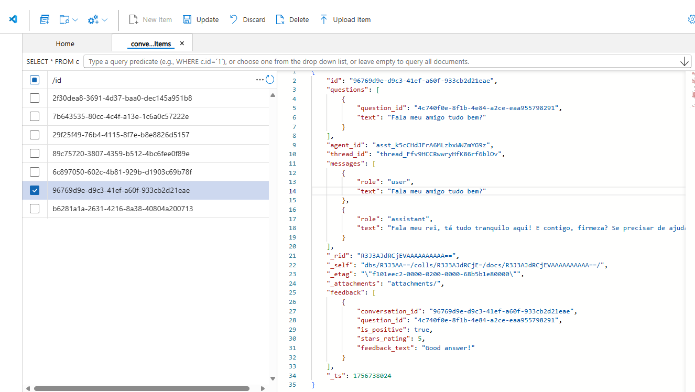
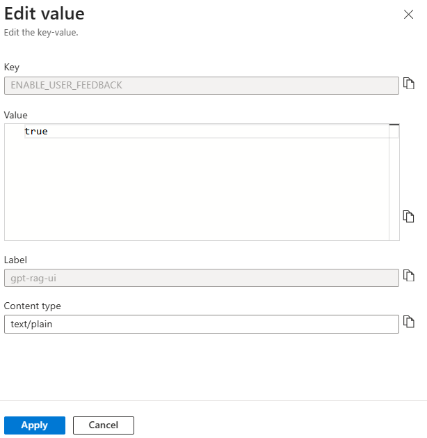
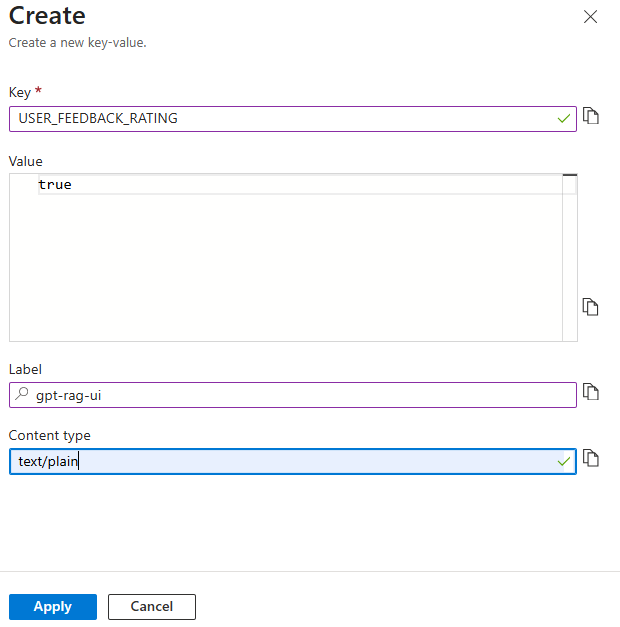

# GPT-RAG User & Admin Guide

This guide provides instructions for deploying, configuring, and managing the GPT-RAG solution within a Zero Trust architecture. 

> [!NOTE] The Guide for Release 2 is in an early stage and currently contains limited content — expect additional sections, examples, and operational details to be added over time.

## Table of Contents

1. [**Overview**](#overview)
2. [**Concepts**](#concepts)
   - [2.1 Solution Architecture](#solution-architecture)
3. [**How-to: Administration**](#how-to-administration)
   - [3.1 Configuring User Feedback Loop](#configuring-user-feedback-loop)
4. [**Reference**](#reference)
   - [4.1 Useful Links](#useful-links) 

<!-- 
Note: This commented Table of Contents is the Release 1 TOC and is retained here for reference when preparing Release 2.
1. [**Overview**](#overview)
2. [**Concepts**](#concepts)
   - [2.1 Solution Architecture](#solution-architecture)
   - [2.2 Data Ingestion](#data-ingestion)
   - [2.3 Orchestration Flow](#orchestration-flow)
   - [2.4 Network Components](#network-components)
   - [2.5 Access Control](#access-control)
   - [2.6 Provision and Deployment](#provision-and-deployment)   
3. [**How-to: User**](#how-to-user)
   - [3.1 Accessing the Application](#accessing-the-application)
   - [3.2 Upload Content](#uploading-documents-for-ingestion)
   - [3.3 Reindexing Data](#reindexing-documents-in-ai-search)
4. [**How-to: Administration**](#how-to-administration)
   - [4.1 Deploying the Solution Accelerator](#deploying-the-solution-accelerator)
   - [4.2 Network Configuration Scenarios](#network-configuration-scenarios)
   - [4.3 Accessing the Data Science VM](#accessing-the-data-science-vm-via-bastion)
   - [4.4 Internal User Access](#internal-user-access)
     - [4.4.1 VNet Peering](#configuring-vnet-peering)
     - [4.4.2 Private Endpoints](#configuring-private-endpoints)
   - [4.5 External User Access](#external-user-access)
     - [4.5.1 Front Door & WAF](#configuring-front-door-and-web-application-firewall-waf)
     - [4.5.2 IP Allowlist](#configuring-ip-allowlist)
   - [4.6 Entra Authentication](#configuring-entra-authentication)
   - [4.7 Authorization Setup](#configuring-authorization) 
   - [4.8 NL2SQL and Fabric Setup](#nl2sql-and-fabric-setup)
   - [4.9 Enabling Multimodality](#enabling-multimodality)
   - [4.10 Sharepoint Indexing](#sharepoint-setup)
   - [4.11 Speech Avatar Integration](#speech-avatar-integration)
   - [4.12 Search Trimming](#search-trimming)
   - [4.13 Bringing Your Own Resources](#bring-your-own-resources)   
   - [4.14 Setting Up Git Repos](#setting-up-git-repos)
   - [4.15 Creating a Teams App Interface](#creating-a-teams-app-interface)
5. [**Reference**](#reference)
   - [5.1 Azure Resources](#azure-resources)
   - [5.2 Permissions](#permissions)    
   - [5.3 Useful Links](#useful-links) 
6. [**Troubleshooting**](#troubleshooting) 
-->

---

## Overview

The **GPT-RAG Solution Accelerator** enables organizations to enhance customer support, decision-making, and data-driven processes with **Generative AI**, empowering systems to handle complex inquiries across extensive datasets. It offers **secure, efficient deployment** for easy integration with existing operations, adaptable for both simple and advanced information retrieval.

Beyond classical **Retrieval-Augmented Generation (RAG)** capabilities, the accelerator incorporates **agents** that support sophisticated scenarios such as **NL2SQL query generation** and other context-aware data interactions. This flexibility enables advanced use cases where AI can seamlessly retrieve and interpret information, meeting diverse technical requirements.

The GPT-RAG Solution Accelerator follows a **modular approach**, consisting of three components: **[Data Ingestion](https://github.com/Azure/gpt-rag-ingestion)**, **[Orchestrator](https://github.com/Azure/gpt-rag-orchestrator)**, and **[Web UI](https://github.com/Azure/gpt-rag-ui)**.

 *GPT-RAG UI*

### Protected Data Access with Zero Trust Design

Adopting a **Zero Trust** approach in Azure, as implemented by the GPT-RAG Solution Accelerator, provides a strong **security foundation** to safeguard your organization’s data and resources. Instead of using public endpoints, which expose services to the internet and increase susceptibility to cyber threats, this architecture ensures all access occurs within a **secure, isolated network** environment, reducing the attack surface and mitigating the risk of unauthorized access.

GPT-RAG's **Zero Trust** architecture with **private endpoints** ensures **network isolation** for sensitive data, enabling efficient Azure service integration without public IP exposure. This approach mitigates risks like data breaches and unauthorized access, creating a controlled environment that strengthens **data integrity** and confidentiality.

### Tailored Orchestration and Chunking

The GPT-RAG Solution Accelerator's **agentic orchestration** allows organizations to design **tailored orchestration flows** that coordinate multiple specialized agents. This customization ensures that complex queries are handled with precision and efficiency, leading to more accurate and contextually relevant AI responses.

Additionally, the solution’s **custom chunking strategy** tailors content segmentation to fit the unique characteristics of different data types and document structures. Aligning chunking methods to data specifics enhances retrieval speed, accuracy, and AI responsiveness, ensuring information is precise and contextually relevant.

## Concepts

### Solution Architecture

The solution leverages a **Zero Trust Architecture** to ensure maximum security and compliance. All components are securely integrated within a virtual network, and communication between services is strictly controlled.

*Zero Trust Architecture*

The diagram above illustrates the Zero Trust architecture. The **GPT-RAG Solution Accelerator** scope encompasses components within the **Enterprise RAG** resource group, providing essential Zero Trust functionalities.

## How-to: Administration

This section provides step-by-step guides for common administrative tasks.

### Configuring User Feedback Loop

GPT-RAG includes a **User Feedback Loop** feature that lets users evaluate the assistant’s responses through the UI. Feedback—whether a simple thumbs up/down or a detailed rating with comments—is sent to the application backend, forwarded to the orchestrator for processing, and then stored in **Cosmos DB**. This data can be queried and analyzed to improve answer quality, track performance, and support continuous learning.

*User feedback stored in Cosmos DB*

By default, **basic feedback** (thumbs up/down) is enabled, while **feedback with ratings** (star rating and text comments) is disabled. Administrators can enable or disable these options through configuration in the **Azure App Configuration** store.

#### User Feedback with Rating

When enabled, users can provide a **star rating** and a free-text comment. This richer evaluation captures not only whether the response was useful but also **why** the user rated it that way.

*User providing rating and comment feedback*

#### Configuration in App Configuration

The behavior of the feedback loop is controlled by key-values in **Azure App Configuration**:

* **ENABLE\_USER\_FEEDBACK** → Default: `true`
  Controls whether the feedback feature is available at all.

 *Key to enable or disable user feedback globally*

* **USER\_FEEDBACK\_RATING** → Default: `false`
  Controls whether users can provide detailed feedback with ratings and comments.

 *Key to enable or disable detailed rating feedback*

#### Default Settings

* `ENABLE_USER_FEEDBACK = true`
* `USER_FEEDBACK_RATING = false`

This means feedback is collected by default, but **star ratings and comments** must be explicitly enabled by setting `USER_FEEDBACK_RATING` to `true`.

## Reference

### Useful Links

- [Microsoft Customer Digital Experiences](https://cdx.transform.microsoft.com/)  
  Set up an M365 demo tenant with an E5 license, which includes Power BI and allows you to enable Fabric. Useful for testing connections with MS Teams, and SharePoint using the Microsoft Graph REST API. Available to Microsoft employees and partners.

- [Microsoft Fabric Trial Capacity](https://learn.microsoft.com/en-us/fabric/get-started/fabric-trial)  
  A good option to explore Fabric and test connections for 60 days, requires a work account.
