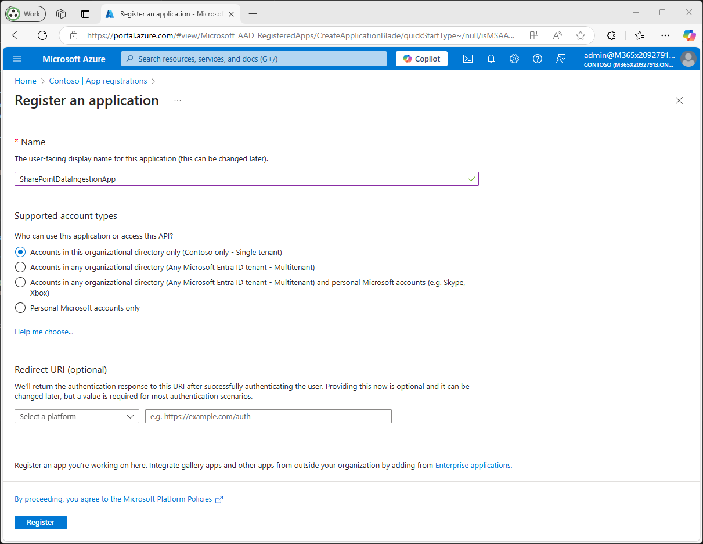
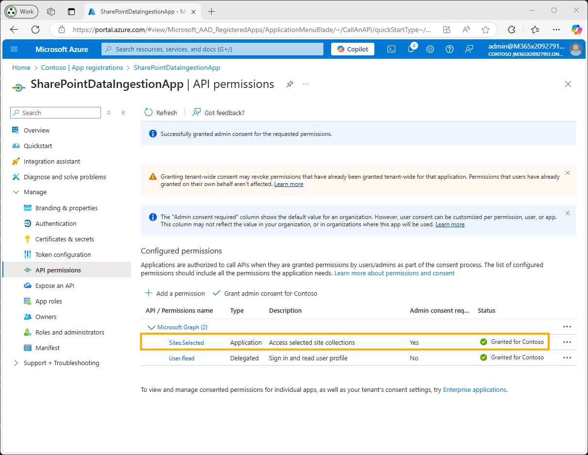
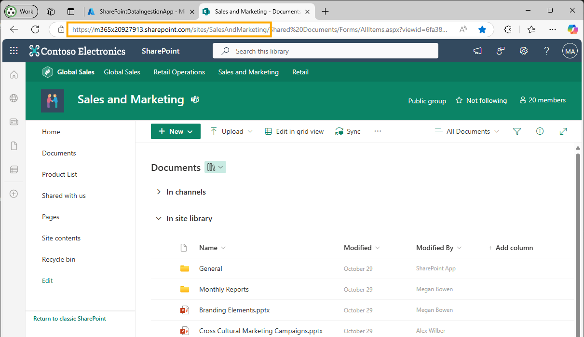
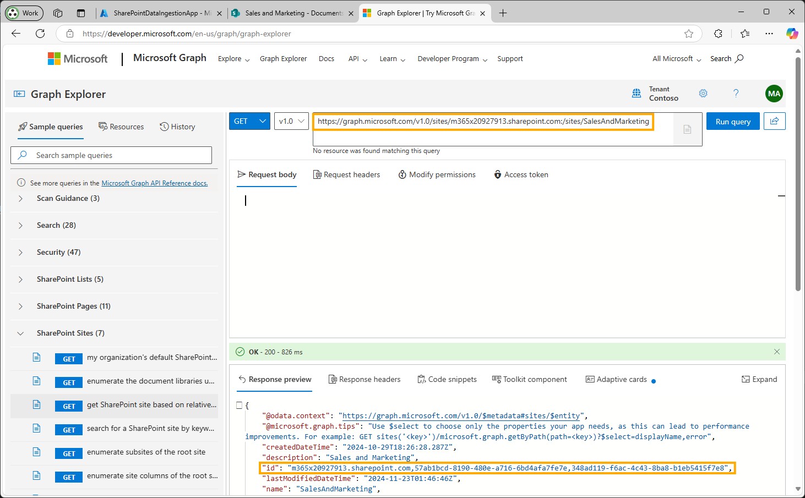
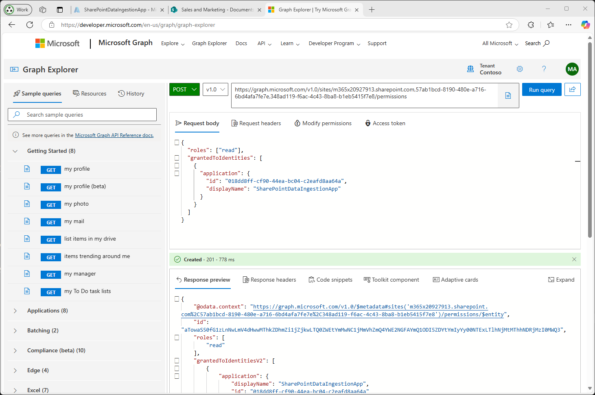
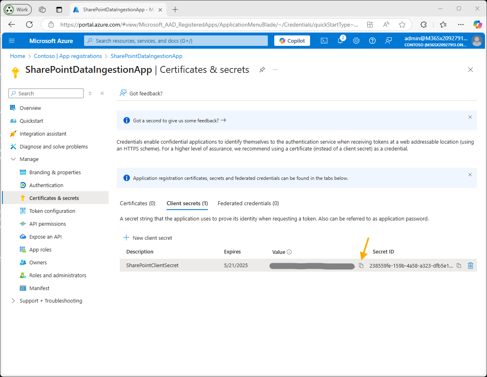

# SharePoint Setup

This section explains how to configure SharePoint as a data source for the `ragindex` GPT-RAG Azure AI Search Index, using the `Sites.Selected` permission to limit access to specific site collections.

## Prerequisites

- **Azure Entra ID Administrative Permissions**: Permission to register an application in Azure Entra ID.

*Use an Entra role: **Application Administrator**, **Cloud Application Administrator**, or **Global Administrator**.*

- **Access to SharePoint Online**: Ensure you have access to the SharePoint site(s) and folders you wish to index.

- **Ability to Use Microsoft Graph API**: Assigning specific site permissions using `Sites.Selected` requires making API calls via Microsoft Graph. This step cannot be completed solely through the Azure Portal.

## Procedure

1. **Register an Application in Azure Entra ID**

   - **Sign in to the Azure Portal**: Go to [Azure Portal](https://portal.azure.com/).

   - **Register a New Application**:

     - Navigate to **Azure Active Directory** > **App registrations** > **New registration**.
     - **Name**: Enter a name for your application (e.g., `SharePointDataIngestionApp`).
     - **Supported Account Types**: Choose **Accounts in this organizational directory only**.
     - **Redirect URI**: Leave this field empty.
     - Click **Register**.

    

   - **Record Application IDs**:

     - *Save the **Application ID** and **Tenant ID** for later use.*

    

2. **Configure API Permissions**

   - **Navigate to API Permissions**:

     - In your registered application, go to **API permissions** > **Add a permission**.

   - **Add Microsoft Graph Permissions**:

     - Select **Microsoft Graph** > **Application permissions**.
     - Search for and add the following permission:

       - **`Sites.Selected`**

     - Click **Add permissions**.

   - **Grant Admin Consent**:

     - Click **Grant admin consent for [Your Tenant Name]**.
     - Confirm the action when prompted.

     
     *Granting admin consent for `Sites.Selected` permission*

3. **Assign Access to Specific Site Collections**

   The `Sites.Selected` permission requires you to explicitly grant the application access to specific site collections. This step must be performed using the Microsoft Graph API.

   > [!NOTE]
   > Currently, assigning site permissions using `Sites.Selected` cannot be done through the Azure Portal. You need to use Microsoft Graph API or PowerShell.

   - **Gather Site Information**:

     - **Site URL**: Navigate to the SharePoint site you wish to index and note its URL (e.g., `https://yourdomain.sharepoint.com/sites/YourSiteName`).
     - **Site ID**: You can retrieve the Site ID using Microsoft Graph API.

    
    *Getting site URL*

   - **Retrieve Site ID**:

     - **Use Microsoft Graph Explorer**:

       - Go to [Microsoft Graph Explorer](https://developer.microsoft.com/graph/graph-explorer).
       - Sign in with an account that has access to the site.
       - Make a `GET` request to:

         ```http
         GET https://graph.microsoft.com/v1.0/sites/{hostname}:/{server-relative-path}
         ```

         Replace `{hostname}` with your SharePoint domain (e.g., `yourdomain.sharepoint.com`) and `{server-relative-path}` with the site path (e.g., `/sites/YourSiteName`).

       - **Example**:

         ```http
         GET https://graph.microsoft.com/v1.0/sites/yourdomain.sharepoint.com:/sites/YourSiteName
         ```

       - The response will include the `id` of the site.

    
    *Getting site ID*    

   - **Grant the Application Access to the Site**:

     - **Make a `POST` Request to Grant Permissions**:

       - In Microsoft Graph Explorer, make a `POST` request to:

         ```http
         POST https://graph.microsoft.com/v1.0/sites/{site-id}/permissions
         ```

         Replace `{site-id}` with the ID obtained in the previous step.

       - **Request Body**:

         ```json
         {
           "roles": ["read"],
           "grantedToIdentities": [
             {
               "application": {
                 "id": "your_application_id",
                 "displayName": "Your Application Name"
               }
             }
           ]
         }
         ```


         - Replace `your_application_id` with your application's **Client ID**.
         - Replace `Your Application Name` with your application's name.
         - The `"roles"` can be `"read"` or `"write"` depending on your needs.

       - **Example**:

         ```json
         {
           "roles": ["read"],
           "grantedToIdentities": [
             {
               "application": {
                 "id": "12345678-90ab-cdef-1234-567890abcdef",
                 "displayName": "SharePointDataIngestionApp"
               }
             }
           ]
         }
         ```

       - **Run the Query** and ensure you receive a `201 Created` response.

     - **Repeat** the permission assignment for each site you wish to index.

    
         *Assigning site permissions via Microsoft Graph Explorer*
    
    
       - **If you encounter a permission denied error when trying to assign site permissions**:
    
    If you encounter a permission error, like the one shown in the next screen, it may be necessary to grant permissions to your user.
    
    
    *Permission error when assigning permissions*
    
    If this is the case, grant the required permissions as shown in the next image.
    
    
    *Adding consent for user to apply permissions*

4. **Create a Client Secret**

   - **Navigate to Certificates & Secrets**:

     - Under the **Manage** section of your application, select **Certificates & secrets**.

   - **Add a New Client Secret**:

     - Under **Client secrets**, click on **New client secret**.
     - **Description**: Provide a description for the client secret (e.g., `SharePointClientSecret`).
     - **Expires**: Choose an appropriate expiration period that suits your needs.
     - Click **Add**.

   - **Record the Client Secret Value**:

     - *Copy and securely store the **Client Secret Value** for later use.*

       > **Note**: Do not copy the "Secret ID" as it is not required.

    

> [!NOTE]
> Done! You have completed the necessary permissions for SharePoint. Now, to complete the configuration in your Function App:

5. **Gather SharePoint Site Information**

   - **Site Domain**: The domain of your SharePoint site (e.g., `yourdomain.sharepoint.com`).
   - **Site Name**: The name of your SharePoint site (e.g., `YourSiteName`).
   - **Site Folder**: Folder path to index (e.g., `/Shared Documents/General`). Leave empty for root.
   - **File Formats**: Specify the file formats to index (e.g., `pdf,docx,pptx`).

6. **Update Function App Environment Variables**

   - **Navigate to Function App Configuration**:

     - In the Azure Portal, go to your **Function App** > **Configuration** > **Application settings**.

   - **Set the Following Environment Variables**:

     ```plaintext
     # Enable or disable the SharePoint connector
     SHAREPOINT_CONNECTOR_ENABLED=true
     
     SHAREPOINT_TENANT_ID=your_actual_tenant_id
     SHAREPOINT_CLIENT_ID=your_actual_client_id
     SHAREPOINT_CLIENT_SECRET=your_client_secret_value
     SHAREPOINT_SITE_DOMAIN=your_actual_site_domain
     SHAREPOINT_SITE_NAME=your_actual_site_name
     SHAREPOINT_SITE_FOLDER=/your/folder/path # Leave empty if using the root folder
     SHAREPOINT_FILES_FORMAT=pdf,docx,pptx
     ```

     - Replace placeholders with the actual values obtained from previous steps.

   - **Save and Restart**:

     - Click **Save** to apply the changes.
     - Restart the Function App to ensure the new settings take effect.


> [!NOTE] 
> Done! You have completed the SharePoint configuration procedure.

## Validation

1. **Test Data Ingestion**

   - **Trigger the Ingestion Process**:

     - Wait for the data ingestion scheduled run.

   - **Monitor Logs**:

     - Check the Function App logs to verify that the SharePoint connector is running without errors.

2. **Verify Indexed Data**

   - **Check Azure AI Index**:

     - Go to your Azure AI Index to confirm that the SharePoint data has been successfully indexed.

   - **Perform Search Queries**:

     - Execute search queries to ensure that content from the specific SharePoint sites is retrievable.

> [!NOTE]
> Using `Sites.Selected` ensures that your application only has access to the SharePoint sites you've explicitly granted permissions to, enhancing security by limiting access scope.

---

**Additional Information:**

- **Removing Permissions**:

  If you need to revoke the application's access to a site, you can delete the permission via Microsoft Graph API:

  ```http
  DELETE https://graph.microsoft.com/v1.0/sites/{site-id}/permissions/{permission-id}
  ```

  - You can obtain the `permission-id` by listing the permissions:

    ```http
    GET https://graph.microsoft.com/v1.0/sites/{site-id}/permissions
    ```

- **Understanding `Sites.Selected` Permission**:

  - The `Sites.Selected` permission by itself does not grant access to any SharePoint site collections.
  - It allows your application to access only the site collections that you explicitly grant it access to.
  - This approach adheres to the principle of least privilege, enhancing security.