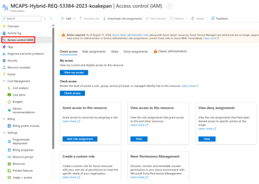
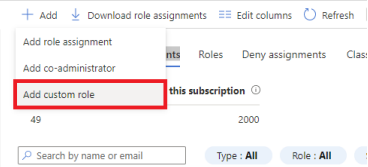
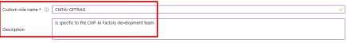
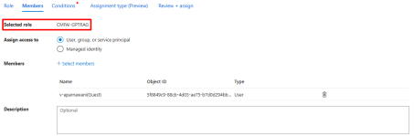
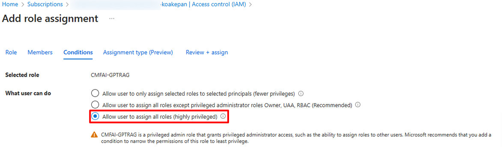
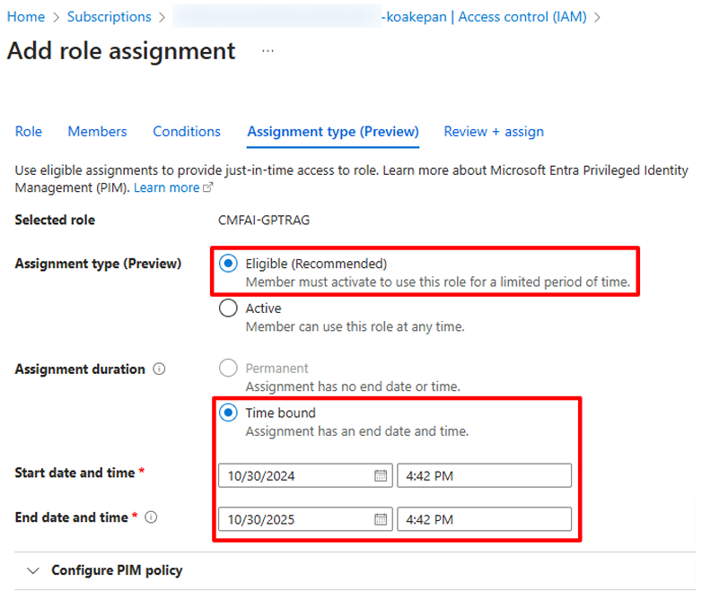

# Creating a Custom Role for GPT-RAG Installation

This guide outlines how to create a custom role in Azure to support least privilege access, ensuring that users and applications have only the permissions needed for specific tasks. By using a custom role, you can enhance security and reduce risk. Permissions in this guide are organized by type: read, action, write, and delete, making it simple to customize—such as removing delete permissions if not needed.

> [!TIP]  
> This procedure applies when you prefer creating a custom role with more specific permissions instead of assigning the **Owner** or **Contributor + User Access Administrator** role.

## Step-by-Step Procedure

1. **Go to Subscriptions**
   - In the Azure portal, navigate to **Subscriptions**.
   - Select the relevant subscription where the custom role will be assigned.

2. **Access Control (IAM)**
   - Within the selected subscription, click on **Access control (IAM)** in the left-hand menu.

   

3. **Create a Custom Role**
   - Click **+ Add** and then **Add custom role**.
   - Choose **Start from scratch** to create a new role with custom permissions.

   

4. **Configure Role Details**
   - In the **Custom role name** field, enter a unique name for the role (e.g., `CMFAI-GPTRAG`).
   - In the **Description** field, provide a description for the role's purpose, such as "Custom role for GPT-RAG installation."

   

5. **Define Permissions**
   - Go to the **JSON** tab.
   - Add the following actions and notActions.

```json
{
                "actions": [
                    "Microsoft.AppConfiguration/*/read",
                    "Microsoft.Authorization/*/read",
                    "Microsoft.CognitiveServices/*/read",
                    "Microsoft.Compute/virtualMachines/read",
                    "Microsoft.DevTestLab/*/read",
                    "Microsoft.DocumentDB/*/read",
                    "Microsoft.Insights/*/read",
                    "Microsoft.KeyVault/*/read",
                    "Microsoft.Network/*/read",
                    "Microsoft.OperationalInsights/*/read",
                    "Microsoft.Resources/*/read",
                    "Microsoft.Search/*/read",
                    "Microsoft.Storage/*/read",
                    "Microsoft.Web/*/read",
                    "Microsoft.CognitiveServices/accounts/listKeys/action",
                    "Microsoft.DocumentDB/databaseAccounts/listKeys/action",
                    "Microsoft.Search/searchServices/listAdminKeys/action",
                    "Microsoft.Storage/storageAccounts/listKeys/action",
                    "Microsoft.Web/sites/config/list/action",
                    "Microsoft.CognitiveServices/accounts/regenerateKey/action",
                    "Microsoft.CognitiveServices/accounts/privateEndpointConnectionsApproval/action",                    
                    "Microsoft.DocumentDB/databaseAccounts/privateEndpointConnectionsApproval/action",
                    "Microsoft.DocumentDB/databaseAccounts/readonlykeys/action",
                    "Microsoft.KeyVault/vaults/PrivateEndpointConnectionsApproval/action",                    
                    "Microsoft.Network/networkInterfaces/join/action",
                    "Microsoft.Network/networkSecurityGroups/join/action",
                    "Microsoft.Network/privateDnsZones/join/action",
                    "Microsoft.Network/publicIPAddresses/join/action",
                    "Microsoft.Network/virtualNetworks/join/action",
                    "Microsoft.Network/virtualNetworks/subnets/join/action",                    
                    "Microsoft.Resources/deployments/validate/action",
                    "Microsoft.Search/searchServices/PrivateEndpointConnectionsApproval/action",                    
                    "Microsoft.Storage/storageAccounts/blobServices/generateUserDelegationKey/action",
                    "Microsoft.Storage/storageAccounts/PrivateEndpointConnectionsApproval/action",                    
                    "Microsoft.Web/sites/functions/action",
                    "Microsoft.Web/sites/host/sync/action",
                    "Microsoft.Web/sites/listsyncfunctiontriggerstatus/action",
                    "Microsoft.Web/sites/networktrace/action",
                    "Microsoft.Web/sites/newpassword/action",
                    "Microsoft.Web/sites/sync/action",
                    "Microsoft.Web/sites/publish/action",
                    "Microsoft.Web/sites/start/action",
                    "Microsoft.Web/sites/stop/action",
                    "Microsoft.Web/sites/restart/action",                    
                    "Microsoft.Web/sites/PrivateEndpointConnectionsApproval/action",                    
                    "Microsoft.AppConfiguration/configurationStores/privateEndpointConnections/write",
                    "Microsoft.Authorization/roleAssignments/write",
                    "Microsoft.CognitiveServices/accounts/write",
                    "Microsoft.CognitiveServices/accounts/deployments/write",
                    "Microsoft.CognitiveServices/accounts/privateEndpointConnections/write",
                    "Microsoft.Compute/virtualMachines/write",
                    "Microsoft.DevTestLab/schedules/write",
                    "Microsoft.DocumentDB/databaseAccounts/write",
                    "Microsoft.DocumentDB/databaseAccounts/sqlDatabases/write",
                    "Microsoft.DocumentDB/databaseAccounts/sqlDatabases/containers/write",
                    "Microsoft.DocumentDB/databaseAccounts/sqlDatabases/throughputSettings/write",
                    "Microsoft.DocumentDB/databaseAccounts/sqlRoleAssignments/write",
                    "Microsoft.DocumentDB/databaseAccounts/sqlRoleDefinitions/write",
                    "Microsoft.Insights/components/write",
                    "Microsoft.Insights/components/linkedStorageAccounts/write",
                    "Microsoft.KeyVault/vaults/write",
                    "Microsoft.KeyVault/vaults/accessPolicies/write",
                    "Microsoft.KeyVault/vaults/secrets/write",
                    "Microsoft.KeyVault/vaults/privateEndpointConnections/write",
                    "Microsoft.Network/bastionHosts/write",
                    "Microsoft.Network/networkInterfaces/write",
                    "Microsoft.Network/networkSecurityGroups/write",
                    "Microsoft.Network/privateDnsZones/write",
                    "Microsoft.Network/privateDnsZones/A/write",
                    "Microsoft.Network/privateDnsZones/AAAA/write",
                    "Microsoft.Network/privateDnsZones/CNAME/write",
                    "Microsoft.Network/privateDnsZones/MX/write",
                    "Microsoft.Network/privateDnsZones/PTR/write",
                    "Microsoft.Network/privateDnsZones/SOA/write",
                    "Microsoft.Network/privateDnsZones/SRV/write",
                    "Microsoft.Network/privateDnsZones/TXT/write",
                    "Microsoft.Network/privateDnsZones/virtualNetworkLinks/write",
                    "Microsoft.Network/privateEndpoints/write",
                    "Microsoft.Network/privateEndpoints/privateDnsZoneGroups/write",
                    "Microsoft.Network/privateLinkServices/privateEndpointConnections/write",
                    "Microsoft.Network/privateLinkServices/write",
                    "Microsoft.Network/publicIPAddresses/write",
                    "Microsoft.Network/virtualNetworks/write",
                    "Microsoft.Network/virtualNetworks/subnets/write",
                    "Microsoft.Network/networkSecurityGroups/write",
                    "Microsoft.OperationalInsights/workspaces/write",
                    "Microsoft.Resources/subscriptions/resourceGroups/write",
                    "Microsoft.Resources/deployments/write",
                    "Microsoft.Search/searchServices/write",
                    "Microsoft.Search/searchServices/privateEndpointConnections/write",
                    "Microsoft.Search/searchServices/sharedPrivateLinkResources/write",
                    "Microsoft.Storage/storageAccounts/write",
                    "Microsoft.Storage/storageAccounts/blobServices/containers/write",
                    "Microsoft.Storage/storageAccounts/privateEndpointConnections/write",
                    "Microsoft.Storage/storageAccounts/blobServices/write",
                    "Microsoft.Storage/storageAccounts/blobServices/containers/write",
                    "Microsoft.Web/sites/write",
                    "Microsoft.Web/sites/config/write",
                    "Microsoft.Web/sites/basicPublishingCredentialsPolicies/write",
                    "Microsoft.Web/sites/extensions/write",
                    "Microsoft.Web/sites/hostNameBindings/write",
                    "Microsoft.Web/sites/networkConfig/write",
                    "Microsoft.Web/sites/privateEndpointConnections/write",
                    "Microsoft.Web/serverfarms/write",
                    "Microsoft.AppConfiguration/configurationStores/privateEndpointConnections/delete",
                    "Microsoft.Authorization/roleAssignments/delete",
                    "Microsoft.CognitiveServices/accounts/delete",
                    "Microsoft.DevTestLab/schedules/delete",
                    "Microsoft.DocumentDB/databaseAccounts/delete",
                    "Microsoft.DocumentDB/databaseAccounts/sqlDatabases/delete",
                    "Microsoft.DocumentDB/databaseAccounts/sqlDatabases/containers/delete",
                    "Microsoft.DocumentDB/databaseAccounts/sqlRoleAssignments/delete",
                    "Microsoft.DocumentDB/databaseAccounts/sqlRoleDefinitions/delete",
                    "Microsoft.Insights/components/delete",
                    "Microsoft.KeyVault/vaults/delete",
                    "Microsoft.KeyVault/vaults/privateEndpointConnections/delete",
                    "Microsoft.Network/networkInterfaces/delete",
                    "Microsoft.Network/networkSecurityGroups/delete",
                    "Microsoft.Network/privateDnsZones/A/delete",
                    "Microsoft.Network/privateDnsZones/AAAA/delete",
                    "Microsoft.Network/privateDnsZones/CNAME/delete",
                    "Microsoft.Network/privateDnsZones/MX/delete",
                    "Microsoft.Network/privateDnsZones/PTR/delete",
                    "Microsoft.Network/privateDnsZones/SRV/delete",
                    "Microsoft.Network/privateDnsZones/TXT/delete",
                    "Microsoft.Network/privateDnsZones/virtualNetworkLinks/delete",
                    "Microsoft.Network/privateEndpoints/privateDnsZoneGroups/delete",
                    "Microsoft.Network/privateLinkServices/privateEndpointConnections/delete",
                    "Microsoft.Network/privateLinkServices/delete",
                    "Microsoft.Network/publicIPAddresses/delete",
                    "Microsoft.Network/virtualNetworks/delete",
                    "Microsoft.Network/virtualNetworks/subnets/delete",
                    "Microsoft.OperationalInsights/workspaces/delete",
                    "Microsoft.Resources/subscriptions/resourceGroups/delete",
                    "Microsoft.Resources/deployments/delete",
                    "Microsoft.Search/searchServices/delete",
                    "Microsoft.Search/searchServices/privateEndpointConnections/delete",
                    "Microsoft.Search/searchServices/sharedPrivateLinkResources/delete",
                    "Microsoft.Storage/storageAccounts/delete",
                    "Microsoft.Storage/storageAccounts/blobServices/containers/delete",
                    "Microsoft.Storage/storageAccounts/privateEndpointConnections/delete",
                    "Microsoft.Storage/storageAccounts/blobServices/containers/delete",
                    "Microsoft.Web/sites/delete",
                    "Microsoft.Web/sites/hostNameBindings/delete",
                    "Microsoft.Web/sites/privateEndpointConnections/delete",
                    "Microsoft.Web/serverfarms/delete"
                ],
                "notActions": [],
                "dataActions": [
                    "Microsoft.Storage/storageAccounts/blobServices/containers/blobs/read",
                    "Microsoft.Storage/storageAccounts/blobServices/containers/blobs/move/action",
                    "Microsoft.Storage/storageAccounts/blobServices/containers/blobs/add/action",
                    "Microsoft.Storage/storageAccounts/blobServices/containers/blobs/write",
                    "Microsoft.Storage/storageAccounts/blobServices/containers/blobs/delete"
                ],
                "notDataActions": []
            }
```

6. **Review and Create**
   - Go to the **Review + create** tab.
   - Review all role settings, and once confirmed, click **Create**.
   - The new custom role may take a few minutes to appear in the role list.

   

7. **Assign the Custom Role to a User**
   - Return to **Access control (IAM)** and select **+ Add** > **Add role assignment**.
   - Choose the custom role created (e.g., `CMFAI-GPTRAG`) under **Role**.
   - Under **Members**, select **+ Select members**, then choose **User, group, or service principal**, and select the user to assign this role to.

   

   - Under **Conditions** > **What User can do**, select **Allow user to assign all roles**.

   

   - On the **Assignment type** tab, select the **Assignment type**:
     - **Eligible** – Requires the user to perform one or more actions to activate the role, such as multifactor authentication, providing a business justification, or requesting approval. **Note:** Applications, service principals, and managed identities cannot perform activation steps.
   - For **Assignment duration**, select **Time bound** if needed, and specify start and end dates.

8. **Finalize the Assignment**
   - On the **Assignment type** tab, select **Eligible** (recommended) or **Active** depending on access requirements.
   - Set the **Assignment duration** to either **Permanent** or **Time bound** as needed.
   - Click **Review + assign** to complete the process.

   

## Conclusion

Your custom role is now created and assigned, enabling the user to carry out the GPT-RAG installation.

---

### Authors

- Kyle Akepanidtaworn, AI Specialized CSU, Global Customer Success, Microsoft, koakepan@microsoft.com
- Aparna Wani, Solution Architect, LTI Mindtree, v-aparnawani@microsoft.com
- Raghav Agrawal (International Supplier), LTI Mindtree, v-ragagrawal@microsoft.com
- Varun Balakrishnan Nambiar (International Supplier), Solution Architect, LTI Mindtree, v-vnambiar@microsoft.com