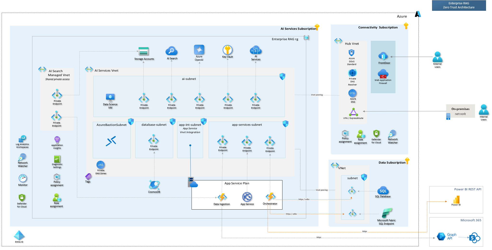
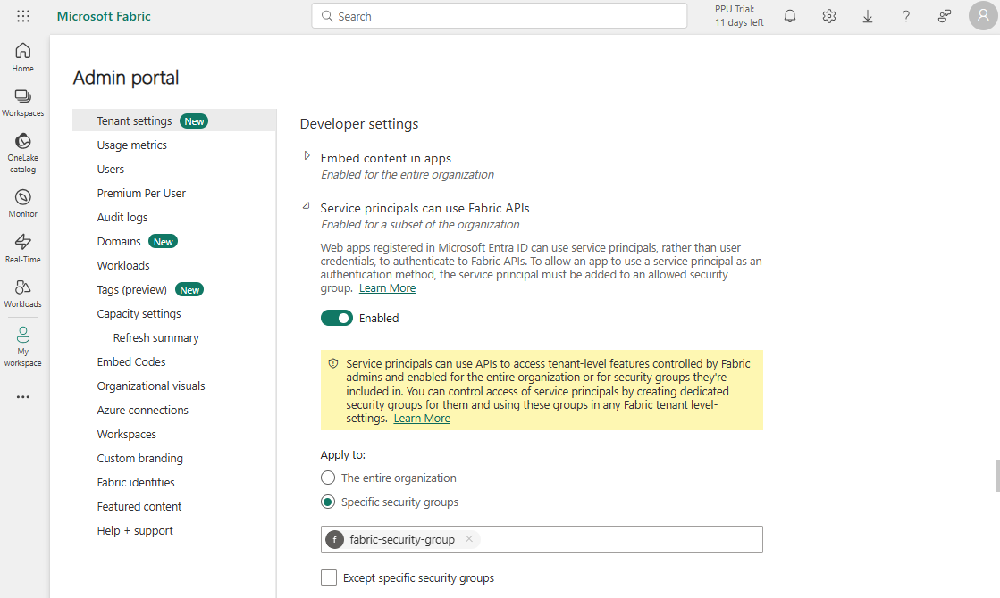
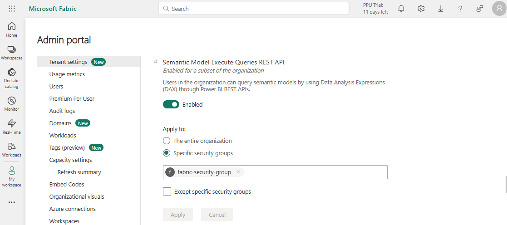
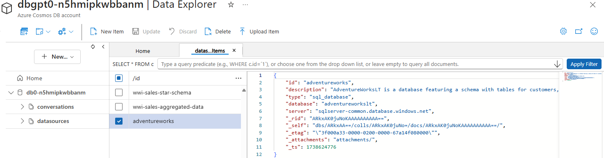
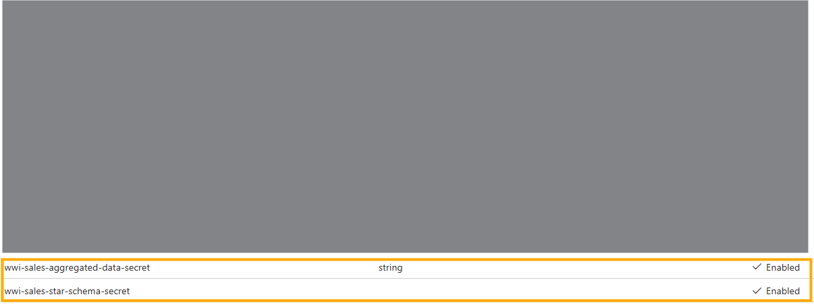

# NL2SQL and Fabric Scenario

Integrating Natural Language to SQL (NL2SQL) into GPT-RAG enhances its capabilities, enabling it to go beyond traditional RAG scenarios by allowing users to generate SQL statements from natural language queries, streamlining data interaction. For Fabric's semantic models, this functionality extends through Natural Language to DAX (NL2DAX), facilitating intuitive data analysis within these models.

## **Table of Contents**

1. [Architecture Overview](#architecture-overview)  
2. [How It Works](#how-it-works)  
   - 2.1 Orchestrator  
   - 2.2 Data Ingestion  
3. [SQL Data Sources](#sql-data-sources)  
   - 3.1 Supported SQL Data Source Types  
     - 3.1.1 Semantic Model (Fabric)  
     - 3.1.2 SQL Endpoint (Fabric)  
     - 3.1.3 SQL Database  
4. [Prerequisites (by Data Source Type)](#prerequisites-by-data-source-type)  
   - 4.1 Azure SQL Databases  
     - 4.1.1 Managed Identity Authentication  
     - 4.1.2 SQL Server Authentication  
   - 4.2 Microsoft Fabric  
     - 4.2.1 SQL Endpoint  
     - 4.2.2 Semantic Model  
5. [NL2SQL Data Sources Configuration](#nl2sql-data-sources-configuration)  
   - 5.1 Semantic Model Datasource Example  
   - 5.2 SQL Endpoint Datasource Example  
   - 5.3 SQL Database Datasource Example  
   - 5.4 Data Source Secrets

## Architecture Overview

These scenarios extend the GPT-RAG Agentic Orchestrator's ability to convert user requests into SQL or DAX queries, supporting **Azure SQL Database** and **Microsoft Fabric** as data sources.

- In **NL2SQL** strategies, the orchestrator uses ODBC drivers to connect to Azure SQL databases. It can authenticate using either **Managed Identity** or **SQL Database authentication** with database credentials stored in **Azure Key Vault**.

- In **Chat with Fabric**, SQL endpoints are accessed using a **App Registration** (Service Principal) via ODBC. For semantic models like **Power BI datasets**, connections are made through the **REST API**, using either delegated authentication or a service principal depending on the scenario.


*Architecture Overview*

## How It Works

In these scenarios, the **orchestrator** interprets the user's query, identifies the relevant **data sources** and **tables** containing the required information, formulates the necessary **queries**, executes them, and generates a response based on the retrieved results.

To implement these scenarios, the solution relies on two key components of GPT-RAG:

1. **Orchestrator** – Generates and executes queries, retrieves results, and formulates the final response for the user.

Learn how the **orchestrator** works and configure it for NL2SQL and Fabric in the [Orchestrator Repository](https://github.com/Azure/gpt-rag-agentic/blob/main/docs/NL2SQL.md).

2. **Data Ingestion** – Ingests data source metadata, like data dictionaries, to enhance query generation accuracy.

To configure the **data ingestion** process for these scenarios, refer to the [Data Ingestion Repository](https://github.com/Azure/gpt-rag-ingestion/blob/main/docs/NL2SQL.md).

> [!NOTE]
> Currently, only the Agentic Orchestrator supports NL2SQL feature.

## SQL Data Sources

We currently support two NL2SQL data sources, SQL Databases and Fabric SQL endpoints, with plans to expand this list as more options become available.

### Supported SQL Data Source Types

The following **data source types** are currently supported:

1. **Semantic Model** (Fabric)  
2. **SQL Endpoint** (Fabric)  
3. **SQL Database**

> [!NOTE]  
> Although the **Semantic Model** is listed as an SQL data source, queries against this model are actually performed using **DAX**. However, for simplicity, we use the **NL2SQL** terminology for these cases as well.


## Prerequisites (by Data Source Type)

The orchestrator supports different authentication methods depending on the data source used. This section outlines the prerequisites for each data source type. Specific configuration instructions are provided in the next section.

### **Azure SQL Databases**

When connecting to **Azure SQL Databases**, you have two authentication options:

- **Managed Identity (Preferred):** Uses the system-assigned or user-assigned identity of the Orchestrator Azure Function. The prerequisite is to ensure that the orchestrator’s managed identity has the `db_datareader` role on the target database.

- **SQL Server Authentication:** Requires a `uid` and password for a user with read access to the database. The password must be stored in **Azure Key Vault**, following the naming convention `{datasource_id}-secret`. Configuration details are provided in the next section.

### **Microsoft Fabric**

The Microsoft Fabric connector can be configured in one of the following modes:

- **SQL Endpoint:** Used for executing SQL queries on lakehouses and warehouses.
- **Semantic Model:** Used for executing DAX queries on Power BI datasets.

#### **SQL Endpoint**

SQL Endpoint connections use the **Microsoft ODBC Driver** and authenticate via an **App Registration** in **Entra ID**.

The prerequisites include:

1. Creating an App Registration in Entra ID.
2. Adding the App Registration to a security group for easier access management.
3. Enabling **Service principals can use Fabric APIs** under **Developer settings** in the tenant.

  
*Developer settings*

4. Assigning the Viewer role to the App Registration or security group in the target workspace.

For more details, refer to: [Entra ID Authentication for SQL Endpoint](https://learn.microsoft.com/en-us/fabric/data-warehouse/entra-id-authentication).

#### **Semantic Model**

Semantic model connections are based on the **Power BI REST API** and require the following:

1. Creating an App Registration in Entra ID.
2. Adding the App Registration to a security group for access management.
3. Grant **Dataset.Read.All** permission to your App Service: Go to **App Registration > API permissions > Add a permission**, select **Power BI Service > Delegated permissions**, then choose **Dataset.Read.All**.

4. Enabling **Semantic Model Execute Queries REST API** under **Integration settings** in the tenant.

  
*Integration settings*

5. Ensuring users have **dataset read** and **build permissions** on the semantic model.

For more details, refer to: [Power BI REST API Guide](https://learn.microsoft.com/en-us/rest/api/power-bi/datasets/execute-queries).

## NL2SQL Data Sources Configuration

Each data source, such as an SQL Database or a Fabric SQL endpoint, must be configured. Data source configurations are stored as JSON documents in the `datasources` container within **CosmosDB**, which is used by GPT-RAG. Each document contains key details such as the data source type and connection information.


<BR>*Sample Datasource Configuration*

Below you can see examples of configurations for each data source type.

### **Semantic Model Datasource**
```json
{
    "id": "wwi-sales-aggregated-data",    
    "description": "This data source is a semantic model containing aggregated sales data. It is ideal for insights such as sales by employee or city.",
    "type": "semantic_model",
    "organization": "myorg",
    "dataset": "your_dataset_or_semantic_model_name",
    "tenant_id": "your_sp_tenant_id",
    "client_id": "your_sp_client_id"    
}
```

### **SQL Endpoint Datasource**
```json
{
    "id": "wwi-sales-star-schema",
    "description": "This data source is a star schema that organizes sales data. It includes a fact table for sales and dimension tables such as city, customer, and inventory items (products).",
    "type": "sql_endpoint",
    "organization": "myorg",
    "server": "your_sql_endpoint. Ex: xpto.datawarehouse.fabric.microsoft.com",
    "database": "your_lakehouse_name",
    "tenant_id": "your_sp_tenant_id",
    "client_id": "your_sp_client_id"
}
```

### **SQL Database Datasource**
```json
{
    "id": "adventureworks",
    "description": "AdventureWorksLT is a database featuring a schema with tables for customers, orders, products, and sales.",
    "type": "sql_database",
    "database": "adventureworkslt",
    "server": "sqlservername.database.windows.net"
}
```

### **Data source secrets**

For **datasources that require Service Principal authentication** (i.e., those that include a `client_id` in their configuration), the corresponding **client secret** must be stored in **Azure Key Vault**. The standard naming convention for storing these secrets follows this pattern:

```
{datasource_id}-secret
```

For example, the secret for the **`wwi-sales-aggregated-data`** datasource should be stored as:

```
wwi-sales-aggregated-data-secret
```


<BR>*Sample Datasource Secrets*

