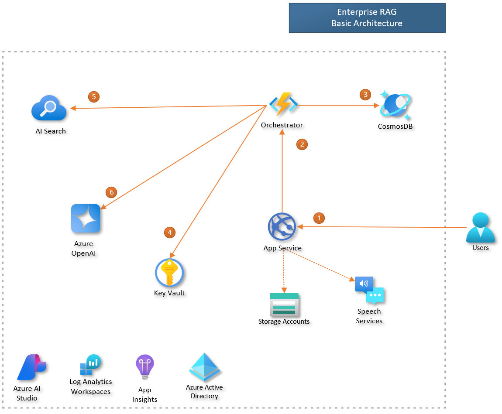
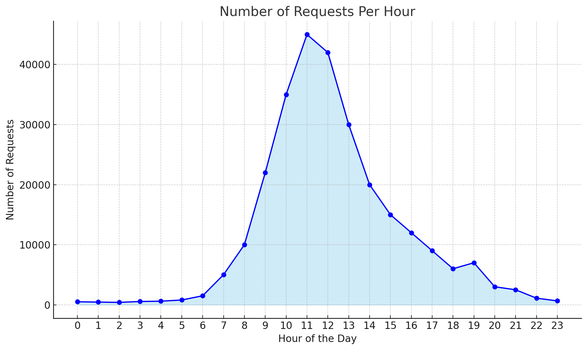
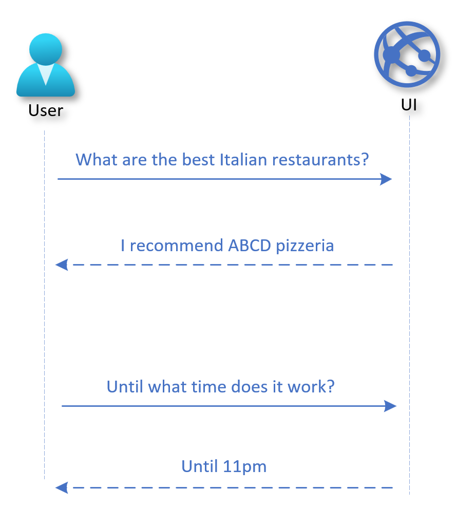
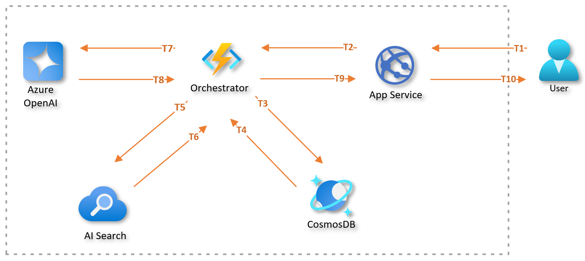
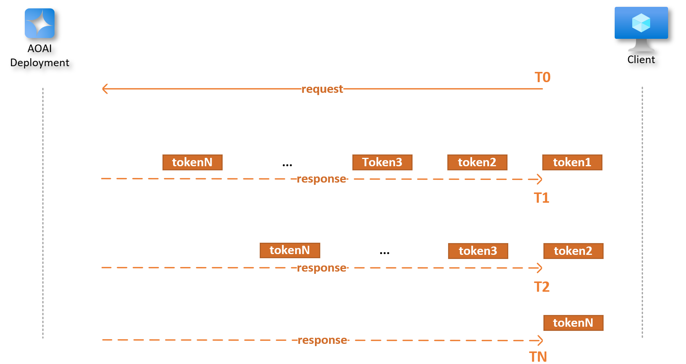
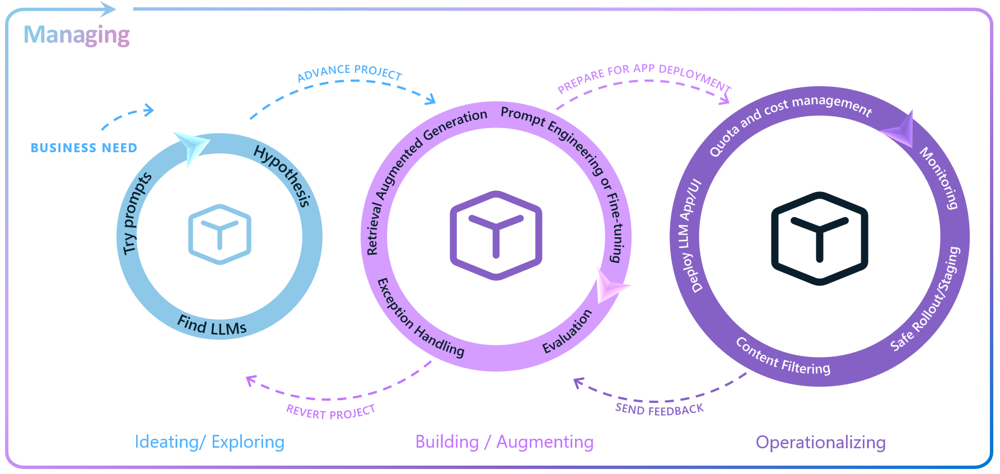
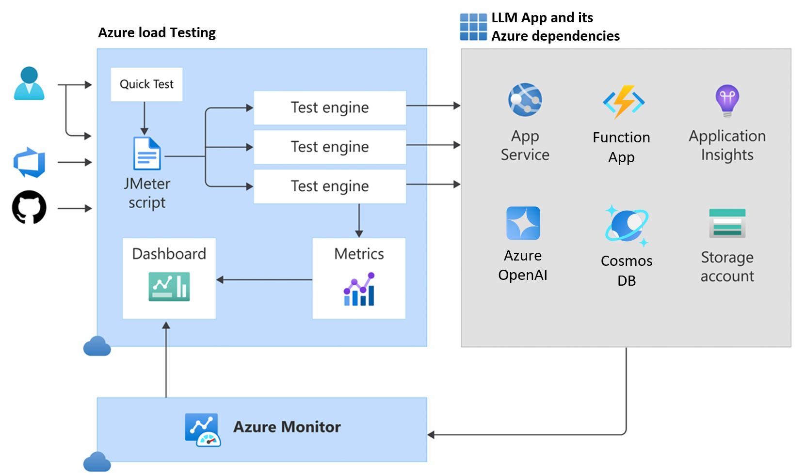
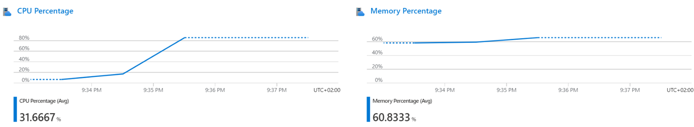
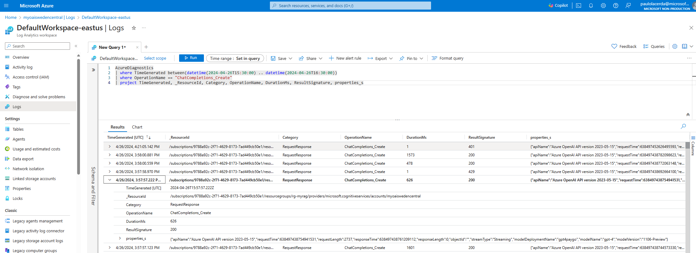

# Performance Evaluation

When developing Language Model (LLM) applications, we typically invest a significant amount of time in both development and evaluation. This is to ensure that the application can generate high-quality responses that are grounded in reliable sources and pose no harm to the user.

However, the effectiveness of an LLM application's user experience is determined not only by the quality of responses but also by how fast the user gets these responses. Therefore, our discussion centers on the evaluation of LLM applications designed for rapid response times.

<!-- **Performance engineering** optimizes application performance through practices like performance tuning, which enhances application functionality, and performance monitoring, which identifies issues and bottlenecks, particularly during production. The ability to foresee and address these issues before they affect the end-users is critical. This is where the role of **performance evaluation** becomes crucial, which is the primary subject of this text -->

The aim of **performance evaluation** is to proactively test the application to identify and address performance issues before they impact end-users. In the subsequent sections, we will explore performance evaluation in detail. We will discuss building an effective strategy, mastering evaluation techniques, and provide practical guides. Here's what you can expect:

- [Building an Effective Strategy](#building-an-effective-strategy)
- [Mastering Evaluation Techniques](#mastering-evaluation-techniques)
- [How-To Guides](#how-to-guides)

## Building an Effective Strategy

Each application has unique characteristics, such as user count, transaction volume, and expected response time. Therefore, it's crucial for you to establish an effective evaluation strategy tailored to the specific application you're evaluating.

Before initiating the tests, you need to outline your strategy, which includes determining the aspects to test and the methods to use. This section provides a detailed discussion on these considerations.

### Identifying What to Evaluate

Let's start by defining what you are going to test. For example, if the application is fully implemented and running in an environment similar to production, you can conduct a comprehensive load test. This allows you to measure performance and anticipate the user experience before the application is released to end users.

Testing the entire application is a good idea as it provides a measure of response times that closely mirrors what a user will experience when interacting with the application. However, a user's interaction with a Large Language Model (LLM) App involves several elements. These include the application frontend, backend, networking, the LLM model, and other cloud services like databases and AI services.

This is particularly true for modern application architectures. With this, you have the opportunity to perform performance tests on specific service even before the entire application is completed and ready for deployment. For example, you can preemptively test the performance of the Large Language Model (LLM) that you will use in the application, even before it is ready. In the [Mastering Evaluation Techniques](#mastering-evaluation-techniques) section, you will see how you can test the performance of a model deployed in the Azure OpenAI service.

Now let's take a look at an example of an application architecture where you have multiple services working together to produce a response for the user.

**Retrieval Augmented Generation** (RAG) is an architectural pattern frequently used in the development of Large Language Model (LLM) Applications, such as ChatGPT. Before making a call to the LLM to generate content, this architecture includes a retrieval step, which is crucial in providing grounding data. The [Enterprise RAG architecture](https://aka.ms/gpt-rag) offers a practical example of the RAG pattern implemented in an enterprise setting. In the [How-To Guides](#how-to-guides) section, you will see an example of how to perform load testing on an LLM application based on the RAG pattern.


<p align="center"><i>Example of communication between the components of an LLM App based on the RAG pattern.</i></p>

> Note: To simplify the diagram, we did not represent the return messages.

This figure illustrates the orchestration flow within an LLM application based on RAG. 

Here's how it works:

1) The user interacts with the frontend UI to pose a question.
2) The frontend service forwards the user's question to the Orchestrator.
3) The Orchestrator retrieves the user's conversation history from the database.
4) The Orchestrator accesses the AI Search key stored in the Key Vault.
5) The Orchestrator retrieves relevant documents from the AI Search index.
6) The Orchestrator uses Azure OpenAI to generate a user response.

Each step in the process involves data transfer and processing across various services, all contributing to the total response time. In such scenarios, you can evaluate not just the overall application response time, but also the performance of individual components, like the response times of the Azure OpenAI model deployment.

Ultimately, the scope of testing depends on each application's specific requirements. For instance, an internal application and a public-facing application may have different performance needs. While a response time of 15 seconds might be acceptable in an internal HR application used to view paychecks, a contact center app with hundreds of users might need to respond much faster due to its high user demand and SLAs. Make sure you know the requirements of your application before starting your performance evaluation.

### Test Scenario

Once you have defined what you will evaluate, it's crucial to define the test scenario. This will not be like timing how long it takes for completions to appear in the playground, how long a Prompt flow's flow takes to execute, or the duration of code execution in VS Code. These metrics, which are based on a single user's experience, can help identify potential performance bottlenecks in specific components. However, to truly gauge the performance under real-world conditions, your test scenario should simulate the actual usage load of the application.

In performance testing, after deciding what to measure, it's essential to define the test scenario accurately. This scenario won't be as simple as measuring the time it takes for completions to appear in the model playground or the execution time of a flow in Prompt Flow. While these metrics, based on a single user's experience, can help pinpoint potential performance issues in specific components, they don't provide a complete picture. To truly understand the performance under real-world conditions, your test scenario should mimic the actual usage load of the application.

First, we need to determine the load that will be placed on the application. This load is defined in terms of throughput, which is the number of requests the application will receive within a specific time frame, such as **Requests per Minute** (RPM).

There are multiple ways to estimate the expected throughput. If the application is already operational, you can use its current usage data, gathered from monitoring tools, as a reference. The subsequent figure illustrates this approach. If you foresee an increase in usage due to the integration of LLM into the solution, you should adjust your throughput estimation to accommodate this anticipated growth.


<p align="center"><i>Example of usage scenario, see the peak load from 10h to 13h hours.</i></p>

When dealing with a new application, estimating the expected throughput can be approached through benchmarking or usage modeling. Benchmarking involves comparing your application with similar ones that serve the same target audience. By studying their usage patterns, you can get a rough estimate of the expected throughput for your application.

Usage modeling, on the other hand, requires you to create a model of the expected usage patterns of your application. This can be achieved by interacting with stakeholders or potential users in the specific field for which the application is being developed. Their insights can provide a better understanding of how the application might be used, which can assist in estimating the Requests Per Minute (RPM).

One approach to model your application usage is starting by identifying the **total number of users**. This should encompass all registered, or potential users of your application. Then, identify the number of these **users** who are active **during peak usage times**. Focusing on peak usage times is crucial as off-peak data may not accurately reflect system performance, particularly for systems with distinct high usage periods.

Next, estimate the average number of times a user will use the application during peak times. This is referred to as **sessions**. Also, estimate the number of actions or **interactions** a user makes during a session. Each interaction corresponds to a request made to the application. 

For example, consider a mobile app for a shopping mall. Users are likely to have multiple interactions in a single session. They might first search for recommended restaurants, then ask about the operating hours of a specific restaurant. Each of these actions is an interaction.

<p align="center">
  
  <br>
  <i>Example of a user session.</i>
</p>

Once you have the number of users (**u**), the percentage (**p**) of them that will use the application during the peak usage hours (**n**), the number of user sessions (**s**), and the average number of interactions (**i**) they have with the application, you can use the following formula to derive the RPM, considering these are sufficient to run a load test.

`RPM = (u * p * s * i) / n / 60`

Taking the previous example of the Mall App, let's consider a set of **10,000 registered users** on the App. We expect that during peak hours, **10%** of the users will interact at least once with the application to obtain information, such as store locations or product details.

In this case, we have:
- **u=10000** (total users)
- **p=0.1** (percentage of active users)
- **s=1** (sessions per user)
- **i=2** (interactions per session)
- **n=1** (network calls per interaction)

Therefore, the expected throughput for the peak hours is approximately **17 RPM**.

> **Note:** During testing, you may want to reproduce a load that is about 10% higher than estimated to be more conservative.

Defining the scenario for larger applications can become complex, requiring the identification of distinct user roles and their usage behavior. However, if exact modeling is challenging due to lack of information, just keep things simple, make an educated guess, and validate it with the application's stakeholders.

Another factor to consider when defining your test scenario is that LLM response times depend on the sizes of prompts and completions. Accurate testing requires replicating real usage scenarios, matching these sizes. For instance, RAG prompts are typically larger due to context text, while proofreading apps usually have similar prompt and completion sizes.

#### Test Data

Performance testing heavily relies on the data used during the test execution. It's crucial to use data that closely mirrors real-world scenarios. For instance, if we're testing an application like a copilot, the test results would be more accurate if each user asks different questions. Even if users ask the same questions, they should phrase them differently.

Consider a scenario where each virtual user asks the exact same question during the test. This could lead to results that don't accurately represent real-world usage. Certain components of the application might leverage caching mechanisms to deliver faster responses, skewing the results. Furthermore, the final metric, typically an average or a percentile, will be biased towards the repeated question.

Having experts in the App domain contribute to the creation of the test data set can greatly enhance its quality and relevance. Their knowledge can help shape more realistic and relevant examples. Alternatively, a Large Language Model (LLM) can be utilized to generate a synthetic dataset. This approach can be particularly useful for running tests, as it allows for the creation of diverse and comprehensive data scenarios. This practice not only enhances the quality of the tests but also ensures that they cover a wide range of potential real-world situations.

#### Test Measurements

Performance testing requires identifying key metrics. A common one is **Response Time**, the total time from sending a request to receiving a response. Performance requirements are typically determined by this metric, such as needing an average response time under ten seconds, or 95% of responses within ten seconds.

However, response time is not the only metric of interest. To gain a holistic understanding of the application's performance and the factors affecting it, we can categorize the metrics into two groups.

The first group comprises metrics that can be measured from the client's perspective - what the client can observe and capture. The second group consists of metrics that are measured by monitoring the server's performance. Let's explore each of these groups in detail:

##### Client metrics

When testing an LLM App, we usually obtain the following client metrics:

| Metric                     | Description                                        |
|----------------------------|----------------------------------------------------|
| Number of Virtual Users    | This metric shows the virtual user count during a load test, helping assess application performance under different user loads. |
| Requests per Second        | This is the rate at which requests are sent to the LLM App during the load test. It's a measure of the load your application can handle. |
| Request Response Time      | This is the time taken by the application to respond to a request.|
| Number of Failed Requests  | This is the count of requests that failed during the load test. It helps identify the reliability of your application under stress. |

> **Note:** "Request response time" is the duration from when a client sends a request to when it receives the full response, often called "end-to-end response time". It includes all processing time within the system. However, the "request response time" only measures the interval between sending a request and receiving the response. It does not account for any client-side processing time, such as rendering a webpage or executing JavaScript in a web application.

The diagram below illustrates how processing and communication times add up to the total response time. In the figure, each Tn marks a specific time during processing. T1 is when the user initiates a request through a client, such as a browser or MS Teams. T10 is when the user gets the full response. Note that the total response time (from T1 to T10) depends on the processing and response times of all components involved in the request.


<p align="center"><i>Simplified example of the breakdown of request response time.</i></p>


###### Performance Metrics for a LLM

When conducting performance testing directly on a specific service, we can collect specific client-side metrics for the target service. In the context of performance testing a Language Model (LLM), we should consider metrics related to prompt tokens and response tokens. For instance, consider the deployment of an OpenAI model on Azure. The following table presents some of these metrics, which offer valuable insights into the client's interaction with the model deployment and its performance under load.

| Metric                           | Description                                                  |
|----------------------------------|--------------------------------------------------------------|
| Number Prompt Tokens per Minute  | Rate at which the client sends prompts to the OpenAI model.  |
| Number Generated Tokens per Min  | Rate at which the OpenAI model generates response tokens.    |
| Time to First Token (TTFT)       | Latency from the start of the client's request until the first response token is generated. |
| Time Between Tokens (TBT)        | Time interval between consecutive response tokens being generated. |

> **Note:** To examine the time intervals between tokens in Azure OpenAI's responses, you can utilize its streaming feature. Unlike conventional API calls that deliver the entire response at once, streaming sends each token or a set of tokens to the client as soon as they are produced. This allows for real-time performance monitoring and detailed analysis of the dynamics of response generation.

The diagram below provides a simplified view of a client's interaction with a model endpoint. The interaction commences at the moment (`T0`) when the client sends a request to the model's endpoint. The model responds in streaming mode, with `T1`, `T2`, and `TN` representing the moments when the first, second, and last tokens are received, respectively. 

In this scenario, we define several key metrics: **Time to First Token (TTFT)** is `T1 - T0`, **Time Between Tokens (TBT)** is `T2 - T1`, and the **end-to-end response time** is `TN - T0`. It's important to note that in streaming mode, the model's responses can arrive in multiple parts, each with several tokens. This makes both the diagram and the metrics an approximate representation of real-world scenarios.


<p align="center"><i>AOAI deployment response in streaming mode.</i></p>


##### Server metrics

During performance testing, we focus on two types of metrics. The first type is client metrics, which directly affect the user experience. The second type is server metrics, which give us insights into the performance of server components.

Server metrics encompass a wide range of measurements. For instance, we might look at the CPU and memory usage of the application service running the frontend. We could also monitor the utilization of resources like the Azure OpenAI PTU deployment. These are just a few examples; there are many other server metrics we could potentially examine.

By collecting these measurements, we can create a detailed performance profile of the entire solution. This profile helps us identify any bottlenecks and tune any components that are not performing optimally.

LLM Apps consist of various services, and the server metrics we utilize will vary based on these services. To give you an idea, here are some examples of the metrics we might gather, depending on the specific service in use:

<!-- https://learn.microsoft.com/en-us/azure/ai-services/openai/how-to/monitoring -->

| Service Name             | Metric                           | Description |
|--------------------------|----------------------------------|-------------|
| Azure OpenAI   | Azure OpenAI Requests            | Total calls to Azure OpenAI API. |
| Azure OpenAI   | Generated Completion Tokens      | Output tokens from Azure OpenAI model. |
| Azure OpenAI   | Processed Inference Tokens       | The number of input and output tokens that are processed by the Azure OpenAI model. |
| Azure OpenAI   | Provision-managed Utilization V2 | The percentage of the provisioned-managed deployment that is currently being used. |
| Azure App Service | CPU Percentage                   | The percentage of CPU used by the App backend services. |
| Azure App Service | Memory Percentage                | The percentage of memory used by the App backend services. |
| Azure Cosmos DB          | Total Requests                   | Number of requests made to Cosmos DB. |
| Azure Cosmos DB  | Provisioned Throughput           | The amount of throughput that has been provisioned for a container or database. |
| Azure Cosmos DB  | Normalized RU Consumption        | The normalized request unit consumption based on the provisioned throughput. |
| Azure API Management     | Total Requests                   | Total number of requests made to APIM. |
| Azure API Management     | Capacity                         | Percentage of resource and network queue usage in APIM instance |


### When should I evaluate performance?

You might be wondering when to execute performance tests. To help us in this discussion, let's take a look at the Enterprise LLM Lifecycle, illustrated in the following image.


<p align="center"><i>Enterprise LLM Lifecycle.</i></p>

The Enterprise LLM Lifecycle with Azure AI involves ideating and exploring, building and augmenting, operationalizing, and managing loops to develop, enhance, deploy, and govern large language model (LLM) applications. You can learn more about the Enterprise LLM Lifecycle by reading this blog: [Building for the future: The enterprise generative AI application lifecycle with Azure AI](https://azure.microsoft.com/es-es/blog/building-for-the-future-the-enterprise-generative-ai-application-lifecycle-with-azure-ai/).

Performance testing is crucial and should start as early as possible during the development process. This early start provides enough time for making necessary adjustments and optimizations. The exact timing, however, depends on what aspects of the application you're testing.

If your goal is to evaluate the performance of the entire LLM App before it's used by end-users, the application must be fully developed and deployed to a staging environment. Typically, this load testing of the LLM App occurs during the initial iterations of the Operationalization loop in the Enterprise LLM Lifecycle.

Keep in mind that there are scenarios where performance evaluations can be conducted before Operationalization. For instance, during the Experimenting and Ideating phase, you might be exploring various LLMs for use. If you're considering using one of the models available on Azure OpenAI, this could be an excellent time to conduct a performance benchmark test using the Azure OpenAI benchmarking tool.

The following figure illustrates the moments in the LLM lifecycle where the two types of performance tests mentioned earlier are usually conducted.


<p align="center"><i>Performance tests in the LLM Lifecycle.</i></p>

## Mastering Evaluation Techniques

OK, if you've reached this point, you already know what's important to consider in your testing strategy. Here, we will explore two evaluation techniques. One is aimed at performance testing of the entire LLM application, and the second is more focused on testing the deployed LLM. It's worth mentioning that these are two commonly used examples, but this is a non-exhaustive list. Depending on your performance requirements, it may be necessary to use other techniques in your testing strategy.

#### LLM App Load Testing

Azure Load Testing is a fully managed load-testing service that enables you to generate high-scale LLM App load testing. The service simulates traffic for your applications, regardless of where they're hosted. You can use it to test and optimize application performance, scalability, or capacity of your application. You have the flexibility to create and execute load tests either through the Azure portal or via the Azure Command Line Interface (CLI), managing and running your tests in the way that suits you best.

Azure Load Testing helps you simulate a large number of users sending requests to a server to measure how well an application or service performs under heavy load. You can use Apache JMeter scripts to set up and run these tests. These scripts can act like real users, doing things like interacting with the service, waiting, and using data. In the [How-To Guides](#how-to-guides) section, you will find a guide on how you can test your LLM App with a practical example.

The diagram below shows the high-level architecture of Azure Load Testing. It uses JMeter to simulate heavy server loads and provides detailed performance metrics. You can adjust the number of test engine instances to meet your load test requirements, making the system scalable and robust.


<p align="center"><i>Azure Load Testing.</i></p>

LLM App load testing is crucial for identifying performance issues and ensuring that your application and its Azure dependencies (like the App Service, Function App, and Cosmos DB) can handle peak loads efficiently.

The following table offers an explanation of important concepts associated with Azure Load Testing. Grasping these concepts is essential for effectively using Azure's load testing features to evaluate the performance of the LLM App under various load scenarios.

| Concept | Description |
|---------|-------------|
| Test | Refers to a performance evaluation setup that assesses system behavior under simulated loads by configuring load parameters, test scripts, and target environments. |
| Test Run | Represents the execution of a Test.|
| Test Engine | Engine that runs the JMeter test scripts. Adjust load test scale by configuring test engine instances. |
| Threads | Are parallel threads in JMeter that represent virtual users. They are limited to a maximum of 250. |
| Virtual Users (VUs) | Simulate concurrent users. Calculated as threads * engine instances. |
| Ramp-up Time | Is the time required to reach the maximum number of VUs for the load test. |
| Latency | Is the time from sending a request to the moment the beginning of the response arrives. |
| Response Time | This refers to the duration between sending a request and receiving the full response. It does not include any time spent on client-side response processing or rendering. |

Azure Load Testing allows parameter definition, including environment variables, secrets, and certificates. It supports test scaling, failure criteria setting, and monitoring of application components and resource metrics. CSV files with test data and JMeter configurations can be uploaded for flexible, customizable test scripts.

For [secure access](https://learn.microsoft.com/en-us/azure/load-testing/how-to-test-secured-endpoints) to Azure Key Vault [secrets](https://learn.microsoft.com/en-us/azure/load-testing/how-to-parameterize-load-tests#secrets), a managed identity can be used. This resource, when deployed within your [virtual network](https://learn.microsoft.com/en-us/azure/load-testing/how-to-test-private-endpoint), It is capable of generating load directed at your application's private endpoint. Authentication via access tokens, user credentials, or client certificates is also supported, depending on your application's requirements.

##### Monitoring Application Resources

With Azure Load Testing, you can monitor your server-side performance during load tests. You can specify which Azure application components to monitor in the test configuration. You can view these server-side metrics both during the test and afterwards on the load testing dashboard. The following figure shows an example of server-side metrics obtained from an App Service after running a test. You can see the Azure services from which you can obtain server-side metrics [in this link](https://learn.microsoft.com/en-us/azure/load-testing/resource-supported-azure-resource-types).


<p align="center"><i>Azure Load Testing Server-side Performance Metrics.</i></p>

##### Load Testing Automation

Integrating Azure Load Testing into your CI/CD pipeline is a key step in enhancing your organization's adoption of LLMOps practices. This integration enables automated load testing, ensuring consistent performance checks at crucial points in the development lifecycle. You can trigger Azure Load Testing directly from Azure Pipelines or GitHub Actions workflows, providing a simplified and efficient approach to performance testing. Below are some examples of commands to automate the creation and execution of a load test.

```
# Example command to create a load test 
az loadtest create \
  --name $loadTestResource \
  --resource-group $resourceGroup \
  --location $location \
  --test-file @path-to-your-jmeter-test-file.jmx \
  --configuration-file @path-to-your-load-test-config.yaml
```

```
# Example command to run the load test
az loadtest run \
  --name $loadTestResource \
  --resource-group $resourceGroup \
  --test-id $testId
```

For more information on configuring a load test and automating these steps using the Azure Command Line Interface (CLI), refer to the [Azure Load Testing CI/CD configuration guide](https://learn.microsoft.com/en-us/azure/load-testing/how-to-configure-load-test-cicd) and the [Azure CLI reference for load testing](https://learn.microsoft.com/en-us/cli/azure/load).

##### Key Metrics to Monitor During Load Tests

When conducting load tests, it's crucial to monitor certain key metrics to understand how your application performs under stress. These metrics will help you identify any potential bottlenecks or areas that need optimization. Here are some of the most important ones to keep an eye on:

   - **Request Rate**: Monitor the request rate during load testing. Ensure that the LLM application can handle the expected number of requests per second.
   - **Response Time**: Analyze response times under different loads. Identify bottlenecks and optimize slow components.
   - **Throughput**: Measure the number of successful requests per unit of time. Optimize for higher throughput.
   - **Resource Utilization**: Monitor CPU, memory, and disk usage. Ensure efficient resource utilization.

##### Best Practices for Executing Load Tests

To ensure your load tests are effective and yield meaningful insights, it's worthwhile to review the following recommendations. Here are some key strategies to consider:

   - **Test Scenarios**: Create realistic test scenarios that mimic actual user behavior.
   - **Ramp-Up Strategy**: Gradually increase the load to simulate real-world traffic patterns. The warm-up period typically lasts between 20 to 60 seconds. After the warm-up, the actual load test begins
   - **Think Time**: Include think time between requests to simulate user interactions.
   - **Geographical Distribution**: Test from different Azure regions to assess global performance.

##### Performance Tuning Strategies for LLM Apps

This section discusses performance tuning for LLM Apps. Application performance is heavily influenced by design and architecture. Effective structures can manage high loads, while poor ones may struggle. We'll cover various performance tuning aspects, not all of which may be universally applicable.

###### Application Design

- **Optimize Application Code**: Examine and refine the algorithms and backend systems of your LLM application to increase efficiency. Utilize asynchronous processing methods, such as Python's async/await, to elevate application performance. This method allows data processing without interrupting other tasks.

- **Batch Processing**: Batch LLM requests whenever possible to reduce overhead. Grouping multiple requests for simultaneous processing improves throughput and efficiency by allowing the model to better leverage parallel processing capabilities, thereby optimizing overall performance.

- **Implement Caching**: Use caching for repetitive queries to lighten the application's load and speed up response times. This is particularly useful in LLM applications where similar questions are common. Caching answers to frequently asked or common questions reduces the need to run the model repeatedly for the same inputs, saving both time and computational resources.

- **Revisit your Retry Logic**: LLM model deployments might start to operate at their capacity, which can lead to 429 errors. A well-designed retry mechanism can help maintain application responsiveness. With the OpenAI Python SDK, you can opt for an exponential backoff algorithm. This algorithm gradually increases the wait time between retries, helping to prevent service overload. Additionally, consider the option of falling back on another model deployment. For more information, refer to the load balance item in the Solution Architecture section.

###### Prompt Design

- **Generate Less Tokens**: To reduce model latency, create concise prompts and limit token output. [cutting 50% of your output tokens may cut ~50% your latency](https://platform.openai.com/docs/guides/latency-optimization). Utilizing 'max_tokens' can also expedite the response time.

- **Optimize Your Prompt**: If dealing with large amounts of context data, consider prompt compression methods. Approaches like those offered by [LLMLingua-2](https://llmlingua.com/llmlingua2.html), fine-tuning the model to reduce lengthy prompts, eliminating superfluous RAG responses, and removing extraneous HTML can be efficient. Trimming your prompt by 50% might only yield a latency reduction of 1-5%, but these strategies can lead to more substantial improvements in performance.

- **Refine Your Prompt**: Optimize the shared prompt prefix by placing dynamic elements, such as RAG results or historical data, toward the end of your prompt. This enhances compatibility with the [KV cache system](https://arxiv.org/pdf/2211.05102) commonly used by most large language model providers. As a result, fewer input tokens need processing with each request, increasing efficiency.

- **Use Smaller Models**: Whenever possible, pick smaller models because they are faster and more cost-effective. You can improve their responses by using detailed prompts, a few examples, or by fine-tuning.

###### Solution Architecture

- **Provisioned Throughput Deployments**: Use these in scenarios requiring stable latency and predictable performance, avoiding the 'noisy neighbor' issue in regular pay-as-you-go setups.

- **Load Balancing LLM Endpoints**: Implement [load balancing](https://github.com/Azure-Samples/openai-aca-lb/) for LLM deployment endpoints. Distribute the workload dynamically to enhance performance based on endpoint latency. Establish suitable rate limits to prevent resource exhaustion and ensure stable latency.

- **Resource Scaling**: If services show strain under increased load, consider scaling up resources. Azure allows seamless scaling of CPU, RAM, and storage to meet growing demands.

- **Network Latency**: Position Azure resources, like the Azure OpenAI service, near your users geographically to minimize network latency during data transmission to and from the service.

#### Azure OpenAI Benchmarking

The [Azure OpenAI Benchmarking Tool](https://github.com/Azure/azure-openai-benchmark) enables you to assess the performance of Azure OpenAI deployments and choose the ideal model and deployment approach (PTU vs. pay-as-you-go) for your specific needs. It provides detailed latency metrics and simulates various traffic patterns. This tool is particularly useful during model selection and experimentation in the initial phases of a project, as it assists developers in determining whether the model deployment is appropriately sized or if it needs adjustments. This tool allows you to make data-driven decisions, ensuring your deployment is both efficient and tailored to your operational requirements.

The benchmarking tool works by creating traffic patterns that mirror the expected test load. When conducting the test, make sure it runs long enough for the throughput to reach a stable state, especially when the utilization is close to or at 100%. The benchmark tool also generates synthetic requests with random words, matching the number of context tokens in the requested shape profile. To simulate a worst-case scenario and prevent unrealistically favorable results due to optimizations, each prompt includes a random prefix, forcing the engine to fully process each request.

This type of test is especially beneficial for Provisioned-Managed deployments. By adjusting the number of provisioned throughput units (PTUs) deployed, you can optimize your solution's design. Based on the analysis, you might need to revise the number of PTU deployments or even consider a hybrid architecture with PTU and Pay-as-you-go deployments, using load balancing between two or more deployments.

###### Test Parameters

You can configure the benchmarking tool to optimize your load testing experience with several adjustable parameters:

 With the `rate` parameter, you can control the frequency of requests in Requests Per Minute (RPM), allowing for detailed management of test intensity.

The `clients` parameter enables you to specify the number of parallel clients that will send requests simultaneously, providing a way to simulate varying levels of user interaction.

The `shape-profile` parameter, with options like "balanced", "context", "custom" or "generation", adjusts the request characteristics based on the number of context and generated tokens, enabling precise testing scenarios that reflect different usage patterns. 

When shape-profile is set to "custom", two additional parameters come into play: context-token and max-tokens. The `context-token` parameter allows you to specify the number of context tokens in the request, while `max-tokens` allows you to specify the maximum number of tokens that can be generated in the response. 

The `aggregation-window` parameter defines the duration, in seconds, for which the data aggregation window spans. Before the test hits the aggregation-window duration, all stats are computed over a flexible window, equivalent to the elapsed time. This ensures accurate RPM/TPM stats even if the test ends early due to hitting the request limit.

###### Retry Strategy

The `retry` parameter allows you to set the retry strategy for requests, offering options such as "none" or "exponential", which can be crucial for handling API request failures effectively. When setting up a retry strategy for Azure OpenAI benchmarking, it's crucial to select an approach that carefully balances resource capacity to avoid skewing latency statistics. 

When running a test with retry=none, throttled requests are immediately retried with a reset start time, and latency metrics only reflect the final successful attempt, o que pode nao representar a experiencia do usuario final . Use this setting for workloads within resource limits without throttling or to assess how many requests need redirecting to a backup during peak loads that surpass the primary resource’s capacity.

 Conversely, with retry=exponential, failed or throttled requests are retried with exponential backoff, up to 60 seconds. This approach, recommended when no backup resources are deployed, measures the total time from the first failed attempt to the successful completion, thus capturing the full potential wait time an end-user might experience. This method is ideal for understanding the impacts of throttling and retries on total request latency, especially in scenarios like chat applications where response times are critical.

###### Sample Scenario

In the following example, taken from the tool's documentation, the benchmarking tool tests a traffic pattern that sends requests to the gpt-4 deployment in the 'myaccount' Azure OpenAI resource at a rate of 60 requests per minute, with the retry set to exponential. The default traffic shape is used, where each request contains 1000 context tokens, and the maximum response size is limited to 500 tokens.
```
$ python -m benchmark.bench load \
    --deployment gpt-4 \
    --rate 60 \
    --retry exponential \
    https://myaccount.openai.azure.com

2023-10-19 18:21:06 INFO     using shape profile balanced: context tokens: 500, max tokens: 500
2023-10-19 18:21:06 INFO     warming up prompt cache
2023-10-19 18:21:06 INFO     starting load...
2023-10-19 18:21:06 rpm: 1.0   requests: 1     failures: 0    throttled: 0    ctx tpm: 501.0  gen tpm: 103.0  ttft avg: 0.736  ttft 95th: n/a    tbt avg: 0.088  tbt 95th: n/a    e2e avg: 1.845  e2e 95th: n/a    util avg: 0.0%   util 95th: n/a   
2023-10-19 18:21:07 rpm: 5.0   requests: 5     failures: 0    throttled: 0    ctx tpm: 2505.0 gen tpm: 515.0  ttft avg: 0.937  ttft 95th: 1.321  tbt avg: 0.042  tbt 95th: 0.043  e2e avg: 1.223 e2e 95th: 1.658 util avg: 0.8%   util 95th: 1.6%  
2023-10-19 18:21:08 rpm: 8.0   requests: 8     failures: 0    throttled: 0    ctx tpm: 4008.0 gen tpm: 824.0  ttft avg: 0.913  ttft 95th: 1.304  tbt avg: 0.042  tbt 95th: 0.043  e2e avg: 1.241 e2e 95th: 1.663 util avg: 1.3%   util 95th: 2.6% 
```

When you run the test, you will obtain average and 95th percentile metrics from the following measures:

|measure|description|
|-|-|
|`ttft`| Time to First Token. Time in seconds from the beginning of the request until the first token was received.|
|`tbt`| Time Between Tokens. time in seconds between two consecutive generated tokens.|
|`e2e`| End to end request time.|
|`util`| Azure OpenAI deployment utilization percentage as reported by the service.|


##### Monitoring AOAI Resource

To leverage Azure Monitor Log Analytics queries for log and metrics analysis, it's essential to [configure diagnostic settings](https://learn.microsoft.com/en-us/azure/ai-services/openai/how-to/monitoring#configure-diagnostic-settings) for both your Azure OpenAI resource and Log Analytics workspace. While platform metrics and the Azure Monitor activity log are automatically collected and stored, Azure Monitor resource logs require a diagnostic setting to be created and routed to one or more locations.

Configuring diagnostic settings for Azure OpenAI Service is essential for monitoring the availability, performance, and operation of your Azure resources. These settings enable the collection and analysis of metrics and log data from your Azure OpenAI resource. They allow you to track key metrics like the number of API calls, generated tokens, and training hours, and provide access to logs for insights into resource-specific activities. Proper configuration of these settings offers valuable insights into your Azure OpenAI resources' performance and usage, aiding in application optimization and troubleshooting.

After configuring the diagnostic settings, you can start querying the generated logs. Simply access your Azure OpenAI resource in the portal and then select Logs in the Monitoring section. Next, click on the Log Analytics Workspace that you selected during the diagnostic settings configuration and select the workspace's Logs option.

Below is a query example that retrieves logs from AzureDiagnostics for "ChatCompletions_Create" operations, conducted between 3:30 PM and 4:30 PM on April 26, 2024. It selects logs with details such as timestamp, resource, operation, duration, response code, and additional properties, enabling a detailed analysis of the operation's performance and outcomes during that hour.

```
AzureDiagnostics
| where TimeGenerated between(datetime(2024-04-26T15:30:00) .. datetime(2024-04-26T16:30:00))
| where OperationName == "ChatCompletions_Create"
| project TimeGenerated, _ResourceId, Category, OperationName, DurationMs, ResultSignature, properties_s
```


<p align="center"><i>Analyzing Azure OpenAI Metrics with Azure Monitor.</i></p>


## How-To Guides

Now that you understand the concepts for conducting performance tests, you can refer to the following sections where we provide a detailed guide on how to use the tools mentioned in the text to test your LLM App or your Azure OpenAI model deployment.

- [LLM RAG application testing with Azure Load Testing](LOAD_TESTING.md).

- [Model deployment testing with AOAI Benchmarking Tool](https://github.com/microsoft/llmops-workshop/labs/performance/AOAI_BENCH_TOOL.md).

<!--  references:
https://www.microsoft.com/en-us/research/group/experimentation-platform-exp/articles/how-to-evaluate-llms-a-complete-metric-framework/ 
https://learn.microsoft.com/en-us/azure/ai-services/openai/how-to/monitoring
https://jmeter.apache.org/usermanual/glossary.html -->