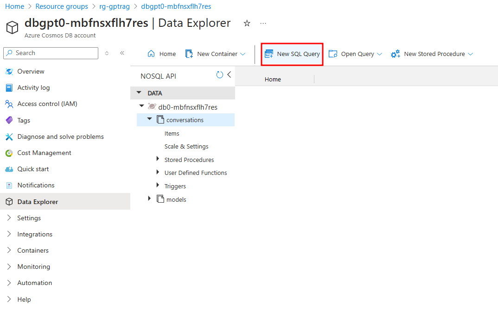

# Querying Conversations from CosmosDB

This page provides you with SQL queries to extract specific information about conversations stored in CosmosDB. 

To execute these queries, access your CosmosDB resource through the Azure Portal, then select the 'New SQL Query' option in the Data Explorer, as shown in the following screen:



#### 1) Retrieve Conversation by ID

To retrieve a specific conversation using its ID, use the following query:

```
SELECT * FROM c WHERE c.id = 'replace_with_the_id'
```

#### 2) Last Conversation

To retrieve the last conversation, you can use the following query:

```
SELECT TOP 1 *
FROM c
ORDER BY c.conversation_data.start_date DESC
```

#### 3) Number of Conversations in a Specific Period

To count the number of conversations within a specific date range, use the query below:

```
SELECT COUNT(1) AS total_conversations
FROM c
WHERE
    c.conversation_data.start_date >= '2024-05-09 00:00:00'
    AND c.conversation_data.start_date <= '2025-12-31 23:59:59'
```

#### 4) Number of ungrounded answers

To find out how many ungrounded answers where filtered during a specified period, use this query:

```
SELECT COUNT(c) AS ungrounded_answers
FROM c
JOIN i IN c.conversation_data.interactions
WHERE i.gpt_groundedness < 5
AND c.conversation_data.start_date >= '2024-05-09 00:00:00'
AND c.conversation_data.start_date <= '2025-12-31 23:59:59'
```

#### 5) Top Longest Response Times in a Specific Period

To retrieve the top 10 longest response times within a particular period, you can use the following query:

```
SELECT TOP 10 c.conversation_data.interactions
FROM c
WHERE c.conversation_data.start_date >= '2024-05-09 00:00:00'
AND c.conversation_data.start_date <= '2025-12-31 23:59:59'
ORDER BY c.conversation_data.interactions.response_time DESC
```