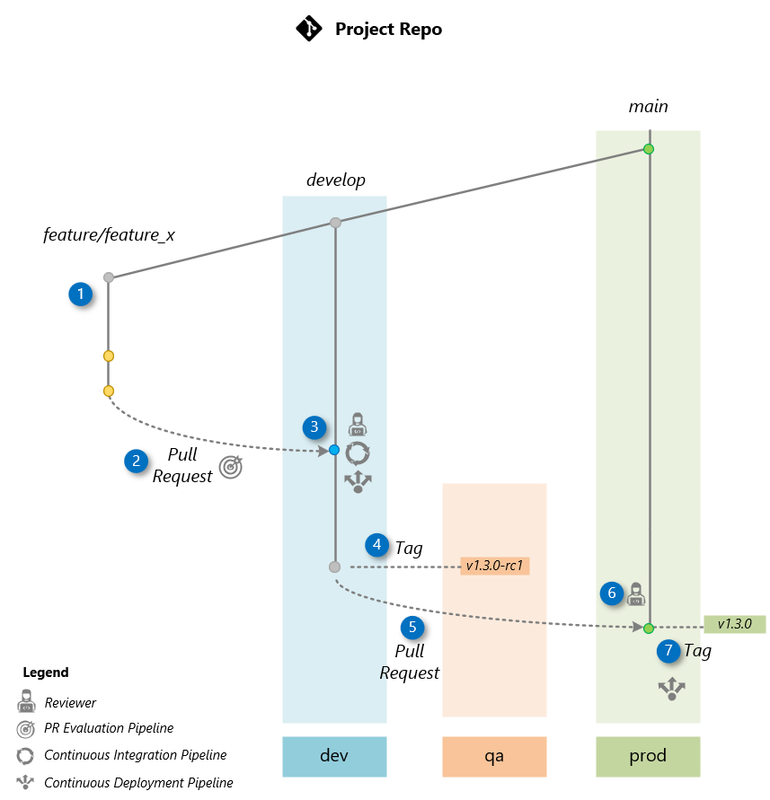

# 🧩 Release Workflow

This project uses a lightweight and structured Git workflow designed for teams working with **Dev**, **QA**, and **Prod** environments. It keeps `develop` as the integration branch, `main` as the production branch, and uses **semantic version tags** to control environment promotion.

> [!NOTE]
> Although this document is located in the main repository, this release workflow applies to **all repositories** that are part of the project—such as the orchestrator, data ingestion, and others. We follow the same branching strategy and tagging process across each of them to ensure consistent releases and environment promotion.





## 🔁 Workflow Steps

### 🔹 Step 1 – Develop a Feature

**Who:** *Contributor*

* Fork the repository.

* Create a feature branch from `develop`:

  ```bash
  git checkout -b feature/your-feature-name develop
  ```

* Commit your changes and push the branch to your fork.

### 🔹 Step 2 – Submit a Pull Request to `develop`

**Who:** *Contributor*

* Open a Pull Request from your feature branch to the `develop` branch of the main repository.

> 🧪 This triggers PR pipeline checks.

### 🔹 Step 3 – Review and Merge the PR into `develop`

**Who:** *Reviewer*

* Review the Pull Request.
* Once approved, merge it into `develop`.

> 📦 🚀 Builds the image and deploys `develop` to **Dev**.

### 🔹 Step 4 – Create a Release Candidate Tag (e.g., `v1.3.0-rc1`)

**Who:** *Maintainer*

* From the latest `develop`, create a release candidate tag:

  ```bash
  git checkout develop
  git pull
  git tag -a v1.3.0-rc1 -m "Release candidate 1"
  git push origin v1.3.0-rc1
  ```

> 🚀 This triggers deployment to the **QA** environment.

### 🔹 Step 5 – Promote to Production: Open PR from `develop` to `main`

**Who:** *Maintaner*

* After successful QA validation, open a Pull Request from `develop` to `main`.

### 🔹 Step 6 – Review and Merge the PR into `main`

**Who:** *Reviewer*

* Review the Pull Request.
* Once approved, merge it into `main`.

### 🔹 Step 7 – Tag the Final Production Release (e.g., `v1.3.0`)

**Who:** *Maintainer*

* Create and push a production release tag:

  ```bash
  git checkout main
  git pull
  git tag -a v1.3.0 -m "Final release"
  git push origin v1.3.0
  ```
> 🚀 This triggers deployment to the **Prod** environment.

> [!TIP]
> This workflow assumes contributors fork the repository to submit changes, as explained on the [contributing](../CONTRIBUTING.MD) page. If you created your own repo using this one as a **template**, you don’t need to fork — just follow the same branching and PR process directly in your repo (`feature/...` → `develop` → `main`, with release tags for QA and production).


📝 Additional Notes

- 🔖 Only final tags (like v1.3.0) should be used for GitHub Releases.
- 🎯 Release candidate tags (e.g., v1.3.0-rc1) are used exclusively for QA validation.
- 🔒 Contributors do not create tags or merge into main — those are handled by Reviewers.