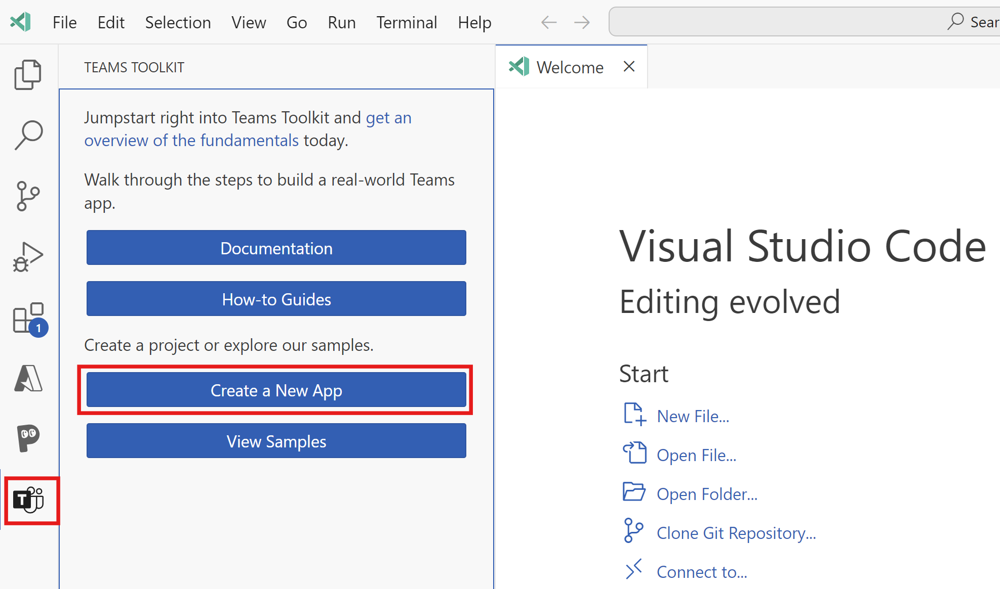
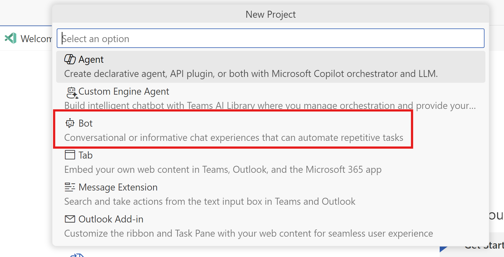
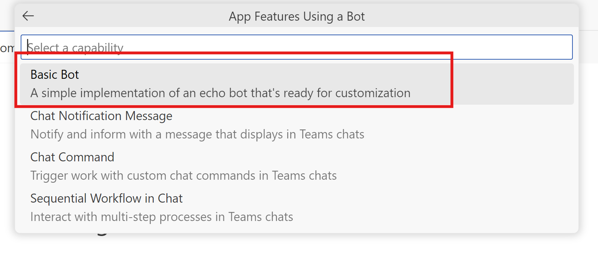
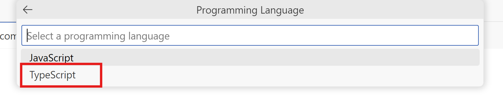
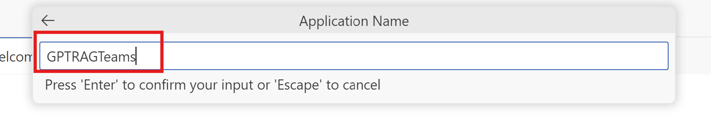

# Guide for Building a Teams App Interface for Enterprise GPT-RAG Solution Accelerator

*Ensure all prerequisites mentioned [here](TEAMS_INTEGRATION_MAIN.md) are completed before proceeding with the steps below.*

## Step 1: Create a new Teams App.

1. Open **Visual Studio Code**. 

2. Select the **Teams Toolkit** > **Create a New App**.

2. Select **Bot** as app capability.

3. Select **Basic Bot** as app capability.

4. Choose a programming language. For this guide, we will use **TypeScript**.

5. Select **Browse** and select the location for project workspace.

6. Enter a suitable name for your app, such as *GPTRAGTeams*, as the application name. Ensure that you use only alphanumeric characters. Press **Enter**.

Proceed to Step 2: [Connect to GPT-RAG Orchestrator and test locally](TEAMS_INTEGRATION_STEP2.md).

## Additional Resources
- [Prerequisites - Guide for Building a Teams App Interface for the Enterprise GPT-RAG Solution Accelerator](TEAMS_INTEGRATION_MAIN.md#prerequisites).
- [Step 2: Connect to GPT-RAG Orchestrator and test locally](TEAMS_INTEGRATION_STEP2.md).

## External Resources
- [Install Teams Toolkit](https://learn.microsoft.com/en-us/microsoftteams/platform/toolkit/install-teams-toolkit?tabs=vscode).
- [Prepare to build apps using Teams Toolkit](https://learn.microsoft.com/en-us/microsoftteams/platform/toolkit/build-environments).
- [Prerequisites for creating your Teams app](https://learn.microsoft.com/en-us/microsoftteams/platform/toolkit/tools-prerequisites).
- [Directory structure for different app types](https://learn.microsoft.com/en-us/microsoftteams/platform/toolkit/create-new-project#directory-structure-for-different-app-types).
