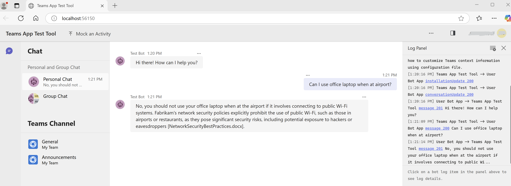

# Guide for Building a Teams App Interface for Enterprise GPT-RAG Solution Accelerator

*Ensure all steps mentioned in [Step 1](TEAMS_INTEGRATION_STEP1.md) are completed before proceeding with the steps below.*

## Step 2: Connect to GPT-RAG Orchestrator and test locally

1. Navigate to the `teamsBot.ts` file. Modify the code to pass the message to the Orchestrator and obtain a response. Below is a sample code snippet to guide you:

```typescript
        //await context.sendActivity(`Echo: ${txt}`);

        // Obtain the orchestrator endpoint securely from Azure KeyVault
        const orchestratorEndpoint = //Obtained from Azure KeyVault;

        // Retrieve the unique conversation ID from the activity context
        const conversation_id = context.activity.conversation.id;

        // Construct the request body to send to the orchestrator
        const requestBody = {
            "question": txt, // The user's input text, which will be sent as the 'question'
            "conversation_id": conversation_id 
        };

        try {
            // Make a POST request to the orchestrator endpoint
            const response = await fetch(orchestratorEndpoint, {
                method: 'POST', // HTTP method to send the request
                headers: {
                    'Content-Type': 'application/json' // Specifies that the body of the request is in JSON format
                },
                body: JSON.stringify(requestBody) // Convert the request body into a JSON string
            });

            // Check if the response was successful 
            if (!response.ok) {
                throw new Error(`HTTP error! status: ${response.status}`);
            }

            // Parse the JSON response from the orchestrator
            const data = await response.json();
            // Send the answer from the orchestrator back to the user
            await context.sendActivity(`${data.answer}`);

        } catch (error) {
            //Error posting question to Azure Function, handle gracefully.
        } 
```
2. Select **Run** and then **Start Debugging**. Test the bot by asking questions relevant to the files uploaded to the GPT-RAG Solution Accelerator.



Proceed to Step 3: [Provision and Deploy the Azure resources for the Teams App](TEAMS_INTEGRATION_STEP3.md).

## Additional Resources
- [Step 1: Create a new Teams App](TEAMS_INTEGRATION_STEP1.md).
- [Step 3: Provision and Deploy the Azure resources for the Teams App](TEAMS_INTEGRATION_STEP3.md).

## External Resources
- [Teams App Test Tool](https://learn.microsoft.com/en-us/microsoftteams/platform/toolkit/debug-your-teams-app-test-tool?tabs=vscode%2Cclijs).
