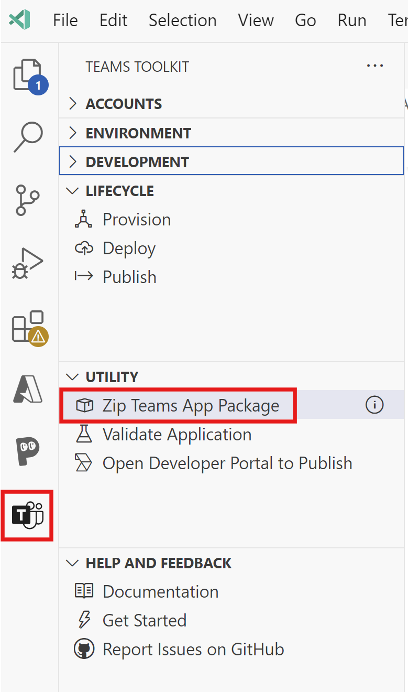
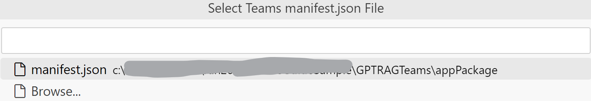
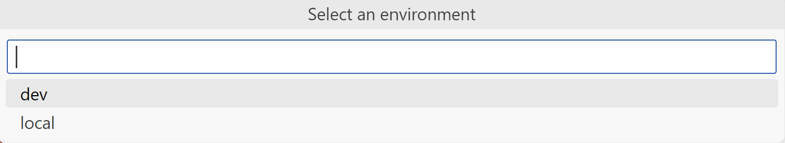
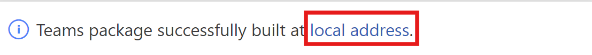
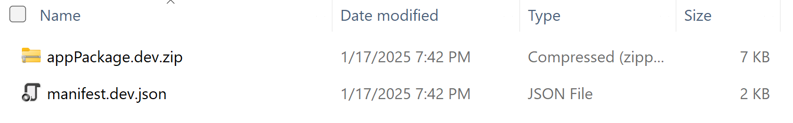

# Guide for Building a Teams App Interface for Enterprise GPT-RAG Solution Accelerator

*Ensure all steps mentioned in [Step 3](TEAMS_INTEGRATION_STEP3.md) are completed before proceeding with the steps below.*

## Step 4: Build the Teams App

1. Select the **Teams Toolkit** icon in the sidebar. Select **Utility** and then, **Zip Teams App Package**.

2. Select the Teams Manifest JSON file.

3. Choose the environment. The Teams Toolkit supports running and testing your app in different deployment targets such as development, staging, production, or locally. It utilizes environment files to handle configurations and automate resource provisioning for various environments. Learn more about environments [here](https://learn.microsoft.com/en-us/microsoftteams/platform/toolkit/teamsfx-multi-env).

4. Wait for the build to complete. Once finished, navigate to the folder. You can click on the **local address** link to go directly to the folder.

5. Review the files generated in the folder. These files will be used for deployment in the subsequent section.

Proceed to Step 5: [Publish the Teams App](TEAMS_INTEGRATION_STEP5.md).

## Additional Resources
- [Step 3: Provision and Deploy the Azure resources for the Teams App](TEAMS_INTEGRATION_STEP3.md).
- [Step 5: Publish the Teams App](TEAMS_INTEGRATION_STEP5.md).

## External Resources
- [Teams app package](https://learn.microsoft.com/en-us/microsoftteams/platform/concepts/build-and-test/apps-package).
- [Environments in Microsoft Teams Toolkit](https://learn.microsoft.com/en-us/microsoftteams/platform/toolkit/teamsfx-multi-env).
