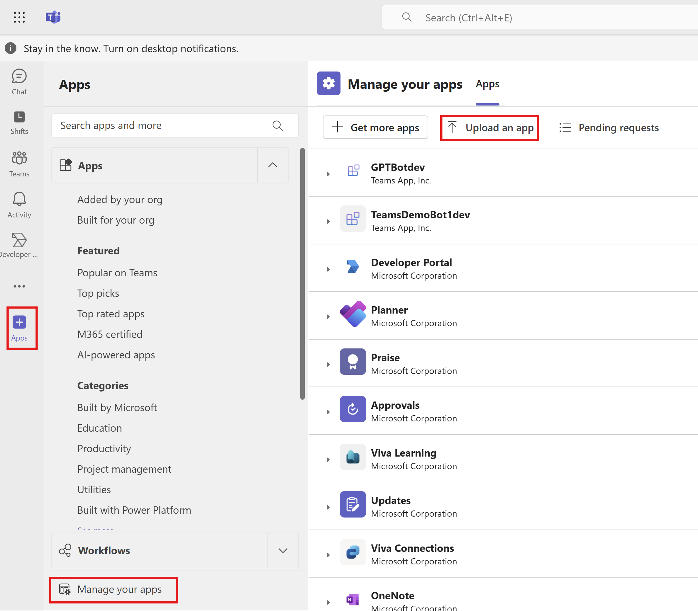
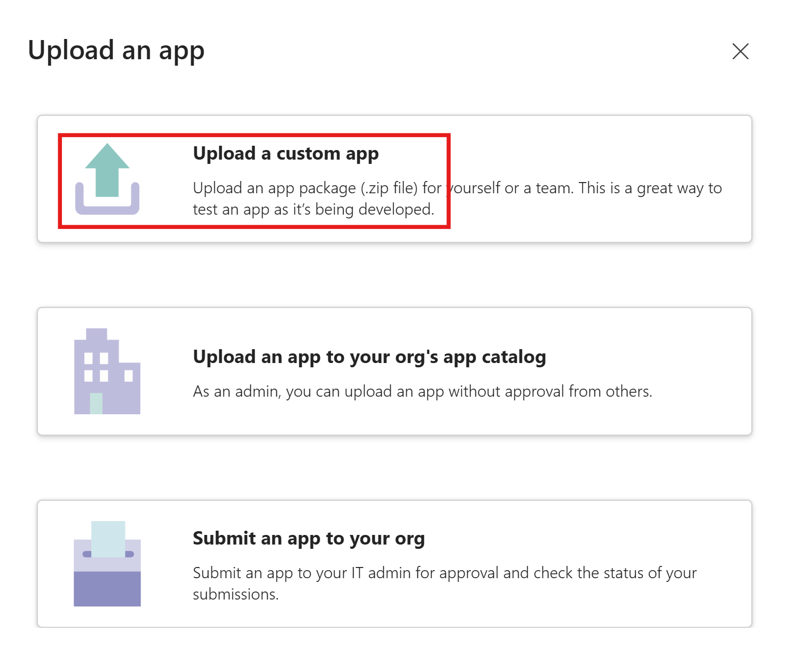
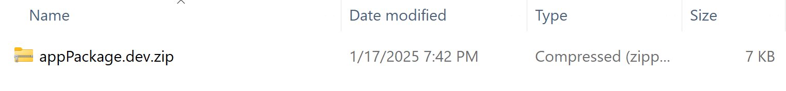
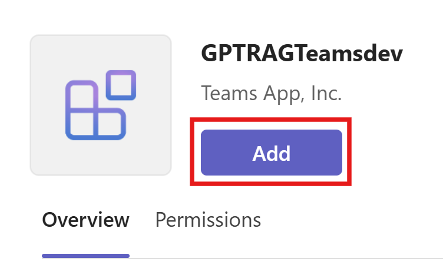
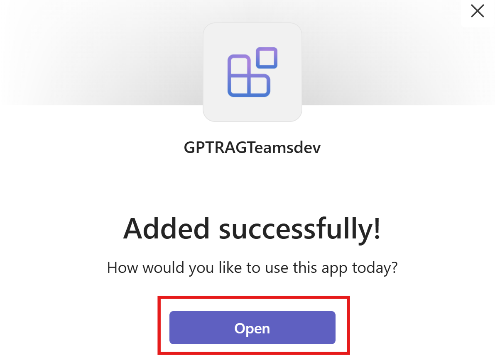
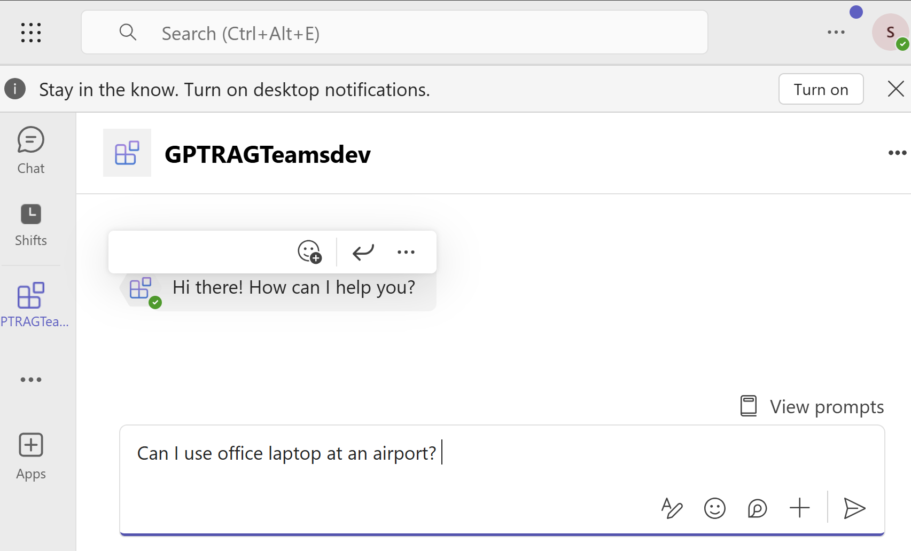
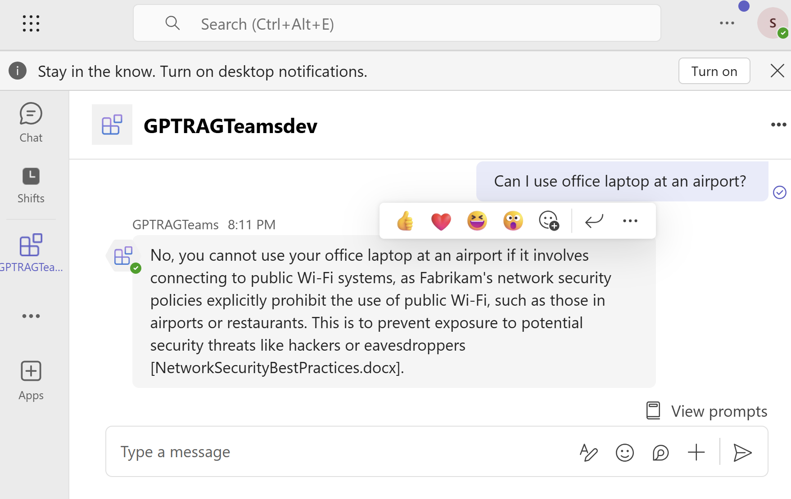

# Guide for Building a Teams App Interface for Enterprise GPT-RAG Solution Accelerator

*Ensure all steps mentioned in Step 4: [Build the Teams App](TEAMS_INTEGRATION_STEP4.md) are completed before proceeding with the steps below.*

## Step 5: Publish the Teams App

You can follow the below steps to publish the Teams app at an individual level for testing purposes using the custom upload option:

1. In the Teams client or Teams web version, select **Apps** > **Manage your apps** > **Upload an app**. 

2. The Upload an app window appears. Select Upload a custom app.

3. Select the zip file generated in the previous section.

4. Select the **Add** button.

5. Wait for the app to be added successfully. 

6. Test the app by asking a question. 

To publish the Teams App to the developer portal, follow the steps outlined [here](https://learn.microsoft.com/en-us/microsoftteams/platform/toolkit/publish-your-teams-apps-using-developer-portal).

## Additional Resources
- [Step 4: Build the Teams App](TEAMS_INTEGRATION_STEP4.md).

## External Resources
- [Publish Teams apps using Teams Toolkit](https://learn.microsoft.com/en-us/microsoftteams/platform/toolkit/publish#upload-app-package).
- [Integrate with Developer Portal](https://learn.microsoft.com/en-us/microsoftteams/platform/toolkit/publish-your-teams-apps-using-developer-portal).