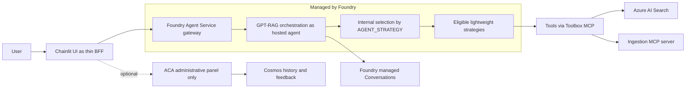
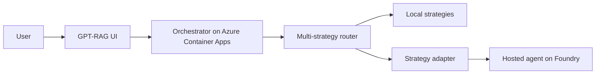

# ADR-0001: How GPT-RAG will support Microsoft Foundry hosted agents

Status: Accepted (revision 3, implementation contracts frozen)
Date: 2026-07-27
Deciders: Paulo (GPT-RAG maintainer), with architecture analysis (Martin) and
implementation analysis (Guido).

## TL;DR (one sentence)

We decided to package the GPT-RAG orchestration as a Foundry hosted agent, with
the UI talking directly to it and the orchestrator Azure Container Apps becoming
optional (administrative panel backend only), switched on by a provisioning
flag, so the customer has one less resource to operate.

Non-negotiable requirement: Option 1 is only acceptable if it preserves,
end to end, the native document-level security provided by Foundry IQ and Azure
AI Search, with each user seeing only what they are allowed to see.

## Decision history

The first version of this ADR chose Option 2 (the orchestrator stays on
Container Apps and only consumes hosted agents as sub-agents). The decision was
reversed after a conversation with the field. The argument that turned the
table: customers want hosted agents as an alternative to Azure Container Apps,
not as one more piece on top of what already exists. In other words, the work is
not to add capability, it is to replace the orchestrator compute resource. Under
that framing Option 2 does not deliver what the customer asks for, because it
keeps Container Apps running. Only Option 1 removes a resource from the operator
bill.

## Context and problem

Before deciding anything we need to agree on vocabulary, because the word "agent"
is overloaded.

A hosted agent, in Microsoft's strict sense, is your agent code packaged into a
container and run by the Foundry Agent Service. The platform handles the
runtime, scaling, session state, identity, and observability. You program the
behavior, the platform operates the rest.

That is different from a prompt agent, which is a declarative agent created in
the portal and consumed by id or name. Prompt agents are out of scope for this
decision. Here we only mean the strict sense: code in a container, managed by
Foundry.

To ground this in what exists today: the GPT-RAG orchestrator (repository
Azure/gpt-rag-orchestrator, version 3.5.0, Python with FastAPI) runs on Azure
Container Apps and has a multi-strategy router. It selects the strategy through a
configuration called AGENT_STRATEGY, and there are already strategies built on
Microsoft Agent Framework (maf_lite, maf_agent_service) and on Semantic Kernel
(single_agent_rag, mcp, nl2sql, multimodal). The UI (repository gpt-rag-ui, a
Chainlit app in Python) talks to the orchestrator over HTTP and receives the
response as a stream, and there are also routes for conversation history,
feedback, and an administrative dashboard. Keep these details in mind, because
they weigh on the design.

An important finding from the code review: the maf_agent_service strategy
already publishes to the Foundry Agent Service declaratively, with create_version
and PromptAgentDefinition, and already runs on the Responses runtime via the
Microsoft Agent Framework ChatAgent. It already integrates OBO and MCP. This
means the starting point for becoming a hosted agent already exists inside the
repository, it is not starting from zero.

## The two ways to do it

There are two ways to connect GPT-RAG to the world of hosted agents. They are
almost opposite.

### Option 1: BE a hosted agent (chosen)

We package the GPT-RAG orchestration core as a hosted agent and let Foundry host
and manage the runtime. The agent exposes the protocols Foundry expects
(Responses and Invocations). The UI now talks to this agent for chat. The
orchestrator Azure Container Apps stops being mandatory and only comes up when
the customer wants the administrative panel.

The analogy is moving into a fully serviced furnished apartment. The building
handles maintenance, front-desk security, and infrastructure. In exchange you
accept the building rules: the size of the apartment and what you can and cannot
install. You give up some control and gain one less resource to maintain.

### Option 2: CONSUME hosted agents (discarded)

The orchestrator would stay on Azure Container Apps with today's multi-strategy
router, and would start calling external hosted agents as sub-agents. It is low
risk and additive, but it keeps Container Apps running, which is exactly the
resource the customer wants to eliminate. That is why it was discarded as the
main direction.

## The Option 1 design, in detail

This is the heart of the ADR. These are the answers to the questions Option 1
opens.

### Runtime-agnostic adapter boundary

The central recommendation is to extract the orchestration core (the strategies)
into a library that does not know the runtime, behind a stable contract, for
example a handle_turn function that takes the request and returns a stream of
events. On top of that library sit two thin adapters: a FastAPI adapter (today's
/orchestrator SSE endpoint, for the Container Apps mode) and a Responses adapter
(using azure-ai-agentserver-responses, for the hosted agent). What is specific to
Foundry stays isolated in the Responses adapter. The repository already has a
contracts folder with a versioned audit event schema, so there is precedent for
this. This adapter is the investment that protects both modes and avoids
rewriting business logic.

### Strategies are preserved, the runtime change is plumbing not logic

An explicit design principle: we are not deleting strategies to become a hosted
agent. The six strategies stay. The reasoning core of each strategy is meant to
be runtime-agnostic, which is exactly what the adapter boundary delivers. Moving
to the hosted agent runtime changes the plumbing around the strategies, not the
strategy reasoning. Concretely, the plumbing that changes is: the adapter
boundary, moving history and feedback persistence out of the ACA-coupled
orchestrator, the identity and retrieval path so document-level security still
works when the user token does not reach the container, and routing tools through
the Toolbox. That plumbing cost is paid once, and it is roughly the same whether
we keep six strategies or one, so keeping them is not what drives the migration
cost. Any later consolidation (folding single_agent_rag and mcp into the base,
reclassifying nl2sql and multimodal as composable tools or connected agents) is
optional future cleanup, not a prerequisite to ship.

### Multi-strategy routing: one agent with internal selection

We chose to publish a single hosted agent that loads the eligible strategies and
selects by AGENT_STRATEGY at the version level. This realizes the "one less
resource" the field asked for and avoids reintroducing a separate router. We are
not going to publish one agent per strategy as the default, because that
multiplies operational cost and recreates the fragmentation we want to avoid.
Eligible at the start are the lightweight strategies: maf_lite,
maf_agent_service, single_agent_rag, and mcp. The heavy strategies, nl2sql and
multimodal, are handled separately (see resource ceiling). A hybrid mode, with a
heavy strategy isolated in its own agent, is reserved only if profiling shows the
need.

### UI: Chainlit as a thin BFF, not the browser directly

The browser should not speak Responses directly. That path requires confidential
client Entra authentication, secret handling, SSE streaming, and CORS, things
that do not safely fit in the client. The gpt-rag-ui UI is already a Chainlit app
with a server-side Python backend, and it already centralizes the conversation
with the orchestrator in orchestrator_client.py. We keep Chainlit as a thin edge
proxy, a BFF, that speaks Responses with the hosted agent and turns the response
into chunks for the screen. This BFF is not the old orchestrator: it has no
strategies and no retrieval, it only mediates auth, the token with the right
audience, streaming, and the conversation id mapping. In code, this is an
evolution of orchestrator_client.py, with a new path selected by configuration
(for example CHAT_BACKEND equal to hosted_agent), without spreading branches
across the app.

### Non-conversational routes: history, feedback, and panel

The code already separates these routes from the chat flow. The recommendation
is:
- Basic conversation history moves to Foundry managed Conversations, which are
  durable and independent of the compute. That way history survives even without
  Container Apps.
- Feedback, the administrative panel, and the dashboard stay on the optional,
  smaller Container Apps, with Cosmos, provisioned only when the panel is turned
  on.
- Code caveat: today conversation and feedback persistence is coupled to the chat
  flow inside orchestration/orchestrator.py. For Container Apps to be truly
  optional, history and feedback writes need to move into the hosted agent,
  leaving Container Apps with read and curation only. This is a refactoring task
  to validate.

Naming note: the optional Container Apps serves the administrative panel
(history, feedback, and dashboard). The term "curation" only appears when we mean
the activity of reviewing content inside that panel.

### The provisioning flag

Two flags in the format the infra already uses (deployXxx with a value coming
from an environment variable), with defaults that preserve current behavior:
- DEPLOY_HOSTED_AGENT_ORCHESTRATION, default false. Turns on the hosted agent
  mode: provisions the agent, points the UI at it, and makes the orchestrator
  Container Apps conditional.
- DEPLOY_ADMINISTRATIVE_PANEL, default false. When true in hosted agent mode,
  brings up the smaller Container Apps only to serve history, feedback, and the
  dashboard.

Three resulting modes:
- Classic (default): hosted agent off. Orchestrator on Container Apps, UI talks
  to it, panel included. This is today's behavior and the supported path while
  hosted agents are in preview.
- Hosted agent without panel: flag on, panel off. The hosted agent comes up, the
  UI points at it, the orchestrator Container Apps does not come up, history via
  Foundry Conversations. This is the field's "one less resource".
- Hosted agent with panel: flag on, panel on. Hosted agent for chat, smaller
  Container Apps only as the administrative backend.

In Bicep (the infra folder of the Azure/gpt-rag repository, which is a submodule
of bicep-ptn-aiml-landing-zone), this is a conditional between the agent module
and the orchestrator Container Apps module, plus the panel conditional. The agent
deploy uses the azure.ai.agent service in azure.yaml.

### User identity and document-level security

This is the most delicate part of Option 1, so it is worth explaining from the
start.

How it works today, on Container Apps. The user logs in to the UI with their
Entra account. The UI sends the request to the orchestrator along with the user
token, in an HTTP header called Authorization. The orchestrator uses that token
to do OBO (on-behalf-of): it exchanges the user token for a token to talk to
Azure AI Search as that user. So Search only returns the documents that person is
allowed to see. That is what we call per-user trimming, or document-level
security.

What changes in hosted agent mode. Now the request goes from the UI to the
Foundry gateway and only then to your container. That gateway, for security,
drops most of the caller headers before handing the request to the container, and
Authorization is among the ones it drops. Practical consequence: the user token
does not enter the container. So the agent cannot repeat that same OBO from
before, because it does not have the user token in hand.

Why it matters. If the user identity does not reach the moment of the search,
trimming is lost and everyone would start seeing everything. Our requirement is
the opposite: Option 1 has to keep respecting the native document-level security
of Foundry IQ and Azure AI Search. Native means Search itself decides what the
person can see, comparing the user's Entra groups against the permissions stored
on each document. It is not us filtering by hand, it is the platform making the
cut. For that to work, Search needs to receive the user identity at query time.

In other words, the real problem is not "recreate OBO in the agent". It is to
make sure the user identity reaches Search so the native mechanism trims the
results. We design this in two paths, in order of preference.

- Target path, native security via Foundry IQ with identity passthrough. The
  search tools enter through the Toolbox (MCP), which is the only supported way
  to give tools to the hosted agent, and the Toolbox knows how to forward the
  user's OAuth identity onward. With that, the query to Foundry IQ carries the
  person's identity, and Search applies native trimming on its own, using the
  user's groups against the document permissions. It is the cleanest path,
  because we write no filter code, we just reuse what the platform already does.
  This is the target of the design.
- Fallback controlled by GPT-RAG, in case native identity passthrough does not
  close in preview. The UI, which has the user identity, looks up the person's
  groups in Microsoft Graph and sends a group filter to the agent, in an allowed
  header (x-client-*) or in the request body. The agent forwards that filter on
  the query to Search. It is still Search applying the cut, but the one who
  discovers the groups is the UI, not the platform. It serves as a safety net
  while we validate the native path.

Acceptance requirement: Option 1 is only considered done when the native
document-level security of Foundry IQ and AI Search works end to end through the
target path, with a user without permission unable to see the restricted
document. Validating this with two users from different groups is a mandatory
item before promoting the hosted agent mode.

The code that touches this already exists and shortens the work: search.py
(acquire_obo_token, conversation filter), maf_agent_service_strategy.py (the
request token), and mcp_client.py (the user-context header). Foundry IQ uses
metadata_security_id and rbacScope for trimming, which is exactly the native
piece we want to keep in charge.

### Resource ceiling and the heavy strategies

Session sizes range from 0.5 vCPU / 1 GiB up to a maximum of 2 vCPU / 4 GiB, per
session, and billing sums the active sessions. Orchestration is I/O bound, the
heavy work runs on Azure OpenAI and on Search, so the lightweight strategies
(single_agent_rag, maf_lite, maf_agent_service, mcp) and also nl2sql tend to fit.
The real risk is multimodal, because of image decoding, large base64, and
multiple images. Mitigation: push multimodal preprocessing to ingestion or to a
Toolbox tool, prefer streaming over buffering, and isolate multimodal in its own
agent only if profiling requires it.

### Zero Trust and the private ACR

Foundry can run network-isolated, with egress through the customer VNet and
private endpoints to Search, Cosmos, SQL, Storage, Key Vault, Foundry, and Azure
OpenAI. The UI and the panel Container Apps sit in the VNet behind Front Door or
Application Gateway with WAF. Brazil South is among the supported regions.

One point that needs to be explicit and correct, because the previous version of
this ADR got it wrong: support for the ACR (Azure Container Registry, where the
container image lives) behind a private endpoint with public access disabled
depends on the Foundry project creation date. Projects created after June 25,
2026 support a private ACR. Projects created before that date need the ACR to be
reachable through the public endpoint so the platform can pull the image. On top
of that, with a private ACR, the azd up that builds and pushes the image and
creates the agent version needs to run from inside the VNet, through a CI runner
or jumpbox, or use ACR Tasks. This is not a blocker, but it is a concrete
environment constraint that goes into planning.

## Advantages and disadvantages

### Option 1, being a hosted agent

Advantages:
- One less resource for the customer to operate. The orchestrator Container Apps
  leaves the bill in the no-panel mode.
- Runtime, scaling, session state, agent identity, versioning, and observability
  come ready from the platform.
- Aligns the project with Foundry's official path for agents.
- The starting point already exists in code (maf_agent_service already uses the
  declarative Agent Service and the Responses runtime).

Disadvantages:
- It is a boundary refactor. The core needs to be extracted into a library behind
  adapters, and history and feedback persistence needs to move into the agent.
- The user token does not reach the container, so document-level security has to
  be preserved through the native Foundry IQ path with identity passthrough via
  the Toolbox, with the group filter as a fallback.
- The 2 vCPU and 4 GiB per-session ceiling now applies to orchestration, which
  squeezes multimodal.
- It puts a preview runtime on the critical path. No SLA, no native canary, and
  rollback is reverting to a previous version.

### Option 2, consuming hosted agents

Advantages:
- Low risk and additive, what already works keeps working.
- Lands on the canonical extension point, a new strategy.

Disadvantages:
- It does not deliver what the customer asks for, because it keeps Container Apps
  running.
- It adds a network hop and keeps the cost of operating the orchestrator.

### Comparison table

| Axis | Option 1: BE a hosted agent (chosen) | Option 2: CONSUME hosted agents |
| --- | --- | --- |
| Delivers the field request | Yes, removes Container Apps from the bill | No, keeps Container Apps |
| Effort and risk | High, refactors the boundary and persistence | Low, lands as a new strategy |
| Zero Trust and network | Depends on Foundry networking, with the ACR date lock | Keeps current network and rules |
| Document-level security | Token does not reach the container, preserves the native cut via Foundry IQ and Toolbox, group fallback | User token already arrives, classic OBO directly |
| Operational cost | Less infra in the no-panel mode | Still operates the orchestrator |
| Scale and limits | The 2 vCPU and 4 GiB ceiling applies to orchestration | The ceiling only affects the sub-agent |
| Preview dependency | High, preview runtime on the critical path | Low, Responses and Invocations are GA |
| Reversibility | Keep the classic mode as fallback via the flag | Easy, on and off per strategy |

## What the official documentation confirmed

Three facts were checked in the official documentation on 2026-07-21 and enter as
base truth for this decision. Two of them correct claims from the previous
version.

- The private ACR has a per-project date lock. Corrects the previous version,
  which said the lock had been lifted. Support for an ACR behind a private
  endpoint with public access disabled only applies to projects created after
  2026-06-25. Earlier projects require the ACR reachable through the public
  endpoint.
- The gateway drops caller headers outside a fixed set. This keeps Authorization
  and credentials out of the container. Direct consequence: on the path from the
  UI to the hosted agent, the user token does not arrive as a bearer. That is why
  document-level security now depends on the native cut of Foundry IQ and AI
  Search with the identity forwarded by the Toolbox, and on the group filter as a
  fallback.
- Versions are immutable and the endpoint serves one version with 100% of the
  traffic. There is no native traffic splitting, no canary, no blue-green.
  Updating means publishing a new version and switching. Rollback is reverting to
  the previous version.

What still holds: the 2 vCPU and 4 GiB per-session ceiling, hosted agents in
preview without SLA, and tools only via the Toolbox MCP.

## Decision

We are going with Option 1, in the mode designed above: the orchestration becomes
a hosted agent, the Chainlit UI talks to it as a thin BFF, and the orchestrator
Azure Container Apps becomes optional, surviving only as the administrative panel
backend, switched on by a provisioning flag.

The why, in plain terms:
- Delivers what the field asked for: one less resource for the customer to
  operate.
- Concentrates the runtime in Foundry, with managed scaling, state, identity, and
  versioning.
- Reuses what already exists in code, because maf_agent_service already talks to
  the Agent Service declaratively.
- Keeps the classic Container Apps mode as a supported fallback while the feature
  is in preview, so the change is opt-in and breaks no one.

## Consequences

What we gain:
- A path to deliver the model the customer wants, with less infra to operate day
  to day.
- An adapter boundary that serves both modes and protects the investment.

What we give up:
- The user token arriving directly at the compute, which changes the security
  design of trimming.
- Part of the resource headroom, because the per-session ceiling now applies to
  orchestration.
- Having the whole critical path in GA, because hosted agents are in preview.

The thread running through it: regardless of the mode, GPT-RAG should formalize
the adapter boundary. It is what lets us serve the classic mode and the hosted
agent mode from the same logic, without rewriting anything when the preview turns
GA.

## Phased path

This is the architecture-level plan, in dependency order.

- Phase 1, orchestrator: extract the agentic core into a library behind adapters,
  starting from maf_agent_service, and decide the ownership of conversation and
  feedback persistence. Without this, nothing downstream works.
- Phase 2, infra and azd: introduce the flags, make the orchestrator Container
  Apps conditional, provision the hosted agent via azure.ai.agent, and write the
  chat backend and the agent endpoint into the configuration the UI reads.
  Depends on Phase 1 to have an agent image.
- Phase 3, UI: add the hosted_agent path in the BFF, adapt streaming and the
  conversation id to Responses, and keep history and feedback on the optional
  Container Apps. Depends on Phases 1 and 2.
- Phase 4, ingestion and Toolbox: register the MCP source in the Toolbox and
  validate connectivity and identity. Depends on Phase 2 for network and
  identity.
- Phase 5, identity and document-level security: close the identity passthrough
  and validate that the native cut of Foundry IQ and AI Search works end to end
  on the new path, with a test using two users from different groups. Depends on
  Phases 1, 3, and 4.

## Risks

- Preview without SLA on the critical path. Mitigation: keep the classic mode as
  the default and fallback, and keep the hosted agent as opt-in documented as
  preview.
- Immutable version serving 100% of the traffic, no canary. Mitigation: publish
  and validate in a separate environment before switching the production version,
  and have the rollback by version reversal documented.
- Cold start with scale-to-zero after 15 minutes idle. The stated goal is to
  resume in under 1 second on microVMs, but being preview it needs to be
  validated with real load.
- Private ACR date lock. Zero Trust environments on older projects may need the
  public ACR, which must be checked in environment planning.

## Implementation contracts frozen for issue #588

The following decisions are frozen as repository-level contracts and release
gates for implementation tracks.

### Decision matrix

| Area | Frozen decision | Contract owner(s) | Release blocker if violated |
| --- | --- | --- | --- |
| History and feedback ownership | Hosted modes use Foundry managed Conversations for chat history. Feedback and administrative curation metadata remain in Cosmos and are only available when the administrative panel is deployed. | gpt-rag-orchestrator, gpt-rag-ui, Azure/GPT-RAG | Hosted/no-panel requires orchestrator Container Apps for chat persistence. |
| Identity propagation and fallback policy | Primary path is Toolbox identity passthrough so Foundry IQ and AI Search apply native document trimming. Group-filter fallback is allowed only as an explicit temporary override for preview environments and cannot be the default release path. | gpt-rag-orchestrator, gpt-rag-ui | Any unauthorized document retrieval on hosted path; fallback enabled by default in a release candidate. |
| Strategy eligibility under 2 vCPU / 4 GiB | The initial shared hosted-agent implementation scope is maf_lite, maf_agent_service, single_agent_rag, and mcp, subject to the hosted runtime gates below. nl2sql and multimodal remain classic-only until their investigations pass. | gpt-rag-orchestrator | nl2sql or multimodal enabled in the shared hosted agent without the required bounds, profiling evidence, and approval. |
| Chat/backend configuration contract | `CHAT_BACKEND` values are `orchestrator` (default) and `hosted_agent`. Deployment flags remain `DEPLOY_HOSTED_AGENT_ORCHESTRATION` (default `false`) and `DEPLOY_ADMINISTRATIVE_PANEL` (default `false`). App Configuration label `gpt-rag` must publish backend selector plus both endpoint outputs (`orchestrator` and hosted agent) so the UI can switch without code changes. | Azure/GPT-RAG, gpt-rag-ui | Missing selector/endpoint outputs or ambiguous ownership of the keys. |
| Administrative panel boundary | Hosted/no-panel mode provisions no orchestrator Container Apps. Hosted/panel mode provisions panel-only backend endpoints (history, feedback, dashboard) and does not route chat through Container Apps. | Azure/GPT-RAG, gpt-rag-orchestrator, gpt-rag-ui | Any hosted/no-panel deployment with orchestrator app provisioned; hosted/panel chat routed to Container Apps. |
| Private ACR build route | The automated baseline is a VNet-connected self-hosted CI runner or agent that runs the build from inside the VNet, as documented by Microsoft. A jump host is the interactive fallback. A dedicated VNet-connected ACR Tasks agent pool is an optional optimization pending validation; shared ACR Tasks are not a private-endpoint bypass. | Azure/GPT-RAG, bicep-ptn-aiml-landing-zone | No validated private-build route for hosted mode before release sign-off, or public ACR access enabled as an implicit workaround. |
| Validation environment target | Validation must run in a dedicated non-production environment pair: one Basic topology and one network-isolated topology with private endpoints and private ACR support. | Azure/GPT-RAG | Hosted modes promoted without evidence from both topology classes. |

### Measurable release gates by topology

| Mode | Required evidence gates | Rollback trigger |
| --- | --- | --- |
| Classic (default fallback) | `DEPLOY_HOSTED_AGENT_ORCHESTRATION=false`; orchestrator Container Apps deployed; UI `CHAT_BACKEND=orchestrator`; regression checks for history and feedback pass. | Any regression in classic chat, history, or feedback after hosted changes. |
| Hosted / no-panel | `DEPLOY_HOSTED_AGENT_ORCHESTRATION=true`, `DEPLOY_ADMINISTRATIVE_PANEL=false`; zero orchestrator Container Apps provisioned; UI `CHAT_BACKEND=hosted_agent`; two-user authorization negative test proves restricted user cannot retrieve protected content. | Unauthorized retrieval, missing hosted endpoint, or orchestrator app unexpectedly provisioned. |
| Hosted / panel | `DEPLOY_HOSTED_AGENT_ORCHESTRATION=true`, `DEPLOY_ADMINISTRATIVE_PANEL=true`; hosted path serves chat; panel endpoints serve history/feedback/dashboard; Cosmos contains panel feedback records only. | Chat flow depends on Container Apps or panel APIs unavailable in hosted/panel mode. |

Cross-cutting hosted runtime gates:

- Each enabled strategy must complete cold readiness within 30 seconds, survive
  one 15-minute idle/resume cycle, and stay below 2.5 GiB peak RSS under five
  representative concurrent requests. These are GPT-RAG release gates, not
  Microsoft platform guarantees.
- In-memory query results and image payloads must have explicit bounds.
- A network-isolated release must build and push from inside the VNet and prove
  that Foundry can pull the image while ACR public access remains disabled.

### Adoption order and migration

1. Freeze configuration contracts and App Configuration key ownership in
   Azure/GPT-RAG.
2. Implement hosted/core adapter and persistence split in gpt-rag-orchestrator.
3. Implement UI backend selection and endpoint switching in gpt-rag-ui.
4. Register/validate Toolbox tooling and ingestion compatibility.
5. Run release gates in both validation topology classes before manifest pin
   promotion.

Migration boundaries:
- No mandatory backfill from Cosmos to Foundry Conversations is required for
  hosted/no-panel adoption.
- Existing classic deployments keep Cosmos-backed history/feedback and remain
  supported fallback.

### Time-bounded investigations required before relaxing the freeze

- **INV-001 (due 2026-08-21):** bound and profile hosted nl2sql. Before
  profiling, enforce an explicit SQL result-row cap. Decision criterion:
  enable nl2sql only after five concurrent representative requests meet the
  cross-cutting RSS and startup gates without thread-pool saturation.
- **INV-002 (due 2026-08-21):** validate native Toolbox identity passthrough in
  the isolated topology without group-filter fallback. Decision criterion:
  fallback policy stays temporary-only until two-user negative retrieval tests
  pass in isolated mode.
- **INV-003 (due 2026-08-21):** decide and profile the hosted multimodal path.
  Decision criterion: the selected retrieval path preserves actual image
  behavior, private Blob access succeeds, payloads remain bounded, and the
  cross-cutting RSS and startup gates pass.
- **INV-004 (due 2026-08-21):** evaluate a dedicated VNet-connected ACR Tasks
  agent pool as an optional alternative to the self-hosted runner. Decision
  criterion: the selected region supports the preview pool, Premium ACR is
  acceptable, private DNS and endpoint access work, least-privilege build and
  Foundry pull both succeed, and azd integration requires no public ACR access.

## Review trigger

Reassess this ADR immediately when any of the following occurs:
- Foundry hosted agents leave preview or change identity/header propagation
  behavior.
- Session resource ceilings, pricing model, or private ACR support policy
  changes.
- ACR Tasks dedicated agent pools become generally available or add a required
  deployment region.
- A hosted-mode release gate fails in validation or production.
- Security review reports an unauthorized document retrieval path.

## References

- What are hosted agents (sandbox, sessions, identity, versioning, limits):
  https://learn.microsoft.com/azure/foundry/agents/concepts/hosted-agents
- Hosted agent runtime contract (headers, protocol):
  https://learn.microsoft.com/azure/foundry/agents/concepts/hosted-agent-contract
- Deploy a hosted agent with azd:
  https://learn.microsoft.com/azure/foundry/agents/how-to/deploy-hosted-agent
- Configure virtual networks and network isolation (includes the ACR date lock):
  https://learn.microsoft.com/azure/foundry/agents/how-to/virtual-networks
- Deploy a hosted agent with a private ACR:
  https://learn.microsoft.com/azure/foundry/agents/how-to/deploy-hosted-agent-private-azure-container-registry
- Allow trusted services to access Azure Container Registry:
  https://learn.microsoft.com/azure/container-registry/allow-access-trusted-services
- ACR Tasks dedicated agent pools:
  https://learn.microsoft.com/azure/container-registry/tasks-agent-pools
- Agent Service networking deep dive:
  https://learn.microsoft.com/azure/foundry/agents/concepts/agents-networking-deep-dive
- Toolbox (tools via MCP):
  https://learn.microsoft.com/azure/foundry/agents/how-to/tools/toolbox
- Limits, quotas, and regions:
  https://learn.microsoft.com/azure/foundry/agents/concepts/limits-quotas-regions
- Foundry Agent Service pricing:
  https://azure.microsoft.com/pricing/details/foundry-agent-service/
