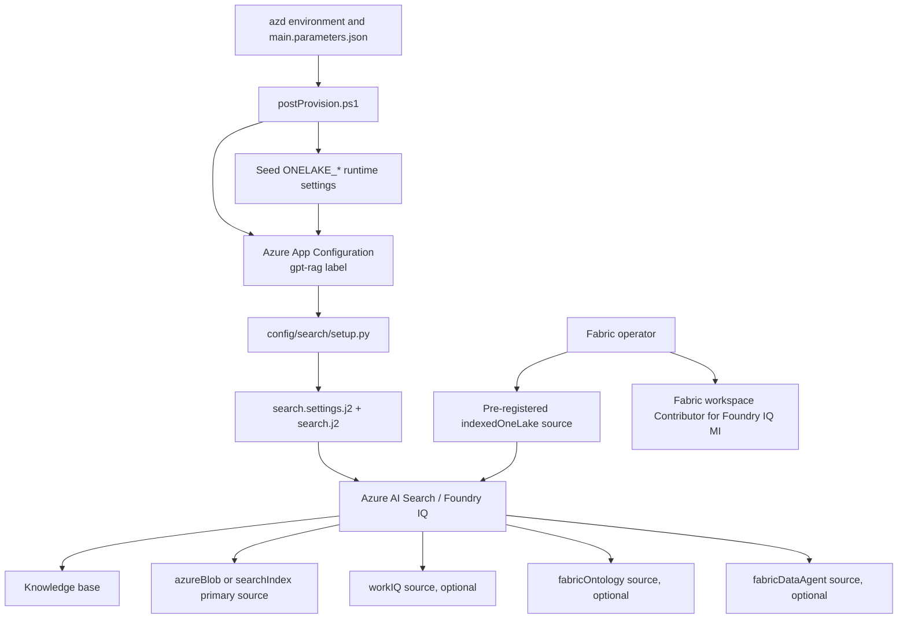
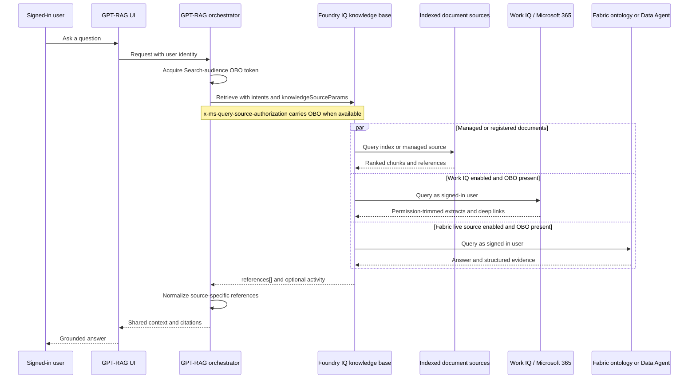

# ADR-0003: Use Foundry IQ as the grounding plane for GPT-RAG

**Status:** Accepted (records the implementation shipped through GPT-RAG
`v3.7.0` and orchestrator `v3.8.0`)<br>
**Date:** 2026-08-04<br>
**Owners:** GPT-RAG maintainers

## TL;DR

GPT-RAG uses a Foundry IQ knowledge base as its default grounding plane and
adds Work IQ, Fabric ontology, Fabric Data Agent, and indexed OneLake as
optional knowledge sources on that plane. Work IQ and the two live Fabric
sources require a signed-in user's on-behalf-of (OBO) token; indexed OneLake is
a managed indexed source and does not. Direct Azure AI Search remains the
compatibility and rollback backend. Calling Work IQ or Fabric IQ directly as
Foundry Agent Service tools is a valid alternative architecture, but it is not
the implementation selected by this decision.

## Context

GPT-RAG needs to answer questions from several kinds of organizational
knowledge:

- documents and policies stored in Azure Blob Storage or ADLS Gen2;
- an existing Azure AI Search index owned by GPT-RAG or by a customer;
- the signed-in user's Microsoft 365 work context;
- live business entities and relationships exposed by a Fabric ontology;
- live analytical answers produced by a Fabric Data Agent; and
- files in a Fabric OneLake lakehouse.

These sources have different ingestion, identity, latency, and authorization
models. Implementing each one as a separate orchestrator connector would move
source selection, fan-out, ranking, and result composition into GPT-RAG. It
would also create different citation and security paths for each source.

Foundry IQ provides a knowledge base over one or more Azure AI Search knowledge
sources. Its agentic retrieval engine plans queries, fans out to the selected
sources, reranks evidence, and returns references through one retrieve
contract. Foundry IQ is built on Azure AI Search; it is not a replacement data
store or an unrelated retrieval stack.

Issue [Azure/GPT-RAG#526] introduced Foundry IQ as a first-class retrieval
backend. Issue [Azure/GPT-RAG#543] then proposed Work IQ and Fabric IQ as
additional knowledge source kinds on the same retrieve API. The implementation
landed incrementally in:

- [Azure/GPT-RAG#528] and [Azure/GPT-RAG#530] for the Foundry IQ backend and
  native Blob default;
- [Azure/GPT-RAG#547] for Work IQ;
- [Azure/GPT-RAG#549] for Fabric ontology;
- [Azure/GPT-RAG#554] for Fabric Data Agent;
- [Azure/GPT-RAG#559] and [Azure/GPT-RAG#561] for indexed OneLake runtime
  configuration and operator documentation; and
- the corresponding pinned orchestrator releases, now consolidated in
  orchestrator `v3.8.0`.

This ADR records the implemented decision and its boundaries. It does not
propose a new retrieval design.

## Vocabulary

### Foundry IQ

The managed knowledge layer used by GPT-RAG. A Foundry IQ knowledge base binds
one or more knowledge sources and exposes agentic retrieval through the Azure
AI Search knowledge base retrieve API.

### Work IQ

A permission-aware Microsoft 365 knowledge source for the signed-in user's
mail, meetings, files, chats, and people context. GPT-RAG accesses it as
knowledge source kind `workIQ`.

### Fabric IQ

Microsoft Fabric's business-intelligence layer. Fabric IQ is not a child or
data source of Foundry IQ. The products are independent, but Foundry IQ can
connect to concrete Fabric capabilities through knowledge sources.

GPT-RAG supports three distinct Fabric-related source types:

- `fabricOntology`: live entity and relationship reasoning over a Fabric
  ontology;
- `fabricDataAgent`: live analytical question answering through a curated
  Fabric Data Agent; and
- `indexedOneLake`: indexed files from a OneLake lakehouse, with the generated
  Azure AI Search ingestion and index lifecycle owned by the knowledge source.

### OBO

Microsoft Entra on-behalf-of authentication. The orchestrator exchanges or
forwards the signed-in user's delegated identity so the downstream source
evaluates that user's permissions.

### Pattern A: managed indexed source

Foundry IQ owns the ingestion and generated Azure AI Search objects for a
source such as `azureBlob` or `indexedOneLake`. GPT-RAG's custom ingestion
service does not populate the primary corpus for this pattern.

### Pattern B: existing search index

GPT-RAG registers an existing Azure AI Search index as a `searchIndex`
knowledge source. GPT-RAG or the customer still owns that index and its
ingestion lifecycle. Query-time security over GPT-RAG's custom security fields
uses `filterAddOn`.

## Prioritized architecture characteristics

1. **Authorization correctness.** Remote personal and business sources must
   execute as the signed-in user. A service managed identity must never
   impersonate a user for Work IQ, Fabric ontology, or Fabric Data Agent.
2. **One retrieval contract.** All selected sources must produce the shared
   `{title, link, content}` context contract so downstream prompting and
   citations do not depend on source kind.
3. **Safe adoption.** Optional sources must be disabled by default. Upgrading
   without enabling them must preserve existing behavior.
4. **Operational simplicity.** Prefer source-managed indexing where it meets
   the scenario, while retaining self-managed ingestion where GPT-RAG needs
   custom indexing, security fields, or rapid conversation uploads.
5. **Reversibility.** Operators must be able to switch
   `RETRIEVAL_BACKEND=ai_search` without deleting indexes or rewriting the
   orchestration strategies.
6. **Explicit preview risk.** Preview API, licensing, consent, same-tenant, and
   data-boundary requirements must be operator-visible and independently
   gated.

## Alternatives considered

### Option A: One Foundry IQ knowledge base with multiple knowledge sources

The orchestrator calls one knowledge base retrieve endpoint. The request can
include the primary document source plus any enabled Work IQ, Fabric, OneLake,
conversation-upload, SharePoint, web, or MCP sources.

Benefits:

- centralizes query planning, multi-source fan-out, ranking, and references;
- reuses the existing Foundry IQ client and context-provider seam;
- keeps citation shaping identical across orchestrator strategies;
- makes Work IQ and Fabric additions opt-in rather than new backends; and
- lets managed indexed sources own their index lifecycle.

Costs and risks:

- the retrieve contract and several source kinds use preview API
  `2026-05-01-preview`;
- one slow or unavailable remote source can increase end-to-end latency;
- OBO, tenant consent, licenses, and service-specific permissions remain
  mandatory;
- source payloads have different reference shapes that GPT-RAG must normalize;
  and
- blending personal, organizational, and business data requires explicit
  operator review of data flow and answer exposure.

### Option B: Call Work IQ and Fabric IQ directly as Agent Service tools

Foundry Agent Service exposes preview tools such as `work_iq_preview` and
`fabric_iq_preview`. An agent can invoke Work IQ through A2A and can route
Fabric requests to a Fabric ontology, Data Agent, or supported semantic model.

Benefits:

- the model chooses tools as part of agent reasoning;
- each tool can have its own instructions, error policy, and conversational
  workflow;
- Fabric's direct tool surface can expose targets not represented by a
  distinct Azure AI Search knowledge source kind; and
- this fits applications whose primary abstraction is a hosted Foundry agent,
  not a retrieval context provider.

Costs and risks:

- it is a different runtime architecture from GPT-RAG's current
  `FoundryIQClient`;
- tool outputs, retries, citations, audit events, and prompt integration would
  need a new orchestrator or hosted-agent implementation;
- direct tools do not automatically preserve the current shared retrieval and
  context contract; and
- it couples grounding behavior to Agent Service tool orchestration.

This remains a supported future direction, especially with the hosted-agent
work in [ADR-0001], but it is not a transparent configuration alternative to
the current GPT-RAG Approach A.

### Option C: Query every source directly from the GPT-RAG orchestrator

GPT-RAG would implement separate clients for Azure AI Search, Microsoft 365,
Fabric ontology, Fabric Data Agent, and OneLake, then perform planning and
ranking itself.

Benefits:

- full control of source routing and failure policy;
- no dependency on the Foundry IQ knowledge base retrieve surface; and
- source-specific optimization is possible.

Costs and risks:

- duplicates platform query planning and ranking;
- creates more authorization and citation code to secure and maintain;
- increases contract drift between strategies; and
- turns every new source into an orchestrator release.

### Option D: Keep direct Azure AI Search only

GPT-RAG would continue querying its self-managed RAG index and would not
support Work IQ or live Fabric grounding.

Benefits:

- stable, familiar latency and operations;
- no Work IQ or Fabric preview dependencies; and
- keeps all indexed-document behavior under GPT-RAG control.

Costs and risks:

- cannot answer from live Microsoft 365 work context;
- cannot perform live ontology traversal or Fabric Data Agent analysis;
- requires GPT-RAG ingestion for the primary corpus; and
- forgoes managed multi-source agentic retrieval.

## Decision

Choose **Option A**.

GPT-RAG uses `RETRIEVAL_BACKEND=foundry_iq` as the default for fresh
deployments. The default primary source is Pattern A `azureBlob`. The
orchestrator calls:

```text
POST {KNOWLEDGE_BASE_ENDPOINT}/knowledgebases/{KNOWLEDGE_BASE_NAME}/retrieve
     ?api-version=2026-05-01-preview
```

The platform provisions the primary knowledge source and knowledge base.
Optional Work IQ and live Fabric sources are registered on that same knowledge
base and are appended to `knowledgeSourceParams` only when their feature flag,
knowledge source name, and required binding identifiers are configured.

Keep **Option D** as the supported compatibility and rollback path through
`RETRIEVAL_BACKEND=ai_search`.

Keep **Option B** as a separate future architecture. Do not describe direct
Agent Service tools as the implementation behind the current Foundry IQ
retrieval backend.

## Implemented architecture

### Provisioning



The provisioning boundary is intentionally asymmetric:

- `search.j2` can create the primary `azureBlob` or `searchIndex` source,
  `workIQ`, `fabricOntology`, and `fabricDataAgent`, and can bind those sources
  to the knowledge base.
- Work IQ runs a soft Microsoft Graph preflight for the shared service
  principal. If consent is absent or cannot be verified, setup removes only
  the Work IQ source and continues provisioning.
- `indexedOneLake` is not currently emitted by `search.j2`. The platform seeds
  the `ONELAKE_*` App Configuration keys, and the orchestrator can query a
  knowledge source that an operator has registered separately.
- Fabric workspace RBAC for indexed OneLake is a manual operator step because
  the deployment identity normally lacks Fabric administrator authority.

This distinction is a frozen documentation contract: the current code must not
be represented as fully automating indexed OneLake registration or Fabric
workspace authorization.

### Runtime retrieval



`FoundryIQContextProvider` exposes the same prompt context shape as the direct
Azure AI Search context provider. The source-specific work is isolated in
`FoundryIQClient`:

- build the enabled `knowledgeSourceParams`;
- forward source authorization;
- apply Pattern B filters only where valid;
- extend remote-source runtime limits;
- normalize heterogeneous references; and
- return shared `{title, link, content}` records.

## Source and ingestion ownership

| Source kind | Data access | Index owner | Requires `gpt-rag-ingestion` for that source | Query identity | Current platform registration |
| --- | --- | --- | --- | --- | --- |
| `azureBlob` | Indexed | Foundry IQ / Azure AI Search | No | OBO or service MI, according to source permissions | Automated by `search.j2` |
| `searchIndex` | Indexed | GPT-RAG or customer | Yes when GPT-RAG populates the index | OBO or service MI; custom fields use `filterAddOn` | Automated by `search.j2` |
| conversation upload sidecar (`searchIndex`) | Indexed | GPT-RAG | Yes | Conversation-scoped `filterAddOn` | Automated when enabled |
| `workIQ` | Live remote | Microsoft 365 | No | OBO required | Automated when enabled and consent preflight passes |
| `fabricOntology` | Live remote | Microsoft Fabric | No | OBO required | Automated when enabled |
| `fabricDataAgent` | Live remote | Microsoft Fabric | No | OBO required | Automated when enabled |
| `indexedOneLake` | Indexed | Foundry IQ / Azure AI Search | No | No per-user OBO requirement at retrieve time | Operator pre-registers; GPT-RAG seeds runtime keys |

Therefore, choosing Foundry IQ does not categorically remove
`gpt-rag-ingestion`. It removes ingestion from the primary corpus only when the
primary source is managed, such as `azureBlob`. Ingestion remains relevant for:

- Pattern B indexes owned by GPT-RAG;
- runtime conversation file uploads;
- custom source connectors not covered by managed knowledge sources;
- multimodal preprocessing not covered by the managed pipeline; and
- NL2SQL schema and metadata preparation.

## Identity and authorization contracts

### Service authorization to the knowledge base

The orchestrator acquires a service bearer token for
`https://search.azure.com/.default` to call the knowledge base endpoint.

### Per-user source authorization

When available, the user's Search-audience OBO token is forwarded in:

```text
x-ms-query-source-authorization: <delegated user token>
```

This is the native permission path for Work IQ and live Fabric sources. It is
separate from Pattern B's OData `filterAddOn`.

### Remote source rule

The remote set includes `workIQ`, `fabricOntology`, and `fabricDataAgent`.
Those sources:

- require a real per-user OBO token;
- never use the service managed identity as a substitute for the user;
- never receive Pattern B `filterAddOn`; and
- are omitted from the request, with a warning, when OBO is unavailable.

Local sources remain available when a remote source is omitted. This is a
deliberate partial-degradation policy, not a claim that the remote query
succeeded. User-facing and operational telemetry must preserve that
distinction.

### Pattern B rule

`filterAddOn` is valid only for a `searchIndex` knowledge source. It expresses
GPT-RAG's custom security-field and conversation filters. Enabling it for
`workIQ`, `fabricOntology`, `fabricDataAgent`, `azureBlob`, or
`indexedOneLake` is invalid.

### Indexed OneLake rule

`indexedOneLake` is a native indexed source, not a live remote source. At
retrieve time it:

- does not require a user OBO token;
- does not trigger the remote-source runtime extension on its own; and
- does not receive `filterAddOn`.

The knowledge source's managed identity and Fabric workspace RBAC govern
indexing access. Operators must separately evaluate the permission semantics of
the indexed content and the generated index.

## Configuration contracts

### Retrieval backend and primary source

| Key | Meaning | Implemented default |
| --- | --- | --- |
| `RETRIEVAL_BACKEND` | `foundry_iq` or `ai_search` | `foundry_iq` for fresh platform deployments |
| `FOUNDRY_IQ_PATTERN` | `azureBlob` or `searchIndex` primary pattern | `azureBlob` |
| `FOUNDRY_IQ_API_VERSION` | Knowledge source and retrieve API | `2026-05-01-preview` |
| `KNOWLEDGE_BASE_NAME` | Knowledge base resource name | `knowledge-base` |
| `FOUNDRY_IQ_KNOWLEDGE_SOURCE_NAME` | Primary source name | `knowledge-base-blob-ks` |
| `FOUNDRY_IQ_FILTER_ADD_ON_ENABLED` | Pattern B security filter | `false` |
| `FOUNDRY_IQ_FORWARD_SOURCE_AUTH` | Forward MI token when no OBO for eligible local sources | `true` |

### Optional IQ sources

| Source | Enable flag | Required bindings | Default |
| --- | --- | --- | --- |
| Work IQ | `WORK_IQ_ENABLED` | `WORK_IQ_KNOWLEDGE_SOURCE_NAME` plus tenant feature, consent, and user licensing | Disabled |
| Fabric ontology | `FABRIC_IQ_ENABLED` | source name, `FABRIC_IQ_WORKSPACE_ID`, `FABRIC_IQ_ONTOLOGY_ID` | Disabled |
| Fabric Data Agent | `FABRIC_DATA_AGENT_ENABLED` | source name, `FABRIC_DATA_AGENT_WORKSPACE_ID`, `FABRIC_DATA_AGENT_DATA_AGENT_ID` | Disabled |
| Indexed OneLake | `ONELAKE_KS_ENABLED` | pre-registered source name, `ONELAKE_WORKSPACE_ID`, `ONELAKE_LAKEHOUSE_ID`, Fabric RBAC | Disabled |

An enable flag without the required source name or binding identifiers must not
produce a malformed knowledge source definition.

## Failure and latency behavior

Work IQ and live Fabric sources can take materially longer than local index
retrieval. When any remote source is enabled, the orchestrator adds
`maxRuntimeInSeconds`, defaulting to 120 seconds. Local-only Pattern A and
Pattern B requests omit that property to preserve their request behavior.

Current failure behavior is:

- missing remote OBO: omit that remote source and continue with local sources;
- missing Work IQ consent or inconclusive preflight: skip Work IQ provisioning
  and continue;
- invalid Pattern B API or source kind: fail before sending the request;
- failed knowledge source or knowledge base provisioning: fail the Foundry IQ
  setup; and
- failed retrieve request: surface a retrieval failure to the context provider,
  which records rejection telemetry and returns no context for the turn.

The Work IQ preflight is intentionally soft to keep unrelated sources
deployable. The cost is that an operator can request Work IQ and receive a
deployment without it. Logs and deployment documentation are therefore part of
the operational contract.

## Security, privacy, and compliance consequences

- Work IQ and live Fabric queries operate under the signed-in user's delegated
  permissions. Same-tenant requirements apply.
- Native source ACLs, sensitivity labels, information barriers, Fabric item
  permissions, and workspace permissions remain service-owned controls.
- The service managed identity is suitable only for source kinds whose
  authorization model permits app or resource identity.
- Enabling Work IQ or Fabric sources can move data between Microsoft 365,
  Fabric, Azure AI Search, the orchestrator, model prompts, chat history, and
  telemetry. Operators must review residency, compliance boundary, retention,
  and logging before enablement.
- Optional integrations are preview features and may lack a production SLA or
  complete regional availability.
- Work IQ requires tenant feature enablement, administrator consent, and
  eligible Microsoft 365 licensing.
- Fabric sources require Fabric capacity/licensing, item access, supported
  regions, and workspace configuration.

No feature flag is an authorization boundary. The downstream service's
identity and permissions remain authoritative.

## Consequences

### Positive

- GPT-RAG has one default retrieval plane for indexed documents, Microsoft 365
  context, and supported Fabric grounding.
- Source additions do not require a new `RETRIEVAL_BACKEND` value.
- Managed indexed sources reduce the index, skillset, and indexer lifecycle
  operated by GPT-RAG.
- The orchestrator's strategies and citation surfaces consume one normalized
  context contract.
- Direct Azure AI Search remains available for compatibility and rollback.
- Optional sources default off and do not alter existing deployments until
  explicitly configured.

### Negative or accepted

- The security-capable retrieve path is pinned to a preview API.
- Remote sources increase latency and introduce licensing, consent, capacity,
  and regional dependencies.
- Source-specific reference normalization must track preview response shapes.
- Omission of a remote source can yield a partial answer from local sources;
  operators and users need enough telemetry to distinguish partial grounding.
- OneLake enablement is not fully automated by this repository.
- Managed ingestion trades operational control for platform ownership and
  platform-specific behavior.
- A single blended retrieve can combine data with different privacy and
  governance expectations.

## Adoption and migration

### New deployments

1. Keep `RETRIEVAL_BACKEND=foundry_iq` and the default `azureBlob` pattern.
2. Provision and validate the primary knowledge source and knowledge base.
3. Enable only the optional sources for which tenant prerequisites, identity,
   licensing, regional availability, and data-boundary review are complete.
4. Validate as a representative signed-in user with both allowed and denied
   content.

### Existing direct AI Search deployments

1. Preserve the existing GPT-RAG index and ingestion pipeline.
2. Register it as a Pattern B `searchIndex` knowledge source.
3. Keep `FOUNDRY_IQ_FILTER_ADD_ON_ENABLED=true` only when custom GPT-RAG
   security fields are required.
4. Compare citation, security-trimming, latency, and answer quality before
   switching the backend.

### Indexed OneLake

1. Create or select the Fabric workspace and lakehouse.
2. Register the `indexedOneLake` knowledge source using the supported preview
   API and bind it to the knowledge base.
3. Grant the Foundry IQ managed identity the documented Fabric workspace role.
4. Set the four `ONELAKE_*` values in App Configuration.
5. Enable the source and validate indexing freshness and retrieval references.

### Rollback

Set `RETRIEVAL_BACKEND=ai_search` and redeploy or refresh runtime
configuration. Do not delete the existing Azure AI Search index or disable its
ingestion until rollback has been exercised. Disable optional IQ source flags
independently when only one integration is unhealthy.

Moving from the knowledge-base architecture to direct Agent Service tools is
not rollback. It is a new architectural decision with different runtime,
contracts, and operational ownership.

## Fitness functions and verification

The following are executable or reviewable controls for this decision:

1. `main.parameters.json` defaults fresh deployments to
   `RETRIEVAL_BACKEND=foundry_iq`, Pattern A `azureBlob`, and API
   `2026-05-01-preview`.
2. `config/search/tests/test_foundry_iq_templates.py` verifies default-off
   behavior, required binding fields, knowledge source kinds, parameter blocks,
   knowledge base references, and Work IQ consent-preflight behavior.
3. Orchestrator tests at the pinned `v3.8.0` verify for Work IQ, Fabric
   ontology, and Fabric Data Agent:
   - enabled and named sources are appended;
   - disabled or unnamed sources are not appended;
   - OBO is required;
   - managed identity never substitutes for OBO;
   - `filterAddOn` is absent;
   - remote runtime limits are emitted; and
   - references normalize to the shared contract.
4. Orchestrator indexed OneLake tests verify:
   - source emission is opt-in;
   - no OBO is required;
   - no `filterAddOn` is emitted;
   - no remote runtime extension is triggered; and
   - file references normalize to the shared contract.
5. `manifest.json` pins the component versions whose tests establish the
   runtime contract.
6. A live enablement gate must verify:
   - an allowed user receives expected M365 or Fabric evidence;
   - a denied user does not receive that evidence;
   - a request without OBO does not invoke remote sources;
   - local grounding remains available when a remote source is skipped; and
   - logs and telemetry do not expose access tokens or unapproved source
     payloads.

Template and unit tests do not prove tenant consent, licenses, Fabric capacity,
regional support, live ACL trimming, or data residency. Those remain
environment-specific release gates.

## Frozen contracts

The following statements must remain true unless this ADR is superseded:

- Foundry IQ is one retrieval backend, not one backend per optional source.
- Work IQ, Fabric ontology, and Fabric Data Agent are remote OBO-only sources.
- `filterAddOn` is restricted to `searchIndex`.
- Managed identity is never used to impersonate a user for remote IQ sources.
- `indexedOneLake` is an indexed managed source and is not treated as an
  OBO-only live Fabric source.
- Optional IQ sources default to disabled.
- The shared downstream record contract is `{title, link, content}`.
- Direct Azure AI Search remains a supported rollback path.
- Direct Agent Service Work IQ and Fabric IQ tools are a separate architecture.
- Documentation must distinguish automated source registration from
  operator-managed indexed OneLake registration.

## Review triggers

Reassess this decision when any of the following occurs:

- the Azure AI Search knowledge base security features used here reach a stable
  API and the preview pin can be removed;
- Work IQ or Fabric IQ changes its OBO, consent, licensing, tenant, or
  compliance-boundary contract;
- GPT-RAG adopts hosted Agent Service as its primary runtime and direct
  `work_iq_preview` or `fabric_iq_preview` tools become preferable;
- `indexedOneLake` registration and Fabric RBAC become automated by the
  platform;
- the retrieval backend no longer returns a stable shared citation contract;
- a required source cannot participate safely in blended knowledge-base
  retrieval; or
- direct Azure AI Search is proposed for deprecation.

Review no later than 2026-11-04 while the selected integrations remain in
preview.

## References

### Implementation and history

- [Azure/GPT-RAG#526 - Support Foundry IQ as a first-class retrieval backend]
- [Azure/GPT-RAG#543 - Add support to Work and Fabric IQ]
- [Azure/GPT-RAG#528 - Foundry IQ retrieval configuration]
- [Azure/GPT-RAG#530 - Foundry IQ native Blob default]
- [Azure/GPT-RAG#547 - Work IQ knowledge source support]
- [Azure/GPT-RAG#549 - Fabric ontology knowledge source]
- [Azure/GPT-RAG#554 - Fabric Data Agent knowledge source]
- [Azure/GPT-RAG#559 - indexed OneLake configuration keys]
- [Azure/GPT-RAG#561 - indexed OneLake operator guide]
- [`config/search/search.j2`](../../config/search/search.j2)
- [`config/search/setup.py`](../../config/search/setup.py)
- [`config/search/tests/test_foundry_iq_templates.py`](../../config/search/tests/test_foundry_iq_templates.py)
- [`scripts/postProvision.ps1`](../../scripts/postProvision.ps1)
- [`manifest.json`](../../manifest.json)
- [Orchestrator `FoundryIQClient` at the pinned `v3.8.0` tag]
- [Orchestrator Foundry IQ tests at the pinned `v3.8.0` tag]

### Microsoft documentation

- [What is Foundry IQ?]
- [Azure AI Search knowledge sources]
- [Create a Work IQ knowledge source]
- [Create a Fabric Ontology knowledge source]
- [Create a Fabric Data Agent knowledge source]
- [Create an indexed OneLake knowledge source]
- [Connect Agent Service to Work IQ]
- [Connect Agent Service to Fabric IQ]
- [Microsoft IQ documentation hub]

[ADR-0001]: ADR-0001-hosted-agents.md
[Azure/GPT-RAG#526 - Support Foundry IQ as a first-class retrieval backend]: https://github.com/Azure/GPT-RAG/issues/526
[Azure/GPT-RAG#543 - Add support to Work and Fabric IQ]: https://github.com/Azure/GPT-RAG/issues/543
[Azure/GPT-RAG#526]: https://github.com/Azure/GPT-RAG/issues/526
[Azure/GPT-RAG#543]: https://github.com/Azure/GPT-RAG/issues/543
[Azure/GPT-RAG#528 - Foundry IQ retrieval configuration]: https://github.com/Azure/GPT-RAG/pull/528
[Azure/GPT-RAG#530 - Foundry IQ native Blob default]: https://github.com/Azure/GPT-RAG/pull/530
[Azure/GPT-RAG#547 - Work IQ knowledge source support]: https://github.com/Azure/GPT-RAG/pull/547
[Azure/GPT-RAG#549 - Fabric ontology knowledge source]: https://github.com/Azure/GPT-RAG/pull/549
[Azure/GPT-RAG#554 - Fabric Data Agent knowledge source]: https://github.com/Azure/GPT-RAG/pull/554
[Azure/GPT-RAG#559 - indexed OneLake configuration keys]: https://github.com/Azure/GPT-RAG/pull/559
[Azure/GPT-RAG#561 - indexed OneLake operator guide]: https://github.com/Azure/GPT-RAG/pull/561
[Orchestrator `FoundryIQClient` at the pinned `v3.8.0` tag]: https://github.com/Azure/gpt-rag-orchestrator/blob/v3.8.0/src/connectors/foundry_iq.py
[Orchestrator Foundry IQ tests at the pinned `v3.8.0` tag]: https://github.com/Azure/gpt-rag-orchestrator/tree/v3.8.0/tests
[What is Foundry IQ?]: https://learn.microsoft.com/azure/foundry/agents/concepts/what-is-foundry-iq
[Azure AI Search knowledge sources]: https://learn.microsoft.com/azure/search/agentic-knowledge-source-overview
[Create a Work IQ knowledge source]: https://learn.microsoft.com/azure/search/agentic-knowledge-source-how-to-work-iq
[Create a Fabric Ontology knowledge source]: https://learn.microsoft.com/azure/search/agentic-knowledge-source-how-to-fabric-ontology
[Create a Fabric Data Agent knowledge source]: https://learn.microsoft.com/azure/search/agentic-knowledge-source-how-to-fabric-data-agent
[Create an indexed OneLake knowledge source]: https://learn.microsoft.com/azure/search/agentic-knowledge-source-how-to-onelake
[Connect Agent Service to Work IQ]: https://learn.microsoft.com/azure/foundry/agents/how-to/tools/work-iq
[Connect Agent Service to Fabric IQ]: https://learn.microsoft.com/azure/foundry/agents/how-to/tools/fabric-iq
[Microsoft IQ documentation hub]: https://learn.microsoft.com/microsoft-iq/
