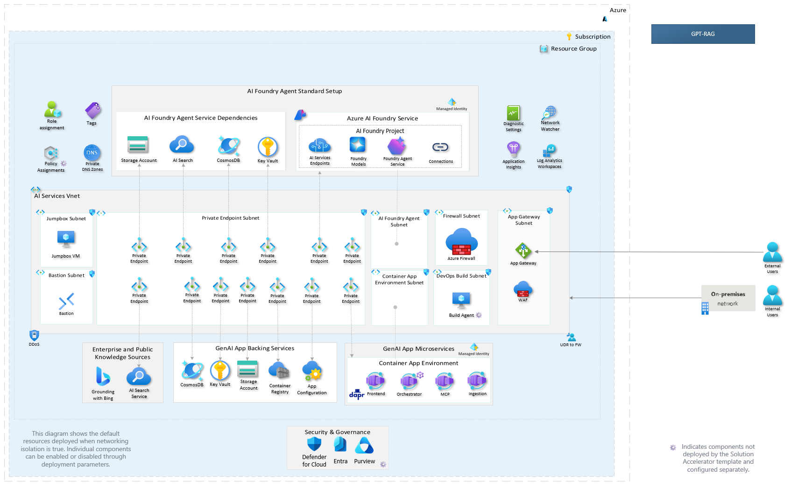
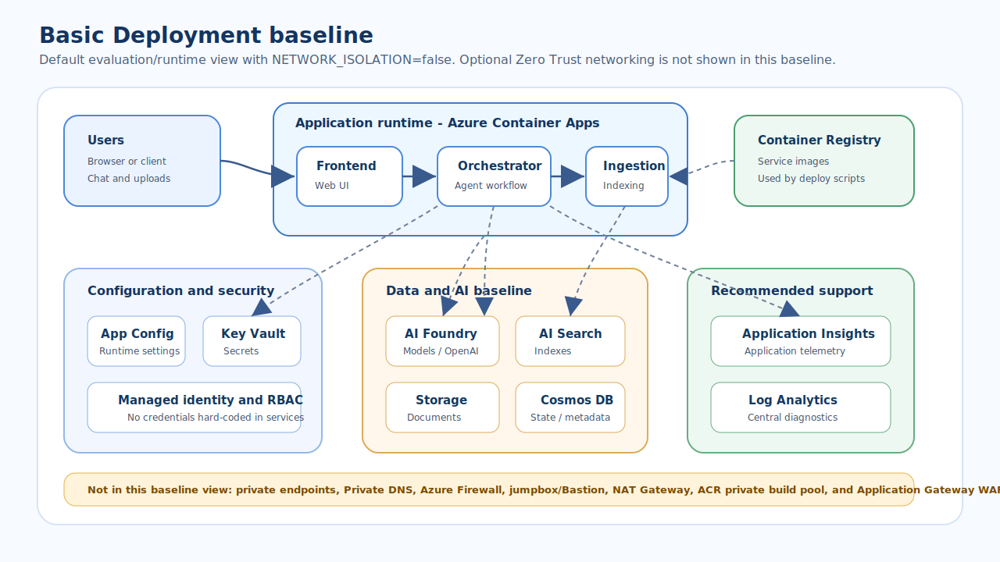
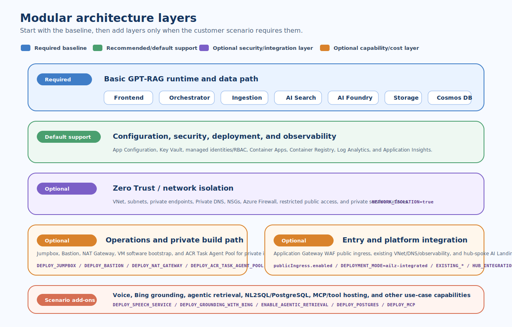

## Architecture

GPT-RAG is modular. The full Zero Trust diagram shows a hardened, full-capability reference architecture; it is not the minimum footprint required to evaluate or run the accelerator. Start with the **Basic Deployment** baseline, then add network isolation, enterprise integration, public ingress, or AI capabilities only when the scenario requires them.

## Full Zero Trust reference

The existing architecture diagram remains the full network-isolated reference view. Use it when discussing hardened deployments, while the complementary diagrams below explain the baseline and optional layers.

[Download Visio Diagram](media/GPT-RAG.vsdx)

---

## Complementary modular views

!!! note "How to read these diagrams"
    Solid blue components are part of the basic GPT-RAG deployment path. Green components are recommended/default platform support. Purple and orange components are optional add-ons controlled by deployment parameters.

The baseline corresponds to the [Basic Deployment](deploy.md#basic-deployment) flow with `NETWORK_ISOLATION=false`. It focuses on the default application and data path: users access the frontend, the orchestrator coordinates AI and retrieval, ingestion indexes enterprise content, and shared platform services provide configuration, secrets, identity, storage, search, and conversation state.

## Component matrix

| Layer | Posture | Controlled by | Include when |
| --- | --- | --- | --- |
| Frontend, orchestrator, ingestion | Required baseline | `manifest.json` components and `containerAppsList` | Running the default GPT-RAG web, orchestration, and ingestion services. |
| AI Foundry / Azure OpenAI, AI Search, Storage, Cosmos DB | Required for default RAG | `deployAiFoundry`, `modelDeploymentList`, `deploySearchService`, `deployStorageAccount`, `deployCosmosDb` | Running the standard RAG experience with indexed content, conversations, prompts, and model deployments. |
| App Configuration, Key Vault, managed identity / RBAC | Required platform baseline | `deployAppConfig`, `deployKeyVault`, `useUAI`, service role lists | Centralizing runtime settings and secrets without hard-coded credentials. |
| Container Apps, Container Registry | Required for service deployment | `deployContainerApps`, `deployContainerEnv`, `deployContainerRegistry` | Hosting and deploying the GPT-RAG runtime services. |
| Log Analytics and Application Insights | Recommended/default support | `deployLogAnalytics`, `deployAppInsights`, `EXISTING_LOG_ANALYTICS_WORKSPACE_RESOURCE_ID`, `EXISTING_APPLICATION_INSIGHTS_RESOURCE_ID` | Capturing diagnostics and app telemetry, or reusing enterprise observability. |
| Zero Trust networking | Optional security add-on | `NETWORK_ISOLATION=true`, `allowedIpRanges`, Private DNS settings | Requiring private endpoints, private DNS, VNet integration, NSGs, and controlled public access. |
| Jumpbox, Bastion, NAT Gateway, ACR Task Agent Pool, Azure Firewall | Optional operations/build layer | `DEPLOY_JUMPBOX`, `DEPLOY_BASTION`, `DEPLOY_NAT_GATEWAY`, `DEPLOY_ACR_TASK_AGENT_POOL`, `DEPLOY_AZURE_FIREWALL` | Operating from inside the VNet, building images privately, or controlling egress in isolated deployments. |
| Application Gateway WAF public ingress | Optional entry layer | `publicIngress.enabled` | Exposing one private Container App through controlled public HTTPS/WAF. See [Application Gateway](howto_app_gateway.md). |
| Existing platform / AI Landing Zone integration | Optional enterprise integration | `DEPLOYMENT_MODE=ailz-integrated`, `USE_EXISTING_VNET`, `EXISTING_*_RESOURCE_ID`, `HUB_INTEGRATION_*` | Reusing central network, DNS, observability, Bastion, NAT, or hub-spoke resources. |
| Scenario capabilities | Optional feature add-ons | `DEPLOY_SPEECH_SERVICE`, `DEPLOY_GROUNDING_WITH_BING`, `ENABLE_AGENTIC_RETRIEVAL`, `DEPLOY_POSTGRES`, `DEPLOY_MCP` | Enabling voice, Bing grounding, agentic retrieval, NL2SQL/PostgreSQL, or MCP/tool-hosting scenarios. |

## Key Capabilities

- **Enterprise-Grade Security**  
  Optional Zero Trust architecture with private endpoints, Azure Key Vault integration, and comprehensive monitoring.

- **Flexible & Customizable**  
  Modular design with customizable orchestration, multiple interface options, and bring-your-own-resources support.

- **Multimodal Experience**  
  Native support for text, images, and voice with SharePoint and Fabric connectors for seamless data integration.

- **Production Ready**  
  Enterprise-ready infrastructure with support for CI/CD pipelines and quality evaluation integration.
