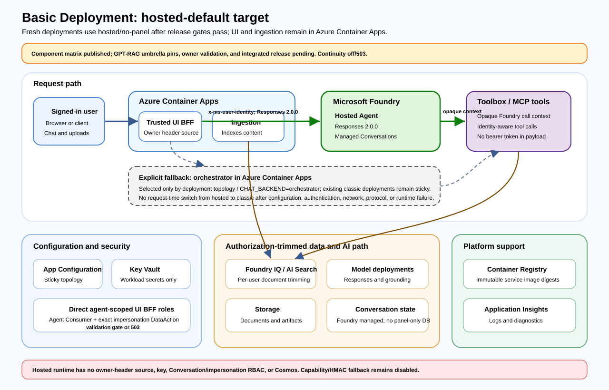

## Architecture

GPT-RAG is modular. The accepted hosted-default architecture makes Microsoft
Foundry hosted/no-panel the target for genuinely fresh deployments and keeps
the Container Apps orchestrator as an explicit supported fallback. Existing
deployments retain their persisted topology during upgrade. Network isolation,
enterprise integration, public ingress, and optional AI capabilities remain
separate choices.

!!! warning "Exact matrix pinned; live evidence gates remain"
    UI `v2.6.0`, orchestrator `v4.0.0`, ingestion `v2.7.0`, and AILZ `v2.5.0`
    are pinned by the umbrella integration and implement the delegated
    `x-ms-user-identity` contract. Classic, hosted/no-panel, and explicitly
    selected hosted-panel are supported topologies. Continuity, user-history,
    owner-binding validation, and operator-surface gates remain
    deployment-published `false`, so their routes stay off/503; no live
    validation result is implied. See the
    [hosted-agent supported matrix](hosted_agent_release_matrix.md).

## Full Zero Trust reference

The existing PNG and Visio remain the full network-isolated reference view.
Use them when discussing hardened deployments. Maintainers should apply the
[legacy diagram update handoff](architecture_legacy_diagram_handoff.md) when an
umbrella release ships so those manually maintained assets match the focused
editable SVG and Excalidraw views below.

[Download Visio Diagram](media/GPT-RAG.vsdx)

---

## Chat runtime modes

[Edit the chat runtime diagram in Excalidraw](media/architecture_chat_runtime_modes.excalidraw)

The fresh-deployment target sends chat from the Web UI to a Microsoft Foundry
hosted agent. For the release-gated OQ-OWN path, the trusted UI BFF authenticates to
the individual agent and derives the delegated owner header; OBO is reserved
for downstream retrieval. The hosted agent passes only opaque Foundry call
context to Toolbox, and Foundry IQ or Azure AI Search applies native
authorization trimming. Missing identity, call context, configuration,
authorization, network, protocol, or runtime state fails closed. A request
never silently switches to the Container Apps orchestrator.

For hosted continuity, the trusted UI BFF derives `x-ms-user-identity` from the
authenticated server-side principal and sends it on Responses protocol `2.0.0`.
This delegated owner binding is distinct from OBO retrieval tokens. Activation
requires direct individual-agent-scope assignments of Foundry Agent Consumer
(`eed3b665-ab3a-47b6-8f48-c9382fb1dad6`) and the exact GPT-RAG custom role
**GPT-RAG Hosted Agent User Identity Impersonation**
(`bef66abe-a495-530a-be1d-5d882fecff03`) containing only
`Microsoft.CognitiveServices/accounts/AIServices/agents/endpoints/UserIdentityImpersonation/action`,
plus `HOSTED_CONVERSATION_OWNER_BINDING_VALIDATED=true`. The hosted runtime is not an
identity-header source and gets no key, Conversation or impersonation RBAC, or Cosmos DB in
hosted/no-panel. Capability/HMAC remains a disabled fallback. See the
[hosted conversation continuity platform contract](hosted_continuity_platform_contract.md)
for the disabled-by-default gate, exact roles, limits, and cleanup lifecycle.

The classic runtime remains selectable through an explicit deployment
operation. Pre-cutover deployments without a topology marker remain classic,
and any persisted topology stays sticky until an operator deliberately
migrates it. Hosted-panel is not the fresh default, but an operator may select
it explicitly. It provisions UI, ingestion, and only the metadata owner-index
and feedback Cosmos containers. Its user-history and operator routes remain
off/503 behind independent evidence gates.

The lower lane in the diagram shows the planned two-phase hosted image flow:
provision prerequisites, build through public ACR Tasks or the dedicated
VNet-connected ACR Tasks agent pool, resolve the hosted image to an immutable
`sha256` digest, provision the digest-backed hosted handoff, and deploy.

## Complementary modular views

!!! note "How to read these diagrams"
    The modular view is organized around **Basic Deployment**, **Common
    platform services**, and **Zero Trust additions**. Hosted chat is a
    mode-selected baseline runtime, not an optional AI capability. Solid-color
    chips are standard resources, dashed orange chips are default-on or
    BYO-capable parameters, and solid orange chips are opt-in add-ons.

The Basic diagram shows the target [fresh deployment](deploy.md#chat-runtime-modes)
with `NETWORK_ISOLATION=false`: Web UI and ingestion remain in Container Apps,
while hosted/no-panel handles chat through Toolbox and authorization-trimmed
retrieval. The orchestrator Container App appears only as the explicit
fallback. The panel is absent and its flag remains `false`.

Use the table below for the deployment parameters behind each layer, and the [Deployment Guide](deploy.md) for the full `azd env set` flows.

## Deployment component table

| Layer | Posture | Controlled by | Include when |
| --- | --- | --- | --- |
| UI, chat runtime, ingestion | Mode-selected baseline | Canonical `DEPLOYMENT_TOPOLOGY`; materialized `DEPLOY_HOSTED_AGENT_ORCHESTRATION`, `DEPLOY_ADMINISTRATIVE_PANEL`, `CHAT_BACKEND`; `manifest.json` components; `containerAppsList` | The umbrella manifest pins the exact supported matrix. Existing topologies stay sticky, `classic` selects the Container Apps fallback, hosted/no-panel is the fresh default, and hosted-panel requires explicit operator selection while its independent evidence gates remain off/503. |
| AI Foundry account, project, and model deployments | Required AI control plane | `deployAiFoundry`, `deployAfProject`, `deployAAfAgentSvc`, `modelDeploymentList` | Provisioning Azure AI Foundry / Azure OpenAI and the model deployments used by GPT-RAG. |
| AI Foundry associated resources | Default-created or BYO-capable | `aiSearchResourceId`, `aiFoundryStorageAccountResourceId`, `aiFoundryCosmosDBAccountResourceId`, `keyVaultResourceId`, `aiFoundryStorageSku` | Letting the AI Foundry module create its required Storage, Search, Cosmos DB, and Key Vault resources, or reusing existing ones. |
| RAG workload data services | Mode-selected, parameter-controlled | `deploySearchService`, `deployStorageAccount`, `deployCosmosDb`, `storageAccountContainersList`, `databaseContainersList` | Running indexed-document and file-storage paths. Hosted/no-panel uses Foundry managed Conversations and omits panel-only Cosmos DB; classic preserves its existing state path. |
| App Configuration, identity / RBAC, Container Apps, Container Registry | Required platform capabilities, topology varies by mode | `deployAppConfig`, `deployContainerApps`, `deployContainerEnv`, `deployContainerRegistry`, `useUAI`, service role lists | Publishing the sticky topology and runtime contract, hosting UI/ingestion, and preparing immutable images. Hosted/no-panel does not provision an orchestrator Container App. Delegated continuity grants the two exact direct agent-scoped roles only to the UI BFF after protocol and owner-binding validation. |
| Workload Key Vault and observability | Default support, parameter-controlled or reusable | `deployKeyVault`, `deployLogAnalytics`, `deployAppInsights`, `EXISTING_LOG_ANALYTICS_WORKSPACE_RESOURCE_ID`, `EXISTING_APPLICATION_INSIGHTS_RESOURCE_ID`, `EXISTING_APPLICATION_INSIGHTS_CONNECTION_STRING` | Storing workload secrets and capturing telemetry. The delegated primary continuity path does not provision or require a capability key or dedicated continuity vault; those inputs remain disabled fallback-only. Application Insights is created or wired only when an effective Log Analytics workspace is available. |
| Zero Trust private networking | Optional security posture | `networkIsolation`, `allowedIpRanges`, `useExistingVNet`, `deploySubnets`, `policyManagedPrivateDns`, `EXISTING_PRIVATE_DNS_ZONE_*` | Requiring private endpoints, private DNS, VNet integration, NSGs, and internal Container Apps ingress. |
| Azure Firewall, Jumpbox, Bastion, NAT Gateway, private ACR build pool | Zero Trust operations/build options | `DEPLOY_AZURE_FIREWALL`, `DEPLOY_JUMPBOX`, `DEPLOY_BASTION`, `DEPLOY_NAT_GATEWAY`, `DEPLOY_ACR_TASK_AGENT_POOL`, `EXISTING_JUMPBOX_RESOURCE_ID`, `EXISTING_BASTION_RESOURCE_ID`, `EXISTING_NAT_GATEWAY_RESOURCE_ID` | Operating inside the VNet or reusing central access/egress resources. The gated hosted flow uses the dedicated VNet-connected ACR Tasks agent pool for private builds; shared ACR Tasks cannot reach a private endpoint. |
| Application Gateway WAF public ingress | Optional entry layer | `publicIngress.enabled` | Exposing one private Container App through controlled public HTTPS/WAF. See [Application Gateway](howto_app_gateway.md). |
| Existing platform / AI Landing Zone integration | Optional enterprise integration | `DEPLOYMENT_MODE=ailz-integrated`, `USE_EXISTING_VNET`, `EXISTING_*_RESOURCE_ID`, `HUB_INTEGRATION_*` | Reusing central network, DNS, observability, Bastion, NAT, or hub-spoke resources. |
| Scenario capabilities | Optional feature add-ons | `DEPLOY_SPEECH_SERVICE`, `DEPLOY_GROUNDING_WITH_BING`, `ENABLE_AGENTIC_RETRIEVAL` | Enabling voice, Bing grounding, or agentic retrieval scenarios. The hosted runtime is not classified as an optional capability. MCP tool selection and NL2SQL application behavior remain separately configured. |

For data ownership, telemetry, retention, and responsibility boundaries, see
[Governance and responsible operation](governance_overview.md). The correlated
audit event implementation on that page is available since
[GPT-RAG v3.7.0](https://github.com/Azure/GPT-RAG/releases/tag/v3.7.0) but
remains disabled by default and is not part of the basic deployment shown
above until an operator enables it.

## Key Capabilities

- **Enterprise-Grade Security**  
  Optional Zero Trust architecture with private endpoints, Azure Key Vault integration, and comprehensive monitoring.

- **Flexible & Customizable**  
  Modular design with customizable orchestration, multiple interface options, and bring-your-own-resources support.

- **Multimodal Experience**  
  Native support for text, images, and voice with SharePoint and Fabric connectors for seamless data integration.

- **Production Ready**  
  Enterprise-ready infrastructure with support for CI/CD pipelines and quality evaluation integration.
