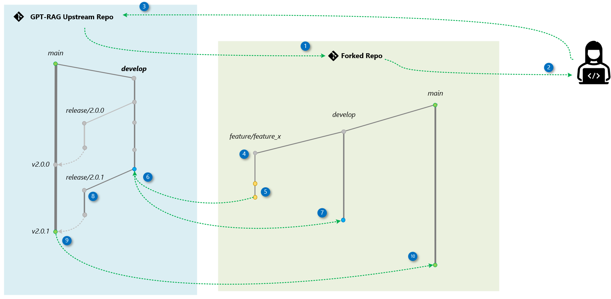

We appreciate contributions and suggestions for this project!

> While anyone can submit pull requests at any time, we created a **[contributor form](http://aka.ms/gpt-rag-contributing)** to help match volunteers with areas where we need the most help. It's optional but helps us better organize and direct contributions!

### Ways to Contribute
- **Issues:** Report bugs, propose enhancements, or share feature requests.
- **Comments:** Engage in discussions, help others, and review proposals.
- **Documentation:** Improve guides and clarity for new users.
- **Design:** Contribute to open design discussions and new patterns.
- **Tests:** Strengthen reliability through unit and integration tests.
- **Code:** Submit fixes, enhancements, or new modules via pull requests.


## Contribution Guidelines

To maintain project quality, the following items will be considered during the PR review.

> Adhering to these best practices will streamline the review process.

- **Target the `develop` Branch:** Always direct your pull request to the `develop` branch to ensure that changes are properly integrated into the project's development workflow.
 
- **Keep Pull Requests Small:** Aim to make your pull requests as focused and concise as possible. This makes it easier to review and ensures quicker integration into the codebase.
  
- **Associate with Prioritized Issues:** Ensure that each pull request is linked to a specific, prioritized issue in the project backlog. This helps maintain alignment with project goals and ensures that work is being done on tasks of the highest importance.

- **Include Documentation:** Every new feature or functionality must be accompanied by clear documentation explaining its purpose and configuration. This ensures others can use it independently in a self-service manner.

- **Bugs and Documentation Corrections:** Pull requests that address bugs or correct documentation do not need to be associated with prioritized issues. These can be submitted directly to maintain the quality and accuracy of the project.

- **Multi-Repo Dependencies:** If your pull request has dependencies on updates in other repositories, make sure to mention this in the pull request description. Additionally, create a corresponding pull request in the other repository to ensure synchronized updates across all related projects.

## Code Update Workflow

We use a simplified version of the [Fork and Branch Workflow](https://blog.scottlowe.org/2015/01/27/using-fork-branch-git-workflow/) alongside [Git Flow](https://nvie.com/posts/a-successful-git-branching-model/) for branching strategy. The `main` branch always contains deployment-ready code, while the `develop` branch serves as our integration branch.

Contributors create feature branches from `develop` in their forks. Once changes are completed, they submit a pull request to the `develop` branch in the upstream repository. After review and approval, reviewers merge the changes into `develop`. Weekly, maintainers group these changes into a pull request from `develop` to `main` for final review and merging.

### Process Overview

This section outlines the contribution process, highlighting the key actions for both contributors and maintainers. The accompanying diagram visually represents the workflow.



1) **Fork the Repository**
   
   Create a copy of the GPT-RAG upstream repository under your own GitHub account.

2) **Clone Locally**

   Download your forked repository to your local machine.

3) **Add Upstream** 

Link the original GPT-RAG upstream repository as `upstream` to keep your fork synchronized.

4) **Create a Feature Branch**

From your fork’s `develop` branch, create a feature branch for your change (e.g., `feature/feature_x`).

5) **Commit and Push Changes**

Implement your updates locally, commit, and push them to your fork on GitHub.

6) **Open and Merge the Pull Request to `develop`**

Open a PR from your feature branch in your fork to the upstream repository’s `develop` branch.

7) **Sync with Upstream `develop`**

After your PR is merged, update your fork's `develop` branch with the latest changes from the upstream.

8) **Create a Release Branch** *(Maintainers)*

When the `develop` branch is ready for release, create a branch named `release/x.y.z` from your fork's `develop`. This branch will be tested and validated before merging to `main`.

9) **Open a Pull Request to Upstream `main`** *(Maintainers)*

Once the release is validated, open a PR from your release branch to the upstream `main`. After the merge, maintainers will create a version tag (e.g., `v2.0.1`).

10) **Sync Your Fork**

Finally, update both your fork’s `main` and `develop` branches to reflect the latest upstream state.

### Step-by-Step

Here’s an example of implementing a feature called `conversation-metadata` in the `gpt-rag-orchestrator` repository.

1) **Create a Fork**

   ```bash
   https://github.com/placerda/gpt-rag-orchestrator.git
   ```

2) **Clone Your Fork Locally**

   ```bash
   git clone https://github.com/placerda/gpt-rag-orchestrator.git
   ```

3) **Set Upstream Remote**

   ```bash
   git remote add upstream git@github.com:Azure/gpt-rag-orchestrator.git
   ```

4) **Create a Feature Branch**

   ```bash
   git checkout -b feature/conversation-metadata develop
   ```

5) **Make and Push Your Changes**

   ```bash
   git add .
   git commit -m "Implemented conversation metadata"
   git push origin feature/conversation-metadata
   ```

6) **Open and Merge the Pull Request to `develop`**

   * **6a. Create the PR:**
     Go to your fork on GitHub → click **New Pull Request** →
     Base: `Azure/gpt-rag-orchestrator` → `develop`
     Compare: `placerda/gpt-rag-orchestrator` → `feature/conversation-metadata`
   * **6b. Maintainer Review:**
     The maintainers will review, request changes if needed, and merge the PR into the upstream `develop`.

7) **Sync Your Fork’s `develop`**

   ```bash
   git fetch upstream
   git checkout develop
   git merge upstream/develop
   git push origin develop
   ```

8) **Create a Release Branch** *(Maintainers)*

   ```bash
   git checkout -b release/2.0.1 develop
   git push origin release/2.0.1
   ```

9) **Open a Pull Request to Upstream `main`** *(Maintainers)*

   * Base: `Azure/gpt-rag-orchestrator` → `main`
   * Compare: `placerda/gpt-rag-orchestrator` → `release/2.0.1`
   * After review and merge, maintainers tag the release (e.g., `v2.0.1`).

10) **Sync Your Fork After Tag Creation**

```bash
git fetch upstream
git checkout main
git merge upstream/main
git push origin main
```

## Legal and Code of Conduct

Before contributing, you'll need to sign a Contributor License Agreement (CLA) to confirm that you have the rights to, and do, grant us permission to use your contribution. More details can be found at [Microsoft CLA](https://cla.opensource.microsoft.com).

This project adheres to the [Microsoft Open Source Code of Conduct](https://opensource.microsoft.com/codeofconduct/). For more information, please visit the [Code of Conduct FAQ](https://opensource.microsoft.com/codeofconduct/faq/) or contact [opencode@microsoft.com](mailto:opencode@microsoft.com) with any questions or comments.