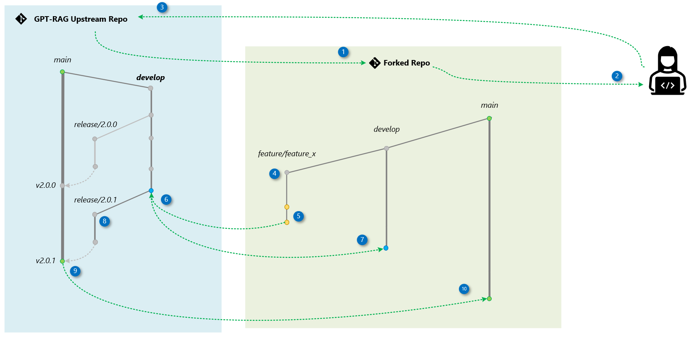

We appreciate contributions and suggestions for this project!

> While anyone can submit pull requests at any time, we created a **[contributor form](http://aka.ms/gpt-rag-contributing)** to help match volunteers with areas where we need the most help. It's optional but helps us better organize and direct contributions!

### Ways to Contribute
- **Issues:** Report bugs, propose enhancements, or share feature requests.
- **Comments:** Engage in discussions, help others, and review proposals.
- **Documentation:** Improve guides and clarity for new users.
- **Design:** Contribute to open design discussions and new patterns.
- **Tests:** Strengthen reliability through unit and integration tests.
- **Code:** Submit fixes, enhancements, or new modules via pull requests.


## Contribution Guidelines

To maintain project quality, the following items will be considered during the PR review.

> Adhering to these best practices will streamline the review process.

- **Use the Correct Base Branch:** Runtime component changes target `develop`. For this documentation site, create a `feature/*` branch from `docs` and target `docs` in your pull request. Keep documentation and runtime changes in their owning repositories and link dependent pull requests.
 
- **Keep Pull Requests Small:** Aim to make your pull requests as focused and concise as possible. This makes it easier to review and ensures quicker integration into the codebase.
  
- **Associate with Prioritized Issues:** Ensure that each pull request is linked to a specific, prioritized issue in the project backlog. This helps maintain alignment with project goals and ensures that work is being done on tasks of the highest importance.

- **Include Documentation:** Every new feature or functionality must be accompanied by clear documentation explaining its purpose and configuration. This ensures others can use it independently in a self-service manner.

- **Bugs and Documentation Corrections:** Pull requests that address bugs or correct documentation do not need to be associated with prioritized issues. These can be submitted directly to maintain the quality and accuracy of the project.

- **Multi-Repo Dependencies:** If your pull request has dependencies on updates in other repositories, make sure to mention this in the pull request description. Additionally, create a corresponding pull request in the other repository to ensure synchronized updates across all related projects.

### Documentation

All project documentation is centralized in MkDocs and hosted at [https://aka.ms/gpt-rag-docs](https://aka.ms/gpt-rag-docs). When contributing to documentation:

- **Use AI Tools Wisely:** GitHub Copilot and similar tools can help generate documentation, but always review and refine the output. Avoid excessive use of emojis, dashes, bullets, and images. Keep documentation clean, clear, and professional.

- **Focus on Clarity:** Prioritize straightforward language and well-structured content. Documentation should be easy to read.

- **Follow Existing Patterns:** Review existing documentation pages to maintain consistency in style, formatting, and tone.

- **Test Your Changes:** Preview your documentation locally using MkDocs before submitting to ensure proper rendering.

Run these commands from a documentation checkout of `Azure/GPT-RAG`, not a
runtime component checkout. Use a virtual environment; the documentation
workflow uses Python 3.11, independently of the runtime components' Python
version.

```powershell
python -m pip install -r requirements-docs.txt
python -m mkdocs build
python -m mkdocs serve
```

`build` renders the site locally; `serve` starts a local preview. Neither
publishes documentation. Do not run `mkdocs gh-deploy` as a preview check:
merging to `docs` triggers the publishing workflow.

When documenting a coordinated runtime change, keep the documentation PR in
draft until the component interfaces and commands are confirmed. Record the
component PRs and merge order in its description. Do not describe proposed
checks, package layouts, or repository rules as shipped behavior. Review
deployment, authentication, and continuity examples too; record a no-change
assessment when their supported behavior is preserved.

## Python Quality Checks

!!! warning "Draft contributor preview, not an activated merge policy"
    The commands in this section apply only to the implementation checkpoints
    linked below for [#681](https://github.com/Azure/GPT-RAG/issues/681),
    coordinated in [#689](https://github.com/Azure/GPT-RAG/pull/689).
    They are not instructions for the currently released components.
    The backend checkpoints still fail lint, broad-handler, and bootstrap
    policy checks. Their passing tests and typing/architecture results do not
    establish a green quality gate or required-check activation.

### Repository-local setup

Work in the relevant component checkout, not the umbrella or documentation
checkout, using an isolated Python 3.12 environment. Read its `AGENTS.md` and
the linked PR before running the commands. The recorded backend checkpoints
used Python 3.12.9, Ruff 0.16.5, mypy 2.3.1, Import Linter 2.14, and Grimp
3.16. Install the checked-out `requirements-quality.txt`; do not substitute
tool versions from the original proposal. These are development dependencies,
not additions to runtime images.

| Component checkpoint | Contributor source at the recorded revision |
| --- | --- |
| [Azure/gpt-rag-orchestrator#346](https://github.com/Azure/gpt-rag-orchestrator/pull/346), `ef649ee` | [AGENTS.md](https://github.com/Azure/gpt-rag-orchestrator/blob/ef649eeab6144156b4c90c4422d62f229454dedc/AGENTS.md#python-quality-policy-bootstrap-under-review) |
| [Azure/gpt-rag-ingestion#296](https://github.com/Azure/gpt-rag-ingestion/pull/296), `bbe5292` | [Python quality guide](https://github.com/Azure/gpt-rag-ingestion/blob/bbe52923dbaf2b8ce4f6f371e492ad32ae7ffe45/docs/python-quality.md) |

Fetch the PR's actual target before running checks. In the examples, replace
`<fetched-protected-target-sha>` with that target commit, not the candidate
commit. These component PRs target `develop`; release work must use its actual
target instead. Reuse the same base and unchanged candidate for test evidence
and quality reports.

**Orchestrator**

```powershell
python -m pip install -r requirements.txt
python -m pip install pytest pytest-asyncio pytest-mock jsonschema
python -m pip install -r requirements-quality.txt
$Base = "<fetched-protected-target-sha>"
python -m pytest -q --junitxml=.artifacts\pytest.xml
python .github\scripts\check-quality.py --check all --base-ref $Base --report .artifacts\quality.json --test-results .artifacts\pytest.xml
```

**Ingestion**

```powershell
python -m pip install -r requirements.txt
python -m pip install pytest pytest-asyncio
python -m pip install -r requirements-quality.txt
$Base = "<fetched-protected-target-sha>"
python -m pytest tests -q --junitxml=.artifacts\pytest.xml -o junit_family=legacy
python .github\scripts\quality-evidence.py --junit .artifacts\pytest.xml --base-ref $Base --report .artifacts\test-evidence.json
python .github\scripts\check-quality.py --check all --base-ref $Base --test-evidence .artifacts\test-evidence.json --report .artifacts\quality.json
```

These interfaces intentionally differ: orchestrator accepts JUnit through
`--test-results`; ingestion first binds JUnit to same-run JSON with
`quality-evidence.py`, then consumes it through `--test-evidence`. Do not
reuse stale evidence or treat a test name in a policy record as proof that
the test passed.

Both backend checkers accept `--check all`, or one of `lint`, `typing`,
`architecture`, `exceptions`, and `policy` for diagnosis. Exit `0` means the
requested checks passed, `1` means violations, and `2` means invalid input
or incomplete execution. A missing report, tool failure, or a passing
individual check is not a passing full gate. Existing behavior tests and
frontend jobs remain separate obligations in the component workflows.

### Typing scope and reviewed exceptions

The checkpoint `.quality/typing-scope.json` files describe incremental blocking
coverage, not whole-repository strict typing:

| Component | Initial blocking files, including new helpers |
| --- | --- |
| Orchestrator | `src/schemas.py`, `src/connectors/types.py`, `src/plugins/retrieval/retrieval_types.py`, `src/plugins/nl2sql/nl2sql_types.py`, `src/connectors/obo.py` |
| Ingestion | `telemetry/audit_contract.py`, `telemetry/audit_sanitizer.py`, `jobs/runtime.py` |

Newly discovered runtime modules join blocking typing scope. Imported
diagnostics outside that scope remain visible in reports; they are not
silently covered by a global missing-import ignore. Both initial
`.quality/typing-baseline.json` files are empty. A reviewed legacy baseline
identifies individual diagnostics and multiplicity, not just an error count.
Moving a module must preserve its identity and coverage, not erase its debt
or create a new allowance.

Scope reductions, baseline growth, new suppressions, or changes to the
checker, workflows, tool pins, and policy need explicit maintainer review.
Do not edit records to make a failing candidate approve itself, generate
baselines automatically in CI, or exempt entire files from review.

Both checkpoint `.quality/exceptions.json` ledgers are empty: no inherited
broad handler is approved. A proposed exception must identify the exact
source site and try/handler fingerprint, its necessity, expected failure
outcome, safe diagnostic path, review reference, and passing named failure
tests. Logging or re-raising alone is not an exemption. Preserve explicitly
best-effort audit side effects without using them to excuse failed primary
operations. Follow the owning repository's schema rather than copying
exception records between components.

### Adoption is separate from workflow availability

The component drafts introduce an always-evaluated `quality-gate` alongside
their existing tests. Ordinary policy approval deliberately fails at bootstrap
because the protected base has no evaluator yet. A workflow file, candidate
approval string, or uploaded report cannot activate repository protection.

Before claiming enforcement, maintainers must resolve the remaining findings
and review the bootstrap. Separately authorized administrators must require
the quality gate and existing checks, enforce latest-head code-owner review,
dismiss stale approvals, restrict bypass, and prove clean and deliberately
failing PR outcomes. Repair policy through a reviewed PR rather than
disabling controls. These steps are pending, not performed by this
documentation change.

## Code Update Workflow

We use a simplified version of the [Fork and Branch Workflow](https://blog.scottlowe.org/2015/01/27/using-fork-branch-git-workflow/) alongside [Git Flow](https://nvie.com/posts/a-successful-git-branching-model/) for branching strategy. The `main` branch always contains deployment-ready code, while the `develop` branch serves as our integration branch.

Contributors create feature branches from `develop` in their forks. Once changes are completed, they submit a pull request to the `develop` branch in the upstream repository. After review and approval, reviewers merge the changes into `develop`. Weekly, maintainers group these changes into a pull request from `develop` to `main` for final review and merging.

### Process Overview

This section outlines the contribution process, highlighting the key actions for both contributors and maintainers. The accompanying diagram visually represents the workflow.



1) **Fork the Repository**
   
   Create a copy of the GPT-RAG upstream repository under your own GitHub account.

2) **Clone Locally**

   Download your forked repository to your local machine.

3) **Add Upstream** 

Link the original GPT-RAG upstream repository as `upstream` to keep your fork synchronized.

4) **Create a Feature Branch**

From your fork’s `develop` branch, create a feature branch for your change (e.g., `feature/feature_x`).

5) **Commit and Push Changes**

Implement your updates locally, commit, and push them to your fork on GitHub.

6) **Open and Merge the Pull Request to `develop`**

Open a PR from your feature branch in your fork to the upstream repository’s `develop` branch.

7) **Sync with Upstream `develop`**

After your PR is merged, update your fork's `develop` branch with the latest changes from the upstream.

8) **Create a Release Branch** *(Maintainers)*

When the `develop` branch is ready for release, create a branch named `release/x.y.z` from your fork's `develop`. This branch will be tested and validated before merging to `main`.

9) **Open a Pull Request to Upstream `main`** *(Maintainers)*

Once the release is validated, open a PR from your release branch to the upstream `main`. After the merge, maintainers will create a version tag (e.g., `v2.0.1`).

10) **Sync Your Fork**

Finally, update both your fork’s `main` and `develop` branches to reflect the latest upstream state.

### Step-by-Step

Here’s an example of implementing a feature called `conversation-metadata` in the `gpt-rag-orchestrator` repository.

1) **Create a Fork**

   ```bash
   https://github.com/<your-github-user>/gpt-rag-orchestrator.git
   ```

2) **Clone Your Fork Locally**

   ```bash
   git clone https://github.com/<your-github-user>/gpt-rag-orchestrator.git
   ```

3) **Set Upstream Remote**

   ```bash
   git remote add upstream git@github.com:Azure/gpt-rag-orchestrator.git
   ```

4) **Create a Feature Branch**

   ```bash
   git checkout -b feature/conversation-metadata develop
   ```

5) **Make and Push Your Changes**

   ```bash
   git add .
   git commit -m "Implemented conversation metadata"
   git push origin feature/conversation-metadata
   ```

6) **Open and Merge the Pull Request to `develop`**

   * **6a. Create the PR:**
     Go to your fork on GitHub → click **New Pull Request** →
     Base: `Azure/gpt-rag-orchestrator` → `develop`
     Compare: `<your-github-user>/gpt-rag-orchestrator` → `feature/conversation-metadata`
   * **6b. Maintainer Review:**
     The maintainers will review, request changes if needed, and merge the PR into the upstream `develop`.

7) **Sync Your Fork’s `develop`**

   ```bash
   git fetch upstream
   git checkout develop
   git merge upstream/develop
   git push origin develop
   ```

8) **Create a Release Branch** *(Maintainers)*

   ```bash
   git checkout -b release/2.0.1 develop
   git push origin release/2.0.1
   ```

9) **Open a Pull Request to Upstream `main`** *(Maintainers)*

   * Base: `Azure/gpt-rag-orchestrator` → `main`
   * Compare: `<your-github-user>/gpt-rag-orchestrator` → `release/2.0.1`
   * After review and merge, maintainers tag the release (e.g., `v2.0.1`).

10) **Sync Your Fork After Tag Creation**

```bash
git fetch upstream
git checkout main
git merge upstream/main
git push origin main
```

> **Note for Documentation Contributions:** When contributing to documentation, target the `docs` branch instead of `develop`. It is recommended to create a dedicated clone specifically for documentation work to avoid mixing documentation changes with code updates. This keeps documentation workflows separate and simplifies the review process.

## Legal and Code of Conduct

Before contributing, you'll need to sign a Contributor License Agreement (CLA) to confirm that you have the rights to, and do, grant us permission to use your contribution. More details can be found at [Microsoft CLA](https://cla.opensource.microsoft.com).

This project adheres to the [Microsoft Open Source Code of Conduct](https://opensource.microsoft.com/codeofconduct/). For more information, please visit the [Code of Conduct FAQ](https://opensource.microsoft.com/codeofconduct/faq/) or contact [opencode@microsoft.com](mailto:opencode@microsoft.com) with any questions or comments.