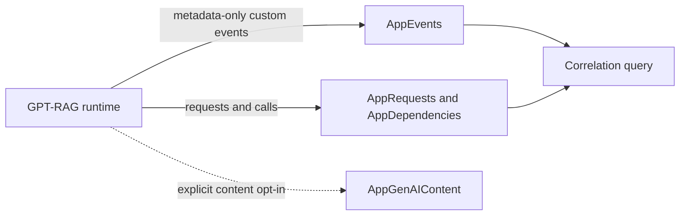

# Audit Contract v1

This page is the proposed technical contract for reconstructing GPT-RAG request,
route, source, tool, and outcome activity through Azure Monitor.

!!! warning "Proposed contract, not released"
    Current GPT-RAG releases do not emit this event set. The names, fields,
    enums, bounds, feature flags, health behavior, and queries below are
    implementation assumptions based on the design brief for issue
    [#571](https://github.com/Azure/GPT-RAG/issues/571). They must be compared
    field by field with the runtime schema pull request and validated against
    deployed telemetry before this contract is described as available.

## Contract goals

Audit Contract v1 is designed to:

- reconstruct a representative request without recording sensitive content;
- correlate custom events with request and dependency telemetry;
- keep event values bounded and machine-readable;
- state when content was omitted or redacted;
- remain additive so consumers can ignore unknown optional fields; and
- reuse GPT-RAG's OpenTelemetry and Application Insights integration.

It is not a transaction log, a source of legal conclusions, an immutable
ledger, or proof that the producing component behaved correctly.



## Application Insights representation

The proposal uses Azure Monitor OpenTelemetry custom events. The producer sets
`microsoft.custom_event.name`; workspace-based Application Insights stores the
event in `AppEvents`.

| Contract value | `AppEvents` representation |
| --- | --- |
| Event name | `Name` |
| Event timestamp | `TimeGenerated` |
| W3C trace ID | `OperationId` |
| Parent operation or span | `ParentId` |
| GPT-RAG envelope and event fields | `Properties` |
| Producing service | `AppRoleName` and `gptrag.audit.component` |
| Producing version | `AppVersion` and `gptrag.audit.service_version` |

Application Insights uses `customEvents` in the classic Application Insights
query experience and `AppEvents` in the workspace schema. The queries on this
page use the workspace schema provisioned by GPT-RAG.

Sensitive prompts, responses, system instructions, and tool content must not be
placed in `AppEvents`. Azure Monitor maps the relevant `gen_ai.*` content
attributes to `AppGenAIContent`. Sensitive-content capture remains an explicit
opt-in and the table should be protected. Follow the current Azure Monitor
migration guidance before enabling content capture. During the table migration,
the same content attributes can also be routed to existing telemetry tables
unless the documented protection feature is enabled.

## Proposed event names

The `Name` value is proposed as:

| Event name | Meaning |
| --- | --- |
| `gptrag.audit.request.started` | GPT-RAG accepted a request for processing. |
| `gptrag.audit.request.completed` | Request processing completed. |
| `gptrag.audit.request.failed` | Request processing failed. |
| `gptrag.audit.request.cancelled` | The caller or runtime cancelled processing. |
| `gptrag.audit.orchestration.decision` | A strategy, route, or fallback was selected. |
| `gptrag.audit.source.selected` | A grounding source was selected. |
| `gptrag.audit.source.rejected` | A grounding source was considered but not used. |
| `gptrag.audit.tool.started` | A tool invocation started. |
| `gptrag.audit.tool.completed` | A tool invocation completed. |
| `gptrag.audit.tool.failed` | A tool invocation failed or timed out. |
| `gptrag.audit.outcome.produced` | A final outcome was produced. |
| `gptrag.audit.outcome.rejected` | A final outcome was not returned because a bounded policy or runtime reason rejected it. |

A runtime health signal such as `gptrag.audit.health.degraded` is also proposed,
but it is not part of the per-request audit taxonomy. Its exact name, metric,
rate limit, and alert behavior are pending implementation.

## Common envelope

Every event should expose this logical envelope. Property names are proposed
and pending runtime verification.

| Proposed property or column | Type | Semantics |
| --- | --- | --- |
| `gptrag.audit.schema_version` | string | Contract version. Proposed initial value: `1.0`. Consumers branch on this value and ignore unknown optional fields. |
| `gptrag.audit.event_id` | UUID string | Unique identifier for one audit event. |
| `gptrag.audit.correlation_id` | opaque string | Operator-facing identifier shared by all events for one logical activity. It is separate from the trace ID because asynchronous work can cross trace boundaries. |
| `gptrag.audit.parent_event_id` | UUID string, optional | Previous logical audit event when a parent is known. |
| `OperationId` | 32 hexadecimal characters | W3C `trace-id` populated by Application Insights correlation. |
| `gptrag.audit.span_id` | 16 hexadecimal characters | W3C span identifier for the emitting operation when available. |
| `ParentId` | string, optional | Application Insights parent operation or span identifier. |
| `gptrag.audit.component` | bounded string | Producing component, initially `orchestrator` or `ingestion`. |
| `gptrag.audit.operation` | bounded string | Activity such as `chat`, `retrieve`, `ingest`, or `tool_call`. |
| `gptrag.audit.environment` | bounded string | Deployment environment label. Do not store subscription, tenant, or resource credentials. |
| `gptrag.audit.service_version` | bounded string | Deployed component version. |
| `gptrag.audit.status` | enum | Current event status from the enum below. |
| `gptrag.audit.start_time` | ISO 8601 UTC string, optional | Logical activity start when it differs from `TimeGenerated`. |
| `gptrag.audit.duration_ms` | non-negative integer, optional | Elapsed time for completed, failed, cancelled, or timed-out activity. |
| `gptrag.audit.capture_mode` | enum | Whether only metadata or explicitly approved sensitive content was enabled. |
| `gptrag.audit.redaction_applied` | boolean | `true` when the producer omitted or transformed a permitted field. It is not a guarantee that arbitrary content is safe. |
| `gptrag.audit.omitted_fields` | bounded string array | Field names omitted by policy or validation. Never include omitted values. |
| `gptrag.audit.actor_id` | HMAC pseudonym, optional | Off by default. Never a raw email, user name, object ID, or token claim. Exact format and configuration are pending. |

## Event-specific fields

| Event group | Proposed fields |
| --- | --- |
| Request lifecycle | `request_kind`, `status`, `duration_ms`, and, for failure, `error_class` and bounded `reason_code`. |
| Orchestration decision | `action_type`, `route`, `decision_outcome`, and bounded `reason_code`. Do not record chain-of-thought or free-form model reasoning. |
| Source selection | `source_kind`, opaque `source_id`, `decision_outcome`, and bounded `reason_code`. Do not record a title, URL query string, document text, or excerpt by default. |
| Tool invocation | `tool_name`, opaque `invocation_id`, `tool_operation`, `status`, `duration_ms`, and bounded `error_class`. Do not record arguments or results by default. |
| Final outcome | `outcome_kind`, `status`, `duration_ms`, and bounded `reason_code`. Do not record the response body by default. |

## Proposed enums

Exact values remain an implementation dependency. The runtime must reject or
map unknown values rather than emitting unbounded free text.

| Enum | Proposed values |
| --- | --- |
| `status` | `started`, `ok`, `failed`, `cancelled`, `rejected`, `timeout` |
| `capture_mode` | `metadata_only`, `sensitive_content_enabled` |
| `decision_outcome` | `selected`, `rejected`, `fallback` |
| `error_class` | `authentication`, `authorization`, `validation`, `rate_limited`, `timeout`, `dependency`, `cancelled`, `internal`, `unknown` |
| `source_kind` | `ai_search`, `foundry_iq_documents`, `work_iq`, `fabric_ontology`, `fabric_data_agent`, `onelake`, `sharepoint_remote`, `sharepoint_indexed`, `web_bing`, `mcp` |

The source enum represents the specific integrations documented by GPT-RAG. It
does not imply complete support for Microsoft IQ or access to telemetry produced
inside Work IQ, Fabric IQ, Foundry IQ, Bing, SharePoint, or an MCP server.

## Bounds

OpenTelemetry SDKs default to 128 attributes per span or log record and 128
events per span. OpenTelemetry does not define a default attribute-value length,
so the runtime serializer must add explicit limits.

| Item | Proposed v1 ceiling | Reconciliation required |
| --- | --- | --- |
| Total event properties | 128 | Confirm the runtime serializer and exporter apply the same or a lower limit. |
| Event name and enum value | 128 characters | Confirm whether validation rejects or maps longer values. |
| Identifier, component, operation, source, route, and tool fields | 256 characters each | Confirm the exact UTF-8 byte or character rule. |
| `reason_code` and `error_class` | 128 characters each | Confirm these are allowlisted values, not truncated exception messages. |
| `omitted_fields` | 32 entries, 128 characters per field name | Confirm serialization and overflow behavior. |
| Optional properties | 64 in addition to the required envelope, while remaining within the 128 total | Confirm the exact count. |
| `duration_ms` | Non-negative integer | Define and test the maximum accepted value in the runtime PR. |

Values that exceed a limit should be omitted or mapped to a bounded sentinel.
Do not truncate and export a token, secret, arbitrary prompt, exception body, or
tool payload. Exact byte limits, Unicode handling, and sentinel values are
pending runtime verification.

## Correlation semantics

Use [W3C Trace Context](https://www.w3.org/TR/trace-context/) to propagate
`traceparent` and `tracestate` across supported HTTP boundaries.

- `OperationId` is the W3C trace correlation used to connect `AppEvents`,
  `AppRequests`, and `AppDependencies`.
- `gptrag.audit.correlation_id` groups the logical GPT-RAG activity, including
  work that can cross traces or asynchronous boundaries.
- `gptrag.audit.event_id` identifies one event.
- `gptrag.audit.parent_event_id` expresses logical audit ordering when a trace
  parent is not sufficient.
- `gptrag.audit.span_id` and `ParentId` retain trace structure when available.

Do not put personal or business meaning into trace, correlation, event, or
invocation identifiers. Generate opaque values with sufficient randomness.

OpenTelemetry generative AI semantic conventions are currently marked
Development. GPT-RAG can align with fields such as `gen_ai.operation.name` and
`gen_ai.conversation.id`, but the runtime must pin and document the convention
version before treating those names as a stable public contract.

## Privacy semantics

Metadata-only events may include bounded identifiers, statuses, timings,
component and tool names, source kinds, and reason codes. They must not contain
prompts, responses, source excerpts, tool arguments, tool results, arbitrary
exception messages, or URLs with query strings.

Even when sensitive-content capture is explicitly enabled, producers must never
capture access tokens, API keys, authorization headers, cookies, connection
strings, credentials, or detected secrets. Redaction must occur before export.

If actor correlation is later enabled:

1. derive the pseudonym with a deployment-specific HMAC key;
2. keep the key in Azure Key Vault;
3. never emit the key identifier, raw actor identifier, or input claim;
4. define rotation and historical-correlation behavior; and
5. restrict access to the workload identity that performs the HMAC.

## Best-effort evidence and producer trust

The contract provides best-effort reconstruction. It does not guarantee a
complete record.

Evidence can be missing because of sampling, filtering, exporter queue loss,
throttling, process termination, network failure, async context loss, a disabled
feature flag, an upstream service, or activity generated before instrumentation
was enabled.

Audit events are producer-asserted telemetry from the same process they
describe. They are not cryptographically signed or independently attested.
Azure Monitor retention, purge, RBAC, and export settings are operator
controls. If stronger immutability is required, export to an operator-managed
destination and apply an appropriate immutable-storage policy.

The runtime should not fail a user request only because audit emission failed.
Instead, it should expose a bounded, rate-limited health signal and let the
operator identify the affected interval as an evidence gap. This behavior must
be tested and reconciled with the runtime pull request.

## KQL: reconstruct audit events

This query uses the proposed property names. It is syntactically aligned with
the workspace-based `AppEvents` schema, but it has not been validated against
runtime telemetry.

```kusto
let lookback = 30d;
let audit_correlation_id = "<gptrag-audit-correlation-id>";
AppEvents
| where TimeGenerated >= ago(lookback)
| where Name startswith "gptrag.audit."
| extend AuditCorrelationId =
    tostring(Properties["gptrag.audit.correlation_id"])
| where AuditCorrelationId == audit_correlation_id
| extend
    AuditEventId = tostring(Properties["gptrag.audit.event_id"]),
    SchemaVersion = tostring(Properties["gptrag.audit.schema_version"]),
    AuditStatus = tostring(Properties["gptrag.audit.status"]),
    Component = tostring(Properties["gptrag.audit.component"]),
    DurationMs = tolong(Properties["gptrag.audit.duration_ms"])
| project
    TimeGenerated,
    Name,
    AuditCorrelationId,
    AuditEventId,
    SchemaVersion,
    AuditStatus,
    Component,
    DurationMs,
    OperationId,
    ParentId,
    AppRoleName,
    Properties
| order by TimeGenerated asc
```

## KQL: add requests and dependencies

The second query finds trace operation IDs from the correlated audit events,
then unions the matching `AppRequests` and `AppDependencies` rows.

```kusto
let lookback = 30d;
let audit_correlation_id = "<gptrag-audit-correlation-id>";
let operation_ids = materialize(
    AppEvents
    | where TimeGenerated >= ago(lookback)
    | where Name startswith "gptrag.audit."
    | where tostring(
        Properties["gptrag.audit.correlation_id"]
      ) == audit_correlation_id
    | where isnotempty(OperationId)
    | distinct OperationId
);
union
(
    AppRequests
    | where TimeGenerated >= ago(lookback)
    | where OperationId in (operation_ids)
    | project
        TimeGenerated,
        TelemetryType = "request",
        Name,
        OperationId,
        ParentId,
        Id,
        Success,
        ResultCode,
        DurationMs,
        DependencyType = "",
        Target = "",
        Data = ""
),
(
    AppDependencies
    | where TimeGenerated >= ago(lookback)
    | where OperationId in (operation_ids)
    | project
        TimeGenerated,
        TelemetryType = "dependency",
        Name,
        OperationId,
        ParentId,
        Id,
        Success,
        ResultCode,
        DurationMs,
        DependencyType,
        Target,
        Data
)
| order by TimeGenerated asc
```

`AppDependencies.Data` can contain a URI or other dependency detail. Treat the
second query's output as potentially sensitive and apply the same access and
export controls as the underlying workspace.

## Runtime reconciliation checklist

Before describing Audit Contract v1 as available:

- replace every proposed event name with the runtime constant;
- compare every property name, type, required flag, and default;
- replace proposed enums and bounds with tested runtime values;
- document exact audit, actor, content, and rollback configuration keys;
- verify how `OperationId`, span ID, `ParentId`, and logical correlation are
  populated across sync and async paths;
- verify prohibited-data filtering before the exporter;
- verify how `AppGenAIContent` is used when sensitive content is enabled;
- run both KQL queries against canary telemetry;
- test sampling, exporter failure, health signaling, and evidence-gap behavior;
- measure latency, volume, and cost; and
- preserve the preview warning until the runtime version is released.

## Official references

- [Azure Monitor OpenTelemetry custom telemetry](https://learn.microsoft.com/azure/azure-monitor/app/opentelemetry-add-modify#collect-custom-telemetry)
- [Application Insights telemetry data model](https://learn.microsoft.com/azure/azure-monitor/app/data-model-complete)
- [`AppEvents` table](https://learn.microsoft.com/azure/azure-monitor/reference/tables/appevents)
- [`AppRequests` table](https://learn.microsoft.com/azure/azure-monitor/reference/tables/apprequests)
- [`AppDependencies` table](https://learn.microsoft.com/azure/azure-monitor/reference/tables/appdependencies)
- [`AppGenAIContent` table](https://learn.microsoft.com/azure/azure-monitor/reference/tables/appgenaicontent)
- [W3C Trace Context](https://www.w3.org/TR/trace-context/)
- [OpenTelemetry SDK environment variables and limits](https://github.com/open-telemetry/opentelemetry-specification/blob/main/specification/configuration/sdk-environment-variables.md)
- [OpenTelemetry generative AI events](https://github.com/open-telemetry/semantic-conventions-genai/blob/main/docs/gen-ai/gen-ai-events.md)
