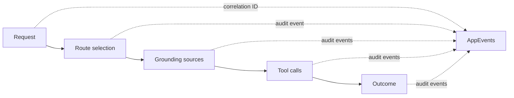

# Audit Contract v1

Use this page to understand the unreleased GPT-RAG orchestrator audit event
contract, estimate its telemetry volume, and prepare queries for a future
runtime release.

!!! warning "Implemented in a pull request, but not released"
    This page is reconciled with orchestrator pull request
    [#277](https://github.com/Azure/gpt-rag-orchestrator/pull/277) at commit
    `844fe14757d07a2cdc828189105fbce831f3c11d`. That code is not in a released
    orchestrator version. Audit events also remain disabled by default and need
    GPT-RAG umbrella deployment integration before they are available through a
    normal GPT-RAG deployment. Do not configure the flags below until the
    runtime release and integration are complete.

The contract provides best-effort operational evidence. It is not a transaction
log, an immutable or nonrepudiable record, independent attestation, or proof
that a component behaved correctly. It does not establish legal or regulatory
compliance.

## What the implementation covers

The orchestrator implementation adds request, route, grounding source, tool,
outcome, and audit-emission events over the existing OpenTelemetry and Azure
Monitor connection.



The shared schema reserves ingestion event names, but orchestrator pull request
#277 does not implement an ingestion producer.

The exact reviewed artifacts are:

- [logical v1 schema](https://github.com/Azure/gpt-rag-orchestrator/blob/844fe14757d07a2cdc828189105fbce831f3c11d/contracts/audit-event-v1.schema.json)
- [Application Insights wire schema](https://github.com/Azure/gpt-rag-orchestrator/blob/844fe14757d07a2cdc828189105fbce831f3c11d/contracts/audit-event-v1.application-insights.schema.json)
- [contract SHA-256 digests](https://github.com/Azure/gpt-rag-orchestrator/blob/844fe14757d07a2cdc828189105fbce831f3c11d/contracts/audit-event-v1.sha256)
- [golden logical event](https://github.com/Azure/gpt-rag-orchestrator/blob/844fe14757d07a2cdc828189105fbce831f3c11d/tests/golden/audit_event_v1.json)
- [golden logical root event](https://github.com/Azure/gpt-rag-orchestrator/blob/844fe14757d07a2cdc828189105fbce831f3c11d/tests/golden/audit_event_v1_root.json)
- [runtime configuration guidance](https://github.com/Azure/gpt-rag-orchestrator/blob/844fe14757d07a2cdc828189105fbce831f3c11d/README.md#audit-event-configuration)

The pinned SHA-256 digests of the two schema files, recorded in
`contracts/audit-event-v1.sha256`, are:

| Artifact | SHA-256 |
| --- | --- |
| `audit-event-v1.schema.json` | `825db8ef40a81e2c19e5d80d37c565b6b47fc9a6540e9881d35cc12b8fde5aab` |
| `audit-event-v1.application-insights.schema.json` | `066c8f5408610ab839d5121d06ca5bc59e8797e551d5c47c875c5ba52f7e0588` |

Recompute these digests against the pinned commit before relying on this page
if the contract is revised.

## Application Insights wire format

The producer writes through the `gptrag.audit` logger with the fixed log body
`GPT-RAG audit event`. It sets `microsoft.custom_event.name` to
`gptrag.audit.<event_type>`, which the pinned Azure Monitor exporter converts to
an `AppEvents` row.

| Logical value | Workspace-based Application Insights value |
| --- | --- |
| Custom event name | `AppEvents.Name` |
| Export time | `AppEvents.TimeGenerated` |
| Current OpenTelemetry trace ID | `AppEvents.OperationId` |
| Current OpenTelemetry span ID | `AppEvents.ParentId` |
| Event fields | Unprefixed keys in `AppEvents.Properties` |
| Service name | `AppEvents.AppRoleName` and `Properties["service_name"]` |
| Runtime version | `AppEvents.AppVersion` and `Properties["service_version"]` |

The event property names are not prefixed with `gptrag.audit.`. For example,
use `Properties["correlation_id"]`, not
`Properties["gptrag.audit.correlation_id"]`.
The exporter can add properties such as source-code attributes or
`logger_name`; v1 readers must ignore unknown optional properties.

Azure Monitor stringifies every custom event property. Logical numbers,
booleans, and arrays therefore arrive as strings. Parse scalar values in KQL
before comparing or calculating with them. The wire contract does not guarantee
JSON encoding for arrays. Treat `omitted_fields` and `truncated_fields` as
display values on the wire unless a future contract defines a portable array
encoding.

The logical schema allows a root `parent_event_id` to be `null`. Azure Monitor
drops null custom properties, so the wire adapter encodes that logical null as
this reserved sentinel before export:

```text
evt_00000000000000000000000000000000
```

A consumer must decode `Properties["parent_event_id"] ==
"evt_00000000000000000000000000000000"` back to logical `null` and must never
treat it as an identifier or join it as an event. The all-zero value is also
explicitly rejected as an `event_id` and as any non-root `parent_event_id`, in
both the logical and wire schemas: it can only ever mean "no logical parent."

When an event has a valid active span:

- `Properties["trace_id"]` equals `OperationId`;
- `Properties["span_id"]` equals `ParentId`; and
- `Properties["parent_event_id"]` expresses the logical audit relationship,
  not the OpenTelemetry span relationship.

If no valid span is active, the logical `trace_id` and `span_id` and the
exported `OperationId` and `ParentId` use all-zero hexadecimal values. Exclude
the all-zero trace ID from joins.

The runtime reads `service_version` from the repository root `VERSION` file and
uses the same value for the OpenTelemetry `service.version` resource attribute.
The reviewed branch reports `3.7.0`, but the audit feature itself is unreleased.
The eventual release will report the version packaged in its own `VERSION`
file.

## Event names

The orchestrator event name is the `gptrag.audit.` prefix followed by one of
these exact logical event types:

| `event_type` | `AppEvents.Name` | Current meaning |
| --- | --- | --- |
| `request.started` | `gptrag.audit.request.started` | Streaming request processing started. |
| `request.completed` | `gptrag.audit.request.completed` | Streaming request processing completed. |
| `request.failed` | `gptrag.audit.request.failed` | Request processing raised an exception. |
| `request.cancelled` | `gptrag.audit.request.cancelled` | The stream was cancelled or disconnected. |
| `route.selected` | `gptrag.audit.route.selected` | An agent strategy or single-agent route was selected. |
| `grounding.source.selected` | `gptrag.audit.grounding.source.selected` | A grounding source or result was selected. |
| `grounding.source.rejected` | `gptrag.audit.grounding.source.rejected` | A source was rejected, empty, or not selected. |
| `tool.invocation.started` | `gptrag.audit.tool.invocation.started` | A proxied tool invocation started, or a Foundry IQ activity was reconstructed as started. |
| `tool.invocation.completed` | `gptrag.audit.tool.invocation.completed` | A tool invocation completed. |
| `tool.invocation.failed` | `gptrag.audit.tool.invocation.failed` | A tool invocation failed or timed out. |
| `tool.invocation.cancelled` | `gptrag.audit.tool.invocation.cancelled` | A proxied tool invocation was cancelled. |
| `outcome.produced` | `gptrag.audit.outcome.produced` | A streamed response was produced. |
| `outcome.rejected` | `gptrag.audit.outcome.rejected` | A streamed response was rejected after a failure. |
| `audit.emission.failed` | `gptrag.audit.audit.emission.failed` | Sanitization, serialization, size, attribute, or synchronous logging failed. |

The shared schema also reserves these names for a future ingestion producer:

- `ingestion.run.started`
- `ingestion.run.completed`
- `ingestion.run.failed`
- `ingestion.run.cancelled`
- `ingestion.document.indexed`
- `ingestion.document.rejected`
- `ingestion.document.deleted`

## Required logical fields

Every logical event requires these fields. Readers of major version 1 must
ignore unknown optional fields.

| Field | Logical type and constraint |
| --- | --- |
| `schema_version` | Integer constant `1`. |
| `event_id` | `evt_` plus 32 lowercase hexadecimal characters. The all-zero value (`evt_00000000000000000000000000000000`) is reserved and rejected; it can never identify a real event. |
| `event_type` | One of the event types in the shared schema. |
| `event_time_utc` | UTC timestamp with exactly six fractional digits and a `Z` suffix. |
| `correlation_id` | `req_` plus 32 lowercase hexadecimal characters. |
| `trace_id` | 32 lowercase hexadecimal characters. |
| `span_id` | 16 lowercase hexadecimal characters. |
| `parent_event_id` | Event ID or `null` in the logical schema. `null` marks a root event. The reserved all-zero value is rejected as a non-root parent; the wire uses the all-zero sentinel only to represent `null`. |
| `service_name` | String, maximum 512 characters. Current value: `gpt-rag-orchestrator`. |
| `service_version` | String, maximum 512 characters, read from `VERSION`. |
| `environment` | String, maximum 64 characters. Uses `ENVIRONMENT_NAME`, then `AZURE_ENV_NAME`, then `unknown`. |
| `operation` | String, maximum 512 characters. |
| `status` | Exact status enum below. |
| `reason_code` | Exact reason enum below. |
| `capture_mode` | `metadata_only` or `sensitive_allowlist`. |
| `redaction_applied` | Boolean. This indicates that the sanitizer changed a value, not that arbitrary content is safe. |
| `omitted_fields` | Array of at most 32 field paths, each at most 512 characters. |
| `truncated_fields` | Array of at most 32 field paths, each at most 512 characters. |

Terminal request and tool events also require `started_at_utc` and
`duration_ms`. This applies to completed, failed, and cancelled request or tool
events, including the reserved ingestion run terminal events.

## Optional logical fields

| Fields | Logical type and constraint |
| --- | --- |
| `started_at_utc` | UTC timestamp in the same format as `event_time_utc`. |
| `duration_ms` | Number from 0 through 86,400,000 (24 hours), rounded to three decimal places. The producer rejects out-of-range or non-finite values rather than clamping them. |
| `timing_source` | `observed` or `reconstructed`. Present only on Foundry IQ MCP tool events today, always as `reconstructed`; absent elsewhere, which means the timestamp was observed directly. `reconstructed` values are approximate, described further in [MCP and Foundry IQ evidence](#mcp-and-foundry-iq-evidence). |
| `decision_type`, `decision_value` | String, maximum 512 characters. |
| `source_id` | String or `null`, maximum 512 characters. |
| `source_type` | String, maximum 512 characters. |
| `source_rank` | Non-negative integer. |
| `tool_name` | String, maximum 512 characters. |
| `tool_id`, `tool_invocation_id` | String or `null`, maximum 512 characters. |
| `outcome_type`, `failure_type` | String, maximum 512 characters. |
| `input_count`, `output_count`, `source_count` | Non-negative integer. Current request counts are character and emitted-source-event counts, not token counts. |
| `partial_output` | Boolean. |
| `audit_events_omitted`, `source_events_omitted`, `tool_invocations_omitted` | Non-negative integer. Present only on request-terminal events (`request.completed`, `request.failed`, `request.cancelled`), reporting how many detail, grounding-source, and complete tool-invocation-pair events this request could not emit because a fixed per-request budget was reached. See [Event and tool budgets](#event-and-tool-budgets). |
| `http_status_code` | Integer from 100 through 599. Reserved by the contract but not populated by the reviewed request lifecycle. |
| `transport` | String, maximum 512 characters. |
| `actor_id`, `conversation_id`, `question_id`, `thread_id` | String or `null`, maximum 512 characters. `thread_id` is reserved but not populated by the reviewed implementation. |
| `hmac_key_id` | String, maximum 512 characters. Present on normal emitted events, but not on the minimal `audit.emission.failed` fallback. |
| `prompt`, `response`, `source_excerpt`, `tool_arguments`, `tool_result` | Sensitive allowlist string, maximum 2,048 characters after conversion and sanitization. |

The logical JSON Schema allows additional properties for forward-compatible
readers. The current producer is stricter: it omits fields outside its required
and optional allowlists and records their names in `omitted_fields`.

## Status and reason enums

The exact `status` values are:

```text
started
completed
failed
cancelled
selected
rejected
produced
```

The exact `reason_code` values are:

```text
none
request_received
request_completed
request_failed
request_cancelled
client_disconnected
partial_output
strategy_configured
direct_model_selected
agent_selected
source_selected
source_rejected
source_empty
source_limit_reached
tool_invoked
tool_completed
tool_failed
tool_cancelled
timeout
outcome_produced
outcome_rejected
validation_failed
redaction_failure
serialization_failure
event_too_large
attribute_limit_exceeded
export_failure
unknown
```

Not every reserved reason is emitted by the current orchestrator paths. For
example, reaching the source event limit stops further source events silently;
it does not currently emit `source_limit_reached`.

## Bounds and sanitizer behavior

| Bound | Current value |
| --- | --- |
| Serialized logical event | 16 KiB UTF-8 |
| Producer attributes | 60, leaving room for the custom-event marker and three OpenTelemetry source-code attributes |
| Logical or wire properties | 64 maximum |
| Metadata string | 512 characters |
| Environment | 64 characters |
| Sensitive string | 2,048 characters |
| Recursive depth | 6 |
| Mapping entries inspected | 65 (64 considered plus one truncation lookahead) |
| Sequence items inspected | 33 (32 emitted plus one truncation lookahead) |
| Total nested values inspected per event | 256 |
| Recorded omitted or truncated field paths | 32 per list |
| Source events per request | Configurable from 1 through 25, default 25 |

Metadata and approved sensitive strings that exceed their character limits are
truncated and named in `truncated_fields`. If the whole event still exceeds 16
KiB, optional fields are removed until it fits. If only required fields remain
and the event is still too large, the payload is discarded and an
`audit.emission.failed` event is attempted.

The recursive sanitizer:

- strips control characters other than tab, line feed, and carriage return,
  then truncates and records oversize strings and keys;
- redacts prohibited key classes and configured additional nested keys;
- scans for bearer and basic credentials, cookies, JWT-like values, connection
  strings, SAS signatures, private keys, embedded URL credentials, and similar
  secret forms;
- inspects mappings and sequences through a bounded lookahead so it can detect
  and record truncation without materializing an entire oversize collection;
- handles cycles, unsupported objects, malformed iterables, collection bounds,
  depth bounds, and the total inspected-node cap by omitting or truncating
  fields instead of raising; and
- scans the final serialized event before logging it.

This filtering is defense in depth, not a data-loss-prevention boundary.

## Event and tool budgets

Independent of the per-event serialization bounds above, each request has a
fixed, non-configurable ceiling on how many audit events it can produce:

| Budget | Limit |
| --- | --- |
| Audit events per request | 64 total, including one reserved request-terminal event and at most one reserved `audit.emission.failed` event |
| Tool invocation pairs per request | 16 complete `started` and terminal event pairs |
| Grounding-source events per request | 25 maximum, the same limit as `AUDIT_SOURCE_EVENT_LIMIT` above |

Tool invocation pairs are reserved atomically: the producer only emits a
`tool.invocation.started` event once request capacity also guarantees room for
its terminal event, so a start is never recorded without a matching outcome.
When a budget is exhausted, the orchestrator drops further detail, source, or
tool events for that request rather than emitting a partial or malformed one,
while the reserved request-terminal event still fires. That terminal event
(`request.completed`, `request.failed`, or `request.cancelled`) reports how
much was dropped in `audit_events_omitted`, `source_events_omitted`, and
`tool_invocations_omitted`, so a consumer can tell that evidence is incomplete
for that request instead of assuming silence means nothing else happened.

## Configuration

These values are loaded at startup from Azure App Configuration. The HMAC key
must be a Key Vault reference and must not be exposed through the admin
dashboard.

| Key | Default | Exact behavior |
| --- | --- | --- |
| `AUDIT_EVENTS_ENABLED` | `false` | Enables the emitter. When `false`, inactive audit settings are ignored and no HMAC key is required. |
| `AUDIT_HMAC_KEY` | Unset | Required when auditing is enabled. Accepts Base64, Base64URL, or hexadecimal encoding of exactly 32 random bytes. Invalid or missing values fail startup. |
| `AUDIT_HMAC_KEY_ID` | `v1` | Non-secret key version stored on normal events. Required and limited to 512 characters when enabled. |
| `AUDIT_SENSITIVE_CONTENT_ENABLED` | `false` | Allows fields in the sensitive field allowlist to be considered. |
| `AUDIT_SENSITIVE_CONTENT_FIELDS` | Empty | Comma-separated subset of `prompt`, `response`, `source_excerpt`, `tool_arguments`, and `tool_result`. Unknown values fail startup when auditing is enabled. |
| `AUDIT_ACTOR_PSEUDONYM_ENABLED` | `false` | Adds an HMAC pseudonym for the authenticated actor. |
| `AUDIT_SOURCE_EVENT_LIMIT` | `25` | Accepts an integer from 1 through 25. |
| `AUDIT_ADDITIONAL_REDACTED_KEYS` | Empty | Comma-separated nested key fragments that the sanitizer always redacts. |

GPT-RAG's next minor umbrella release pins orchestrator `v3.8.0` and ingestion
`v2.5.0`. Post-provisioning creates `AUDIT-HMAC-KEY` in Key Vault from 256
cryptographically random bits when it does not already exist, then registers
only an `AUDIT_HMAC_KEY` Key Vault reference in App Configuration. Ordinary
reprovisioning reuses the existing secret. The key value is not an admin
setting, deployment output, or log value.

Ingestion provenance uses a separate, non-secret configuration surface:

| Key | Default | Exact behavior |
| --- | --- | --- |
| `INGESTION_PROVENANCE_ENABLED` | `false` | Adds provenance and governance values to supported ingestion document events and indexed documents when enabled. |
| `INGESTION_REQUIRE_GOVERNANCE_METADATA` | `false` | Requires explicit classification and right-to-use values when provenance is enabled. Setting this to `true` while provenance is disabled is invalid. |
| `INGESTION_DEFAULT_CLASSIFICATION` | `unclassified` | Fallback classification when provenance is enabled and strict mode is off. |
| `INGESTION_DEFAULT_RIGHT_TO_USE` | `not_asserted` | Fallback right-to-use value when provenance is enabled and strict mode is off. |

These four ingestion values contain no credentials and are safe to display and
edit as normal configuration. Ingestion does not consume `AUDIT_HMAC_KEY`.
Post-provisioning seeds only missing values and preserves operator-managed
settings unless an AZD environment value explicitly overrides them. A deployment
that explicitly disables Key Vault receives the disabled defaults but cannot
enable audit events until a valid HMAC Key Vault reference is supplied.

If `AZURE_MONITOR_DISABLE_LOGGING=true` while auditing is enabled, the
orchestrator enables Azure Monitor log export only for the `gptrag.audit`
namespace. If normal log export is enabled, audit events use that existing
export path. A valid `APPLICATIONINSIGHTS_CONNECTION_STRING` is still required.
If it is unavailable, monitoring export is disabled rather than making the
orchestrator fail.

To roll back, set `AUDIT_EVENTS_ENABLED=false` and restart the orchestrator.
This stops new events. It does not delete previously exported telemetry.

## Search provenance schema and migration

The RAG Azure AI Search index has optional, retrievable fields for
`provenance_id`, `source_uri_id`, `source_version_id`,
`content_checksum_sha256`, `ingested_at`, `ingest_run_id`,
`data_classification`, `right_to_use`, `retention_class`, and `delete_after`.
Identifiers and checksums are filterable. Guaranteed UTC `ingested_at` values
use filterable, sortable `Edm.DateTimeOffset`. `delete_after` remains a
filterable, sortable string because ingestion v2.5.0 passes through operator
policy values without imposing a date format. Classification, right-to-use, and
retention class are also facetable.

Post-provisioning updates an existing index in place by merging only missing
fields into its current definition. It preserves existing documents and
operator-added fields. If a same-name field has an incompatible type or
attributes, setup fails before making the update. GPT-RAG does not fall back to
deleting and recreating the index.

Existing documents can leave the new fields empty until they are reingested by
ingestion `v2.5.0`. Older component versions ignore the additive fields, so
rollback does not require removing them.

`delete_after` is policy intent only. No GPT-RAG job reads this field to
schedule or perform a purge. The operator must implement retention enforcement
and verify the deletion outcome.

## HMAC identifiers and rotation

Auditing requires a 256-bit HMAC key even when actor pseudonyms are disabled.
The producer uses HMAC-SHA256 over:

```text
<identifier-kind>:<raw-value>
```

It exports `hmac_` followed by the first 32 lowercase hexadecimal characters of
the digest. Current code pseudonymizes conversation IDs, question IDs, source
references, tool IDs, tool invocation IDs, and optional actor IDs. Raw values
are not placed in those audit properties.

Create and restrict the key in Key Vault. To rotate it, update
`AUDIT_HMAC_KEY` and `AUDIT_HMAC_KEY_ID` together, then restart. Identical raw
values produce different pseudonyms after rotation, so correlation does not
continue automatically across key versions.

## Sensitive-content capture

The default `capture_mode` is `metadata_only`. It changes to
`sensitive_allowlist` only when both the feature flag is true and the allowlist
is non-empty. A field not in the allowlist is omitted and named in
`omitted_fields`.

The reviewed implementation places approved sensitive fields in the same
`AppEvents.Properties` collection as the rest of the audit event. It does not
route audit content to `AppGenAIContent`. Protect access to `AppEvents`,
retention, exports, workbooks, alerts, and query results accordingly. Other
OpenTelemetry generative AI instrumentation may use `AppGenAIContent`
independently.

Even when allowlisted, content is bounded and scanned for prohibited values.
Do not enable sensitive capture as a troubleshooting shortcut. The scanner
cannot guarantee that every secret or sensitive business value will be found.

## MCP and Foundry IQ evidence

Direct MCP calls from the MCP strategy are wrapped with public Microsoft Agent
Framework `AIFunction` proxies. The same invocation seam covers SSE and
streamable HTTP. It emits a started event before delegation and one completed,
failed, timed-out, or cancelled terminal event. Tool arguments and results are
only present when their sensitive fields are explicitly allowlisted.

Both direct MCP transports propagate W3C Trace Context and remove OpenTelemetry
baggage. This supports trace correlation without forwarding ambient identity
or other baggage to the MCP server.

Foundry IQ MCP activity has a different evidence quality. The Azure AI Search
response exposes completed activity but no pre-invocation callback, and
reconstruction only runs when auditing is enabled and a request audit context
is present; it never touches retrieval when auditing is disabled. For each
returned activity, the orchestrator validates that `elapsedMs` is a finite,
non-negative number of at most 86,400,000 milliseconds (24 hours). If the value
is invalid, the orchestrator does not clamp it: it omits that tool-invocation
pair, records it in `tool_invocations_omitted` on the request-terminal event,
and attempts a bounded, payload-free `audit.emission.failed` event, all without
failing the underlying retrieval call. If the value is valid, the orchestrator
reserves a started and terminal event pair atomically, the same way it reserves
direct tool invocation pairs, and derives `started_at_utc` by subtracting
`elapsedMs` from the observation time; `elapsedMs` becomes `duration_ms`. The
tool name is the bounded `foundry_iq_mcp_tool`, the started event records
transport `foundry_iq`, and both the started and terminal events set
`timing_source=reconstructed`.

This reconstructed pair is not proof that a start event was observed when the
remote call began; `timing_source=reconstructed` marks it as approximate. If
the response or its activity array is missing, those tool events are also
missing.

Grounding source normalization covers the specific integrations implemented by
GPT-RAG:

```text
azure_ai_search
azure_ai_search_multimodal
foundry_iq
foundry_iq_mcp
web_grounding
work_iq
fabric_iq
fabric_data_agent
sharepoint_remote
sharepoint_indexed
onelake
nl2sql_datasource
unknown
```

This list describes specific Work IQ, Fabric IQ, Foundry IQ, and web grounding
integrations. It does not claim complete support for Microsoft IQ or visibility
into telemetry produced inside those upstream services.

## Failure semantics and evidence gaps

Enabling, disabling, or exhausting a budget in the audit instrumentation never
changes response bodies, SSE streams, retrieval results, cache behavior,
application logs, traces, or metrics. For example, a grounding source with
empty content is still appended to the result list whether or not its
`grounding.source.rejected` audit event was emitted; audit evidence describes
what the orchestrator did, it does not gate what the orchestrator does.

Audit emission is deliberately best effort:

- sanitization or serialization failure discards the original payload and
  attempts a payload-free, constant-safe `audit.emission.failed` event, one
  with a fixed `service_name`, `service_version`, `environment`, and
  `capture_mode` instead of values derived from the event that failed, so the
  fallback event itself cannot fail to serialize or redact;
- oversize and attribute-limit failures use the same minimal event;
- at most one `audit.emission.failed` event is attempted per request, guarded
  against re-entrant failures;
- a synchronous logging failure is caught and mapped to `export_failure`;
- if the minimal event also cannot be logged, the runtime attempts a fixed
  warning and continues the user operation; and
- the Azure Monitor batch exporter has no application callback for later
  delivery failure, so an asynchronous export failure cannot produce a reliable
  failure event.

The implementation does not add a separate health event, metric, rate limiter,
or delivery acknowledgment. Operators must use Azure Monitor ingestion health,
application logs, and expected-volume checks to identify gaps.

Additional known gaps include:

- sampling, filtering, throttling, queue loss, process termination, and network
  failure;
- request dependency or body-validation failures before the endpoint handler,
  which may not receive `X-Correlation-ID` or lifecycle audit events;
- feedback requests, which receive a server correlation header but do not enter
  the streaming request audit lifecycle;
- upstream actions that occur outside instrumented seams;
- detail, source, or tool events dropped after a request reaches the fixed
  event or tool budgets described in
  [Event and tool budgets](#event-and-tool-budgets), reported through
  `audit_events_omitted`, `source_events_omitted`, and
  `tool_invocations_omitted` on the request-terminal event; and
- the reconstructed Foundry IQ MCP timing described above.

The server ignores an inbound `X-Correlation-ID` and generates a new
`req_<32 lowercase hex>` value. Successful orchestrator and feedback responses
return it in `X-Correlation-ID`. The identifier is also saved with a question in
Cosmos when a question is persisted. It is not authentication, authorization,
idempotency, proof of delivery, or an immutability mechanism.

## Event volume and benchmark

A normal successful streaming request emits four lifecycle events before source
or tool activity:

1. `request.started`
2. `route.selected`
3. `outcome.produced`
4. `request.completed`

A failed stream normally emits four events, replacing the last two with
`outcome.rejected` and `request.failed`. A cancelled stream normally emits
three: request start, route selection, and request cancellation. The
single-agent strategy can add another `route.selected` event for its internal
direct-model or agent-service choice.

Each selected or rejected grounding source adds one event, up to
`AUDIT_SOURCE_EVENT_LIMIT`. Each proxied direct MCP invocation adds a started
and terminal pair, and each returned Foundry IQ MCP activity also adds a
reconstructed pair, up to the fixed 16-pair tool budget described in
[Event and tool budgets](#event-and-tool-budgets). The request also has an
overall 64-event ceiling that includes its reserved terminal event. A request
with unusually heavy source or tool activity can reach these budgets; check
`audit_events_omitted`, `source_events_omitted`, and `tool_invocations_omitted`
on the request-terminal event rather than assuming the visible event count is
complete.

The pull request validation ran a non-gating metadata-only microbenchmark with a
null logging handler for 10,000 events:

| Measurement | Result |
| --- | --- |
| Median emitter time | 886.85 microseconds |
| p95 emitter time | 1,706.20 microseconds |
| Peak traced memory | 334.1 KiB |

This isolates event construction and sanitization. It does not include Azure
Monitor export, network latency, production concurrency, or end-to-end request
p95. Measure representative traffic and ingestion cost before production
enablement.

## KQL: reconstruct audit events

Replace the correlation ID with the value returned in `X-Correlation-ID`.
This query uses the exact unprefixed wire properties and converts scalar strings
to useful KQL types. `ParentEventId` decodes the Application Insights wire
sentinel back to logical `null`: an empty `ParentEventId` means the event is a
logical root, not that decoding failed. `TimingSource`,
`AuditEventsOmitted`, `SourceEventsOmitted`, and `ToolInvocationsOmitted` are
optional fields; expect empty values on events that do not set them, for
example on every event except reconstructed Foundry IQ MCP tool events and
request-terminal events respectively.

```kusto
let lookback = 30d;
let audit_correlation_id = "req_0123456789abcdef0123456789abcdef";
AppEvents
| where TimeGenerated >= ago(lookback)
| where Name startswith "gptrag.audit."
| extend AuditCorrelationId = tostring(Properties["correlation_id"])
| where AuditCorrelationId == audit_correlation_id
| extend
    AuditEventTime = todatetime(Properties["event_time_utc"]),
    AuditEventId = tostring(Properties["event_id"]),
    AuditEventType = tostring(Properties["event_type"]),
    SchemaVersion = toint(Properties["schema_version"]),
    AuditStatus = tostring(Properties["status"]),
    ReasonCode = tostring(Properties["reason_code"]),
    ServiceName = tostring(Properties["service_name"]),
    ServiceVersion = tostring(Properties["service_version"]),
    AuditOperation = tostring(Properties["operation"]),
    DurationMs = todouble(Properties["duration_ms"]),
    TimingSource = tostring(Properties["timing_source"]),
    SourceRank = toint(Properties["source_rank"]),
    OutputCount = tolong(Properties["output_count"]),
    PartialOutput = tobool(Properties["partial_output"]),
    RedactionApplied = tobool(Properties["redaction_applied"]),
    AuditEventsOmitted = tolong(Properties["audit_events_omitted"]),
    SourceEventsOmitted = tolong(Properties["source_events_omitted"]),
    ToolInvocationsOmitted = tolong(Properties["tool_invocations_omitted"])
| extend
    // Decode the Application Insights wire sentinel back to a logical null.
    // Never join or treat this sentinel as an event.
    ParentEventId = iff(
        tostring(Properties["parent_event_id"]) == "evt_00000000000000000000000000000000",
        "",
        tostring(Properties["parent_event_id"])
    )
| project
    TimeGenerated,
    AuditEventTime,
    Name,
    AuditEventType,
    AuditCorrelationId,
    AuditEventId,
    ParentEventId,
    AuditStatus,
    ReasonCode,
    ServiceName,
    ServiceVersion,
    AuditOperation,
    DurationMs,
    TimingSource,
    SourceRank,
    OutputCount,
    PartialOutput,
    RedactionApplied,
    AuditEventsOmitted,
    SourceEventsOmitted,
    ToolInvocationsOmitted,
    OperationId,
    ParentId,
    AppRoleName,
    AppVersion,
    Properties
| order by AuditEventTime asc, TimeGenerated asc
```

## KQL: add requests and dependencies

This query builds one timeline from the audit events and matching
`AppRequests` and `AppDependencies` rows. It uses the official workspace table
columns, including `DurationMs`, `ResultCode`, `DependencyType`, `Target`, and
`Data`.

```kusto
let lookback = 30d;
let audit_correlation_id = "req_0123456789abcdef0123456789abcdef";
let audit_events = materialize(
    AppEvents
    | where TimeGenerated >= ago(lookback)
    | where Name startswith "gptrag.audit."
    | where tostring(Properties["correlation_id"]) == audit_correlation_id
);
let operation_ids = materialize(
    audit_events
    | where isnotempty(OperationId)
    | where OperationId != "00000000000000000000000000000000"
    | distinct OperationId
);
union
(
    audit_events
    | project
        TimeGenerated,
        TelemetryType = "audit",
        Name,
        OperationId,
        ParentId,
        Id = tostring(Properties["event_id"]),
        Success = case(
            tostring(Properties["status"]) in ("failed", "cancelled", "rejected"), false,
            tostring(Properties["status"]) in ("completed", "selected", "produced"), true,
            bool(null)
        ),
        ResultCode = tostring(Properties["reason_code"]),
        DurationMs = todouble(Properties["duration_ms"]),
        DependencyType = "",
        Target = "",
        Data = "",
        Properties
),
(
    AppRequests
    | where TimeGenerated >= ago(lookback)
    | where OperationId in (operation_ids)
    | project
        TimeGenerated,
        TelemetryType = "request",
        Name,
        OperationId,
        ParentId,
        Id,
        Success,
        ResultCode,
        DurationMs,
        DependencyType = "",
        Target = "",
        Data = Url,
        Properties
),
(
    AppDependencies
    | where TimeGenerated >= ago(lookback)
    | where OperationId in (operation_ids)
    | project
        TimeGenerated,
        TelemetryType = "dependency",
        Name,
        OperationId,
        ParentId,
        Id,
        Success,
        ResultCode,
        DurationMs,
        DependencyType,
        Target,
        Data,
        Properties
)
| order by TimeGenerated asc
```

`AppRequests.Url`, `AppDependencies.Data`, and arbitrary `Properties` can
contain sensitive details. Restrict access to query results and exported copies.

The queries are reconciled with the exporter wire conversion test in pull
request #277 and the official Azure Monitor table schemas. They cannot be run
against released audit telemetry until the runtime is released and enabled.

## What evidence can support

When combined with adopter-owned identity, access, retention, review, and
incident processes, this evidence can help with:

- security and architecture reviews;
- incident reconstruction;
- privacy and risk assessments;
- adopter-led
  [NIST AI Risk Management Framework](https://www.nist.gov/itl/ai-risk-management-framework)
  activities; and
- adopter-led assessments involving the
  [EU AI Act](https://eur-lex.europa.eu/eli/reg/2024/1689/oj).

The evidence is an input to those activities, not automatic compliance,
certification, or a legal conclusion.

## Official references

- [Azure Monitor OpenTelemetry custom telemetry](https://learn.microsoft.com/azure/azure-monitor/app/opentelemetry-add-modify#collect-custom-telemetry)
- [Application Insights telemetry data model](https://learn.microsoft.com/azure/azure-monitor/app/data-model-complete)
- [`AppEvents` table](https://learn.microsoft.com/azure/azure-monitor/reference/tables/appevents)
- [`AppRequests` table](https://learn.microsoft.com/azure/azure-monitor/reference/tables/apprequests)
- [`AppDependencies` table](https://learn.microsoft.com/azure/azure-monitor/reference/tables/appdependencies)
- [W3C Trace Context](https://www.w3.org/TR/trace-context/)
