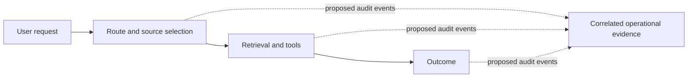

# Governance and responsible operation

Use this guide to decide what data GPT-RAG may process, who owns each
control, and what evidence an operator should preserve for security reviews
and incident investigations.

!!! warning "Audit trail feature under development"
    The governance practices on this page can be applied today. The correlated
    audit events described in the [Audit Contract v1](governance_audit_contract_v1.md)
    are a proposal for a coming release and are not emitted by the current
    released runtime. Event names, fields, limits, configuration keys, and KQL
    must be reconciled with the runtime schema pull request before this warning
    is removed.

## Why this matters

During a review or incident, an operator should be able to answer practical
questions without searching unrelated logs:

- What route or orchestration strategy handled the request?
- Which grounding sources and tools were selected?
- Did each tool call complete, fail, time out, or get cancelled?
- Was an outcome produced or rejected?
- What data classes could have entered telemetry?
- Who configured access, retention, deletion, and export?

GPT-RAG already uses logs, traces, metrics, and source references. Those signals
are useful, but current releases do not provide the versioned, end-to-end audit
contract described in issue
[#571](https://github.com/Azure/GPT-RAG/issues/571). The coming contract is
intended to correlate operational metadata while leaving prompts, responses,
source excerpts, tool arguments, and tool results out of the default event
stream.

## What GPT-RAG can and cannot establish

GPT-RAG cannot determine whether a deployment or use case is legally compliant.
It does not certify a system, enforce an external governance framework, provide
a complete legal crosswalk, or replace an adopter's legal, privacy, security,
risk, records-management, or human-oversight processes.

Clear responsibilities, documented data practices, correlated audit events,
configurable retention, and reviewable technical evidence can help adopters
perform their own:

- security and architecture reviews;
- incident investigations;
- privacy, risk, and audit assessments;
- [NIST AI Risk Management Framework](https://www.nist.gov/itl/ai-risk-management-framework)
  activities; and
- assessments involving the
  [EU AI Act](https://eur-lex.europa.eu/eli/reg/2024/1689/oj).

These are inputs to an adopter-led assessment, not proof of conformance or a
legal conclusion. Applicability and evidence requirements depend on the
deployment, data, users, jurisdiction, and intended use.

## Intended use and limitations

The governance baseline is intended for teams that deploy GPT-RAG as a
retrieval-augmented assistant and need a repeatable way to manage enterprise
data and operational evidence.

Do not assume that:

- a citation proves that an answer is correct or complete;
- a recorded event proves that the producer behaved correctly;
- missing telemetry proves that an action did not occur;
- an opaque identifier is anonymous in every environment;
- permission trimming replaces source-system authorization review;
- a preview grounding capability is production-ready because it has audit
  events;
- retention in Azure Monitor satisfies a records-management obligation; or
- technical evidence establishes legal compliance.

The proposed audit trail is best-effort telemetry. Sampling, exporter failures,
process termination, asynchronous boundaries, disabled instrumentation, and
upstream systems can create evidence gaps. Events are asserted by the producing
GPT-RAG process. They are not independently attested, cryptographically signed,
or a tamper-evident ledger.

## Shared responsibility

One organization may perform more than one role. Assign each responsibility
explicitly before production use.

| Role | Responsibilities |
| --- | --- |
| GPT-RAG maintainers | Publish accurate behavior and limitations; provide privacy-conscious defaults; version the audit contract; test schema compatibility, redaction, and bounds; preserve compatibility or publish migration guidance. |
| Deployer or platform team | Select the deployment topology; configure identities, networking, Key Vault, Azure Monitor, retention, export, and backup; apply least-privilege RBAC; keep secrets out of configuration and telemetry; verify regional and service boundaries. |
| Runtime operator | Monitor health, cost, sampling, and evidence gaps; review access regularly; investigate incidents; validate deletion and export procedures; canary changes; roll back audit emission if it harms reliability. |
| Adopter, business owner, or data owner | Define the intended and prohibited uses; assert the right to use each data source; classify data; set minimization and retention policy; determine legal and regulatory obligations; define human oversight, risk acceptance, and user communication. |

## Govern ingested and connected data

Apply these controls to indexed content and to sources queried at request time.
That includes Blob Storage, Azure AI Search, SharePoint, OneLake, Work IQ,
Fabric ontology, Fabric Data Agent, web grounding, and remote MCP servers.

### Before connecting a source

1. **Record provenance.** Identify the system of record, data owner, ingestion
   or query path, refresh cadence, and applicable permission model.
2. **Obtain a right-to-use assertion.** The operator or data owner should record
   that the organization is authorized to process the source for the intended
   users and purpose. GPT-RAG cannot make this determination.
3. **Classify the data.** Apply the organization's classification for personal,
   confidential, regulated, export-controlled, or other sensitive content.
4. **Minimize scope.** Include only the sites, containers, indexes, tables,
   fields, date ranges, and tools required by the use case.
5. **Define retention and deletion.** Document how source data, indexes,
   conversation history, caches, and backups are removed. Test the process.
6. **Review access.** Use source-system permissions, managed identities,
   delegated access, and GPT-RAG retrieval controls as applicable. Test with
   representative allowed and denied users.
7. **Review data movement.** Confirm region, service, public internet, and
   cross-boundary behavior for every enabled source.

### Sensitive content

Treat retrieved content as sensitive whenever its source classification says
so. Grounding can copy excerpts into prompts, responses, conversation history,
dependency telemetry, or troubleshooting logs. Permission trimming reduces
unauthorized retrieval, but it does not replace classification, minimization,
access review, or downstream handling controls.

For the concrete capabilities GPT-RAG integrates, see the
[Grounding sources overview](howto_grounding_overview.md). GPT-RAG integrates
specific Work IQ, Fabric ontology, Fabric Data Agent, Foundry IQ, and web
grounding capabilities. It does not claim complete support for a unified
"Microsoft IQ" product or governance layer.

## Govern generated telemetry

### Data classes

| Class | Examples | Required posture |
| --- | --- | --- |
| Operational metadata | Event and correlation IDs, component and version, bounded status and reason codes, durations, tool names, source kinds, opaque source references | Permitted by the proposed metadata-only contract. Classify and minimize it because identifiers and operational context can still be sensitive. |
| Sensitive content | Prompts, responses, source excerpts, system instructions, tool arguments, tool results | Off by default. Enable only after an explicit need, privacy review, access design, retention decision, and cost review. |
| Prohibited data | Access tokens, API keys, authorization headers, cookies, connection strings, credentials, and detected secrets | Never capture or export, including when sensitive-content capture is enabled. Redact before telemetry leaves the producing process and fail closed by omitting unsafe values. |

The default proposal records no actor identity. If a future deployment enables
actor correlation, use a deployment-specific HMAC pseudonym rather than a raw
user name, email address, object ID, or token claim. Store and rotate the HMAC
key in Azure Key Vault, restrict access to the producing workload, and document
the effect of key rotation on historical correlation. The exact actor field and
configuration are pending the runtime schema pull request.

Redaction metadata should say that redaction occurred and list omitted field
names, never the omitted values. A successful redaction flag does not prove that
all sensitive information was found, so producers must use allowlisted fields
and bounded enums instead of trying to sanitize arbitrary objects.

## Retention, access, and export

GPT-RAG's current AI Landing Zone template configures the Log Analytics
workspace for 30 days of retention. A reused workspace or table-level override
can differ, so inspect the deployed settings rather than assuming the template
value applies.

Azure Monitor supports up to two years of analytics retention for Analytics
tables and up to 12 years of total retention with long-term retention. Longer
retention and additional ingestion can increase cost. The adopter must choose a
period that matches incident, privacy, records-management, and legal needs.

Use this operational baseline:

- Keep access least-privileged and review role assignments regularly.
- Separate platform administration from routine telemetry reading where
  practical.
- If sensitive generative AI content is enabled, use the dedicated
  `AppGenAIContent` table and configure it as a
  [protected table](https://learn.microsoft.com/azure/azure-monitor/logs/protected-tables-configure).
  Check the current
  [Application Insights routing guidance](https://learn.microsoft.com/azure/azure-monitor/app/data-model-complete#generative-ai-telemetry)
  as well. During Azure Monitor's table migration, content attributes can
  also appear in existing telemetry tables unless the documented protection
  feature is enabled, so protecting only `AppGenAIContent` may be insufficient.
- Test retention changes and deletion procedures in a non-production
  environment.
- Use
  [Log Analytics data export](https://learn.microsoft.com/azure/azure-monitor/logs/logs-data-export)
  when continuous export to Azure Storage or Event Hubs is required.
- If an organization needs WORM retention, configure
  [immutable Blob Storage](https://learn.microsoft.com/azure/storage/blobs/immutable-storage-overview)
  on the export destination as an operator-owned control. GPT-RAG does not
  configure an immutable evidence store.

Sampling affects evidence. A 100 percent sampling configuration may reduce
sampling gaps, but it increases ingestion and retention cost and still does not
guarantee complete evidence. Verify the deployed OpenTelemetry and Azure Monitor
sampling behavior, exporter health, and throttling before relying on telemetry
for an investigation.

## Roll out the coming audit feature safely

The exact configuration keys remain pending until the runtime schema pull
request is available.

1. Upgrade with audit emission disabled.
2. Enable metadata-only events in a non-production environment.
3. Keep actor correlation and sensitive-content capture disabled.
4. If actor correlation is approved, create and restrict a Key Vault HMAC key
   before enabling it.
5. Canary a small production slice and reconstruct representative requests.
6. Monitor latency, exporter failures, ingestion volume, retention cost, and
   evidence-gap health signals.
7. Confirm that existing traces, logs, dashboards, and alerts still work.
8. Roll back by disabling the audit-emission feature flag. Do not enable
   sensitive content as a troubleshooting shortcut.

Audit emission should not make the user request fail. If event production or
export is degraded, the runtime should continue the request, expose a
rate-limited health signal, and mark the period as an evidence gap for
operators. The exact health signal and alert threshold are pending runtime
verification.

## Related reading

- [Audit Contract v1 proposal](governance_audit_contract_v1.md)
- [Authentication and Document-Level Security](howto_authentication.md)
- [Grounding sources overview](howto_grounding_overview.md)
- [Azure Monitor Application Insights telemetry data model](https://learn.microsoft.com/azure/azure-monitor/app/data-model-complete)
- [Manage Log Analytics retention](https://learn.microsoft.com/azure/azure-monitor/logs/data-retention-configure)
- [Manage access to Log Analytics workspaces](https://learn.microsoft.com/azure/azure-monitor/logs/manage-access)
