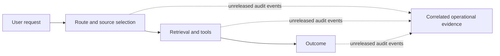

# Governance and responsible operation

Use this guide to decide what data GPT-RAG may process, who owns each
control, and what evidence an operator should preserve for security reviews
and incident investigations.

!!! warning "Audit trail implementation is not released"
    The governance practices on this page can be applied today. The correlated
    [Audit Contract v1](governance_audit_contract_v1.md) is reconciled with
    orchestrator pull request #277, but that implementation is not in a released
    runtime. It is disabled by default and still needs GPT-RAG umbrella
    deployment integration. Do not configure it until the runtime release and
    integration are complete.

## Why this matters

During a review or incident, an operator should be able to answer practical
questions without searching unrelated logs:

- What route or orchestration strategy handled the request?
- Which grounding sources and tools were selected?
- Did each tool call complete, fail, time out, or get cancelled?
- Was an outcome produced or rejected?
- What data classes could have entered telemetry?
- Who configured access, retention, deletion, and export?

GPT-RAG already uses logs, traces, metrics, and source references. Those signals
are useful, but current releases do not provide the versioned audit contract
described in issue
[#571](https://github.com/Azure/GPT-RAG/issues/571). The unreleased contract
correlates operational metadata while leaving prompts, responses, source
excerpts, tool arguments, and tool results out of the default event stream.

## What GPT-RAG can and cannot establish

GPT-RAG cannot determine whether a deployment or use case is legally compliant.
It does not certify a system, enforce an external governance framework, provide
a complete legal crosswalk, or replace an adopter's legal, privacy, security,
risk, records-management, or human-oversight processes.

Clear responsibilities, documented data practices, correlated audit events,
configurable retention, and reviewable technical evidence can help adopters
perform their own:

- security and architecture reviews;
- incident investigations;
- privacy, risk, and audit assessments;
- [NIST AI Risk Management Framework](https://www.nist.gov/itl/ai-risk-management-framework)
  activities; and
- assessments involving the
  [EU AI Act](https://eur-lex.europa.eu/eli/reg/2024/1689/oj).

These are inputs to an adopter-led assessment, not proof of conformance or a
legal conclusion. Applicability and evidence requirements depend on the
deployment, data, users, jurisdiction, and intended use.

## Intended use and limitations

The governance baseline is intended for teams that deploy GPT-RAG as a
retrieval-augmented assistant and need a repeatable way to manage enterprise
data and operational evidence.

Do not assume that:

- a citation proves that an answer is correct or complete;
- a recorded event proves that the producer behaved correctly;
- missing telemetry proves that an action did not occur;
- an opaque identifier is anonymous in every environment;
- permission trimming replaces source-system authorization review;
- a preview grounding capability is production-ready because it has audit
  events;
- retention in Azure Monitor satisfies a records-management obligation; or
- technical evidence establishes legal compliance.

The unreleased audit trail is best-effort telemetry. Sampling, exporter failures,
process termination, asynchronous boundaries, disabled instrumentation, and
upstream systems can create evidence gaps. Events are asserted by the producing
GPT-RAG process. They are not independently attested, cryptographically signed,
tamper-evident, or nonrepudiable.

## Shared responsibility

One organization may perform more than one role. Assign each responsibility
explicitly before production use.

| Role | Responsibilities |
| --- | --- |
| GPT-RAG maintainers | Publish accurate behavior and limitations; provide privacy-conscious defaults; version the audit contract; test schema compatibility, redaction, and bounds; preserve compatibility or publish migration guidance. |
| Deployer or platform team | Select the deployment topology; configure identities, networking, Key Vault, Azure Monitor, retention, export, and backup; apply least-privilege RBAC; keep secrets out of configuration and telemetry; verify regional and service boundaries. |
| Runtime operator | Monitor health, cost, sampling, and evidence gaps; review access regularly; investigate incidents; validate deletion and export procedures; canary changes; roll back audit emission if it harms reliability. |
| Adopter, business owner, or data owner | Define the intended and prohibited uses; assert the right to use each data source; classify data; set minimization and retention policy; determine legal and regulatory obligations; define human oversight, risk acceptance, and user communication. |

## Govern ingested and connected data

Apply these controls to indexed content and to sources queried at request time.
That includes Blob Storage, Azure AI Search, SharePoint, OneLake, specific Work
IQ, Fabric IQ, Foundry IQ and web grounding integrations, and remote MCP
servers.

### Before connecting a source

1. **Record provenance.** Identify the system of record, data owner, ingestion
   or query path, refresh cadence, and applicable permission model.
2. **Obtain a right-to-use assertion.** The operator or data owner should record
   that the organization is authorized to process the source for the intended
   users and purpose. GPT-RAG cannot make this determination.
3. **Classify the data.** Apply the organization's classification for personal,
   confidential, regulated, export-controlled, or other sensitive content.
4. **Minimize scope.** Include only the sites, containers, indexes, tables,
   fields, date ranges, and tools required by the use case.
5. **Define retention and deletion.** Document how source data, indexes,
   conversation history, caches, and backups are removed. Test the process.
6. **Review access.** Use source-system permissions, managed identities,
   delegated access, and GPT-RAG retrieval controls as applicable. Test with
   representative allowed and denied users.
7. **Review data movement.** Confirm region, service, public internet, and
   cross-boundary behavior for every enabled source.

### Sensitive content

Treat retrieved content as sensitive whenever its source classification says
so. Grounding can copy excerpts into prompts, responses, conversation history,
dependency telemetry, or troubleshooting logs. Permission trimming reduces
unauthorized retrieval, but it does not replace classification, minimization,
access review, or downstream handling controls.

For the concrete capabilities GPT-RAG integrates, see the
[Grounding sources overview](howto_grounding_overview.md). GPT-RAG integrates
specific Work IQ, Fabric IQ, Foundry IQ, and web grounding capabilities. It
does not claim complete Microsoft IQ support or provide a Microsoft IQ
governance layer.

## Govern generated telemetry

### Data classes

| Class | Examples | Required posture |
| --- | --- | --- |
| Operational metadata | Event and correlation IDs, service and version, bounded status and reason codes, durations, tool names, source kinds, opaque source references | Permitted by the unreleased metadata-only contract. Classify and minimize it because identifiers and operational context can still be sensitive. |
| Sensitive content | Prompts, responses, source excerpts, system instructions, tool arguments, tool results | Off by default. Enable only after an explicit need, privacy review, access design, retention decision, and cost review. |
| Prohibited data | Access tokens, API keys, authorization headers, cookies, connection strings, credentials, and detected secrets | Never capture or export, including when sensitive-content capture is enabled. Redact before telemetry leaves the producing process and fail closed by omitting unsafe values. |

Actor correlation is disabled by default. If
`AUDIT_ACTOR_PSEUDONYM_ENABLED=true`, the producer records `actor_id` as
`hmac_` plus the first 32 hexadecimal characters of an HMAC-SHA256 digest. It
never places the raw user name, email address, object ID, or token claim in that
property. Store `AUDIT_HMAC_KEY` in Azure Key Vault, restrict it to the
producing workload, and rotate it together with `AUDIT_HMAC_KEY_ID`. Rotation
breaks direct pseudonym correlation across key versions.

Redaction metadata should say that redaction occurred and list omitted field
names, never the omitted values. A successful redaction flag does not prove that
all sensitive information was found, so producers must use allowlisted fields
and bounded enums instead of trying to sanitize arbitrary objects.

## Retention, access, and export

GPT-RAG's current AI Landing Zone template configures the Log Analytics
workspace for 30 days of retention. A reused workspace or table-level override
can differ, so inspect the deployed settings rather than assuming the template
value applies.

Azure Monitor supports up to two years of analytics retention for Analytics
tables and up to 12 years of total retention with long-term retention. Longer
retention and additional ingestion can increase cost. The adopter must choose a
period that matches incident, privacy, records-management, and legal needs.

Use this operational baseline:

- Keep access least-privileged and review role assignments regularly.
- Separate platform administration from routine telemetry reading where
  practical.
- The audit implementation stores allowlisted `prompt`, `response`,
  `source_excerpt`, `tool_arguments`, and `tool_result` values in
  `AppEvents.Properties`, not `AppGenAIContent`. If audit sensitive capture is
  approved, restrict `AppEvents`, its query results, alerts, workbooks, and
  exports accordingly.
- Other generative AI instrumentation can use `AppGenAIContent`. Follow the
  current
  [Application Insights routing guidance](https://learn.microsoft.com/azure/azure-monitor/app/data-model-complete#generative-ai-telemetry)
  and configure it as a
  [protected table](https://learn.microsoft.com/azure/azure-monitor/logs/protected-tables-configure)
  when that separate content capture is enabled.
- Test retention changes and deletion procedures in a non-production
  environment.
- Use
  [Log Analytics data export](https://learn.microsoft.com/azure/azure-monitor/logs/logs-data-export)
  when continuous export to Azure Storage or Event Hubs is required.
- If an organization needs WORM retention, configure
  [immutable Blob Storage](https://learn.microsoft.com/azure/storage/blobs/immutable-storage-overview)
  on the export destination as an operator-owned control. GPT-RAG does not
  configure an immutable evidence store.

Sampling affects evidence. A 100 percent sampling configuration may reduce
sampling gaps, but it increases ingestion and retention cost and still does not
guarantee complete evidence. Verify the deployed OpenTelemetry and Azure Monitor
sampling behavior, exporter health, and throttling before relying on telemetry
for an investigation.

## Roll out the audit feature

Use GPT-RAG umbrella `v3.7.0` or later with orchestrator `v3.8.0` and ingestion
`v2.5.0`. Do not mix older component versions with this shared-contract rollout.

1. Upgrade with `AUDIT_EVENTS_ENABLED=false`,
   `AUDIT_SENSITIVE_CONTENT_ENABLED=false`, and
   `INGESTION_PROVENANCE_ENABLED=false`.
2. Run post-provisioning. Verify that `AUDIT_HMAC_KEY` is a Key Vault reference
   and that the existing Search index gained the optional provenance fields
   without being recreated.
3. Enable metadata-only audit events in a non-production environment.
4. Enable ingestion provenance separately if the deployment has reviewed the
   classification and right-to-use defaults.
5. Keep `AUDIT_ACTOR_PSEUDONYM_ENABLED` and
   `AUDIT_SENSITIVE_CONTENT_ENABLED` disabled.
6. If actor correlation is approved, enable pseudonymization only after
   reviewing access to the automatically provisioned Key Vault key.
7. Canary a small production slice and reconstruct representative requests.
8. Monitor latency, exporter failures, ingestion volume, retention cost, and
   evidence-gap health signals.
9. Confirm that existing traces, logs, dashboards, alerts, indexed documents,
   and operator-added Search fields still work.
10. Roll back by setting `AUDIT_EVENTS_ENABLED=false` and
    `INGESTION_PROVENANCE_ENABLED=false`, then restart the components. Additive
    Search fields can remain. Do not enable sensitive content as a
    troubleshooting shortcut.

Audit emission should not make the user request fail. If event production or
the synchronous logging path fails, the runtime continues the request and
attempts an `audit.emission.failed` event, then a fixed warning if that also
fails. The Azure Monitor batch exporter does not expose an application callback
for later delivery failure. The implementation has no separate health event,
rate limiter, or delivery acknowledgment, so operators must monitor expected
volume and Azure Monitor ingestion health.

## Related reading

- [Audit Contract v1](governance_audit_contract_v1.md)
- [Authentication and Document-Level Security](howto_authentication.md)
- [Grounding sources overview](howto_grounding_overview.md)
- [Azure Monitor Application Insights telemetry data model](https://learn.microsoft.com/azure/azure-monitor/app/data-model-complete)
- [Manage Log Analytics retention](https://learn.microsoft.com/azure/azure-monitor/logs/data-retention-configure)
- [Manage access to Log Analytics workspaces](https://learn.microsoft.com/azure/azure-monitor/logs/manage-access)
