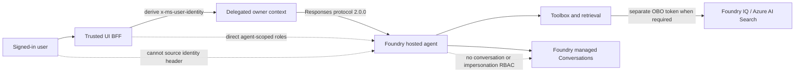

# Hosted conversation continuity platform contract

GPT-RAG has pivoted hosted conversation ownership to delegated user identity.
The trusted UI BFF derives `x-ms-user-identity` from the authenticated
server-side principal and sends it on the hosted Responses request. This is the
preferred and default continuity architecture.

!!! danger "Shipped in v3.8.0; continuity evidence gate remains closed"
    The OQ-OWN platform pivot merged in
    [PR #633](https://github.com/Azure/GPT-RAG/pull/633) at
    [`86b17b0`](https://github.com/Azure/GPT-RAG/commit/86b17b0af672edefe6842cba0f1a8ff77ab23038),
    and [GPT-RAG `v3.8.0`](https://github.com/Azure/GPT-RAG/releases/tag/v3.8.0)
    pins UI `v2.6.1`, orchestrator `v4.1.0`, ingestion `v2.7.1`, and AILZ
    `v2.5.1` at their exact release commits. See
    [the hosted-agent component release matrix](hosted_agent_release_matrix.md#store-false-wire-contract)
    for the `/responses` `store` gap, now fixed and pinned.
    Keep `HOSTED_CONTINUITY_ENABLED=false` until deployment proves the exact
    owner-binding role and protocol contract and records
    `HOSTED_CONVERSATION_OWNER_BINDING_VALIDATED=true`, continuity endpoints
    must fail closed with HTTP 503 rather than use an unvalidated owner path.

The previous capability/HMAC design is not the primary path. It remains a
disabled fallback only. A primary delegated deployment does not create a
capability key, require a dedicated continuity Key Vault, or publish a
capability Key Vault reference.

See the [hosted-agent component release matrix](hosted_agent_release_matrix.md)
for the exact release commits, stateless `/responses` behavior, user and
operator endpoints, Cosmos confinement, current browser operator authentication
status, and rollback procedure.

## Primary delegated trust boundary

Only the trusted UI BFF may source `x-ms-user-identity`. It derives the value
from the authenticated server-side principal; it does not accept a browser-
selected owner and the hosted runtime must not synthesize, replace, or derive
the header.

The delegated owner header is not an OAuth On-Behalf-Of token. It binds the
Foundry Conversation owner for Responses protocol `2.0.0`. OBO remains a
separate downstream retrieval flow used when Foundry IQ, Azure AI Search, Work
IQ, or another source needs a delegated bearer token to enforce source
permissions. The two mechanisms have different audiences and must not be
substituted for each other.

## Required protocol and role gate

Activation must prove all of these conditions together:

| Gate | Required contract |
| --- | --- |
| Protocol | The live endpoint exposes Responses and routes 100% through one fixed-ratio agent version whose definition declares exactly one Responses protocol `2.0.0` entry. Other protocol versions or the legacy Invocations contract do not satisfy OQ-OWN. |
| Owner header | `HOSTED_CONVERSATION_DELEGATED_IDENTITY_HEADER=x-ms-user-identity` and `HOSTED_CONVERSATION_DELEGATED_IDENTITY_SOURCE=authenticated_ui_bff_principal`. Client-supplied identity is not authoritative. |
| Invocation role | Built-in **Foundry Agent Consumer** (`eed3b665-ab3a-47b6-8f48-c9382fb1dad6`) has no control-plane `Actions` and exactly `Microsoft.CognitiveServices/accounts/AIServices/endpoints/interact/action` in `DataActions`. |
| Impersonation role | Custom **GPT-RAG Hosted Agent User Identity Impersonation** (`bef66abe-a495-530a-be1d-5d882fecff03`) has no `Actions`, `NotActions`, or `NotDataActions` and exactly `Microsoft.CognitiveServices/accounts/AIServices/agents/endpoints/UserIdentityImpersonation/action` in `DataActions`. Its only assignable scope is the hosted agent resource group. |
| Assignments | Both roles are direct `ServicePrincipal` assignments to the UI BFF at `/subscriptions/{subscription}/resourceGroups/{resourceGroup}/providers/Microsoft.CognitiveServices/accounts/{account}/projects/{project}/agents/{agent}`. |
| Validation result | Deployment records `HOSTED_CONVERSATION_OWNER_BINDING_VALIDATED=true` only after the live role definitions, direct assignments, exact scope, protocol, and identity-source behavior pass validation. |

Broader project-, account-, resource-group-, subscription-, or
management-group-scoped assignments do not satisfy the gate. Inherited,
group-derived, wildcard, custom-equivalent, or extra-DataAction roles are
rejected. **Foundry User** and **Project Runtime User** are prohibited
substitutes. The UI BFF and hosted runtime must use distinct identities.

If any protocol, identity, role-definition, assignment, or scope check fails,
setup keeps `HOSTED_CONTINUITY_ENABLED=false`. Compatible UI history operations
must return HTTP 503 while the owner-binding gate is false or unavailable; they
must not silently fall back to an unbound Conversation.

## Runtime isolation

The hosted runtime executes the agent but is not an identity or persistence
authority. In hosted/no-panel it receives:

- no authority to source `x-ms-user-identity`;
- no capability or HMAC key;
- no Foundry Conversation data-plane role;
- no `UserIdentityImpersonation` role;
- no broader assignment that grants either Conversation or impersonation
  actions; and
- no Cosmos DB conversation store.

Foundry managed Conversations provide hosted state. The no-panel topology does
not provision panel-only Cosmos DB, and the hosted runtime cannot use Cosmos as
a continuity fallback.

## Configuration contract

The platform and compatible components must treat these settings as fail-closed
controls:

| Setting or gate | Required posture |
| --- | --- |
| `HOSTED_CONTINUITY_ENABLED` | Defaults to `false`. May become `true` only after the selected owner-binding gate succeeds. |
| `HOSTED_CONVERSATION_OWNER_BINDING` | Defaults to `delegated`; `capability` is the only accepted explicit fallback value. |
| `HOSTED_CONVERSATION_OWNER_BINDING_VALIDATED` | Defaults or resolves to `false` until live protocol and role validation succeeds. A false or missing value forces continuity off/503. |
| `HOSTED_CONVERSATION_DELEGATED_IDENTITY_HEADER` | Must be exactly `x-ms-user-identity`. |
| `HOSTED_CONVERSATION_DELEGATED_IDENTITY_SOURCE` | Must be exactly `authenticated_ui_bff_principal`; browser identity and OBO retrieval tokens are rejected as ownership inputs. |
| `HOSTED_CONVERSATIONS_TOKEN_AUDIENCE` | Remains the exact Foundry audience `https://ai.azure.com` for the UI BFF's Foundry access token. It is not the `x-ms-user-identity` value and is distinct from downstream OBO audiences. |
| `HOSTED_AGENT_RESPONSES_PROTOCOL_VERSION` | Must be exactly `2.0.0`. |
| `HOSTED_CONTINUITY_UNAVAILABLE_STATUS_CODE` | Must be `503`. |
| `HOSTED_HISTORY_MAX_ITEMS` | Default `100`; accepted range 1-1,000. |
| `HOSTED_HISTORY_MAX_TOKENS` | Default `32000`; accepted range 1-1,000,000. |
| `HOSTED_HISTORY_TRUNCATION` | Must be `drop_oldest`. |

The history bounds limit context supplied through the compatible hosted path.
They do not define records retention, legal hold, backup, or deletion policy.
UI `v2.6.1` falls back locally to 40 items and 8,000 tokens if these values are
absent. The umbrella integration publishes the reviewed platform values of 100
and 32,000 rather than relying on UI fallbacks. This publication does not open
the continuity gate; live protocol, identity, role, and owner-binding evidence
is still required.

## Disabled capability/HMAC fallback

The owner-bound capability contract from
[PR #630](https://github.com/Azure/GPT-RAG/pull/630) is retained only as an
explicit fallback for future compatibility work. It is disabled unless a
separate release explicitly selects and validates that mode.

These settings and resources are fallback-only:

| Fallback surface | Posture |
| --- | --- |
| `HOSTED_CONVERSATION_OWNER_BINDING=capability` | Never selected implicitly by the delegated primary path. |
| `HOSTED_CONVERSATION_CAPABILITY_KEY_ID` | Defaults to `v1`; accepts 1-64 safe identifier characters. Used only by the disabled capability mode. |
| `HOSTED_CONVERSATION_CAPABILITY_TTL_SECONDS` | Defaults to `900`; accepted range 60-3,600 seconds. Used only by the disabled capability mode. |
| `HOSTED_CONTINUITY_KEY_VAULT_URI` / `HOSTED_CONTINUITY_KEY_VAULT_NAME` | Optional fallback inputs; not provisioned or required for delegated continuity. |
| `HOSTED_CONVERSATION_CAPABILITY_KEY` | Optional fallback Key Vault reference; absent on the primary delegated path. |

The primary path must not create `HOSTED-CONVERSATION-CAPABILITY-KEY`, grant a
capability-secret role, or publish `HOSTED_CONVERSATION_CAPABILITY_KEY`.
Existing fallback key versions may be retained for rollback or investigation
when disabling a previously provisioned capability deployment, but they are not
a prerequisite for delegated ownership.

## Activation and disabled reconciliation

Activation occurs only after the individual hosted agent exists:

1. Provisioning seeds continuity disabled.
2. The hosted agent is deployed with Responses protocol `2.0.0`.
3. Validation proves the trusted UI BFF is the identity-header source, validates
   the live built-in Foundry Agent Consumer definition and the exact GPT-RAG
   custom role (`bef66abe-a495-530a-be1d-5d882fecff03`) containing only
   `Microsoft.CognitiveServices/accounts/AIServices/agents/endpoints/UserIdentityImpersonation/action`,
   and verifies both direct assignments at the individual agent scope.
4. The platform records
   `HOSTED_CONVERSATION_OWNER_BINDING_VALIDATED=true`.
5. Only then may the compatible UI enable continuity. Otherwise history remains
   unavailable with HTTP 503.

Disabled reconciliation removes the UI BFF's exact agent-scoped invocation and
impersonation assignments. If a prior fallback capability deployment exists,
reconciliation also removes its App Configuration reference and exact
secret-scoped role while retaining Key Vault secret-version history. A
delegated-only deployment has no capability reference or secret role to remove.

## Release and rollout gate

Do not enable this contract by combining the published component tags manually
or against the capability-first platform implementation alone. A GPT-RAG
umbrella release may enable delegated continuity only after all of the following
are true:

1. The OQ-OWN platform pivot from PR #633 is present.
2. The UI BFF derives `x-ms-user-identity` from the authenticated server-side
   principal and clients cannot select the owner.
3. Responses protocol `2.0.0` is pinned across the UI and hosted runtime.
4. The two exact direct agent-scoped UI BFF roles pass live validation.
5. The hosted runtime has no identity-header source, key, Conversation or
   impersonation RBAC, or Cosmos dependency in hosted/no-panel.
6. The exact component pins are present in the umbrella manifest.

Until those gates pass, `HOSTED_CONTINUITY_ENABLED=false` and HTTP 503 are the
required operational behavior.
