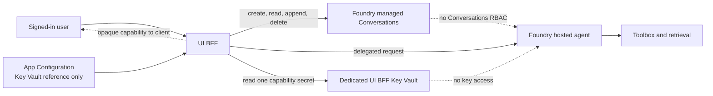

# Hosted conversation continuity platform contract

GPT-RAG has a platform contract for preserving hosted chat continuity with
Microsoft Foundry managed Conversations. The contract was merged to `develop`
in [Azure/GPT-RAG PR #630](https://github.com/Azure/GPT-RAG/pull/630).

!!! warning "Merged platform contract; keep it disabled"
    This is not a released end-to-end feature. Compatible UI and hosted-runtime
    component pins, final umbrella pins, and integrated validation are still
    required. Keep `HOSTED_CONTINUITY_ENABLED=false` until the UI BFF
    implementation has completed owner-binding validation and the compatible
    component set is published.

The contract is fail closed. It does not grant the hosted runtime authority over
conversation ownership or Foundry Conversations. The UI BFF is the only
component that creates, reads, appends to, or deletes managed Conversations and
the only component that creates and verifies the owner-bound capability.

## Trust boundary



The UI BFF derives the lowercase Microsoft Entra object ID (`oid`) from the
authenticated server-side principal. It signs the versioned capability with
HMAC-SHA256 and verifies the owner, expiry, schema, canonical framing, and
signature before every Conversation operation. The browser may retain the
opaque capability, but it does not choose or alter the owner.

The UI BFF remains the authority that issues and verifies capabilities. An
opaque signed envelope does not grant the hosted runtime ownership authority.
The hosted runtime receives no HMAC key, raw `oid`, capability-key permission,
or Foundry Conversations data-plane role.

## Configuration contract

Post-provisioning seeds these values under the App Configuration label
`gpt-rag`. Invalid values fail setup; validation failure writes
`HOSTED_CONTINUITY_ENABLED=false`.

| App Configuration key | Default | Validation and purpose |
| --- | --- | --- |
| `HOSTED_CONTINUITY_ENABLED` | `false` | Master gate. Must remain disabled until compatible components are pinned and owner binding has been validated. Enabling also requires a hosted topology, `CHAT_BACKEND=hosted_agent`, and Key Vault deployment. |
| `HOSTED_CONVERSATION_OWNER_BINDING` | `capability` | The only accepted ownership boundary. Raw caller identifiers are not a supported substitute. |
| `HOSTED_CONVERSATION_OWNER_BINDING_VALIDATED` | `false` | Explicit compatibility gate. `HOSTED_CONTINUITY_ENABLED=true` is rejected unless this is exactly `true`. |
| `HOSTED_CONVERSATIONS_TOKEN_AUDIENCE` | `https://ai.azure.com` | Exact audience required for Foundry Conversations access by the UI BFF. |
| `HOSTED_CONVERSATION_CAPABILITY_KEY_ID` | `v1` | Non-secret key-version identifier. Must contain 1-64 letters, digits, periods, underscores, or hyphens and start with a letter or digit. Advancing it creates a new secret version while preserving prior versions. |
| `HOSTED_CONVERSATION_CAPABILITY_TTL_SECONDS` | `900` | Capability lifetime. Accepted range is 60-3,600 seconds. |
| `HOSTED_HISTORY_MAX_ITEMS` | `100` | Maximum managed history items supplied to the compatible UI BFF/runtime contract. Accepted range is 1-1,000. |
| `HOSTED_HISTORY_MAX_TOKENS` | `32000` | Maximum history token budget. Accepted range is 1-1,000,000. |
| `HOSTED_HISTORY_TRUNCATION` | `drop_oldest` | The only accepted overflow policy. It preserves the newest bounded context. |

These limits are compatibility and safety controls, not a records-retention
policy. Foundry Conversation deletion, organizational retention, backup, and
legal-hold requirements remain operator responsibilities.

## Dedicated Key Vault and App Configuration

An enabled deployment must identify a dedicated UI BFF Key Vault through one of
these deployment inputs:

```powershell
azd env set HOSTED_CONTINUITY_KEY_VAULT_URI "https://<ui-bff-vault>.vault.azure.net/"
# Or:
azd env set HOSTED_CONTINUITY_KEY_VAULT_NAME "<ui-bff-vault>"
```

The shared workload vault identified by `KEY_VAULT_URI` is rejected. The
platform creates or reuses the `HOSTED-CONVERSATION-CAPABILITY-KEY` secret and
grants the UI BFF **Key Vault Secrets User** only at that individual secret
scope. Effective inherited, group-derived, custom, or broader secret-read
access fails validation. The hosted identity must have no effective access to
the capability secret.

App Configuration never stores the HMAC key. It stores
`HOSTED_CONVERSATION_CAPABILITY_KEY` only as a Key Vault reference to the
dedicated secret. A plaintext value, a malformed reference, or a reference to a
different vault or secret fails closed.

## Foundry role boundary

Activation verifies the live built-in **Foundry Agent Consumer** role before
using it:

| Property | Required value |
| --- | --- |
| Role ID | `eed3b665-ab3a-47b6-8f48-c9382fb1dad6` |
| Principal | UI BFF managed identity only |
| Scope | The individual hosted agent resource |
| Hosted runtime assignment | None |

The role must still be the built-in role with the reviewed single endpoint
interaction data action. Custom roles and assignments inherited from a project,
account, subscription, management group, or group membership are not accepted
as substitutes. The UI BFF and hosted runtime must not share an identity.

This role lets the UI BFF invoke the one hosted agent. It does not grant the
hosted runtime access to Foundry Conversations, and it must not be broadened to
the Foundry project or account.

## Activation and disabled reconciliation

Continuity setup is deliberately ordered after the hosted agent resource
exists:

1. Post-provisioning validates and seeds the configuration while forcing
   continuity disabled. It does not publish the capability reference or grant
   continuity-specific roles.
2. The hosted agent is deployed.
3. The activation gate validates the live Foundry role definition, distinct
   identities, exact agent and secret scopes, dedicated vault, capability key,
   and owner-binding flag.
4. Only after every check succeeds does setup publish the Key Vault reference
   and set `HOSTED_CONTINUITY_ENABLED=true`.

Disabling the feature is also reconciled, not merely hidden behind a flag. With
the platform-managed capability reference still present, the next setup pass
removes:

- the UI BFF's exact Foundry Agent Consumer assignment at the individual agent;
- the UI BFF's exact Key Vault Secrets User assignment at the capability
  secret; and
- the `HOSTED_CONVERSATION_CAPABILITY_KEY` App Configuration reference.

The capability secret and its previous versions remain in Key Vault. Retaining
that key history supports controlled rollback and investigation; removing old
versions is a separate operator retention decision.

Do not manually delete the App Configuration reference before running disabled
reconciliation. The reference is how setup resolves the exact capability-secret
scope. If it was removed out of band, inspect and remove the UI BFF's exact
secret-scoped assignment separately; the agent-scoped Foundry assignment is
still reconciled independently.

## Release and rollout gate

Do not enable this contract against the currently published classic component
set or by mixing arbitrary component branches. A release may enable continuity
only after all of the following are true:

1. The UI BFF exclusively implements managed Conversation CRUD and capability
   issuance/verification.
2. The hosted runtime accepts neither the capability key nor raw `oid` and has
   no Conversations RBAC.
3. The owner-binding compatibility test sets
   `HOSTED_CONVERSATION_OWNER_BINDING_VALIDATED=true`.
4. Compatible UI, hosted-runtime, AI Landing Zone, and umbrella pins are
   published and validated together.
5. Deployment tests confirm activation occurs only after the individual hosted
   agent exists and disabled reconciliation removes only the exact
   continuity-specific grants and reference.

Until then, the documented platform contract is available for component
implementation and review, but `HOSTED_CONTINUITY_ENABLED=false` is the required
operational posture.
