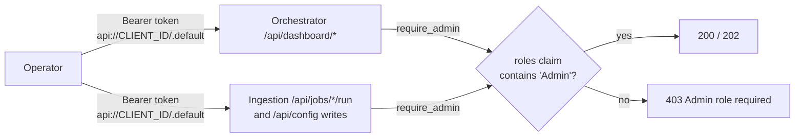

# Authentication and Document-Level Security

This page explains how authentication works in GPT-RAG, from the GPT-RAG UI sign-in to querying Azure AI Search with document-level access control enabled (POSIX-like ACL / RBAC scopes). The key idea is intentionally simple: when authentication is configured, the UI forwards a single user token to the orchestrator, and the orchestrator takes responsibility for producing the correct “user context” token required by Azure AI Search.

> In OAuth mode, the orchestrator receives a user access token (for the orchestrator API) and then performs an On-Behalf-Of (OBO) exchange to obtain a separate token for Azure AI Search. The two tokens have different audiences and are not interchangeable.

## Concepts

GPT-RAG uses Microsoft Entra ID authentication end-to-end, and Azure [AI Search document-level access control (POSIX-like ACL / RBAC scopes)](https://learn.microsoft.com/en-us/azure/search/search-document-level-access-overview) relies on three related steps:

1) The UI signs the user in and sends an access token to the orchestrator. This token is meant for the orchestrator API.

2) The orchestrator validates the incoming token (signature, issuer, and audience) and extracts the user identity (for example, user object ID). This is how the orchestrator knows which user is calling.

3) When the orchestrator queries Azure AI Search with document-level security enabled, it must send a different delegated token whose audience is Azure AI Search. The orchestrator obtains that token by performing an On-Behalf-Of exchange with Entra ID.

The diagram below shows where each token is used. Azure AI Search receives the orchestrator credential (to authorize the call) and a separate “query source authorization” token (to enforce document-level access control).

<div class="no-wrap">
```
	+---------------------------+                 +----------------------------------+
	|  Microsoft Entra ID       |                 |  Azure AI Search                 |
	|  Tenant                   |                 |  Index with ACL/RBAC enforcement |
	|                           |                 |  permissionFilterOption=enabled  |
	+---------------------------+                 +----------------------------------+
			^													   ^
			|													   |
			| (4) user access                                      | (6) Search query
			|  aud: https://search.azure.com                       |   Authorization: (orchestrator identity)
			|  scope: https://search.azure.com/user_impersonation  |   x-ms-query-source-authorization: (user access token)
			|													   |
			|													   |
			|													   |
	+---------------------------+         (3) OBO exchange         |
	|  Orchestrator             |----------------------------------+
	|  Container App            |   to Entra ID token endpoint
	|                           |
	|  Validates API token      |   Inputs
	|  Uses client secret       |   - incoming user access token
	|  Uses MI or admin key     |   - client id and client secret
	+---------------------------+   - requested scope for Search
						^
						|
						| (2) API token
						|     aud: api://<CLIENT_ID>
						|     scope: api://<CLIENT_ID>/user_impersonation
						|
	+---------------------------+
	|  Frontend                 |
	|  Container App            |
	|  Chainlit OAuth           |
	+---------------------------+
						^
						|
						| (1) User sign-in
						|     Entra issues API token
						|
	+---------------------------+
	|  App Registration         |
	|  Single registration for  |
	|  UI and orchestrator      |
	+---------------------------+
```
</div>

When authentication is configured (OAuth enabled), the UI includes the user access token for the orchestrator API on calls to the orchestrator. This is the token shown as (2) in the diagram. If OAuth is not configured and the UI is running in anonymous mode, the UI calls the orchestrator without an `Authorization` header. In OAuth mode, the UI sends the token like this:

```
Authorization: Bearer <orchestrator_api_user_access_token>
```

On the orchestrator side, this user access token is validated before any downstream call is made. The orchestrator verifies the token signature and issuer using the tenant signing keys (JWKS), checks the expected audience for the orchestrator API, and extracts the user identity (for example, user object ID). That identity can be used to enforce access to the orchestrator itself.

To query Azure AI Search with document-level access control enabled, the orchestrator performs an On-Behalf-Of (OBO) exchange using the incoming user access token as the user assertion. This returns a delegated user token whose audience is Azure AI Search. The orchestrator includes that token in the header below when running queries.

```
x-ms-query-source-authorization: Bearer <search_user_access_token>
```

Document-level access control is enforced by Azure AI Search when the index is configured for document permissions (see `permissionFilterOption` in the index definition) and documents include permission metadata. 

!!! note "Foundry IQ retrieval"
    When `RETRIEVAL_BACKEND=foundry_iq`, there are two security paths. Native
    Foundry IQ sources use the `x-ms-query-source-authorization` OBO header only
    when permissions were ingested from a supported source such as ADLS Gen2
    ACLs, SharePoint, OneLake/Fabric, or Purview labels. The custom ingestion
    path, where the existing GPT-RAG index is registered as a `searchIndex`
    knowledge source, uses an OData `filterAddOn` over GPT-RAG security fields
    instead. Plain Blob storage is container-level RBAC for this purpose unless
    Purview labels or an equivalent per-document permission source are used. See
    [Retrieval backend selection](howto_retrieval_backend.md#security-modes).

GPT-RAG uses these field names consistently across ingestion paths:

```
metadata_security_user_ids
metadata_security_group_ids
metadata_security_rbac_scope
```

For GPT-RAG, the document-level access control model is POSIX-style ACL plus RBAC scopes. Each document can carry ACL metadata such as user and group object IDs. When applicable, a document can also carry an RBAC scope such as a storage container resource ID.

GPT-RAG ingestion is responsible for collecting and attaching the permission metadata for each document automatically. This repo does not rely on the built-in Azure AI Search indexers for permission extraction. Permissions are handled by the pipeline implemented in `gpt-rag-ingestion`.

When ACL and RBAC scope metadata are present, Azure AI Search evaluates them as alternatives. Access is granted when any one permission type matches: userIds, groupIds, or rbacScope.

In normal usage, userIds and groupIds contain Microsoft Entra ID object IDs as strings. They also support special values.

    - `["all"]` makes every caller match this ACL type.

    - `["none"]` and `[]` mean no caller matches this ACL type.

These values only apply to that ACL type. For example, userIds set to `["none"]` does not block access through groupIds or RBAC scope.

RBAC scopes are applied at the storage container level. When RBAC is used for a document, users must have the appropriate Azure role assignment on the container scope, typically Storage Blob Data Reader.

In test environments, if you do not want Azure AI Search to enforce document permissions, set `permissionFilterOption` to `disabled` in the index definition. This is the default.

Azure AI Search enforces limits for document permission fields. The `userIds` and `groupIds` fields accept up to 32 values each. The `rbacScope` field is limited to five distinct values across the entire index.

## Prerequisites

**For user authentication**
- A Microsoft Entra ID App Registration used by both the UI and the orchestrator. The UI uses it to sign users in and request an access token for the orchestrator API. The orchestrator then validates that token and uses the app's client secret to perform the On-Behalf-Of (OBO) token exchange when the Azure AI Search index is configured for document-level access control.
- You have permissions in the tenant to create or update the App Registration, add API permissions.

**For document-level security**
- User authentication is configured.
- Your Azure AI Search index is configured for document-level access control and includes the required document permission fields. *
- Your documents are indexed with the correct security metadata for each document (user object IDs, group object IDs, and RBAC scope). **
- Tenant admin consent is granted for the Azure AI Search delegated permission `user_impersonation` in the App Registration.

\* If you use the GPT-RAG provisioning workflow, it already creates the index with this configuration.

\** If you use gpt-rag data ingetion pipeline documents are automatically indexed with ACL when they're set in the blobs metadata fields

## Setup

**1) Create one App Registration in Microsoft Entra ID.**

After creating it, go to the **App Registration Overview** page and copy the Application (client) ID and the Directory (tenant) ID. You will use them later as `OAUTH_AZURE_AD_CLIENT_ID` and `OAUTH_AZURE_AD_TENANT_ID`.

If you plan to use group-based access control, in the **App Registration** go to **Manage > Token configuration** and add a `groups` claim. 

If users belong to many groups, Entra may emit an overage indicator instead of the full group list, which typically requires resolving membership via Microsoft Graph.

**2) In the App Registration, go to Manage > Authentication.**

**Under Platform configurations > Web, add the frontend redirect URI.**

```
https://<YOUR-APP-URL>/auth/oauth/azure-ad/callback
```

or

```
https://<YOUR-APP-URL>/.auth/login/aad/callback
```

**3) In the App Registration, go to Manage > Expose an API.** 

Set the Application ID URI to `api://<OAUTH_AZURE_AD_CLIENT_ID>`.


Then create a delegated scope named `user_impersonation` and add this scope to the app.

```
api://<OAUTH_AZURE_AD_CLIENT_ID>/user_impersonation
```

**4) In the App Registration, go to Manage > Certificates & secrets.**

**Create a new client secret and copy the secret value.**

You can only copy the secret value once. Store it securely (for example, in Key Vault) and use it later for the orchestrator configuration.

**5) Add the Azure AI Search delegated permission `user_impersonation` and grant tenant consent.**

In the App Registration, go to **Manage > API permissions**.

```
Add a permission
	APIs my organization uses
		Azure Cognitive Search
			Delegated permissions
				user_impersonation

Grant admin consent
```

CLI alternative if Azure Cognitive Search does not appear in the picker. First, discover the Azure AI Search resource application ID and the scope ID.

```
az rest --method GET --url "https://graph.microsoft.com/v1.0/servicePrincipals?$filter=servicePrincipalNames/any(s:s eq 'https://search.azure.com')&$select=appId,displayName,oauth2PermissionScopes" --query "value[0].{resourceAppId:appId,scopeId:oauth2PermissionScopes[?value=='user_impersonation'].id | [0],name:displayName}"
```

Then add the permission and grant consent.

```
az ad app permission add --id <replace-by-app-client-id> --api <SEARCH_RESOURCE_APP_ID> --api-permissions <SCOPE_ID>=Scope
az ad app permission admin-consent --id <replace-by-app-client-id>
```

Validate the configured permissions.

```
az ad app permission list --id <replace-by-app-client-id>
```

**6) Configure the following app configuration settings used by the authentication flow.**

GPT-RAG authentication settings are configured in **Azure App Configuration**. Create the keys below in App Configuration and apply the **gpt-rag** label. For non-secret settings, store the value as plain text. For secret settings, store the value in **Key Vault** and add the key in App Configuration as a **Key Vault reference** (also under the **gpt-rag** label).

At a minimum, you only need to set the settings marked as **Required** in the table below. The remaining settings are optional and only needed if you want to customize behavior.

| Setting | Required | Secret? | What it controls |
| --- | --- | --- | --- |
| `OAUTH_AZURE_AD_CLIENT_ID` | Yes (for OAuth) | No | Entra App Registration application (client) ID used by the UI OAuth provider to request tokens for the orchestrator API. |
| `OAUTH_AZURE_AD_TENANT_ID` | Yes (for OAuth) | No | Entra tenant ID used to validate/target the tenant for the OAuth flow (single-tenant by default). |
| `OAUTH_AZURE_AD_CLIENT_SECRET` | Yes (for OAuth) | Yes | Client secret used by the app for confidential-client flows (for example, completing the OAuth code flow and performing the OBO exchange). Store as a Key Vault secret and reference it from App Configuration (or from App Settings if you bypass App Configuration). |
| `CHAINLIT_AUTH_SECRET` | Yes | Yes | Secret used by Chainlit to sign its session JWT. If missing, the UI generates a temporary value (sessions reset on restart). Store as a Key Vault secret and reference it from App Configuration (or from App Settings if you bypass App Configuration). |
| `CHAINLIT_URL` | No | No | Public base URL of the UI. Used to build the OAuth redirect/callback URL (and normalized without a trailing slash). |
| `OAUTH_AZURE_AD_SCOPES` | No | No | Scopes requested during interactive login. If omitted, the UI defaults to the orchestrator API scope plus OpenID Connect scopes. Setting this explicitly helps avoid accidentally getting Microsoft Graph tokens. |
| `OAUTH_AZURE_AD_ENABLE_SINGLE_TENANT` | No | No | Defaults to `true`. When `true`, the UI enforces single-tenant behavior for the OAuth flow. Set to `false` only for multi-tenant scenarios. |
| `ALLOW_ANONYMOUS` | No | No | When `true`, the UI runs without OAuth (anonymous mode). Defaults to `true` locally when OAuth is not configured. |


**7) Configure the Azure AI Search index for document-level access control and ensure your documents include permission metadata.**

In the index definition, set `permissionFilterOption` to `enabled`.

These are the Azure AI Search index fields used for document-level access control:

```
metadata_security_user_ids   Collection(Edm.String)   permissionFilter=userIds
metadata_security_group_ids  Collection(Edm.String)   permissionFilter=groupIds
metadata_security_rbac_scope Edm.String               permissionFilter=rbacScope
```

During Blob Storage ingestion, the GPT-RAG ingestion pipeline reads the following blob metadata keys and adds them to the corresponding documents in the index. If you want to specify which users or groups can access a document, set these metadata fields on each blob.

```
metadata_security_user_ids
metadata_security_group_ids
```

> Note: For SharePoint ingestion, you don't need any additional steps. The GPT-RAG ingestion pipeline typically derives the user and group ACLs from the source SharePoint document or list item permissions and populates the same fields automatically.

Examples of how to populate `metadata_security_user_ids` and `metadata_security_group_ids`.


```
["11111111-1111-1111-1111-111111111111"]
["11111111-1111-1111-1111-111111111111","22222222-2222-2222-2222-222222222222"]
11111111-1111-1111-1111-111111111111,22222222-2222-2222-2222-222222222222
['11111111-1111-1111-1111-111111111111','22222222-2222-2222-2222-222222222222']
```

> Note: For Blob Storage ingestion, the GPT-RAG ingestion pipeline will populate `metadata_security_rbac_scope` automatically. The value is the Azure resource ID of the container, for example:
*/subscriptions/<subscriptionId\>/resourceGroups/<resourceGroup\>/providers/Microsoft.Storage/storageAccounts/<storageAccount\>/blobServices/default/containers/<container\>*

## Admin Access for the Operator Dashboards

The orchestrator and the ingestion service each ship a small operator dashboard. The orchestrator dashboard is mounted at `/dashboard` on the orchestrator Container App and the ingestion dashboard is mounted at `/dashboard` on the ingestion Container App. Both surfaces let an operator inspect runs, conversations, and a curated set of runtime settings, and the ingestion dashboard also lets an operator trigger a scheduled job on demand.

Admin access is enforced through an **Entra ID App Role named `Admin`** added to the same App Registration you created for user sign-in. The same token the UI already uses for the orchestrator API also carries the role claim once a user is assigned to it, so there is no separate token, separate scope, or separate app registration to manage.

This section explains how to add the role, assign users, request the correct scope, and debug the most common error (a 403 response even though the role is assigned).

### How each dashboard is gated

The two dashboards apply the gate at slightly different layers. The HTML shell is always served (it is just static files) so the page can render its loading state before the user signs in, but every endpoint that returns data or performs an action enforces the gate.

| Surface | HTML at `/dashboard` | Data endpoints | Job actions | Configuration tab |
| --- | --- | --- | --- | --- |
| Orchestrator | Open (loading shell only) | `Admin` role required on every `/api/dashboard/*` call | Not applicable | Entire tab requires `Admin` (read and write) |
| Ingestion | Open (loading shell only) | Open (read-only run summaries) | `Admin` required for `POST /api/jobs/{job_type}/run` | `GET /api/config` open in read-only mode for non-admins; `PUT /api/config`, `POST /api/config/reload`, and `POST /api/config/apply` require `Admin` |

In all cases, when `OAUTH_AZURE_AD_TENANT_ID` is not configured the gate is a no-op. This matches the rest of the orchestrator and ingestion behavior in local development and lets contributors run both services without an Entra app registration.

The orchestrator dashboard is only mounted when `ENABLE_DASHBOARD` is set to `true`. In default deployments the routes do not exist at all. Set `ENABLE_DASHBOARD=true` under the `gpt-rag-orchestrator` label in App Configuration to enable it.



### 1) Add the `Admin` app role to the App Registration

You add the role to the same App Registration created in the **Setup** section above. You can do this in the Azure portal or with the Azure CLI.

**Portal**

In the App Registration, go to **Manage > App roles**, then **Create app role** and fill the form as follows.

| Field | Value |
| --- | --- |
| Display name | `Admin` |
| Allowed member types | `Users/Groups` |
| Value | `Admin` |
| Description | `Grants access to the GPT-RAG operator dashboards.` |
| Do you want to enable this app role? | Checked |

The `Value` field is what the dashboards check. It must be exactly `Admin` (case-sensitive).

**CLI**

```
az ad app update --id <replace-by-app-client-id> --app-roles '[{
  "allowedMemberTypes": ["User"],
  "description": "Grants access to the GPT-RAG operator dashboards.",
  "displayName": "Admin",
  "isEnabled": true,
  "value": "Admin"
}]'
```

> Note: `az ad app update --app-roles` replaces the full list. If the App Registration already defines other app roles, include them in the same JSON array.

### 2) Assign users or groups to the `Admin` role

App role assignments are done on the **Enterprise application**, not on the App Registration.

1. In the Entra portal go to **Microsoft Entra ID > Enterprise applications**.
2. Open the application that matches your App Registration name (same client ID).
3. Go to **Users and groups > Add user/group**.
4. Pick the user or group, select the **Admin** role, and confirm.

Only users assigned the role will receive `Admin` in the `roles` claim of their access token. Users who are not assigned the role can still sign in and use the chat UI; they only see a 403 when calling a gated dashboard endpoint.

> Tip: For production, assign a security group instead of individual users so you can manage membership without touching Entra.

### 3) Request a scope that returns the `roles` claim

This is the most common source of confusion. Entra only includes the `roles` claim in an access token when the token is requested for **your own API**, not for Microsoft Graph. The scope you request decides the audience of the token and therefore whether the claim is present.

| Scope you request | Token audience | `roles` claim present? |
| --- | --- | --- |
| `api://<OAUTH_AZURE_AD_CLIENT_ID>/.default` | Your API | Yes |
| `api://<OAUTH_AZURE_AD_CLIENT_ID>/user_impersonation` | Your API | Yes |
| `User.Read` (or any `https://graph.microsoft.com/*` scope) | Microsoft Graph | No |
| `openid profile email` only | ID token only, no API access token | No (and no API call possible) |

If the UI requests only Graph scopes or only OpenID Connect scopes, the access token sent to the orchestrator will not contain `roles`, and `require_admin` will reject the call with `403 Admin role required` even when the role is correctly assigned in Entra.

The GPT-RAG UI already requests `api://<OAUTH_AZURE_AD_CLIENT_ID>/user_impersonation` by default. If you override `OAUTH_AZURE_AD_SCOPES`, make sure the API scope is still in the list. For example:

```
OAUTH_AZURE_AD_SCOPES = api://<OAUTH_AZURE_AD_CLIENT_ID>/user_impersonation openid profile email
```

### 4) `ENABLE_DASHBOARD` and labels in App Configuration

The dashboards and their Configuration tabs both read and write App Configuration. Each service uses its own label so an operator can filter cleanly in the portal.

| Setting | Service | Label | Purpose |
| --- | --- | --- | --- |
| `ENABLE_DASHBOARD` | Orchestrator | `gpt-rag-orchestrator` | When `true`, mounts the orchestrator dashboard at `/dashboard`. Defaults to `false`. |
| Curated runtime settings | Orchestrator | `gpt-rag-orchestrator` | The 12 keys exposed on the Configuration tab (see below). |
| Curated runtime settings | Ingestion | `gpt-rag-ingestion` | The 17 keys exposed on the Configuration tab (see below). |

The ingestion dashboard is always mounted; there is no equivalent feature flag.

### 5) Configuration tab: what it can change, and what `Apply` actually does

The Configuration tab in each dashboard is intentionally narrow. It only exposes a curated allowlist of settings, never secrets. The backend enforces both an **allowlist** (only listed keys can be read or written) and a **denylist** as defense in depth (any key whose name suggests a secret is rejected even if it sneaks into the allowlist).

The denylist rejects any key that:

- starts with `OAUTH_`, or
- ends with `_APIKEY`, `_API_KEY`, `_SECRET`, `_PASSWORD`, `_CONNECTION_STRING`, `_CONNSTRING`, `_PRIVATE_KEY`, or `_TOKEN`, or
- is one of the known sensitive keys hard-coded in the registry (for example `AZURE_CLIENT_ID`, `KEY_VAULT_URI`, `APP_CONFIG_ENDPOINT`).

So even if an operator types a Key Vault reference into a field, the API rejects the write.

**Orchestrator allowlist (12 keys)**

`AGENT_STRATEGY`, `REASONING_EFFORT`, `CHAT_TEMPERATURE`, `CHAT_TOP_P`, `MAX_COMPLETION_TOKENS`, `CHAT_HISTORY_MAX_MESSAGES`, `CONVERSATION_HISTORY_COMPACTION_ENABLED`, `SEARCH_RETRIEVAL_ENABLED`, `SEARCH_RAGINDEX_TOP_K`, `BING_RETRIEVAL_ENABLED`, `INFERENCE_MAX_RETRIES`, `MULTIMODAL_CLASSIFY_IMAGES`.

**Ingestion allowlist (17 keys)**

The 7 cron expressions (`CRON_RUN_SHAREPOINT_INDEX`, `CRON_RUN_SHAREPOINT_PURGE`, `CRON_RUN_IMAGES_PURGE`, `CRON_RUN_BLOB_INDEX`, `CRON_RUN_BLOB_PURGE`, `CRON_RUN_NL2SQL_INDEX`, `CRON_RUN_NL2SQL_PURGE`) plus chunking, indexing, throughput, limits, multimodal, and SharePoint-source settings.

**Read-only mode in the ingestion Configuration tab**

`GET /api/config` on the ingestion service is open to any caller, even unauthenticated, so the tab can render without a second round-trip. The response includes a `canEdit` boolean that is `true` only when auth is off, or when the caller presents a valid token carrying the `Admin` role. A non-admin operator sees the current values but the fields and the Save button are disabled. Writes (`PUT /api/config`), cache reload (`POST /api/config/reload`), and Apply (`POST /api/config/apply`) all require `Admin`. The orchestrator dashboard hides the tab entirely for non-admins instead, since the whole `/api/dashboard/*` surface is gated.

**What `Apply` does, and what it does not do**

The button labeled **Apply** calls `POST /api/dashboard/config/apply` (orchestrator) or `POST /api/config/apply` (ingestion). Both endpoints perform a **soft refresh**:

1. The in-process App Configuration cache is refreshed so subsequent reads in this container instance see the new values immediately.
2. On the ingestion service, every known cron job is rescheduled in APScheduler using the latest expression in App Configuration. This means a cron change takes effect on the running container without a restart.

The endpoint is intentionally called `/config/apply` and not `/restart` so the response honestly reflects what happens. The Container App revision is **not** recycled. Other replicas of the same service refresh their own cache on their normal cadence; if you want every replica updated immediately, restart the Container App revision in the portal.

### 6) Operator workflow: verifying the role lands in the token

When access works in Entra but the dashboard still returns 403, the access token sent to the API is almost always missing the `roles` claim. The fastest way to confirm is to inspect the actual token.

1. Sign in to the GPT-RAG UI as the user assigned to the role.
2. Open the browser developer tools, switch to the **Network** tab, and filter by `dashboard` or `config`.
3. Trigger any dashboard request, then open the request and copy the value of the `Authorization` header (the part after `Bearer `).
4. Paste the token into [https://jwt.ms](https://jwt.ms) and look at the claims.

You should see:

```
"aud": "api://<OAUTH_AZURE_AD_CLIENT_ID>",
"roles": ["Admin"],
"scp": "user_impersonation"
```

If `roles` is missing, work down this checklist:

| Symptom | Likely cause | Fix |
| --- | --- | --- |
| `aud` is `00000003-0000-0000-c000-000000000000` or starts with `https://graph.microsoft.com` | The UI requested a Microsoft Graph scope | Make sure `OAUTH_AZURE_AD_SCOPES` contains `api://<CLIENT_ID>/user_impersonation` (or leave it unset to use the default) |
| `aud` is correct but `roles` is missing | The user is not assigned to the `Admin` app role | Assign the user (or their group) in **Enterprise applications > Users and groups** |
| `aud` is correct, `roles` is `["Admin"]`, but the API still returns 403 | Stale cached token in the browser | Sign out, clear the site cookies, and sign back in to force Entra to issue a new token |
| `aud` is correct, `roles` is missing, and the user *was just assigned* the role | Token was issued before the assignment | Sign out and back in; access tokens are typically cached for 60 to 90 minutes |
| Orchestrator returns 404 at `/dashboard` | `ENABLE_DASHBOARD` is not set | Set `ENABLE_DASHBOARD=true` under the `gpt-rag-orchestrator` label in App Configuration and restart the container |
| Local dev returns 401 instead of being open | `OAUTH_AZURE_AD_TENANT_ID` is set in your local environment | Unset it (or remove the value from your local `.env`) so `require_admin` becomes a no-op |

> Tip: The ingestion service also exposes `GET /api/identity`, which returns `{"authEnabled": true, "isAdmin": true}` when the caller carries the `Admin` role. Curling that endpoint with your token is a quick way to confirm the gate sees the role without triggering a job run.
