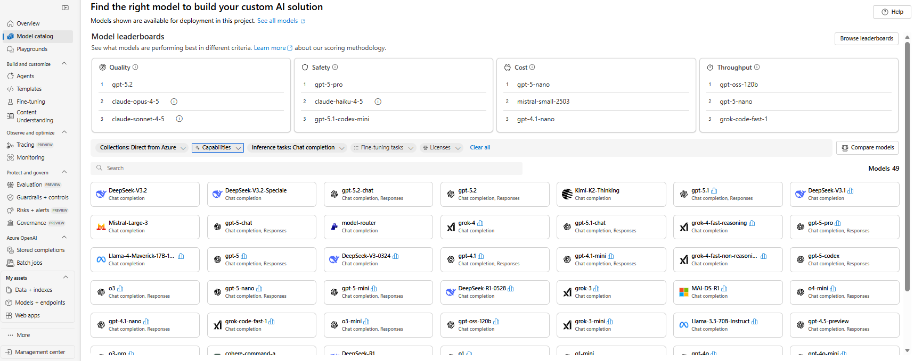

# Azure Direct Models

Azure Direct Models are models hosted and exposed by Microsoft Foundry that you call directly via the Foundry inference APIs, using Microsoft Entra ID–based authentication, instead of Azure OpenAI–specific APIs. This page explains how to switch GPT-RAG’s default inference model (by default, `gpt-4o`) to a different model.

With Azure Direct Models, you can use non–Azure OpenAI models (for example, Mistral, DeepSeek, Grok, etc.) from Azure, while standardizing on Foundry inference APIs with Entra ID identity-based access.

<a id="how-to-find-which-models-you-can-use"></a>

**How to find which models you can use**

Model availability depends on what’s enabled for your tenant, subscription, and region. The easiest way to see what you can use is the  [Foundry Model Catalog](https://ai.azure.com/explore/models). In the catalog, select the `Direct from Azure` collection to focus on Azure Direct models.



<a id="how-to-switch-gpt-rags-default-model"></a>

**Switch chat model**

GPT-RAG provisions with a default model (currently, `gpt-4o`). Most commonly, you change the model at provisioning time. If the solution is already deployed, you can switch the chat model by updating the runtime configuration.

**Provisioning time**

Before you run `azd provision`, set the model in the [`infra/main.parameters.json`](https://github.com/Azure/GPT-RAG/blob/main/infra/main.parameters.json) file (this file is used by the infrastructure provisioning step).

In `infra/main.parameters.json`, update the `model` section.

Example (default)

```json
"model": {
  "format": "OpenAI",
  "name": "gpt-4o",
  "version": "2024-11-20"
}
```

Example (Grok)

Change `format`, `name`, and `version` to match the model you selected in the catalog.

```json
"model": {
  "format": "xAI",
  "name": "grok-4-fast-non-reasoning",
  "version": "1"
}
```

**Models tested**

I tested the end-to-end flow with these models (non-exhaustive list): `DeepSeek-V3.1`, `DeepSeek-V3-0324`, `mistral-small-2503`, `grok-4-fast-non-reasoning`, and `grok-4`.

> Note: available names/versions can change over time. Treat the Microsoft Foundry model catalog (collection `Direct from Azure`) as the source of truth.

**After the solution is deployed**

If you already provisioned GPT-RAG (or you prefer managing models manually), you can still switch models. First, create/select the model deployment in Microsoft Foundry (Model catalog → `Direct from Azure`). Then take the deployment name you created/selected and set it as `CHAT_DEPLOYMENT_NAME` in Azure App Configuration. Finally, restart the orchestrator Container App so it picks up the new value.

<a id="bing-grounding-citations-behavior-by-model-type"></a>

> **Note on Bing Grounding citations**: The Bing Grounding Tool may emit placeholders like &#x3010;0:0&#x2020;source&#x3011;. With OpenAI / Azure OpenAI models, responses include `url_citation` annotations so GPT-RAG can render links. With other Azure Direct models, annotations may be missing, so placeholders are removed.

