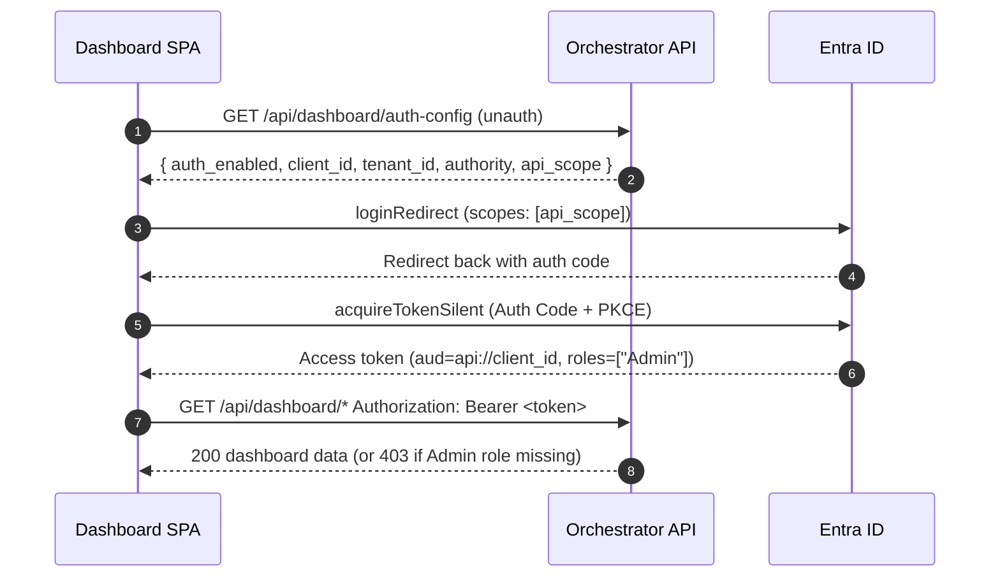

# Admin Dashboard Sign-in

The orchestrator admin dashboard at `/dashboard` signs the operator in with Microsoft Entra ID. This page explains what an operator needs to configure in Entra and in App Configuration to turn that sign-in on, how to assign the `Admin` role, what a working sign-in should look like, and how to diagnose the common failures.

If you are looking for the wider authentication picture (chat UI sign-in, On-Behalf-Of, document-level access control), see [Authentication and Document-Level Security](howto_authentication.md). This page is scoped to the operator dashboard.

This procedure applies to the orchestrator dashboard in the currently released
classic Container Apps topology and in the explicit classic fallback. The
[upcoming hosted-default topology](deploy.md#chat-runtime-modes-upcoming-hosted-default-release)
is hosted/no-panel, does not deploy this dashboard, and requires
`DEPLOY_ADMINISTRATIVE_PANEL=false`. AILZ `v2.5.0` is published, but it still
depends on the remaining compatible component tags, final umbrella pins,
integrated validation, and a new GPT-RAG release. The platform implementation
is merged but unreleased. Hosted/panel is deferred to
[issue #611](https://github.com/Azure/GPT-RAG/issues/611).

## What this is

Until this release, the orchestrator dashboard SPA had no real sign-in. The `require_admin` gate on `/api/dashboard/*` existed, but the only way to feed it a token was to paste one into browser storage. That is now replaced by a proper Entra ID sign-in flow inside the SPA using MSAL (Authorization Code + PKCE, redirect flow):

1. On load, the SPA calls the unauthenticated `GET /api/dashboard/auth-config` and reads whether auth is on and, if so, which tenant, client, authority, and API scope to use.
2. If auth is off, the SPA renders the dashboard as before. The backend gate is a no-op in that mode.
3. If auth is on, the SPA shows a **Sign in** hero. Clicking it triggers a redirect to Entra ID.
4. After the redirect returns, the SPA silently acquires an access token for the orchestrator API and uses it on every `/api/dashboard/*` call.
5. If the user is signed in but the token does not carry the `Admin` app role, the SPA renders a clear "access denied" state instead of the dashboard.

The chat UI is not affected. Only the orchestrator dashboard uses this new flow.



## Prerequisites

- A Microsoft Entra ID tenant and permission to create or edit an App Registration in it.
- An orchestrator Container App already deployed and reachable at a known host (for example `https://<container-app-fqdn>/`).
- Access to the orchestrator's App Configuration store to set the `OAUTH_AZURE_AD_*` keys.
- `ENABLE_DASHBOARD=true` in App Configuration under the `gpt-rag-orchestrator` label. When this flag is off, the dashboard and its routes are not mounted at all.

You can either reuse the App Registration you already created for the chat UI (recommended, so one registration serves both surfaces) or create a dedicated one for the orchestrator API. The steps below assume a single registration.

## 1) Add a SPA redirect URI

The dashboard SPA runs on the same origin as the orchestrator API and needs its redirect URI registered under the **Single-page application** platform, not **Web**. This is the single most common misconfiguration; getting it wrong produces `AADSTS9002326` at sign-in.

In the App Registration:

1. Go to **Manage > Authentication**.
2. Under **Platform configurations** click **Add a platform** and pick **Single-page application**.
3. Add the dashboard origin, with the trailing slash:

    | Environment | Redirect URI |
    | --- | --- |
    | Deployed | `https://<container-app-fqdn>/dashboard/` |
    | Local dev (Vite) | `http://localhost:8000/dashboard/` |

    If a custom domain or Front Door fronts the Container App, register that origin too. The URI must match the browser's address exactly, including scheme, host, port, path, and trailing slash.

4. Leave **Access tokens** and **ID tokens** unchecked. The Auth Code + PKCE flow does not need them enabled at the platform level.

## 2) Expose the `access_as_user` scope on the API

The dashboard requests a delegated scope on the orchestrator's own API so the returned token has the right audience and carries the `Admin` role claim. The default scope name is `access_as_user`.

In **Manage > Expose an API**:

1. If **Application ID URI** is not set yet, click **Set** and accept the default `api://<client-id>`.
2. Click **Add a scope** and fill:

    | Field | Value |
    | --- | --- |
    | Scope name | `access_as_user` |
    | Who can consent? | **Admins and users** (or admins-only, per your policy) |
    | Admin consent display name | `Access GPT-RAG orchestrator as the signed-in user` |
    | Admin consent description | `Allows the orchestrator dashboard to call the orchestrator API on behalf of the signed-in user.` |
    | State | **Enabled** |

The manifest fragment is:

```json
"oauth2Permissions": [
  {
    "adminConsentDescription": "Allows the orchestrator dashboard to call the orchestrator API on behalf of the signed-in user.",
    "adminConsentDisplayName": "Access GPT-RAG orchestrator as the signed-in user",
    "id": "<generate-a-guid>",
    "isEnabled": true,
    "type": "User",
    "userConsentDescription": "Allow the orchestrator dashboard to call the orchestrator API on your behalf.",
    "userConsentDisplayName": "Access GPT-RAG orchestrator as you",
    "value": "access_as_user"
  }
]
```

If you also use the chat UI, you can keep its existing `user_impersonation` scope. Both scopes coexist on the same registration and both return tokens whose audience is your API.

While in the manifest, set `accessTokenAcceptedVersion` to `2`:

```json
"accessTokenAcceptedVersion": 2
```

The orchestrator validates both v1 and v2 tokens, but v2 is the recommended default and is what the SPA will receive.

## 3) Add the `Admin` app role

The gate on `/api/dashboard/*` checks that the caller's access token carries `Admin` in its `roles` claim. Add the role on the same App Registration.

Manifest fragment:

```json
"appRoles": [
  {
    "allowedMemberTypes": ["User"],
    "description": "Grants access to the GPT-RAG operator dashboards.",
    "displayName": "Admin",
    "id": "<generate-a-guid>",
    "isEnabled": true,
    "value": "Admin"
  }
]
```

Or via the CLI:

```
az ad app update --id <orchestrator-client-id> --app-roles '[{
  "allowedMemberTypes": ["User"],
  "description": "Grants access to the GPT-RAG operator dashboards.",
  "displayName": "Admin",
  "isEnabled": true,
  "value": "Admin"
}]'
```

The `Value` field is what the backend compares. It is case-sensitive and must be exactly `Admin`.

Note that `az ad app update --app-roles` replaces the full list. If the registration already defines other app roles (for example ingestion roles), include them all in the same JSON array.

## 4) Set the App Configuration keys

The dashboard reads its runtime auth configuration from the orchestrator's App Configuration store. Set the following keys under the `gpt-rag-orchestrator` label:

| Key | Required | Purpose |
| --- | --- | --- |
| `OAUTH_AZURE_AD_TENANT_ID` | Yes, to enable the gate | Entra tenant id. When unset, the SPA renders without MSAL and `require_admin` is a no-op. |
| `OAUTH_AZURE_AD_CLIENT_ID` | Yes when tenant is set | Application (client) id of the orchestrator API app registration. |
| `OAUTH_AZURE_AD_API_SCOPE` | Optional | Override for the scope the SPA requests. Defaults to `api://<OAUTH_AZURE_AD_CLIENT_ID>/access_as_user`. |

Two rules to keep in mind:

- Setting only `OAUTH_AZURE_AD_TENANT_ID` without `OAUTH_AZURE_AD_CLIENT_ID` is intentionally rejected. `/api/dashboard/auth-config` returns `500` in that case rather than pretending auth is off; the SPA surfaces the misconfiguration instead of silently loading unauthenticated.
- To go back to unauthenticated mode, unset `OAUTH_AZURE_AD_TENANT_ID`. See [Turning sign-in back off](#turning-sign-in-back-off).

The unauthenticated `GET /api/dashboard/auth-config` response looks like this when auth is on:

```json
{
  "auth_enabled": true,
  "client_id": "00000000-0000-0000-0000-000000000000",
  "tenant_id": "11111111-1111-1111-1111-111111111111",
  "authority": "https://login.microsoftonline.com/11111111-1111-1111-1111-111111111111",
  "api_scope": "api://00000000-0000-0000-0000-000000000000/access_as_user"
}
```

And when auth is off:

```json
{ "auth_enabled": false }
```

## 5) Assign the `Admin` role to a user

App role assignments live on the **Enterprise application**, not on the App Registration.

**Portal**

1. Go to **Microsoft Entra ID > Enterprise applications**.
2. Open the enterprise app that matches your App Registration (same client id).
3. Optionally set **Properties > Assignment required?** to **Yes** so only assigned users can sign in.
4. Go to **Users and groups > Add user/group**, pick the user (or a security group), select the **Admin** role, and confirm.

**CLI**

```
CLIENT_ID=<orchestrator-client-id>
USER_UPN=<user@yourtenant.onmicrosoft.com>

SP_ID=$(az ad sp list --filter "appId eq '$CLIENT_ID'" --query "[0].id" -o tsv)
ROLE_ID=$(az ad sp show --id "$SP_ID" --query "appRoles[?value=='Admin'].id | [0]" -o tsv)
USER_ID=$(az ad user show --id "$USER_UPN" --query id -o tsv)

az rest --method POST \
  --uri "https://graph.microsoft.com/v1.0/servicePrincipals/$SP_ID/appRoleAssignments" \
  --headers "Content-Type=application/json" \
  --body "{\"principalId\":\"$USER_ID\",\"resourceId\":\"$SP_ID\",\"appRoleId\":\"$ROLE_ID\"}"
```

For production, prefer assigning a security group. Access tokens issued before an assignment do not carry the role; the user must sign out and back in (or wait for their token to expire) after being assigned.

## 6) Verify

Open the dashboard in a fresh browser session and confirm each of the three states.

| State | What triggers it | Expected view |
| --- | --- | --- |
| Unauthenticated | `OAUTH_AZURE_AD_TENANT_ID` is unset | Dashboard renders directly. No sign-in prompt. |
| Signed in as Admin | Auth on and user has the `Admin` role | Sign-in hero appears, sign-in redirects to Entra, redirect returns, the dashboard loads, and the header shows the user's name with a **Sign out** control. |
| Signed in but not Admin | Auth on and user has no `Admin` role | Sign-in hero appears, sign-in succeeds, then an **Access denied** page explains that the `Admin` app role is missing. No dashboard data is fetched. |

Quick token check. In DevTools **Network** tab, open any `/api/dashboard/*` request, copy the `Authorization` header value, paste it into `https://jwt.ms`, and confirm:

```
"aud": "api://<OAUTH_AZURE_AD_CLIENT_ID>",
"roles": ["Admin"],
"scp": "access_as_user"
```

## Troubleshooting

| Symptom | Likely cause | Fix |
| --- | --- | --- |
| `AADSTS50011: The reply URL specified in the request does not match` | Redirect URI in the app registration does not match the browser origin (scheme, host, port, path, or trailing slash) | Add the exact URI, including trailing slash. `https://<host>/dashboard/` is not the same as `https://<host>/dashboard`. |
| `AADSTS9002326: Cross-origin token redemption is permitted only for the Single-Page Application client type` | The redirect URI was registered under the **Web** platform instead of **Single-page application** | Remove it from **Web** and add it under **Single-page application**. |
| Dashboard reloads to the sign-in hero after every redirect | Third-party cookie blocking or a stale MSAL session | Try a normal window (not private), confirm your browser is not blocking cookies for `login.microsoftonline.com`, and clear site data for the dashboard origin. |
| Signed in successfully but the dashboard shows **Access denied** | Token was issued but is missing `Admin` in `roles` | Assign the user to the `Admin` role on the enterprise app, then sign out and back in. |
| Every `/api/dashboard/*` call returns 401 | Token audience is wrong (Graph or another API) or expired | Confirm `api_scope` in `/api/dashboard/auth-config` matches the scope exposed on the API, and that `OAUTH_AZURE_AD_API_SCOPE`, if set, points at `api://<client_id>/<scope-name>`. |
| Every `/api/dashboard/*` call returns 403 even for an assigned admin | Token was issued before the role assignment, or the token audience is Microsoft Graph | Sign out and back in. Inspect the token in `jwt.ms` and confirm `aud` is `api://<client_id>` and `roles` contains `Admin`. |
| `/api/dashboard/auth-config` returns 500 | `OAUTH_AZURE_AD_TENANT_ID` is set but `OAUTH_AZURE_AD_CLIENT_ID` is not | Set `OAUTH_AZURE_AD_CLIENT_ID` too, or unset the tenant to disable auth. |
| `/dashboard` returns 404 | `ENABLE_DASHBOARD` is not `true` | Set `ENABLE_DASHBOARD=true` under the `gpt-rag-orchestrator` label in App Configuration and restart the container. |
| Local dev returns 401 even though the tenant is not configured for the deployed environment | Your local `.env` still has `OAUTH_AZURE_AD_TENANT_ID` set | Unset it locally to run the SPA without MSAL. |

## Turning sign-in back off

To return the dashboard to unauthenticated mode (for a diagnostic session, or in a lab environment), unset `OAUTH_AZURE_AD_TENANT_ID` in App Configuration and restart the orchestrator Container App revision. On the next load, `/api/dashboard/auth-config` responds with `{"auth_enabled": false}` and the SPA renders without MSAL. The `require_admin` backend gate is a no-op in that mode.

Leave `ENABLE_DASHBOARD=false` if you want to unmount the dashboard entirely instead. That removes both the HTML page and every `/api/dashboard/*` route.

## Backwards-compatibility note

Previous builds of the SPA read a bearer token from `localStorage["dashboard.bearer"]` as a default fallback. That default has been removed. If you have scripts or bookmarklets that used it, switch to signing in through the SPA. An explicit `Authorization` header passed on a scripted request still wins over the MSAL-provided token, so integration tests that already build their own header keep working.
