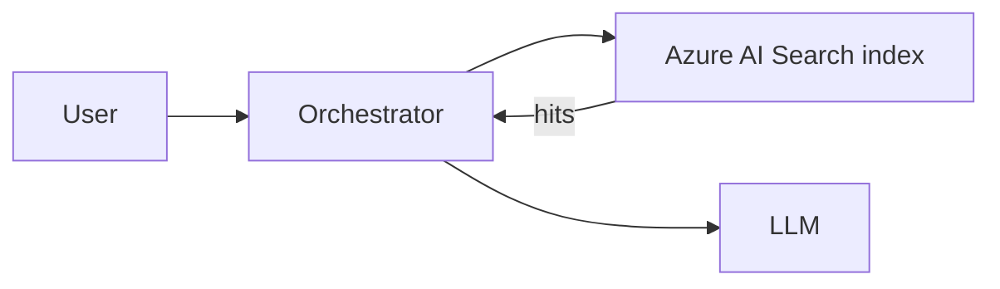

# Direct: Azure AI Search

This is the retrieval path that skips Foundry IQ entirely. The orchestrator
queries the GPT-RAG Azure AI Search index directly. It is not a Foundry IQ
Knowledge Source. It is the alternative to using Foundry IQ.

If you have not read the [Grounding sources overview](howto_grounding_overview.md),
start there. In short: GPT-RAG has one retrieval backend at a time. Setting
`RETRIEVAL_BACKEND=ai_search` selects this path.

## When to use it

- **Existing deployments that are not migrating yet.** Deployments created
  before GPT-RAG v3.0.2 that are running fine on Azure AI Search do not have
  to move.
- **Rollback.** If a Foundry IQ change introduces a problem, flipping the
  backend back to `ai_search` is the fastest way to keep serving traffic
  while you investigate.
- **Environments where Foundry IQ is not desired.** For example, a
  compliance boundary that has not yet approved Foundry IQ, or a scenario
  where you prefer full ownership of the ingestion pipeline and the query
  path with no Knowledge Base in the middle.

For new deployments that do not have one of those reasons, prefer
[Foundry IQ: Documents](howto_grounding_foundry_iq_documents.md).

## What it uses

| Piece | Value |
| --- | --- |
| Retrieval backend | `RETRIEVAL_BACKEND=ai_search` |
| Ingestion | GPT-RAG ingestion service (`gpt-rag-ingestion`) writes to Azure AI Search. |
| Index | The GPT-RAG Azure AI Search index, usually `ragindex`. |
| Security | Enforced through GPT-RAG security fields on the index (`metadata_security_*`) and standard Azure AI Search access control. |

Retrieval does not touch a Foundry IQ Knowledge Base at all. There is no
Knowledge Source configuration to keep in sync. Every query goes straight to
the Search index.



## Enabling it

For a new deployment or to roll back from Foundry IQ:

```powershell
az appconfig kv set `
  --name <app-config-name> `
  --key RETRIEVAL_BACKEND `
  --value ai_search `
  --label gpt-rag `
  --yes
```

Restart the orchestrator Container App so the startup selector is re-read.

Verify by asking a known retrieval question and confirming citations come
from the GPT-RAG Azure AI Search index.

You do not need to delete a Foundry IQ Knowledge Base to roll back. Leave it
in place while you investigate the issue that pushed you off Foundry IQ.

## Security

Security on this path is enforced through GPT-RAG security fields on the
index:

```
metadata_security_user_ids
metadata_security_group_ids
metadata_security_rbac_scope
```

Document-level access control is enforced by Azure AI Search when the index
is configured for document permissions (see `permissionFilterOption` in the
index definition) and documents include permission metadata. The
orchestrator sends a filter over these fields for the signed-in user. See
[Auth and Doc Security](howto_authentication.md) for the full details.

## When to move to Foundry IQ

Move when you want one of the things Foundry IQ gives you and this path does
not:

- A single Knowledge Base that can blend multiple sources (documents,
  Microsoft 365 via Work IQ, Fabric IQ when it ships).
- Native permission ingestion for ADLS Gen2 ACLs, SharePoint,
  OneLake/Fabric, or Purview labels, evaluated through
  `x-ms-query-source-authorization`.
- The default Blob path where Foundry IQ handles content extraction,
  chunking, vectorization, and refresh without a custom ingestion pipeline.

The custom ingestion path in Foundry IQ lets you keep the GPT-RAG ingestion
pipeline exactly as it is today, and only changes how retrieval is routed.
See [Foundry IQ: Documents, custom ingestion path](howto_grounding_foundry_iq_documents.md#custom-ingestion-path).

## Related reading

- [Grounding sources overview](howto_grounding_overview.md)
- [Foundry IQ: Documents](howto_grounding_foundry_iq_documents.md)
- [Auth and Doc Security](howto_authentication.md)
