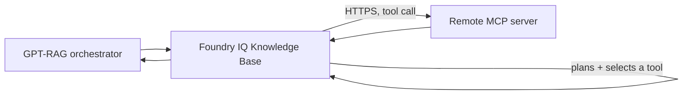

# Foundry IQ: Generic MCP server knowledge sources

The `mcpServer` Foundry IQ knowledge source lets the Knowledge Base call
tools exposed by a remote [Model Context Protocol (MCP)](https://modelcontextprotocol.io/)
server you operate or trust, and blend the results with your other Foundry
IQ sources (documents, Work IQ, Fabric, SharePoint, Web, and so on) in a
single retrieve call. GPT-RAG's provisioning template is server-agnostic:
it does not hard-code any particular MCP server. Azure Monitor MCP over
workspace-scoped Application Insights / Log Analytics is used below as the
worked reference scenario.

If you have not read the [Grounding sources overview](howto_grounding_overview.md),
start there.

!!! warning "Preview configuration, not yet available end to end"
    MCP Server knowledge sources use a preview Foundry IQ knowledge-source
    kind (`mcpServer`) on the `2026-05-01-preview` Azure AI Search API.
    Behavior and configuration may change without notice; do not depend on
    this for production workloads until it is generally available.

    The `FOUNDRY_IQ_MCP_*` settings on this page match the proposed
    provisioning implementation in
    [GPT-RAG code PR #568](https://github.com/Azure/GPT-RAG/pull/568).
    They are not available in a released GPT-RAG version yet. That PR
    registers the source, while the required `messages` request and
    query-time authentication support ships in
    [gpt-rag-orchestrator `v3.7.0`](https://github.com/Azure/gpt-rag-orchestrator/releases/tag/v3.7.0).
    Keep `FOUNDRY_IQ_MCP_ENABLED=false` until you deploy both the provisioning
    change and orchestrator `v3.7.0` or later.

    An MCP server is a **remote, tool-invoking endpoint**.
    Azure AI Search's knowledge-base planner decides which tool to call and
    generates that tool's arguments from the user's question. Tool safety
    does not guarantee semantic correctness of the generated arguments.
    Only point this at MCP servers you trust, scope every tool to
    read-only, bounded operations, and review the
    [Security](#security-and-trust-boundary) section below before you
    enable this in any environment that is not fully isolated.

> Complete the [Foundry IQ prerequisites](howto_grounding_foundry_iq_prereqs.md)
> first. The Prerequisites section below covers only what is specific to
> this source.

## How it works

When the provisioning and compatible runtime changes are both deployed,
Azure AI Search calls the registered MCP server directly over HTTPS:



1. Orchestrator `v3.7.0` or later sends a `messages`-based retrieve request to the
   Knowledge Base with `low` or `medium` reasoning effort (never
   `minimal`). Minimal reasoning skips query planning entirely, and MCP
   tool selection and argument generation require the planner to run.
2. The Knowledge Base's planning model (see
   [Knowledge base planning model](#knowledge-base-planning-model) below)
   decides whether to call the MCP source, which tool to invoke, and what
   arguments to generate for it.
3. Azure AI Search invokes the governed remote HTTPS MCP endpoint you
   registered -- the exact `serverURL` from your configuration, never a
   value supplied by the end user or by the orchestrator at query time.
   Only the tools you explicitly allowlisted per source can be called.
4. The tool output is parsed according to the `outputParsing` object and
   returned in the normal retrieve response. Each MCP call appears in the
   `activity` array. Each result appears in `references` and points back to
   its activity entry through `activitySource`.

The MCP `references` entries do **not** contain the knowledge-source name.
The name appears as `knowledgeSourceName` on the matching `activity` entry.
Join `references[].activitySource` to `activity[].id` when you need to
identify which source produced a citation.

The user request and the retrieve response still pass through the
orchestrator. Only the MCP tool call travels directly from Azure AI Search
to the registered remote HTTPS endpoint. Query-time credential forwarding
is an orchestrator responsibility implemented in `v3.7.0` and later, not by
code PR #568.

## When to use a generic MCP source

Use an MCP Server knowledge source when:

- You need live, tool-backed data (metrics, logs, a ticketing system, an
  internal API) that cannot be pre-indexed, and an MCP server already
  exposes it with a bounded, read-only tool surface.
- You control or trust the MCP server's operator and network exposure, and
  you have a supported way to authenticate the Azure AI Search call to it.
- You can accept that the knowledge base's planning model, not a human,
  decides when to call the tool and what arguments to generate.

Do not use it when:

- The MCP server is untrusted, publicly writable, or you cannot audit the
  arguments the planner generates.
- The data is better served by an indexed knowledge source (Blob, AI
  Search index, SharePoint indexed, OneLake). Indexed sources have a much
  smaller trust surface than a live tool call.
- The only way to authenticate the endpoint would be to put a literal
  credential, header value, cookie, or connection string in configuration.
  GPT-RAG rejects that material. Use only the non-secret `queryHeaders`
  references described in [Authentication](#authentication), with a
  orchestrator `v3.7.0` or later, which resolves them at request time.

## Prerequisites

All of these are hard blockers. Work through them in order.

1. **The MCP server must be reachable over HTTPS with a fixed, production
   hostname.** No IP-literal endpoints, no `localhost`, no query strings
   with embedded credentials. See [Trusted hosts](#trusted-hosts).
2. **Orchestrator `v3.7.0` or later and a supported endpoint authentication
   path.** Optional `queryHeaders` metadata tells the orchestrator how to
   resolve a header at request time; code PR #568 only provisions and
   validates that metadata.
   Do not assume Azure AI Search automatically presents its managed identity
   to the MCP endpoint. See [Authentication](#authentication).
3. **Every tool you intend to call is explicitly allowlisted.** There is
   no "allow all tools" option. Add each tool by name with its own
   `inclusionMode`, `outputParsing`, and `maxOutputTokens`.
4. **A knowledge base planning model.** MCP requires `low` or `medium`
   `retrievalReasoningEffort`, which requires an Azure OpenAI chat model
   on the knowledge base. See
   [Knowledge base planning model](#knowledge-base-planning-model).
5. **Network egress review.** Confirm with your network/security owner
   that the Azure AI Search service is allowed to call the MCP server's
   hostname, and that the MCP server's ingress is restricted to expected
   callers. See [Network and gateway guidance](#network-and-gateway-guidance).

## Configure a generic MCP source

The proposed MCP support is opt-in and defaults to off. After code PR #568
is available, `azd provision` seeds five keys under the `gpt-rag` label
with safe defaults (`FOUNDRY_IQ_MCP_ENABLED=false`, an empty source list,
and conservative defaults for the rest). You do not have to create them by
hand.

When MCP is disabled, provisioning keeps
`FOUNDRY_IQ_MCP_SOURCES_JSON=[]` as the canonical value in App
Configuration. It does not parse or re-persist stale source content. The
Search template renders no MCP source or reference and preserves the
disabled Knowledge Base settings described in
[Knowledge base planning model](#knowledge-base-planning-model).

| Key | Default | Purpose |
| --- | --- | --- |
| `FOUNDRY_IQ_MCP_ENABLED` | `false` | `true` to enable, `false` to disable. |
| `FOUNDRY_IQ_MCP_SOURCES_JSON` | `[]` | JSON array of MCP source objects. See schema below. |
| `FOUNDRY_IQ_MCP_REASONING_EFFORT` | `low` | `low` or `medium`. Controls the knowledge base's `retrievalReasoningEffort` when MCP is enabled. |
| `FOUNDRY_IQ_MCP_TRUSTED_HOSTS` | `` (empty) | Comma-separated allowlist of exact hostnames. Every `serverURL` host must match one of these exactly. |
| `FOUNDRY_IQ_MCP_LOG_TOOL_ARGUMENTS` | `false` | Enables bounded, recursively redacted debug argument logging in orchestrator `v3.7.0` or later. Leave it `false` because arguments can contain user or customer data. |

### Source schema

Each entry in `FOUNDRY_IQ_MCP_SOURCES_JSON` is a JSON object:

```json
{
  "name": "monitor-mcp-ks",
  "description": "Azure Monitor MCP over the platform Log Analytics workspace",
  "serverURL": "https://monitor-mcp.contoso.com/mcp",
  "tools": [
    {
      "name": "query_logs",
      "outputParsing": {
        "kind": "auto"
      },
      "inclusionMode": "reranked",
      "maxOutputTokens": 4096
    }
  ],
  "queryHeaders": [
    {
      "name": "Authorization",
      "valueFrom": {
        "kind": "managedIdentity",
        "scope": "api://monitor-mcp/.default"
      }
    }
  ]
}
```

| Field | Required | Notes |
| --- | --- | --- |
| `name` | Yes | Unique across all MCP sources. Becomes the knowledge-source name. |
| `description` | No | Defaults to a generic description if omitted. |
| `serverURL` | Yes | Must be `https://`, with no userinfo, query string, fragment, IP literal, or local/reserved host. Its host must exactly match an entry in `FOUNDRY_IQ_MCP_TRUSTED_HOSTS`. |
| `tools` | Yes | Non-empty array. Every tool the planner is allowed to call. |
| `queryHeaders` | No | Array of `{name, valueFrom}` objects containing only non-secret request-time resolution metadata. Stored in App Configuration for orchestrator `v3.7.0` or later, but never rendered into Search registration or retrieve parameters. |

Each tool object:

| Field | Required | Notes |
| --- | --- | --- |
| `name` | Yes | Unique within the source. |
| `outputParsing` | Yes | Object with `kind` set to `auto`, `json`, `split`, or `none`. |
| `outputParsing.jsonParameters` | Only if `kind` is `json` | Object containing a non-empty `documentsPath`. It is rejected for every other kind. |
| `inclusionMode` | Yes | `reranked` (only included when the reranker judges it relevant) or `always` (always passed to the model; budget accordingly). |
| `maxOutputTokens` | Yes | Positive integer. Provisioning enforces a local cap of `8192` regardless of what the Search service would otherwise accept, to bound cost and prompt size. |

For JSON tool output, use the nested Search schema exactly:

```json
{
  "outputParsing": {
    "kind": "json",
    "jsonParameters": {
      "documentsPath": "$.results"
    }
  }
}
```

Each `queryHeaders` entry has a `name` and a `valueFrom` object:

| `valueFrom.kind` | Required metadata | Do not include |
| --- | --- | --- |
| `managedIdentity` | Explicit, non-secret `scope` | `secretName` or any credential value |
| `obo` | Explicit, non-secret `scope` | `secretName` or any credential value |
| `keyVaultSecret` | `secretName` only | `scope` or the secret value |
| `none` | None | `scope`, `secretName`, or any credential value |

Header names must be valid HTTP field names and unique within a source,
ignoring case. `Host`, `Content-Length`, and hop-by-hop headers are rejected.
For `keyVaultSecret`, store the secret in Key Vault and provide only its
name. Never put the secret value in this JSON.

`queryHeaders` is runtime-only metadata. Provisioning validates and
canonicalizes it, then stores it as part of
`FOUNDRY_IQ_MCP_SOURCES_JSON` in App Configuration so a compatible
orchestrator can resolve the value when it builds a retrieve request. The
metadata is deliberately omitted from both the Azure AI Search
knowledge-source registration and Knowledge Base retrieve parameters.

After code PR #568 is available, `azd provision` parses and validates this
JSON during setup and **fails the
deployment closed** if it is invalid while `FOUNDRY_IQ_MCP_ENABLED=true`:
malformed JSON, zero sources, zero tools, duplicate source or tool names,
a non-`https` scheme, userinfo, query string, or fragment in `serverURL`,
an IP-literal, local, or reserved host, a host outside
`FOUNDRY_IQ_MCP_TRUSTED_HOSTS`, an unsupported `outputParsing.kind` or
`inclusionMode`, invalid JSON output parameters, a non-positive or
over-cap `maxOutputTokens`, invalid `queryHeaders`, or any forbidden
credential material. `auth` and `authentication` remain forbidden.
Literal credential values, secrets, headers, cookies, tokens, passwords,
credentials, and connection strings are rejected at any nesting depth.
Validation aborts provisioning with an actionable error instead of
silently registering a broken or insecure source.

### Trusted hosts

`FOUNDRY_IQ_MCP_TRUSTED_HOSTS` is a comma-separated allowlist of exact
hostnames (not URLs, not wildcards, not CIDR ranges). Every `serverURL`
you configure must have a host that matches one of these entries exactly
(case-insensitive). This is defense in depth on top of the network-level
egress control described in
[Network and gateway guidance](#network-and-gateway-guidance): even if an
operator fat-fingers a source's `serverURL`, provisioning refuses to
register a knowledge source pointing anywhere the allowlist has not
explicitly approved. IP literals are always rejected outright (this
blocks loopback, link-local, and other reserved ranges by construction),
so the allowlist is DNS-hostname-only.

### Authentication

There are two separate authentication hops:

1. The orchestrator authenticates to Azure AI Search to call the Knowledge
   Base.
2. Azure AI Search calls the MCP endpoint and must satisfy that endpoint's
   authentication requirements.

Do not treat the trusted-host list, private DNS, an IP allowlist, TLS, or
CORS as authentication. CORS is a browser control and does not protect this
server-to-server call.

Azure AI Search currently documents three endpoint-authentication patterns:

- `foundryConnection`, only when Foundry Agent Service invokes the
  Knowledge Base. It does not apply to GPT-RAG's direct retrieve call.
- `storedHeaders`, for static credentials. GPT-RAG code PR #568 does not
  render this option and rejects literal credentials.
- Paired query-time control headers, prefixed with the knowledge-source
  name. This is the appropriate upstream mechanism for rotating or
  per-request credentials. It requires orchestrator `v3.7.0` or later.

Use `queryHeaders` to describe request-time resolution without storing a
credential:

- **`managedIdentity`** requires an explicit, non-secret `scope`.
  Orchestrator `v3.7.0` or later obtains an app-only token for that scope. Every
  user receives the same MCP authorization scope.
- **`obo`** requires an explicit, non-secret `scope`. Orchestrator `v3.7.0`
  or later exchanges the signed-in user's delegated token. Use it only
  when the MCP server enforces per-user authorization.
- **`keyVaultSecret`** requires only `secretName`. Orchestrator `v3.7.0` or
  later reads the secret at request time. The secret value never
  belongs in App Configuration.
- **`none`** has no `scope`, `secretName`, or other credential fields.

Code PR #568 stores only this validated metadata. It does not add the
orchestrator logic that resolves a managed identity token, OBO token, or
Key Vault secret, and it never emits an `authentication` block,
`queryHeaders`, or credential fields to Azure AI Search. That runtime logic
ships in orchestrator `v3.7.0` and later.

`auth` and `authentication` are forbidden, not accepted for
validation-only use. Literal API keys, bearer tokens, passwords, secret
values, header blobs, cookies, credentials, and connection strings are
also rejected. **Never put credential material in
`FOUNDRY_IQ_MCP_SOURCES_JSON` or App Configuration.**

Do not use an orchestrator older than `v3.7.0` with an MCP endpoint that
requires credentials, because it cannot forward the documented paired
headers. Do not expose an unauthenticated MCP endpoint to the public internet.

### Knowledge base planning model

When at least one MCP source is enabled, the knowledge base's `models`
array is populated with the same Azure OpenAI model object GPT-RAG already
renders for standard-mode Blob content extraction (reusing
`FOUNDRY_IQ_AI_SERVICES_ENDPOINT`, `CHAT_DEPLOYMENT_NAME`'s deployment, and
model name from `MODEL_DEPLOYMENTS`), and `retrievalReasoningEffort` is set
to `FOUNDRY_IQ_MCP_REASONING_EFFORT` (`low` by default, or `medium`).
Provisioning fails closed if no chat model or AI Services endpoint can be
resolved, since the planner cannot select or call an MCP tool without one.
When MCP is disabled, `models` stays `[]` and reasoning effort stays
`minimal`, exactly as before this feature existed.

## Reference scenario: Azure Monitor MCP

Azure Monitor MCP over a workspace-scoped Log Analytics workspace is the
motivating scenario for this feature, used here purely as a worked
example. The template has no Azure Monitor-specific code path.

1. Deploy or identify an Azure Monitor MCP endpoint. Put it behind API
   Management or an equivalent gateway, and restrict the backend to one
   Log Analytics workspace or a small, explicit set of workspaces.
2. Identify the principal that actually queries Log Analytics:
    - If the hosted MCP server uses its own managed identity, grant that
      identity access.
    - If orchestrator `v3.7.0` or later forwards an app-only or OBO token, grant
      the principal represented by that token access.

   Do **not** grant the Azure AI Search service identity Log Analytics
   access unless your endpoint has a separately verified design that
   authenticates and uses that identity.
3. Assign **Log Analytics Data Reader** at the **workspace scope**, not at
   subscription or resource-group scope. Do not grant Contributor.
4. Expose only the Azure Monitor MCP workspace-log query tool. Get its
   exact name from the endpoint's `tools/list` response because tool names
   can change between Azure MCP Server versions. Enforce these controls in
   the MCP server or gateway, not only in the prompt:
    - A bounded lookback, such as 24 hours.
    - A row cap, such as 100 rows.
    - Read-only KQL, with no management commands or unapproved
      cross-workspace queries.
    - Auditable tool arguments and generated KQL. Payloads can contain
      customer data, so log them only in a controlled environment and
      apply retention and access controls.
5. Add the source to `FOUNDRY_IQ_MCP_SOURCES_JSON`. Replace
   `<workspace-log-query-tool>` with the exact name returned by
   `tools/list`:

   ```json
   [
     {
       "name": "azure-monitor-mcp-ks",
       "description": "Azure Monitor MCP over the platform observability workspace",
       "serverURL": "https://azmon-mcp.contoso.com/mcp",
       "tools": [
         {
           "name": "<workspace-log-query-tool>",
           "outputParsing": {
             "kind": "auto"
           },
           "inclusionMode": "reranked",
           "maxOutputTokens": 4096
         }
       ],
       "queryHeaders": [
         {
           "name": "Authorization",
           "valueFrom": {
             "kind": "managedIdentity",
             "scope": "api://azure-monitor-mcp/.default"
           }
         }
       ]
     }
   ]
   ```

   Replace the sample `scope` with the application ID URI exposed by your
   MCP gateway. It is metadata, not a token or secret.
6. Add `azmon-mcp.contoso.com` to `FOUNDRY_IQ_MCP_TRUSTED_HOSTS`. In an
   isolated test environment with provisioning from PR #568 and orchestrator
   `v3.7.0` or later, set `FOUNDRY_IQ_MCP_ENABLED=true` and run
   `azd hooks run postprovision` or `azd provision`.
7. Ask a bounded question, such as "Were there any 5xx spikes on the
   checkout service in the last 24 hours? Limit the result to 100 rows."
   Review the generated KQL before trusting the answer. A safe query should
   contain both a time predicate and a result cap, for example:

   ```kusto
   AppRequests
   | where TimeGenerated >= ago(24h)
   | where ResultCode startswith "5"
   | summarize failures = count() by bin(TimeGenerated, 15m)
   | top 100 by TimeGenerated desc
   ```

The bounded time range, row cap, read-only role, and auditable KQL are the
minimum controls for exposing a natural-language-to-KQL tool to an LLM
planner.

## Network and gateway guidance

The trusted-host allowlist in this template is provisioning-time defense
in depth, not a substitute for network-level control. Before enabling any
MCP source outside a fully isolated test environment:

- **Put the MCP server behind Azure API Management or an equivalent
  gateway** so authentication, authorization, rate limiting, and
  request logging do not depend only on the MCP implementation. Point
  `serverURL` at the gateway endpoint, then add the gateway hostname to
  `FOUNDRY_IQ_MCP_TRUSTED_HOSTS`. See
  [Expose and govern an existing MCP server](https://learn.microsoft.com/azure/api-management/expose-existing-mcp-server),
  [Secure access to MCP servers](https://learn.microsoft.com/azure/api-management/secure-mcp-servers),
  [About MCP servers in Azure API Management](https://learn.microsoft.com/azure/api-management/mcp-server-overview),
  and [Monitor MCP server traffic in Azure API Management](https://learn.microsoft.com/azure/api-management/monitor-mcp-servers).
- **Rate-limit the MCP endpoint.** The knowledge base planner can call a
  tool on every retrieve request that selects it; an unbounded MCP server
  behind a popular knowledge base is an unbounded cost and load surface.
- **Restrict egress from Azure AI Search and ingress on the MCP server**
  to each other where your network topology allows it (private endpoints,
  IP allowlists, or an API Management instance with its own private
  ingress). If the Azure AI Search service is deployed with network
  isolation, confirm the MCP server's hostname is reachable through the
  same private path other outbound Search traffic uses.
- **Treat network controls and CORS as defense in depth.** Private
  connectivity and IP rules reduce exposure but do not identify the
  caller. CORS controls browser JavaScript and does not authenticate Azure
  AI Search. Require endpoint authentication as well.
- **Do not expose write-capable or destructive tools.** Every tool
  allowlisted in `FOUNDRY_IQ_MCP_SOURCES_JSON` should be safe to call
  automatically and repeatedly, with no meaningful side effect if the
  planner calls it with unexpected arguments.

## Security and trust boundary

- The knowledge base planning model, not GPT-RAG code, decides when to
  call an MCP tool and what arguments to pass. Treat every allowlisted
  tool as something that **will** be called with LLM-generated arguments
  during normal operation, not as a theoretical capability.
- MCP tool safety (the server rejecting unsafe calls) does not guarantee
  semantic correctness (the server accepting a syntactically valid but
  wrong query and returning misleading results). Bound blast radius at the
  MCP server itself, not just at the GPT-RAG configuration layer.
- Nothing in code PR #568 accepts or forwards literal credentials. A
  `keyVaultSecret` entry contains only a secret name, never the secret
  value. Azure AI Search supports stored headers, but GPT-RAG intentionally
  does not expose that option because it would place long-lived secrets in
  configuration. Do not work around missing runtime support by embedding a
  token, header value, cookie, or connection string in
  `FOUNDRY_IQ_MCP_SOURCES_JSON`, an environment variable, or App
  Configuration. Use a gateway and orchestrator `v3.7.0` or later, which
  resolves validated `queryHeaders` metadata at request time.

## Rollout, canary, and rollback

- **Canary.** First deploy provisioning from PR #568 and orchestrator `v3.7.0` or later
  in a non-production environment. Enable one source with one low-risk,
  read-only tool. Confirm the endpoint receives authenticated calls and
  review the generated arguments before adding tools or sources.
- **Rollout.** Add sources and tools incrementally. Each source is
  independent; a problem with one MCP server does not require disabling
  the others.
- **Rollback.** Set `FOUNDRY_IQ_MCP_ENABLED=false` and run
  `azd hooks run postprovision` or `azd provision`. This removes the MCP
  references from the Knowledge Base, writes the canonical
  `FOUNDRY_IQ_MCP_SOURCES_JSON=[]` value to App Configuration, and restores
  `models=[]` and `retrievalReasoningEffort=minimal`. Stale source content is
  neither parsed nor re-persisted while disabled. The top-level MCP
  knowledge-source object can remain registered in Azure AI Search because
  provisioning does not delete objects that disappear from the template.
  It is unused after the Knowledge Base reference is removed. Delete it
  separately only after you verify that no Knowledge Base references it.

## Production blockers

Do not promote an MCP source to a production environment until all of the
following are true:

- The `serverURL` is the actual production endpoint, not a development or
  staging hostname left over from testing.
- Orchestrator `v3.7.0` or later sends `messages`-based retrieval and the
  endpoint authentication has been tested. Code PR #568 alone is not
  sufficient.
- Every tool name in `FOUNDRY_IQ_MCP_SOURCES_JSON` matches the MCP
  server's real, current tool names. A stale tool name fails at
  registration or, worse, silently never gets selected by the planner.
- The identity used for the MCP endpoint and the identity used by the MCP
  tool against its backend have both been reviewed for the correct token
  audience and least-privilege role.
- The network and gateway guidance above has been reviewed and signed off
  by whoever owns egress/ingress policy for your environment.

## Troubleshooting

- **Deployment fails during Search setup with a message naming
  `FOUNDRY_IQ_MCP_SOURCES_JSON`.** Provisioning validation rejected your
  configuration. The error message names the exact field and rule that
  failed (for example, an untrusted host, a duplicate name, or a missing
  `outputParsing.jsonParameters.documentsPath`). Fix the JSON and re-run
  `azd hooks run postprovision`.
- **No MCP citations in responses.** Confirm `FOUNDRY_IQ_MCP_ENABLED=true`,
  that `FOUNDRY_IQ_MCP_SOURCES_JSON` has at least one source, and that
  `FOUNDRY_IQ_MCP_REASONING_EFFORT` is `low` or `medium`. Also confirm
  that your orchestrator is `v3.7.0` or later.
  To identify the source for a citation, join its `activitySource` to the
  matching activity record; the reference itself has no source name.
- **Planner never selects the MCP tool.** Reasoning effort, tool
  description quality, and `inclusionMode` all affect selection. Try
  `medium` reasoning, or `inclusionMode: "always"` while diagnosing (then
  revert to `reranked` once you confirm the tool works, to control token
  usage).
- **Registration succeeds but calls fail at query time with an
  authentication error.** Registration does not prove endpoint
  authentication works. Confirm orchestrator `v3.7.0` or later sends the
  paired query-time headers, the token audience matches the MCP gateway,
  and the gateway accepts the app-only or OBO identity you selected.

## Related reading

- [Grounding sources overview](howto_grounding_overview.md)
- [Foundry IQ prerequisites](howto_grounding_foundry_iq_prereqs.md)
- [Foundry IQ: Web grounding](howto_grounding_web_bing.md)
- Microsoft Learn: [What is a knowledge source?](https://learn.microsoft.com/azure/search/agentic-knowledge-source-overview)
- Microsoft Learn: [Create an MCP Server knowledge source](https://learn.microsoft.com/azure/search/agentic-knowledge-source-how-to-mcp-server)
- Microsoft Learn: [Create a Knowledge Base](https://learn.microsoft.com/azure/search/agentic-retrieval-how-to-create-knowledge-base)
- Microsoft Learn: [Query a Knowledge Base and review activity and references](https://learn.microsoft.com/azure/search/agentic-retrieval-how-to-retrieve)
- Microsoft Learn: [Build agents using Model Context Protocol on Azure](https://learn.microsoft.com/azure/developer/ai/intro-agents-mcp)
- Microsoft Learn: [Expose and govern an existing MCP server](https://learn.microsoft.com/azure/api-management/expose-existing-mcp-server)
- Microsoft Learn: [Secure access to MCP servers](https://learn.microsoft.com/azure/api-management/secure-mcp-servers)
- Microsoft Learn: [About MCP servers in Azure API Management](https://learn.microsoft.com/azure/api-management/mcp-server-overview)
- Microsoft Learn: [Azure MCP Server tools for Azure Monitor and Workbooks](https://learn.microsoft.com/azure/developer/azure-mcp-server/tools/azure-monitor)
- Microsoft Learn: [Log Analytics Data Reader built-in role](https://learn.microsoft.com/azure/role-based-access-control/built-in-roles/monitor#log-analytics-data-reader)
- [Microsoft preview terms](https://azure.microsoft.com/support/legal/preview-supplemental-terms/)
