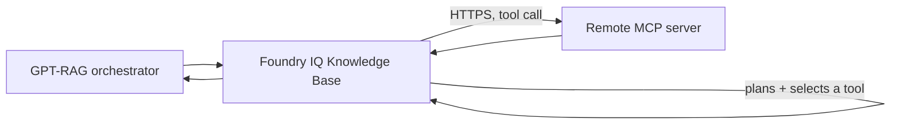

# Foundry IQ: Generic MCP Server knowledge sources

The `mcpServer` Foundry IQ knowledge source lets the Knowledge Base call
tools exposed by a remote [Model Context Protocol (MCP)](https://modelcontextprotocol.io/)
server you operate or trust, and blend the results with your other Foundry
IQ sources (documents, Work IQ, Fabric, SharePoint, Web, and so on) in a
single retrieve call. GPT-RAG's provisioning template is server-agnostic:
it does not hard-code any particular MCP server. Azure Monitor MCP over
workspace-scoped Application Insights / Log Analytics is used below as the
worked reference scenario, but any MCP server that speaks the documented
protocol and that you have added to the trusted host allowlist will work
the same way.

If you have not read the [Grounding sources overview](howto_grounding_overview.md),
start there.

!!! warning "Preview, remote code execution surface, read this before enabling"
    MCP Server knowledge sources use a preview Foundry IQ knowledge-source
    kind (`mcpServer`) on the `2026-05-01-preview` Azure AI Search API.
    Behavior and configuration may change without notice; do not depend on
    this for production workloads until it is generally available.

    More importantly: an MCP server is a **remote, tool-invoking endpoint**.
    Azure AI Search's knowledge-base planner decides which tool to call and
    generates that tool's arguments from the user's question. Tool safety
    does not guarantee semantic correctness of the generated arguments.
    Only point this at MCP servers you trust, scope every tool to
    read-only, bounded operations, and review the
    [Security](#security-and-trust-boundary) section below before you
    enable this in any environment that is not fully isolated.

> Complete the [Foundry IQ prerequisites](howto_grounding_foundry_iq_prereqs.md)
> first. The Prerequisites section below covers only what is specific to
> this source.

## How it works

At retrieval time, the Knowledge Base -- not the GPT-RAG orchestrator --
calls the configured MCP server directly over HTTPS:



1. The orchestrator sends a `messages`-based retrieve request to the
   Knowledge Base with `low` or `medium` reasoning effort (never
   `minimal`). Minimal reasoning skips query planning entirely, and MCP
   tool selection and argument generation require the planner to run.
2. The Knowledge Base's planning model (see
   [Knowledge base planning model](#knowledge-base-planning-model) below)
   decides whether to call the MCP source, which tool to invoke, and what
   arguments to generate for it.
3. Azure AI Search invokes the governed remote HTTPS MCP endpoint you
   registered -- the exact `serverURL` from your configuration, never a
   value supplied by the end user or by the orchestrator at query time.
   Only the tools you explicitly allowlisted per source can be called.
4. The tool's structured output is parsed according to the `outputParsing`
   mode you configured, folded into the retrieve response, and normalized
   into the standard reference contract alongside document and other
   knowledge-source hits.

GPT-RAG's provisioning template never sends request or response bodies
through the orchestrator for this source; the call is entirely between
Azure AI Search and the MCP server. Query-time credential forwarding (for
MCP servers that need a caller-specific token) is orchestrator-side work
tracked separately and is out of scope for this page.

## When to use a generic MCP source

Use an MCP Server knowledge source when:

- You need live, tool-backed data (metrics, logs, a ticketing system, an
  internal API) that cannot be pre-indexed, and an MCP server already
  exposes it with a bounded, read-only tool surface.
- You control or trust the MCP server's operator, its network exposure,
  and the identity Azure AI Search uses to reach it.
- You can accept that the knowledge base's planning model, not a human,
  decides when to call the tool and what arguments to generate.

Do not use it when:

- The MCP server is untrusted, publicly writable, or you cannot audit the
  arguments the planner generates.
- The data is better served by an indexed knowledge source (Blob, AI
  Search index, SharePoint indexed, OneLake). Indexed sources have a much
  smaller trust surface than a live tool call.
- You need static, long-lived credential (API key or bearer token)
  authentication. This provisioning template does not support that yet;
  see [Authentication](#authentication) below.

## Prerequisites

All of these are hard blockers. Work through them in order.

1. **The MCP server must be reachable over HTTPS with a fixed, production
   hostname.** No IP-literal endpoints, no `localhost`, no query strings
   with embedded credentials. See [Trusted hosts](#trusted-hosts).
2. **Managed-identity-only authentication.** Azure AI Search must be able
   to reach the MCP server using its own identity (directly, or because
   the MCP server sits behind something -- an API Management gateway, an
   Azure Monitor-style RBAC-protected endpoint -- that recognizes that
   identity). See [Authentication](#authentication).
3. **Every tool you intend to call is explicitly allowlisted.** There is
   no "allow all tools" option. Add each tool by name with its own
   `inclusionMode`, `outputParsing`, and `maxOutputTokens`.
4. **A knowledge base planning model.** MCP requires `low` or `medium`
   `retrievalReasoningEffort`, which requires an Azure OpenAI chat model
   on the knowledge base. See
   [Knowledge base planning model](#knowledge-base-planning-model).
5. **Network egress review.** Confirm with your network/security owner
   that the Azure AI Search service is allowed to call the MCP server's
   hostname, and that the MCP server's ingress is restricted to expected
   callers. See [Network and gateway guidance](#network-and-gateway-guidance).

## Configure a generic MCP source

MCP support is opt-in and defaults to off. `azd provision` seeds five keys
under the `gpt-rag` label with safe defaults (`FOUNDRY_IQ_MCP_ENABLED=false`,
an empty source list, and conservative defaults for the rest). You do not
have to create them by hand.

| Key | Default | Purpose |
| --- | --- | --- |
| `FOUNDRY_IQ_MCP_ENABLED` | `false` | `true` to enable, `false` to disable. |
| `FOUNDRY_IQ_MCP_SOURCES_JSON` | `[]` | JSON array of MCP source objects. See schema below. |
| `FOUNDRY_IQ_MCP_REASONING_EFFORT` | `low` | `low` or `medium`. Controls the knowledge base's `retrievalReasoningEffort` when MCP is enabled. |
| `FOUNDRY_IQ_MCP_TRUSTED_HOSTS` | `` (empty) | Comma-separated allowlist of exact hostnames. Every `serverURL` host must match one of these exactly. |
| `FOUNDRY_IQ_MCP_LOG_TOOL_ARGUMENTS` | `false` | Orchestrator-side flag reserved for verbose troubleshooting logging of generated tool arguments. Leave `false` outside a debugging session; generated arguments can echo back user question content. |

### Source schema

Each entry in `FOUNDRY_IQ_MCP_SOURCES_JSON` is a JSON object:

```json
{
  "name": "monitor-mcp-ks",
  "description": "Azure Monitor MCP over the platform Log Analytics workspace",
  "serverURL": "https://monitor-mcp.contoso.com/mcp",
  "tools": [
    {
      "name": "query_logs",
      "outputParsing": "auto",
      "inclusionMode": "reranked",
      "maxOutputTokens": 4096
    }
  ]
}
```

| Field | Required | Notes |
| --- | --- | --- |
| `name` | Yes | Unique across all MCP sources. Becomes the knowledge-source name. |
| `description` | No | Defaults to a generic description if omitted. |
| `serverURL` | Yes | Must be `https://`, no userinfo, no fragment, no IP literal, and its host must exactly match an entry in `FOUNDRY_IQ_MCP_TRUSTED_HOSTS`. |
| `tools` | Yes | Non-empty array. Every tool the planner is allowed to call. |
| `auth` | No | Validation-only; see [Authentication](#authentication). Never forwarded into the registration payload. |

Each tool object:

| Field | Required | Notes |
| --- | --- | --- |
| `name` | Yes | Unique within the source. |
| `outputParsing` | Yes | One of `auto`, `json`, `split`, `none`. |
| `documentsPath` | Only if `outputParsing` is `json` | JSON path into the tool's structured output. |
| `inclusionMode` | Yes | `reranked` (only included when the reranker judges it relevant) or `always` (always passed to the model; budget accordingly). |
| `maxOutputTokens` | Yes | Positive integer. Provisioning enforces a local cap of `8192` regardless of what the Search service would otherwise accept, to bound cost and prompt size. |

`azd provision` parses and validates this JSON during setup and **fails the
deployment closed** if it is invalid while `FOUNDRY_IQ_MCP_ENABLED=true`:
malformed JSON, zero sources, zero tools, duplicate source or tool names,
a non-`https` scheme, userinfo or a fragment in `serverURL`, an IP-literal
or `localhost` host, a host outside `FOUNDRY_IQ_MCP_TRUSTED_HOSTS`, an
unsupported `outputParsing` or `inclusionMode` value, a missing
`documentsPath` when required, a non-positive or over-cap
`maxOutputTokens`, or unsupported `auth` metadata all abort provisioning
with an actionable error instead of silently registering a broken or
insecure source.

### Trusted hosts

`FOUNDRY_IQ_MCP_TRUSTED_HOSTS` is a comma-separated allowlist of exact
hostnames (not URLs, not wildcards, not CIDR ranges). Every `serverURL`
you configure must have a host that matches one of these entries exactly
(case-insensitive). This is defense in depth on top of the network-level
egress control described in
[Network and gateway guidance](#network-and-gateway-guidance): even if an
operator fat-fingers a source's `serverURL`, provisioning refuses to
register a knowledge source pointing anywhere the allowlist has not
explicitly approved. IP literals are always rejected outright (this
blocks loopback, link-local, and other reserved ranges by construction),
so the allowlist is DNS-hostname-only.

### Authentication

The Azure AI Search REST schema for authenticating an `mcpServer`
knowledge source is not yet publicly documented as of this preview. Rather
than guess at an unverified field and silently no-op or fail at
registration time, this provisioning template supports exactly one
authentication mode:

- **Implicit managed identity (supported).** The common case, and the one
  used by the Azure Monitor MCP reference scenario below: grant the Azure
  AI Search service's system-assigned managed identity the RBAC role it
  needs on the target resource, and configure nothing else. No `auth`
  field is required in the source JSON at all.

If you add an `auth` object to a source, it is validated but never
forwarded into the registration payload:

- `{"kind": "managedIdentity"}` is accepted as an explicit (and
  functionally redundant) no-op.
- `{"kind": "foundryConnection"}` is always rejected. GPT-RAG calls the
  knowledge base retrieve API directly; Foundry project connection
  authentication does not apply to that path.
- Anything containing API keys, tokens, secrets, passwords, or literal
  header values is always rejected. **Do not put credential material in
  `FOUNDRY_IQ_MCP_SOURCES_JSON` or anywhere in App Configuration.**
- Any other `auth.kind` is rejected with a "not yet supported" error.

Static long-lived header/token authentication for MCP servers, and
dynamic per-query managed-identity/OBO credential forwarding, are tracked
as orchestrator-side follow-up work once the Search team documents the
real schema; they are not implemented by this provisioning template.

### Knowledge base planning model

When at least one MCP source is enabled, the knowledge base's `models`
array is populated with the same Azure OpenAI model object GPT-RAG already
renders for standard-mode Blob content extraction (reusing
`FOUNDRY_IQ_AI_SERVICES_ENDPOINT`, `CHAT_DEPLOYMENT_NAME`'s deployment, and
model name from `MODEL_DEPLOYMENTS`), and `retrievalReasoningEffort` is set
to `FOUNDRY_IQ_MCP_REASONING_EFFORT` (`low` by default, or `medium`).
Provisioning fails closed if no chat model or AI Services endpoint can be
resolved, since the planner cannot select or call an MCP tool without one.
When MCP is disabled, `models` stays `[]` and reasoning effort stays
`minimal`, exactly as before this feature existed.

## Reference scenario: Azure Monitor MCP

Azure Monitor MCP over a workspace-scoped Log Analytics workspace is the
motivating scenario for this feature, used here purely as a worked
example -- the template has no Azure-Monitor-specific code path.

1. Deploy or identify an Azure Monitor MCP server endpoint scoped to a
   single Log Analytics workspace (or a small, explicit set of
   workspaces). Do not point it at a broad, unscoped Log Analytics
   surface.
2. Grant the Azure AI Search service's system-assigned managed identity
   **Log Analytics Data Reader** at the **workspace scope** (not subscription
   or resource-group scope) for that workspace. Read-only, workspace-
   scoped access is the floor: do not grant Contributor or a
   subscription-wide role for this purpose.
3. Configure the MCP server's own tool (for example `query_logs`) to
   enforce, server-side:
    - A bounded lookback window (for example, 24-72 hours), not
      open-ended time ranges.
    - A row/result cap per query.
    - Read-only KQL only -- no management commands, no cross-workspace
      joins beyond what you explicitly intend.
    - Logging of the generated KQL so it is auditable after the fact.
4. Add the source to `FOUNDRY_IQ_MCP_SOURCES_JSON`:

   ```json
   [
     {
       "name": "azure-monitor-mcp-ks",
       "description": "Azure Monitor MCP over the platform observability workspace",
       "serverURL": "https://azmon-mcp.contoso.com/mcp",
       "tools": [
         {
           "name": "query_logs",
           "outputParsing": "auto",
           "inclusionMode": "reranked",
           "maxOutputTokens": 4096
         }
       ]
     }
   ]
   ```

5. Add `azmon-mcp.contoso.com` to `FOUNDRY_IQ_MCP_TRUSTED_HOSTS`, set
   `FOUNDRY_IQ_MCP_ENABLED=true`, re-run `azd hooks run postprovision` (or
   `azd provision`), and `azd deploy`.
6. Ask a bounded, time-scoped question (for example, "were there any
   5xx spikes on the checkout service in the last 24 hours?") and review
   the generated KQL in the MCP server's own logs before trusting the
   answer in a shared environment.

The bounded time range, row cap, read-only access, and auditable
generated KQL in steps 3 and 6 are not optional hardening -- they are the
minimum bar for exposing a natural-language-to-KQL tool to an LLM planner
you do not fully control the prompting of.

## Network and gateway guidance

The trusted-host allowlist in this template is provisioning-time defense
in depth, not a substitute for network-level control. Before enabling any
MCP source outside a fully isolated test environment:

- **Put the MCP server behind Azure API Management (or an equivalent
  gateway)** so you get centralized authentication, rate limiting, and
  request logging independent of what the MCP server itself implements.
  See [Expose a REST API as an MCP server](https://learn.microsoft.com/azure/api-management/export-rest-mcp-server),
  [About MCP servers in Azure API Management](https://learn.microsoft.com/azure/api-management/mcp-server-overview),
  and [Monitor MCP server traffic in Azure API Management](https://learn.microsoft.com/azure/api-management/monitor-mcp-servers).
- **Rate-limit the MCP endpoint.** The knowledge base planner can call a
  tool on every retrieve request that selects it; an unbounded MCP server
  behind a popular knowledge base is an unbounded cost and load surface.
- **Restrict egress from Azure AI Search and ingress on the MCP server**
  to each other where your network topology allows it (private endpoints,
  IP allowlists, or an API Management instance with its own private
  ingress). If the Azure AI Search service is deployed with network
  isolation, confirm the MCP server's hostname is reachable through the
  same private path other outbound Search traffic uses.
- **Do not expose write-capable or destructive tools.** Every tool
  allowlisted in `FOUNDRY_IQ_MCP_SOURCES_JSON` should be safe to call
  automatically and repeatedly, with no meaningful side effect if the
  planner calls it with unexpected arguments.

## Security and trust boundary

- The knowledge base planning model, not GPT-RAG code, decides when to
  call an MCP tool and what arguments to pass. Treat every allowlisted
  tool as something that **will** be called with LLM-generated arguments
  during normal operation, not as a theoretical capability.
- MCP tool safety (the server rejecting unsafe calls) does not guarantee
  semantic correctness (the server accepting a syntactically valid but
  wrong query and returning misleading results). Bound blast radius at the
  MCP server itself, not just at the GPT-RAG configuration layer.
- Nothing in this template accepts or forwards static credentials. If a
  production MCP server absolutely requires header/token authentication
  that this template does not yet support, do not work around that by
  embedding a token in `FOUNDRY_IQ_MCP_SOURCES_JSON`, in an environment
  variable, or anywhere else in App Configuration. Wait for a documented,
  supported authentication field, or front the MCP server with a gateway
  that performs the authentication on Search's behalf using the managed
  identity it already presents.

## Rollout, canary, and rollback

- **Canary.** Enable one source with one low-risk, read-only tool in a
  non-production environment first. Confirm the generated tool calls
  (visible in the MCP server's own request logs, or Azure Monitor/App
  Insights traces on the Search service) look reasonable before adding
  more tools or sources.
- **Rollout.** Add sources and tools incrementally. Each source is
  independent; a problem with one MCP server does not require disabling
  the others.
- **Rollback.** Set `FOUNDRY_IQ_MCP_ENABLED=false` (the default) and
  re-run `azd hooks run postprovision` and `azd deploy`. This is the same
  disable gate used by every other opt-in Foundry IQ source in GPT-RAG:
  flipping it back to `false` removes the MCP knowledge source references
  from the knowledge base and restores `models=[]` and
  `retrievalReasoningEffort=minimal` exactly as they were before MCP was
  ever enabled. No data migration or re-provisioning of unrelated sources
  is required.

## Production blockers

Do not promote an MCP source to a production environment until all of the
following are true:

- The `serverURL` is the actual production endpoint, not a development or
  staging hostname left over from testing.
- Every tool name in `FOUNDRY_IQ_MCP_SOURCES_JSON` matches the MCP
  server's real, current tool names. A stale tool name fails at
  registration or, worse, silently never gets selected by the planner.
- The identity Azure AI Search authenticates as (its managed identity, or
  the identity a fronting gateway presents on its behalf) has been
  reviewed for the correct audience and the least-privilege role needed --
  not a broader role granted for convenience during testing.
- The network and gateway guidance above has been reviewed and signed off
  by whoever owns egress/ingress policy for your environment.

## Troubleshooting

- **Deployment fails during Search setup with a message naming
  `FOUNDRY_IQ_MCP_SOURCES_JSON`.** Provisioning validation rejected your
  configuration. The error message names the exact field and rule that
  failed (for example, an untrusted host, a duplicate name, or a missing
  `documentsPath`). Fix the JSON and re-run `azd hooks run postprovision`.
- **No MCP citations in responses.** Confirm `FOUNDRY_IQ_MCP_ENABLED=true`,
  that `FOUNDRY_IQ_MCP_SOURCES_JSON` has at least one source, and that
  `FOUNDRY_IQ_MCP_REASONING_EFFORT` is `low` or `medium`. Restart the
  orchestrator so it picks up the App Configuration change.
- **Planner never selects the MCP tool.** Reasoning effort, tool
  description quality, and `inclusionMode` all affect selection. Try
  `medium` reasoning, or `inclusionMode: "always"` while diagnosing (then
  revert to `reranked` once you confirm the tool works, to control token
  usage).
- **Registration succeeds but calls fail at query time with an
  authentication error.** Confirm the Azure AI Search service's
  system-assigned managed identity has the RBAC role the MCP server (or
  its fronting gateway) expects, at the correct scope.

## Related reading

- [Grounding sources overview](howto_grounding_overview.md)
- [Foundry IQ prerequisites](howto_grounding_foundry_iq_prereqs.md)
- [Foundry IQ: Web grounding](howto_grounding_web_bing.md)
- Microsoft Learn: [What is a knowledge source?](https://learn.microsoft.com/azure/search/agentic-knowledge-source-overview)
- Microsoft Learn: [Create a Knowledge Base](https://learn.microsoft.com/azure/search/agentic-retrieval-how-to-create-knowledge-base)
- Microsoft Learn: [Build agents using Model Context Protocol on Azure](https://learn.microsoft.com/azure/developer/ai/intro-agents-mcp)
- Microsoft Learn: [Expose a REST API as an MCP server](https://learn.microsoft.com/azure/api-management/export-rest-mcp-server)
- Microsoft Learn: [About MCP servers in Azure API Management](https://learn.microsoft.com/azure/api-management/mcp-server-overview)
- Microsoft Learn: [Azure MCP Server tools for Azure Monitor and Workbooks](https://learn.microsoft.com/azure/developer/azure-mcp-server/tools/azure-monitor)
- Microsoft Learn: [Log Analytics Data Reader built-in role](https://learn.microsoft.com/azure/role-based-access-control/built-in-roles/monitor#log-analytics-data-reader)
- [Microsoft preview terms](https://azure.microsoft.com/support/legal/preview-supplemental-terms/)
