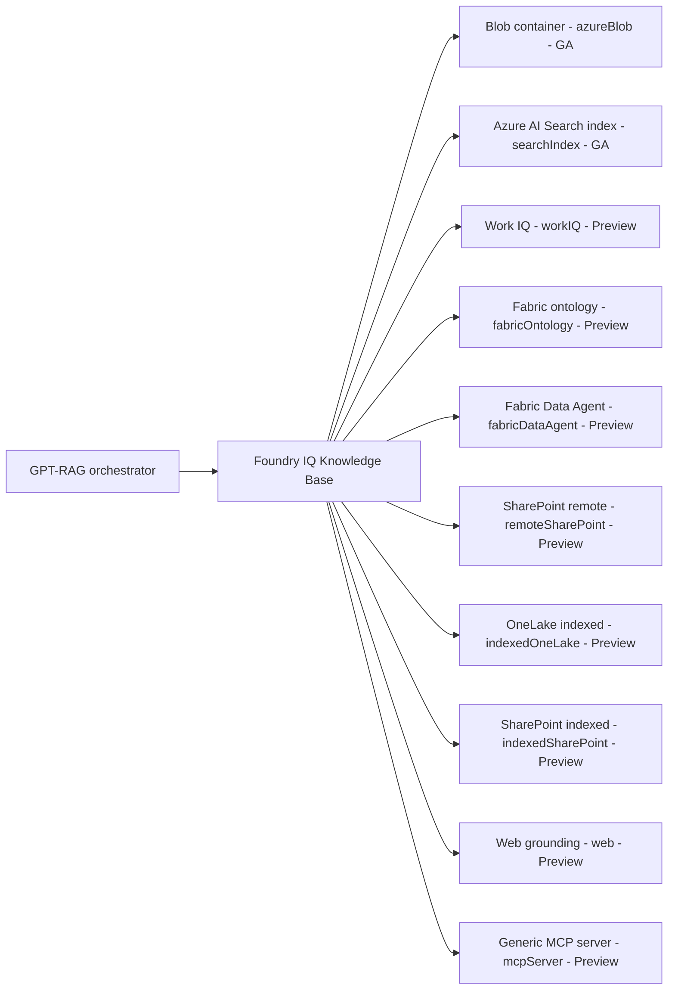

# Grounding sources overview

This page is the map for everything under **Grounding sources**. Read it
first, then jump to the page for the approach and source you want.

## The two approaches

GPT-RAG supports two ways to ground the LLM. Every other page in this
section belongs to one of them. Pick the approach first so you know which
set of pages you are reading.

| | Approach A: Foundry IQ Knowledge Base | Approach B: Azure AI Search direct |
| --- | --- | --- |
| Orchestrator talks to | A single Knowledge Base endpoint that fans out to one or more Knowledge Sources | An Azure AI Search index |
| `RETRIEVAL_BACKEND` | `foundry_iq` (default in v3.0.2+) | `ai_search` |
| Sources it can blend | Blob, existing Search index, Work IQ, Fabric ontology, Fabric Data Agent, SharePoint (remote and indexed), OneLake, Web, generic MCP servers | One AI Search index |
| Multi-source, permission trimming, agentic retrieval | Yes, out of the box | No, you build it |
| Custom ingestion pipeline | Optional (`searchIndex` source) | Required (GPT-RAG ingestion into the index) |
| Status | Default, recommended | Fully supported, rollback and compatibility path |
| Start here | [Prerequisites](howto_grounding_foundry_iq_prereqs.md) | [Azure AI Search direct](howto_grounding_ai_search_direct.md) |

**Rule of thumb**

- New deployment, or you need Microsoft 365, Fabric, SharePoint live,
  OneLake, or Web sources: use Approach A.
- Existing deployment that still runs the classic GPT-RAG ingestion into
  a single AI Search index, or you want the rollback path: stay on Approach B.

!!! note "One backend at a time"
    The orchestrator uses one `RETRIEVAL_BACKEND` per request. You cannot
    mix Approach A and Approach B in the same call. Inside Approach A you
    can enable many Knowledge Sources on the same Knowledge Base and
    Foundry IQ blends the results.

## Prerequisites

Prerequisites depend on the approach.

- **Approach A.** Review [Foundry IQ prerequisites](howto_grounding_foundry_iq_prereqs.md).
  That page covers the shared baseline (region, RBAC, API version, feature
  flags, authorization model). Each knowledge source page adds its own
  extras on top.
- **Approach B.** See [Azure AI Search direct](howto_grounding_ai_search_direct.md).
  If you ingest from SharePoint via the classic path, also see the
  [SharePoint connector](howto_sharepoint_connector.md).

## Retrieval and grounding in plain language

When a user asks a question, the orchestrator does not send the question
straight to a language model. It first looks up relevant material and
includes it in the prompt. That lookup is **retrieval**. The material it
finds is **grounding content**. Answers are built on top of that material,
so they cite real sources instead of guessing.

GPT-RAG can retrieve grounding content from more than one place in the
same request, blend the results, and hand the merged context to the model.

## Approach A: Foundry IQ Knowledge Base

Foundry IQ is a retrieval product in Azure AI Search that sits above the
raw index. Instead of talking to individual indexes, the orchestrator
talks to a **Knowledge Base**, the single retrieval endpoint for a
deployment.

A Knowledge Base points to one or more **Knowledge Sources**. Each source
is one place to look, with its own `kind`. Foundry IQ queries the
sources, applies permissions, and returns a merged, permission-trimmed
result.

Two things matter for operators.

- A Knowledge Base can hold several sources. The orchestrator gets blended
  results in a single call.
- Each source has its own setup, security model, and cost profile. The
  rest of this section covers them one by one.

!!! info "On the name Fabric IQ"
    "Fabric IQ" is Microsoft's umbrella marketing name for grounding on
    Microsoft Fabric data, not something you configure directly. On the
    Knowledge Base it shows up as two concrete kinds: `fabricOntology`
    (reason over a Fabric business ontology and its entities and
    relationships) and `fabricDataAgent` (hand the question to a Fabric
    Data Agent that runs queries over your data). Any time this
    documentation talks about wiring GPT-RAG to Fabric, it is one of
    those two kinds. If you see `FABRIC_IQ_*` in an env var or config
    key, that prefix is historical and configures the `fabricOntology`
    source.

### Knowledge sources at a glance

| Source | Kind | Status | Page |
| --- | --- | --- | --- |
| Blob container | `azureBlob` | GA, default for new deployments | [Documents](howto_grounding_foundry_iq_documents.md) |
| Existing AI Search index | `searchIndex` | GA, for custom ingestion pipelines | [Documents, custom ingestion](howto_grounding_foundry_iq_documents.md#custom-ingestion-path) |
| Work IQ (Microsoft 365) | `workIQ` | Gated public preview | [Work IQ](howto_grounding_work_iq.md) |
| Fabric ontology | `fabricOntology` | Preview | [Fabric ontology](howto_grounding_fabric_ontology.md) |
| Fabric Data Agent | `fabricDataAgent` | Preview | [Fabric Data Agent](howto_grounding_fabric_data_agent.md) |
| SharePoint remote | `remoteSharePoint` | Preview, per-user OBO ACL | [SharePoint remote](howto_grounding_sharepoint_remote.md) |
| OneLake | `indexedOneLake` | Preview, requires workspace RBAC | [OneLake](howto_grounding_onelake.md) |
| SharePoint indexed | `indexedSharePoint` | Preview, app-only auth | [SharePoint indexed](howto_grounding_sharepoint_indexed.md) |
| Web grounding | `web` | Preview, billed per Bing call | [Web grounding](howto_grounding_web_bing.md) |
| Generic MCP server | `mcpServer` | Preview, tool-backed, managed-identity auth only | [Generic MCP server](howto_grounding_mcp_server.md) |

### Pick a source

Match the situation to the source. You can enable several on the same
Knowledge Base.

- **Files in a Blob container.** Use `azureBlob`. Default for new
  deployments.
- **Custom ingestion into an AI Search index.** Register that index as a
  `searchIndex` source and keep the pipeline.
- **Microsoft 365 context** (mail, meetings, files, chats for the
  signed-in user). Add `workIQ`. Requires M365 Copilot licensing and
  signed-in users.
- **Fabric business ontology.** Reason over entities and relationships
  with `fabricOntology`.
- **Fabric Data Agent.** Hand analytical questions to a curated Data
  Agent with `fabricDataAgent`. See the
  [comparison with Fabric ontology](howto_grounding_fabric_data_agent.md#fabric-data-agent-vs-fabric-ontology).
- **SharePoint, live with per-user ACL.** Add `remoteSharePoint`. No
  ingestion, no local copy.
- **SharePoint, indexed with app-only auth.** Add `indexedSharePoint`.
  Foundry IQ maintains its own AI Search index over the site.
- **Fabric OneLake.** Add `indexedOneLake`. Foundry IQ indexes and
  queries lakehouse content natively.
- **Public web, scoped by allow / block lists.** Add `web`. No ACL, no
  OBO, billed per Bing call.
- **Live, tool-backed data from a trusted remote MCP server** (metrics,
  logs, or another system that cannot be pre-indexed). Add `mcpServer`.
  Requires an explicit tool allowlist, a trusted-host allowlist, and a
  knowledge base planning model. See
  [Generic MCP server](howto_grounding_mcp_server.md).

## Approach B: Azure AI Search direct

GPT-RAG can skip Foundry IQ and query an Azure AI Search index directly.
This is the older path and the rollback path. It is not a Knowledge
Source, it is a separate retrieval backend selected with
`RETRIEVAL_BACKEND=ai_search`.

- **Ingestion.** GPT-RAG's own ingestion pipeline writes to the index.
  See [SharePoint connector](howto_sharepoint_connector.md) for the
  classic SharePoint ingestion path.
- **Retrieval.** The orchestrator queries the index directly. No
  Knowledge Base fan-out, no cross-source blending.
- **When to stay here.** Existing deployment not migrating yet, or as a
  rollback if a Foundry IQ change causes trouble.

Full details on the [Azure AI Search direct](howto_grounding_ai_search_direct.md) page.

## Related reading

- [Auth and Doc Security](howto_authentication.md). How the orchestrator
  obtains and forwards the user's delegated token, which is what makes
  per-user security work across sources.
- [Retrieval Optimization](howto_retrieval_optimization.md). Query-time
  tuning that applies once a source is configured.
