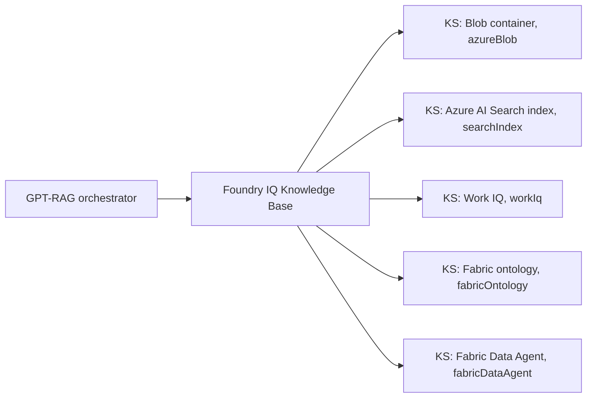

# Grounding sources overview

Start here if you are new to how GPT-RAG finds the information it uses to answer
a question. This page explains what retrieval and grounding mean, what Foundry
IQ is, how Knowledge Bases and Knowledge Sources fit together, which sources
GPT-RAG supports today, and when to pick each one.

The other pages in this section are the operator guides for each source. Read
this page first, then jump to the source you want to enable.

## Which source for which question

If you just want to know where to start, use this quick guide.

- Your files already live in a Blob container? Use the **Blob** knowledge
  source. This is the default for new deployments.
- You already run a custom ingestion pipeline that writes to an Azure AI
  Search index? Register that index as a **Search Index** knowledge source.
- You want answers grounded on the signed-in user's Microsoft 365 world
  (mail, meetings, files, chats)? Add **Work IQ**.
- You have a Fabric ontology and want the agent to reason over its business
  entities and relationships? Add **Fabric ontology**.
- You have a Fabric Data Agent that already answers questions over your
  warehouse or lakehouse? Add **Fabric Data Agent** and let it act as a
  virtual analyst.
- You are on the older Azure AI Search direct path and not ready to move?
  Stay there. It is fully supported as the rollback path.

You can enable more than one of the above on the same Knowledge Base. The
rest of this page explains the pieces behind those names.

## Retrieval and grounding in plain language

When a user asks a question, the orchestrator does not send the question
straight to a language model and hope for the best. It first looks up relevant
material and includes it in the prompt. That lookup is **retrieval**. The
material it finds is **grounding content**. Answers are then built on top of
that material, so they cite real sources instead of guessing.

GPT-RAG can retrieve grounding content from more than one place in the same
request, blend the results, and hand the merged context to the model.

## Foundry IQ, Knowledge Bases, and Knowledge Sources

**Foundry IQ** is a retrieval product in Azure AI Search that sits above the
raw index. Instead of talking to individual indexes, the orchestrator talks to
a Foundry IQ **Knowledge Base**. The Knowledge Base is the single retrieval
endpoint for a deployment.

A Knowledge Base points to one or more **Knowledge Sources**. Each Knowledge
Source is one place to look, with its own `kind`: a Blob container, an existing
Azure AI Search index, a Microsoft 365 tenant, a Fabric ontology, or a Fabric
Data Agent. Foundry IQ queries the sources, applies permissions, and returns a
merged, permission-trimmed result.

> **On the name "Fabric IQ."** You will hear people say "Fabric IQ" a lot.
> It is Microsoft's umbrella marketing name for grounding on Microsoft
> Fabric data, not something you configure directly. In the Foundry IQ
> Knowledge Base, "Fabric IQ" shows up as two concrete knowledge source
> kinds: `fabricOntology` (reason over a Fabric business ontology and its
> entities and relationships) and `fabricDataAgent` (hand the question to a
> Fabric Data Agent that runs queries over your data). Every time this
> documentation talks about wiring GPT-RAG to Fabric, it is one of those
> two kinds on the Knowledge Base. If you ever see `FABRIC_IQ_*` in an env
> var or config key, that prefix is historical: those settings configure
> the `fabricOntology` knowledge source.

Two things matter for operators:

- You do not have to pick one source. A Knowledge Base can hold several, and
  the orchestrator gets blended results in a single call.
- Each Knowledge Source has its own setup, its own security model, and its own
  cost profile. The rest of this section covers them one by one.

## The alternative: Azure AI Search direct

GPT-RAG can also skip Foundry IQ entirely and query an Azure AI Search index
directly. This is the older path and the rollback path. It is not a Knowledge
Source. It is a separate retrieval backend selected with
`RETRIEVAL_BACKEND=ai_search`.

The orchestrator uses one backend at a time:

- `foundry_iq` (default for new v3.0.2+ deployments): retrieval goes through
  the Foundry IQ Knowledge Base, which can hold multiple Knowledge Sources.
- `ai_search`: retrieval goes straight to the GPT-RAG Azure AI Search index.
  No Foundry IQ involved.

## What GPT-RAG supports today

| Source | Kind | Status | Page |
| --- | --- | --- | --- |
| Blob container, native | Foundry IQ Knowledge Source (`azureBlob`) | Generally available. Default for new deployments. | [Foundry IQ: Documents](howto_grounding_foundry_iq_documents.md) |
| Existing Azure AI Search index, custom ingestion | Foundry IQ Knowledge Source (`searchIndex`) | Generally available. For deployments that keep a custom GPT-RAG ingestion pipeline. | [Foundry IQ: Documents](howto_grounding_foundry_iq_documents.md#custom-ingestion-path) |
| Work IQ (Microsoft 365) | Foundry IQ Knowledge Source (`workIq`) | Gated public preview. Off by default. | [Foundry IQ: Work IQ](howto_grounding_work_iq.md) |
| Fabric ontology (Microsoft Fabric) | Foundry IQ Knowledge Source (`fabricOntology`) | Preview. Off by default. Requires Fabric workspace + ontology and signed-in users. | [Foundry IQ: Fabric ontology](howto_grounding_fabric_ontology.md) |
| Fabric Data Agent (Microsoft Fabric) | Foundry IQ Knowledge Source (`fabricDataAgent`) | Preview. Off by default. Requires a published Fabric Data Agent and signed-in users. | [Foundry IQ: Fabric Data Agent](howto_grounding_fabric_data_agent.md) |
| Azure AI Search direct | Not a Foundry IQ Knowledge Source. Separate retrieval backend. | Fully supported. Rollback and compatibility path. | [Direct: Azure AI Search](howto_grounding_ai_search_direct.md) |

## When to use each

Multiple sources can be enabled together on the same Knowledge Base. Pick
the ones that match your data and add them one by one.

- **Blob (`azureBlob`).** PDFs and Office files already sit in the
  `documents` container. This is the new-deployment default. See
  [Foundry IQ: Documents](howto_grounding_foundry_iq_documents.md).
- **Search Index (`searchIndex`).** You keep the GPT-RAG ingestion
  pipeline for custom chunking, large PDFs, Excel handling, or
  security-metadata trimming, and want Foundry IQ to query the resulting
  index. See [Foundry IQ: Documents, custom ingestion path](howto_grounding_foundry_iq_documents.md#custom-ingestion-path).
- **Work IQ (`workIq`).** Answers should include the signed-in user's
  Microsoft 365 context: recent emails, meetings, shared files, chats.
  Requires signed-in users and M365 Copilot licenses. See
  [Foundry IQ: Work IQ](howto_grounding_work_iq.md).
- **Fabric ontology (`fabricOntology`).** You have a Fabric ontology and
  want the agent to reason over its entities and relationships. See
  [Foundry IQ: Fabric ontology](howto_grounding_fabric_ontology.md).
- **Fabric Data Agent (`fabricDataAgent`).** You have a curated Fabric
  Data Agent and want the LLM to hand analytical questions off to it
  rather than reason over an ontology. See
  [Foundry IQ: Fabric Data Agent](howto_grounding_fabric_data_agent.md).
- **Azure AI Search direct.** Existing deployment on
  `RETRIEVAL_BACKEND=ai_search` that is not migrating yet, or a rollback.
  See [Direct: Azure AI Search](howto_grounding_ai_search_direct.md).

Not sure whether to pick Fabric ontology or Fabric Data Agent? See the
comparison table on the
[Fabric Data Agent page](howto_grounding_fabric_data_agent.md#fabric-data-agent-vs-fabric-ontology).

## Related reading

- [Auth and Doc Security](howto_authentication.md) explains how the
  orchestrator obtains and forwards the user's delegated token, which is what
  makes per-user security work across sources.
- [Retrieval Optimization](howto_retrieval_optimization.md) covers query-time
  tuning that applies once a source is configured.
