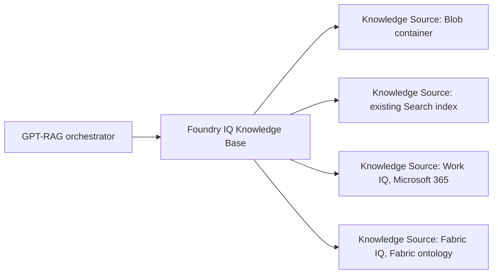

# Grounding sources overview

Start here if you are new to how GPT-RAG finds the information it uses to answer
a question. This page explains what retrieval and grounding mean, what Foundry
IQ is, how Knowledge Bases and Knowledge Sources fit together, which sources
GPT-RAG supports today, and when to pick each one.

The other pages in this section are the operator guides for each source. Read
this page first, then jump to the source you want to enable.

## Retrieval and grounding in plain language

When a user asks a question, the orchestrator does not send the question
straight to a language model and hope for the best. It first looks up relevant
material and includes it in the prompt. That lookup is **retrieval**. The
material it finds is **grounding content**. Answers are then built on top of
that material, so they cite real sources instead of guessing.

GPT-RAG can retrieve grounding content from more than one place in the same
request, blend the results, and hand the merged context to the model.

## Foundry IQ, Knowledge Bases, and Knowledge Sources

**Foundry IQ** is a retrieval product in Azure AI Search that sits above the
raw index. Instead of talking to individual indexes, the orchestrator talks to
a Foundry IQ **Knowledge Base**. The Knowledge Base is the single retrieval
endpoint for a deployment.

A Knowledge Base points to one or more **Knowledge Sources**. Each Knowledge
Source is one place to look: a Blob container, an existing Azure AI Search
index, a Microsoft 365 tenant, and so on. Foundry IQ queries the sources,
applies permissions, and returns a merged, permission-trimmed result.

Two things matter for operators:

- You do not have to pick one source. A Knowledge Base can hold several, and
  the orchestrator gets blended results in a single call.
- Each Knowledge Source has its own setup, its own security model, and its own
  cost profile. The rest of this section covers them one by one.

## The alternative: Azure AI Search direct

GPT-RAG can also skip Foundry IQ entirely and query an Azure AI Search index
directly. This is the older path and the rollback path. It is not a Knowledge
Source. It is a separate retrieval backend selected with
`RETRIEVAL_BACKEND=ai_search`.

The orchestrator uses one backend at a time:

- `foundry_iq` (default for new v3.0.2+ deployments): retrieval goes through
  the Foundry IQ Knowledge Base, which can hold multiple Knowledge Sources.
- `ai_search`: retrieval goes straight to the GPT-RAG Azure AI Search index.
  No Foundry IQ involved.

## What GPT-RAG supports today

| Source | Kind | Status | Page |
| --- | --- | --- | --- |
| Blob container, native | Foundry IQ Knowledge Source (`azureBlob`) | Generally available. Default for new deployments. | [Foundry IQ: Documents](howto_grounding_foundry_iq_documents.md) |
| Existing Azure AI Search index, custom ingestion | Foundry IQ Knowledge Source (`searchIndex`) | Generally available. For deployments that keep a custom GPT-RAG ingestion pipeline. | [Foundry IQ: Documents](howto_grounding_foundry_iq_documents.md#custom-ingestion-path) |
| Work IQ (Microsoft 365) | Foundry IQ Knowledge Source | Gated public preview. Off by default. | [Foundry IQ: Work IQ](howto_grounding_work_iq.md) |
| Fabric IQ (Microsoft Fabric ontology) | Foundry IQ Knowledge Source (`fabricOntology`) | Preview. Off by default. Requires Fabric workspace + ontology and signed-in users. | [Foundry IQ: Fabric IQ](howto_grounding_fabric_iq.md) |
| Azure AI Search direct | Not a Foundry IQ Knowledge Source. Separate retrieval backend. | Fully supported. Rollback and compatibility path. | [Direct: Azure AI Search](howto_grounding_ai_search_direct.md) |

## When to use each

A first-time operator can follow this short decision guide.

- **New deployment, unstructured documents (PDFs, Office files) in Blob.** Use
  the default. That is Foundry IQ with the native Blob Knowledge Source. No
  extra configuration needed. See [Foundry IQ: Documents](howto_grounding_foundry_iq_documents.md).
- **You need custom chunking, Excel handling, PDFs over 300 pages, or per-user
  security based on GPT-RAG metadata fields.** Use Foundry IQ with the custom
  ingestion path, which keeps the GPT-RAG ingestion pipeline and writes to an
  Azure AI Search index. Foundry IQ retrieves from that index. See
  [Foundry IQ: Documents, custom ingestion path](howto_grounding_foundry_iq_documents.md#custom-ingestion-path).
- **You want answers to include personal or team context from Microsoft 365,
  such as recent emails, meetings, shared files, or chats.** Add Work IQ as a
  second Knowledge Source next to the documents source. Requires signed-in
  users and M365 Copilot licenses. See [Foundry IQ: Work IQ](howto_grounding_work_iq.md).
- **You want to ground on analytical data in Microsoft Fabric (semantic
  models, lakehouses, warehouses, KQL databases) exposed through a Fabric
  ontology.** Add Fabric IQ as a Knowledge Source next to the documents
  source. Requires signed-in users, Fabric licenses, and workspace access
  to the ontology. See [Foundry IQ: Fabric IQ](howto_grounding_fabric_iq.md).
- **Existing GPT-RAG deployment that is working on Azure AI Search direct and
  is not ready to migrate.** Stay on `RETRIEVAL_BACKEND=ai_search`. See
  [Direct: Azure AI Search](howto_grounding_ai_search_direct.md).

## Related reading

- [Auth and Doc Security](howto_authentication.md) explains how the
  orchestrator obtains and forwards the user's delegated token, which is what
  makes per-user security work across sources.
- [Retrieval Optimization](howto_retrieval_optimization.md) covers query-time
  tuning that applies once a source is configured.
