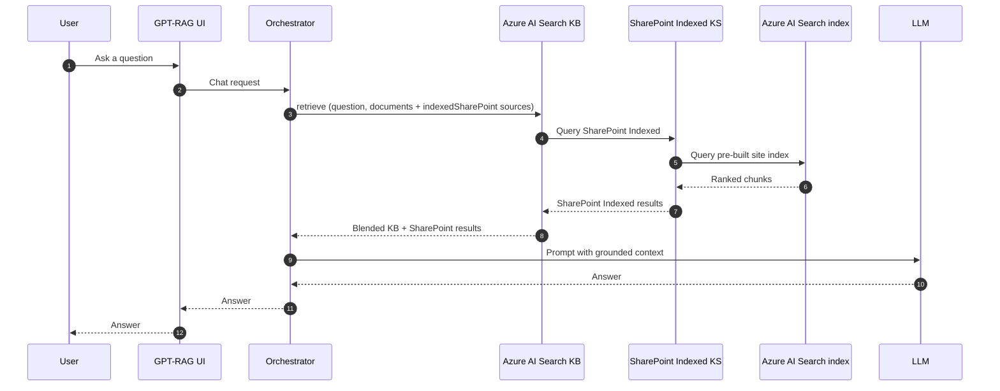

# Foundry IQ: SharePoint Indexed (preview)

SharePoint Indexed is a Foundry IQ Knowledge Source that grounds answers on
content from a specific SharePoint site, served from a pre-built Azure AI
Search index. It runs next to your document Knowledge Source on the same
Knowledge Base. It does not replace it.

On the Knowledge Base, this source is registered with `kind: indexedSharePoint`.
That is the literal string in the Foundry IQ configuration, matching `workIq`,
`fabricOntology`, and `fabricDataAgent` for the other sources. The
`SHAREPOINT_INDEXED_*` App Configuration keys below configure this
`indexedSharePoint` knowledge source.

If you have not read the [Grounding sources overview](howto_grounding_overview.md),
start there. In short: SharePoint Indexed is not a separate retrieval
backend. It is an additional source registered on the Foundry IQ Knowledge
Base, so a single request can pull from documents and from SharePoint in one
call.

!!! warning "Public preview, app-only auth, no ACL trimming"
    SharePoint Indexed is in public preview on Foundry IQ API
    `2026-05-01-preview`. This release ships with **app-only auth** (Managed
    Identity + Federated Identity Credential + Microsoft Graph
    `Sites.Selected` or `Sites.Read.All`) and **does not** perform per-user
    ACL or site-group trimming. Every signed-in user sees results the app
    itself has been granted access to. Behavior, quotas, and configuration
    may change without notice. Do not depend on SharePoint Indexed for
    workloads that require per-user permission trimming until delegated
    auth lands in a later release.

> Complete the [Foundry IQ prerequisites](howto_grounding_foundry_iq_prereqs.md)
> first. The Prerequisites section below covers only what is specific to this
> source.

## When to use SharePoint Indexed

Use SharePoint Indexed when:

- You have a specific SharePoint site whose content should ground answers
  for everyone using the deployment.
- The site's contents are safe to expose to all authenticated users of the
  deployment (no per-user ACL requirement).
- You want retrieval latency comparable to your existing AI Search index
  (the source reads a local index, not a live SharePoint API).

Do not use SharePoint Indexed when:

- You need per-user permission trimming based on SharePoint or M365 group
  membership. Use Work IQ instead, which enforces the caller's M365
  permissions via a delegated (OBO) token.
- You want to ground on the caller's own SharePoint or OneDrive content.
  Use Work IQ.
- You need to cover many SharePoint sites at once. This preview scopes to
  one site per knowledge source; wire additional sites as separate KS
  entries in a follow-up release.

## Prerequisites

Work through these in order. Steps 1 through 4 are hard blockers. Bicep
cannot cover them today because they modify Entra objects; run the `az`
commands manually or ask your tenant admin.

1. Register an Entra application in the target tenant for the SharePoint
   Indexed knowledge source. Note its Application (client) ID; you will
   reference it in step 2.

    ```bash
    az ad app create --display-name "gpt-rag-sharepoint-indexed" \
        --sign-in-audience AzureADMyOrg
    ```

2. Add a Federated Identity Credential on that app that trusts the User
   Assigned Managed Identity used by the orchestrator. Replace
   `<app-object-id>`, `<uami-issuer>`, and `<uami-subject>` with the values
   from your deployment (the UAMI issuer is
   `https://<region>.identity.azure.net/subscriptions/<sub>/resourceGroups/<rg>/providers/Microsoft.ManagedIdentity/userAssignedIdentities/<uami>`;
   the subject is the same URL).

    ```bash
    az ad app federated-credential create \
      --id <app-object-id> \
      --parameters '{
        "name": "gpt-rag-orchestrator-uami",
        "issuer": "<uami-issuer>",
        "subject": "<uami-subject>",
        "audiences": ["api://AzureADTokenExchange"]
      }'
    ```

3. Grant admin consent for the Microsoft Graph permissions the knowledge
   source needs. Prefer `Sites.Selected` (least privilege) over
   `Sites.Read.All`. Replace `<app-object-id>` with the app object ID from
   step 1.

    ```bash
    # Sites.Selected (preferred): grant Application permission, then grant
    # site-scoped access in step 4.
    az ad app permission add --id <app-object-id> \
      --api 00000003-0000-0000-c000-000000000000 \
      --api-permissions 883ea226-0bf2-4a8f-9f9d-92c9162a727d=Role

    az ad app permission admin-consent --id <app-object-id>
    ```

    If your organization does not use `Sites.Selected`, you can grant
    `Sites.Read.All` (tenant-wide read) instead:

    ```bash
    az ad app permission add --id <app-object-id> \
      --api 00000003-0000-0000-c000-000000000000 \
      --api-permissions 332a536c-c7ef-4017-ab91-336970924f0d=Role

    az ad app permission admin-consent --id <app-object-id>
    ```

4. If you used `Sites.Selected`, grant the app read access to the target
   SharePoint site. Run this as a Graph call from a tenant admin session
   (Graph Explorer, or `az rest`). Replace `<site-id>` with the site's
   Microsoft Graph site ID and `<app-object-id>` with the value from
   step 1.

    ```bash
    az rest --method POST \
      --uri "https://graph.microsoft.com/v1.0/sites/<site-id>/permissions" \
      --body '{
        "roles": ["read"],
        "grantedToIdentities": [
          { "application": { "id": "<app-object-id>", "displayName": "gpt-rag-sharepoint-indexed" } }
        ]
      }'
    ```

5. Provision an Azure AI Search index that projects the SharePoint site's
   content. The index name goes into `SHAREPOINT_INDEXED_INDEX_NAME`. This
   preview does not create the index for you; use the SharePoint indexer
   templates published by AI Search, or your own ingestion pipeline.

6. Confirm the AI Search service SKU is at least `standard` (the preview
   feature is not available on `free` or `basic`).

7. The Foundry resource and the target SharePoint tenant must be in the
   same Entra tenant. Cross-tenant SharePoint Indexed is not supported in
   this preview.

## Configuration

All SharePoint Indexed settings live in Azure App Configuration on the
GPT-RAG deployment, under the `gpt-rag` label. `azd provision` seeds the
five keys below with defaults (`SHAREPOINT_INDEXED_ENABLED=false`,
identifiers blank) so you do not have to create them by hand. To turn
SharePoint Indexed on for an existing environment, edit the values in the
App Configuration blade (or `az appconfig kv set --label gpt-rag --key ...`)
and restart the orchestrator; or set the same values as azd env vars and
re-run `azd hooks run postprovision` and `azd deploy`.

| Setting | Default | Purpose |
| --- | --- | --- |
| `SHAREPOINT_INDEXED_ENABLED` | `false` | Set to `true` to turn SharePoint Indexed on. |
| `SHAREPOINT_INDEXED_KNOWLEDGE_SOURCE_NAME` | `""` | Name of the SharePoint Indexed Knowledge Source registered on the Foundry IQ Knowledge Base. |
| `SHAREPOINT_INDEXED_INDEX_NAME` | `""` | Name of the pre-built Azure AI Search index that projects the SharePoint site. |
| `SHAREPOINT_INDEXED_SITE_URL` | `""` | Absolute URL of the target SharePoint site, for example `https://contoso.sharepoint.com/sites/knowledge`. |
| `SHAREPOINT_INDEXED_TENANT_ID` | `""` | Entra tenant ID that owns the SharePoint site and the Entra app registered in step 1. |

All four identifier keys must be non-empty (in addition to
`SHAREPOINT_INDEXED_ENABLED=true`) for the knowledge source to be
registered on the Knowledge Base. If any identifier is missing at
provisioning time, `sharepoint_indexed_setup.py` removes the KS from the
payload and logs a warning; the rest of the provisioning still succeeds.

Notes:

- **App-only, not delegated.** The orchestrator does not forward the
  caller's OBO token to this knowledge source. Every authenticated user
  sees the same results.
- **Additive.** Your existing Knowledge Base retrieval (default Blob path
  or custom ingestion path) continues to run and is blended into the final
  answer.
- **No `FOUNDRY_IQ_MAX_RUNTIME_SECONDS` bump required.** SharePoint
  Indexed reads a pre-built local index and returns quickly, unlike Work
  IQ.

## How SharePoint Indexed works

At runtime, the GPT-RAG orchestrator:

1. Reads `SHAREPOINT_INDEXED_ENABLED` and the four identifiers. If any is
   missing, the source is skipped.
2. Adds the SharePoint Indexed source to the Foundry IQ Knowledge Base
   `retrieve` call, alongside the existing document source.
3. Receives results grounded on the pre-built AI Search index. The
   knowledge source itself calls Microsoft Graph app-only, using the
   Managed Identity federated to the Entra app registered in step 1.
4. Blends the results with the document Knowledge Base results and hands
   the merged context to the model.



## Preview limitations

- No per-user ACL trimming (app-only auth). Results are limited to what
  the app has been granted access to, not to what the individual caller
  can see in SharePoint. Use Work IQ if per-user trimming is required.
- One knowledge source per SharePoint site. Cover multiple sites by
  registering multiple `SHAREPOINT_INDEXED_*` KS entries in follow-up
  releases.
- No delegated (OBO) auth path. Delegated auth is out of scope for this
  preview and is on the roadmap.
- No automatic index provisioning. Bring your own AI Search index that
  projects the SharePoint site.
- Bicep does not create the Entra app, the Federated Identity Credential,
  or the admin consent. Follow the manual steps in Prerequisites.

## Troubleshooting

| Symptom | Likely cause | What to do |
| --- | --- | --- |
| SharePoint Indexed results are always empty. | The Entra app has no admin consent, or `Sites.Selected` was chosen but the app was not granted read access to the target site. | Confirm admin consent for the correct Graph permission and, if using `Sites.Selected`, re-run the `az rest` grant in prerequisite step 4. |
| Provisioning warns that identifiers are missing and skips the KS. | One or more of `SHAREPOINT_INDEXED_KNOWLEDGE_SOURCE_NAME`, `SHAREPOINT_INDEXED_INDEX_NAME`, `SHAREPOINT_INDEXED_SITE_URL`, `SHAREPOINT_INDEXED_TENANT_ID` is blank. | Populate all four keys in App Configuration and re-run `azd hooks run postprovision`. |
| KS registration returns HTTP 400 with a schema error. | The AI Search service does not support the `2026-05-01-preview` API, or the SKU is `free`/`basic`. | Upgrade the SKU to `standard` or higher and confirm the service region supports the preview API. |
| Orchestrator logs show `indexedSharePoint` calls succeeding but the model still ignores the results. | The knowledge base reference to the SharePoint KS may be missing. | Confirm the KB payload includes an entry for `SHAREPOINT_INDEXED_KNOWLEDGE_SOURCE_NAME` under `knowledgeBases[0].knowledgeSources`. Re-render the template if needed. |
| Different tenant sees no results after turning the feature on. | `SHAREPOINT_INDEXED_TENANT_ID` does not match the tenant that owns the SharePoint site, or the Entra app registered in prerequisite step 1 lives in a different tenant. | Recheck the tenant ID and re-register the app in the correct tenant if needed. |

If SharePoint Indexed is unhealthy but you must keep serving traffic, set
`SHAREPOINT_INDEXED_ENABLED=false` in App Configuration. The orchestrator
continues to answer using the existing Knowledge Base only.

## Related reading

- [Grounding sources overview](howto_grounding_overview.md)
- [Foundry IQ: Documents](howto_grounding_foundry_iq_documents.md)
- [Foundry IQ: Work IQ](howto_grounding_work_iq.md)
- [Auth and Doc Security](howto_authentication.md)
