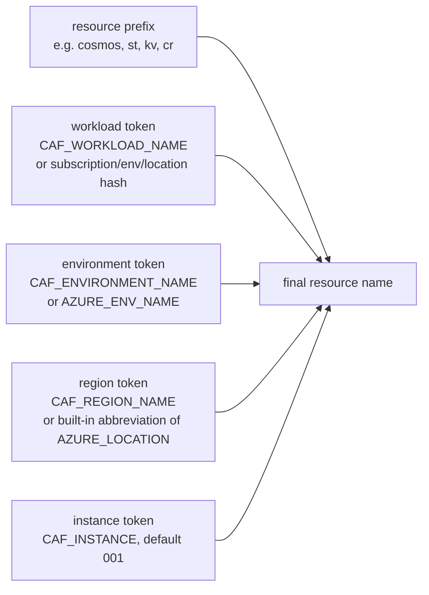

# Resource naming (CAF vs legacy)

Use this guide when you need to understand or change the names GPT-RAG gives to
the Azure resources it provisions.

Starting with GPT-RAG v3.1.0 and [AI Landing Zone
v2.2.0](https://github.com/Azure/bicep-ptn-aiml-landing-zone/releases/tag/v2.2.0),
fresh Basic and Zero Trust deployments produce resource names aligned with the
[Microsoft Cloud Adoption Framework naming and tagging
guidance](https://learn.microsoft.com/azure/cloud-adoption-framework/ready/azure-best-practices/resource-naming)
out of the box. You do not need to set any additional variables for this to
happen.

Existing deployments keep their current names. The naming mode is chosen at
`azd provision` time and does not change resources after the fact.

## The two naming modes

| Mode | When it is used | Example Cosmos DB account name |
| --- | --- | --- |
| `caf` (default in v3.1.0+) | Fresh deployments on GPT-RAG v3.1.0 or later. | `cosmos-y6ijlv-gptrag-v22-aue-001` |
| `legacy` | Deployments that provisioned before GPT-RAG v3.1.0, or fresh deployments that explicitly opt out with `RESOURCE_NAMING_MODE=legacy`. | `cosmos-y6ijlvleexuta` |

Both modes produce fully working deployments. CAF names are easier to read at a
glance, easier to correlate with the environment they belong to, and easier to
audit against enterprise naming standards.

## How CAF names are composed

A CAF resource name in GPT-RAG follows the shape:

```text
<resourcePrefix>-<workload>-<environment>-<region>-<instance>
```



Each token has a sensible default so that operators do not have to set any of
the `CAF_*` variables:

| Token | Environment variable | Default when unset |
| --- | --- | --- |
| Workload | `CAF_WORKLOAD_NAME` | A short hash derived from the subscription ID, `AZURE_ENV_NAME`, and `AZURE_LOCATION`. Stable across re-runs of the same environment. |
| Environment | `CAF_ENVIRONMENT_NAME` | `AZURE_ENV_NAME`. |
| Region | `CAF_REGION_NAME` | A built-in short code from an abbreviation map (for example `australiaeast` becomes `aue`, `eastus2` becomes `eus2`). |
| Instance | `CAF_INSTANCE` | `001`. |
| Prefix | (not user-configurable) | The CAF-recommended abbreviation for the resource type (for example `cosmos`, `st`, `kv`, `cr`, `srch`). |

The full mapping between resource type and prefix, and the exact abbreviation
map for regions, lives in the AI Landing Zone. See the [AILZ parameterization
reference](https://azure.github.io/AI-Landing-Zones/bicep/parameterization) for
the authoritative source of truth.

## Before and after

The table below shows the same resources under `legacy` and `caf` for a
deployment with `AZURE_ENV_NAME=gptrag-v22` in `australiaeast`. Values are
illustrative.

| Resource type | Legacy name | CAF name |
| --- | --- | --- |
| Cosmos DB account | `cosmos-y6ijlvleexuta` | `cosmos-y6ijlv-gptrag-v22-aue-001` |
| AI Search service | `search-y6ijlvleexuta` | `srch-y6ijlv-gptrag-v22-aue-001` |
| Storage account | `sty6ijlvleexuta` | `sty6ijlvgptragv22aue001` |
| Key Vault | `kv-y6ijlvleexuta` | `kv-y6ijlv-gptrag-v22-aue-001` |
| Container Registry | `cry6ijlvleexuta` | `cry6ijlvgptragv22aue001` |
| Log Analytics workspace | `log-y6ijlvleexuta` | `log-y6ijlv-gptrag-v22-aue-001` |
| Application Insights | `appi-y6ijlvleexuta` | `appi-y6ijlv-gptrag-v22-aue-001` |
| Container Apps Environment | `cae-y6ijlvleexuta` | `cae-y6ijlv-gptrag-v22-aue-001` |
| AI Foundry account | `aif-y6ijlvleexuta` | `aif-y6ijlv-gptrag-v22-aue-001` |

Container apps (`ca-orchestrator-*`, `ca-frontend-*`, `ca-dataingest-*`, `ca-mcp-*`)
are provisioned by GPT-RAG's own Bicep, not by the landing zone, and keep the
same legacy-style pattern under both naming modes. This is intentional: their
names must stay stable across releases so `azd deploy` and the post-provision
scripts can find them.

## Opt out and stay on legacy names

Set `RESOURCE_NAMING_MODE=legacy` before `azd provision` if you need to keep the
pre-v3.1.0 naming scheme. Typical reasons:

- You are re-provisioning into an existing subscription or resource group that
  already contains legacy-named GPT-RAG resources and you want the names to
  match.
- You have external tooling, documentation, dashboards, or automation that
  hardcodes the legacy pattern and you cannot update it yet.
- You want to defer the naming change until a later planned change window.

```powershell
azd env set RESOURCE_NAMING_MODE legacy
azd provision
```

Existing deployments that were provisioned before v3.1.0 do not need to set
anything. Resource names are chosen at create time; a landing-zone version bump
alone does not rename resources. Post-provision and `azd deploy` remain
compatible with legacy names.

## Override individual tokens

You can override each token independently while staying in `caf` mode. This is
useful when your organization already publishes CAF token values that GPT-RAG
should adopt.

```powershell
azd env set CAF_WORKLOAD_NAME    "genai"
azd env set CAF_ENVIRONMENT_NAME "prod"
azd env set CAF_REGION_NAME      "aue"
azd env set CAF_INSTANCE         "001"
azd provision
```

With the values above, a Cosmos DB account is named `cosmos-genai-prod-aue-001`.

Constraints to keep in mind:

- Total resource name length is bounded by Azure per resource type. Long custom
  workload or environment tokens can push names over the limit for storage
  accounts, key vaults, or container registries.
- Storage accounts and container registries do not allow hyphens; the landing
  zone strips them automatically, so `sty6ijlv-gptrag-v22-aue-001` becomes
  `sty6ijlvgptragv22aue001`.
- Tokens should stay lower-case and alphanumeric to satisfy the strictest
  resource types.

## What GPT-RAG does under the hood

Post-provision and `azd deploy` do not assume a specific naming pattern. They
resolve each resource by type inside the target resource group using
`az resource list`, so both `caf` and `legacy` names are discovered
automatically. If the resource cannot be found by type, the scripts fall back to
the legacy `<prefix>-<resourceToken>` derivation. This keeps existing legacy
environments working without changes.

## See also

- [Deployment Guide](deploy.md) for the end-to-end `azd provision` and
  `azd deploy` flow.
- [AI Landing Zone parameterization
  reference](https://azure.github.io/AI-Landing-Zones/bicep/parameterization)
  for the authoritative naming contract and the full abbreviation map.
- [Cloud Adoption Framework naming and tagging
  guidance](https://learn.microsoft.com/azure/cloud-adoption-framework/ready/azure-best-practices/resource-naming).
- [GPT-RAG v3.1.0 release
  notes](https://github.com/Azure/GPT-RAG/releases/tag/v3.1.0).
