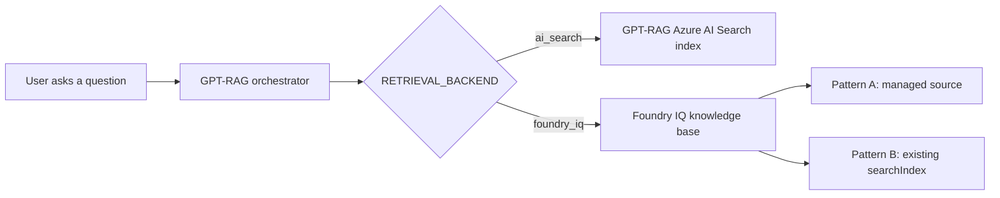

# Retrieval backend selection

Use this guide when you need to decide whether GPT-RAG should retrieve from the
direct Azure AI Search index or from a Foundry IQ knowledge base.

The safe default for existing deployments is still:

```text
RETRIEVAL_BACKEND=ai_search
```

Set `RETRIEVAL_BACKEND=foundry_iq` only after you have provisioned the Foundry IQ
knowledge base, confirmed the security mode, and run a smoke test. Fresh v3
deployments can move to Foundry IQ by default only after the AI Landing Zone
support is validated and released.

## The two backends

| Backend | What it uses | Best for | Operator impact |
| --- | --- | --- | --- |
| `ai_search` | The GPT-RAG Azure AI Search index, usually `ragindex`. | Existing deployments, runtime uploads, multimodal retrieval, and the current GPT-RAG ingestion path. | No migration required. This remains the rollback path. |
| `foundry_iq` | A Foundry IQ knowledge base hosted by Azure AI Search agentic retrieval. | Managed knowledge retrieval, multi-source grounding, and the v3 managed-knowledge path. | Requires knowledge base settings, billing choice, and a security mode. |



## Pattern A and Pattern B

Foundry IQ still runs on Azure AI Search. The difference is who owns the source
and index lifecycle.

| Pattern | AILZ value | What it means | Use when |
| --- | --- | --- | --- |
| Pattern A: managed source | `FOUNDRY_IQ_PATTERN=managed` | Foundry IQ manages the source connector, chunking, vectorization, index, and refresh. | You want the simplest managed ingestion path and your source supports the permissions you need. |
| Pattern B: existing index | `FOUNDRY_IQ_PATTERN=searchIndex` | The existing GPT-RAG Azure AI Search index is registered as a Foundry IQ `searchIndex` knowledge source. | You need runtime uploads, GPT-RAG chunking/schema, multimodal parity, or GPT-RAG security fields. |

Pattern B is the safest first step for most existing GPT-RAG environments because
it keeps the current ingestion and index schema while routing retrieval through
the knowledge base.

## Security modes

There are two security mechanisms. They solve different problems and should not
be mixed up.

| Security mode | Used by | How it is enforced |
| --- | --- | --- |
| Native ingested permissions | Pattern A sources that ingest permissions, such as ADLS Gen2 ACLs, SharePoint, OneLake/Fabric, or Purview labels. | The orchestrator forwards the user's delegated Search token in `x-ms-query-source-authorization`. Foundry IQ evaluates the ingested permissions. |
| GPT-RAG security fields | Pattern B with the existing GPT-RAG index. | The orchestrator sends an OData `filterAddOn` over GPT-RAG security fields. This is separate from the OBO header. |

Important rules:

- Plain Blob storage provides container-level RBAC for this purpose. Do not rely
  on it for per-document trimming unless you use Purview labels or an equivalent
  permission source.
- ADLS Gen2 ACLs, SharePoint, OneLake/Fabric, and Purview labels can support
  per-document permission trimming when native permission ingestion is
  configured.
- Pattern B uses the existing GPT-RAG index registered as a `searchIndex`
  knowledge source. GPT-RAG security fields are enforced through `filterAddOn`,
  not through `x-ms-query-source-authorization`.
- The `x-ms-query-source-authorization` header is for native ingested
  permissions.
- Per-user security uses the `2026-05-01-preview` Azure AI Search API.
- Security-enabled retrieval must fail closed. Missing token, filter, or
  permission configuration should be treated as an error, not as permission to
  run an unfiltered query.

## Configuration settings

All runtime settings are stored in Azure App Configuration with the `gpt-rag`
label, or supplied as container environment variables when you use the
`containerEnv` runtime mode.

| Setting | Default | Used when | Purpose |
| --- | --- | --- | --- |
| `RETRIEVAL_BACKEND` | `ai_search` | Always | Selects `ai_search` or `foundry_iq`. |
| `KNOWLEDGE_BASE_NAME` | Empty until Foundry IQ is selected | `foundry_iq` | Foundry IQ knowledge base name. |
| `KNOWLEDGE_BASE_ENDPOINT` | Empty until Foundry IQ is selected | `foundry_iq` | Azure AI Search endpoint that hosts the knowledge base. |
| `KNOWLEDGE_BASE_CONNECTION_ID` | Empty until Foundry IQ is selected | `foundry_iq` | Dedicated AI Foundry connection ID for the knowledge base. Do not reuse `SEARCH_CONNECTION_ID`. |
| `FOUNDRY_IQ_API_VERSION` | `2026-05-01-preview` | `foundry_iq` | Required for native per-user permissions and Pattern B `filterAddOn`. |
| `FOUNDRY_IQ_KNOWLEDGE_RETRIEVAL_BILLING_PLAN` | `free` | Provisioning and post-provision | Azure AI Search `knowledgeRetrieval` billing plan. |
| `FOUNDRY_IQ_KNOWLEDGE_SOURCE_NAME` | Empty unless Pattern B | Pattern B | Name of the `searchIndex` knowledge source. |
| `FOUNDRY_IQ_FILTER_ADD_ON_ENABLED` | `false` | Pattern B | Enables query-time GPT-RAG security filtering through `filterAddOn`. |
| `FOUNDRY_IQ_SECURITY_FIELD_NAME` | `metadata_security_id` | Pattern B | Field used to build the GPT-RAG security filter. |
| `FOUNDRY_IQ_MAX_OUTPUT_DOCUMENTS` | `5` | `foundry_iq` | Caps the number of documents returned by the knowledge base. |

The AI Landing Zone also stamps Pattern B setup values used by the post-provision
script:

| Setting | Purpose |
| --- | --- |
| `FOUNDRY_IQ_PATTERN` | `managed` for Pattern A or `searchIndex` for Pattern B. |
| `FOUNDRY_IQ_SEARCH_INDEX_NAME` | Existing Azure AI Search index registered as the Pattern B knowledge source. |
| `FOUNDRY_IQ_SEMANTIC_CONFIGURATION_NAME` | Semantic configuration on the existing index. |
| `FOUNDRY_IQ_SOURCE_DATA_FIELDS` | Source fields exposed by the knowledge source. |
| `FOUNDRY_IQ_SEARCH_FIELDS` | Searchable fields used by the knowledge source. |
| `FOUNDRY_IQ_BASE_FILTER` | Optional persisted filter on the knowledge source. |

## Billing choice

Foundry IQ retrieval uses Azure AI Search agentic retrieval billing through the
Search service `knowledgeRetrieval` plan.

| Plan | Use when |
| --- | --- |
| `free` | You want to stay within the included allowance. Retrieval can fail when the allowance is exhausted. |
| `standard` | You explicitly opt in to pay-as-you-go retrieval after the included allowance. |

Set the plan before provisioning or before running the Foundry IQ post-provision
script:

```powershell
azd env set FOUNDRY_IQ_KNOWLEDGE_RETRIEVAL_BILLING_PLAN free
```

Use `standard` only when the operator has approved the billing change.

## Enable Foundry IQ with Pattern B

Pattern B keeps the existing GPT-RAG index and is the recommended migration path
for current deployments.

1. Start from a working `ai_search` deployment.
2. Set the Foundry IQ parameters before provisioning:

    ```powershell
    azd env set RETRIEVAL_BACKEND foundry_iq
    azd env set FOUNDRY_IQ_PATTERN searchIndex
    azd env set FOUNDRY_IQ_API_VERSION 2026-05-01-preview
    azd env set FOUNDRY_IQ_KNOWLEDGE_RETRIEVAL_BILLING_PLAN free
    azd env set FOUNDRY_IQ_FILTER_ADD_ON_ENABLED true
    ```

3. Run `azd provision`.
4. Create or update the data-plane knowledge source and knowledge base:

    ```powershell
    ./infra/scripts/Configure-FoundryIQKnowledgeBase.ps1 `
      -SearchEndpoint "https://<search-name>.search.windows.net" `
      -KnowledgeBaseName "<knowledge-base-name>" `
      -KnowledgeSourceName "<knowledge-source-name>" `
      -SearchIndexName "<gpt-rag-index-name>" `
      -SemanticConfigurationName "<semantic-config-name>" `
      -SearchServiceResourceId "/subscriptions/<sub>/resourceGroups/<rg>/providers/Microsoft.Search/searchServices/<search-name>" `
      -KnowledgeRetrievalBillingPlan "free"
    ```

5. Deploy or restart the orchestrator so it reads the backend selector at startup.
6. Smoke test with a user who should see a document and a user who should not see
   it. The second test must fail closed, not return unfiltered results.

The script caller needs **Search Service Contributor** on the Search service.
When `NETWORK_ISOLATION=true`, run the script from the jumpbox or another host
with VNet access.

## Enable Foundry IQ with Pattern A

Use Pattern A only when the source connector and permission model meet your
needs.

1. Confirm the source supports the permissions you require.
2. Avoid claiming per-document security for plain Blob unless you use Purview
   labels or an equivalent per-document permission source.
3. Keep multimodal workloads on `ai_search` or Pattern B until captioning parity
   is proven.
4. Use `FOUNDRY_IQ_API_VERSION=2026-05-01-preview` when native per-user
   permissions are enabled.
5. Run a smoke test with allowed and denied users before sending production
   traffic.

## Roll back to Azure AI Search

Rollback is intentionally simple.

1. Set the backend selector back to Azure AI Search:

    ```powershell
    az appconfig kv set `
      --name <app-config-name> `
      --key RETRIEVAL_BACKEND `
      --value ai_search `
      --label gpt-rag `
      --yes
    ```

2. Restart the orchestrator Container App so the startup selector is re-read.
3. Ask a known retrieval question and confirm citations come from the GPT-RAG
   Azure AI Search index.

You do not need to delete the knowledge base to roll back. Leave it in place
while you investigate.

## Migration guidance

- Existing deployments should stay on `ai_search` until you explicitly opt in.
- Start with Pattern B if you already rely on GPT-RAG ingestion, runtime uploads,
  multimodal retrieval, or custom security fields.
- Use Pattern A for new managed-source deployments only after you validate
  connector availability, security behavior, billing, latency, and refresh
  timing.
- Do not flip production traffic until you have tested both allowed and denied
  retrieval paths.
- Keep the rollback command ready during the first production change window.

## Known limitations

- Multimodal Pattern A captioning parity is deferred. Keep multimodal on
  `ai_search` or Pattern B until the managed source output is proven equivalent.
- Runtime document uploads still need the self-managed GPT-RAG index for
  low-latency searchability. Use Pattern B for that path.
- Pattern A source refresh can take seconds to minutes. It is not a low-latency
  upload path.
- Pattern B requires the existing index to have a semantic configuration. Vector
  fields must have the expected vectorizer setup.
- The knowledge base and Pattern B index must live on the same Search service.
- Per-user security and `filterAddOn` require `2026-05-01-preview`.
