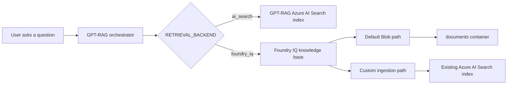
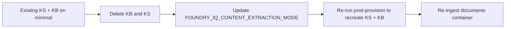

# Retrieval backend selection

Use this guide when you need to decide how GPT-RAG should retrieve grounding
content.

Starting with GPT-RAG v3.0.2 and AI Landing Zone v2.1.2, new deployments use
Foundry IQ by default through a native Azure Blob Knowledge Source. The
deployment provisions the Knowledge Source and Knowledge Base automatically, and
Foundry IQ processes files directly from the `documents` container.

Existing deployments can stay on Azure AI Search until you explicitly migrate:

```text
RETRIEVAL_BACKEND=ai_search
```

If you need to keep a custom GPT-RAG ingestion pipeline, use the Foundry IQ
`searchIndex` path. In that mode, GPT-RAG ingestion processes files, writes
chunks to Azure AI Search, and Foundry IQ retrieves from that existing index.

## The two backends

| Backend | What it uses | Best for | Operator impact |
| --- | --- | --- | --- |
| `foundry_iq` | A Foundry IQ knowledge base hosted by Azure AI Search agentic retrieval. | New GPT-RAG v3.0.2+ deployments. | The default native Blob path is provisioned automatically by AI Landing Zone v2.1.2+. |
| `ai_search` | The GPT-RAG Azure AI Search index, usually `ragindex`. | Existing deployments that are not migrating yet, rollback, or compatibility scenarios. | No migration required. Existing deployments can keep this setting until they migrate. |



## Foundry IQ setup choices

Foundry IQ has two setup choices:

| Choice | AILZ value | What it means | Use when |
| --- | --- | --- | --- |
| Default Blob path | `FOUNDRY_IQ_PATTERN=azureBlob` | Foundry IQ reads files directly from the `documents` container through a native Azure Blob Knowledge Source. Foundry IQ handles source ingestion, chunking, vectorization, index creation, and refresh. GPT-RAG ingestion is not used in this path. | You want the default new deployment path and do not need a custom GPT-RAG ingestion pipeline. |
| Custom ingestion path | `FOUNDRY_IQ_PATTERN=searchIndex` | GPT-RAG ingestion processes files, writes chunks to Azure AI Search, and that existing index is registered as a Foundry IQ `searchIndex` knowledge source. | You intentionally keep a custom GPT-RAG ingestion pipeline. |

Use the custom ingestion path only when you intentionally keep document
processing outside Foundry IQ. It keeps the GPT-RAG ingestion pipeline and index
schema while routing retrieval through the Foundry IQ knowledge base.

## Security modes

There are two security mechanisms. They solve different problems and should not
be mixed up.

| Security mode | Used by | How it is enforced |
| --- | --- | --- |
| Native ingested permissions | The default Blob path and other sources that ingest permissions, such as Azure Blob RBAC scope, ADLS Gen2 ACLs, SharePoint, OneLake/Fabric, or Purview labels. | The orchestrator forwards the user's delegated Search token in `x-ms-query-source-authorization`. Foundry IQ evaluates the ingested permissions. |
| GPT-RAG security fields | The custom ingestion path with the existing GPT-RAG index. | The orchestrator sends an OData `filterAddOn` over GPT-RAG security fields. This is separate from the OBO header. |

Important rules:

- Plain Blob storage provides container-level RBAC for this purpose. Do not rely
  on it for per-document trimming unless you use Purview labels or an equivalent
  permission source.
- ADLS Gen2 ACLs, SharePoint, OneLake/Fabric, and Purview labels can support
  per-document permission trimming when native permission ingestion is
  configured.
- The custom ingestion path uses the existing GPT-RAG index registered as a `searchIndex`
  knowledge source. GPT-RAG security fields are enforced through `filterAddOn`,
  not through `x-ms-query-source-authorization`.
- The `x-ms-query-source-authorization` header is for native ingested
  permissions.
- Per-user security uses the `2026-05-01-preview` Azure AI Search API.
- Security-enabled retrieval must fail closed. Missing token, filter, or
  permission configuration should be treated as an error, not as permission to
  run an unfiltered query.

## Configuration settings

All runtime settings are stored in Azure App Configuration with the `gpt-rag`
label, or supplied as container environment variables when you use the
`containerEnv` runtime mode.

| Setting | Default | Used when | Purpose |
| --- | --- | --- | --- |
| `RETRIEVAL_BACKEND` | `foundry_iq` for new v3.0.2+ deployments | Always | Selects `ai_search` or `foundry_iq`. Existing deployments can keep `ai_search` until they migrate. |
| `KNOWLEDGE_BASE_NAME` | Generated during deployment | `foundry_iq` | Foundry IQ knowledge base name. |
| `KNOWLEDGE_BASE_ENDPOINT` | Generated during deployment | `foundry_iq` | Azure AI Search endpoint that hosts the knowledge base. |
| `KNOWLEDGE_BASE_CONNECTION_ID` | Generated during deployment | `foundry_iq` | Dedicated AI Foundry connection ID for the knowledge base. Do not reuse `SEARCH_CONNECTION_ID`. |
| `FOUNDRY_IQ_PATTERN` | `azureBlob` | `foundry_iq` provisioning | Selects the default Blob path or the custom ingestion path. Use `searchIndex` only when you intentionally keep a custom GPT-RAG ingestion pipeline. |
| `FOUNDRY_IQ_API_VERSION` | `2026-05-01-preview` | `foundry_iq` | Required for native per-user permissions and custom ingestion path `filterAddOn`. |
| `FOUNDRY_IQ_KNOWLEDGE_RETRIEVAL_BILLING_PLAN` | `free` | Deployment configuration | Azure AI Search `knowledgeRetrieval` billing plan. |
| `FOUNDRY_IQ_KNOWLEDGE_SOURCE_NAME` | Generated during deployment | `foundry_iq` | Name of the Foundry IQ knowledge source. |
| `FOUNDRY_IQ_KNOWLEDGE_SOURCE_KIND` | `azureBlob` | `foundry_iq` | Knowledge Source kind sent to Foundry IQ. Use `searchIndex` only for the custom ingestion path. |
| `FOUNDRY_IQ_STORAGE_CONTAINER_NAME` | `documents` | Default Blob path | Storage container that Foundry IQ reads directly. |
| `FOUNDRY_IQ_INGESTION_PERMISSION_OPTIONS` | `["rbacScope"]` | Default Blob path | Permission metadata ingested by the native Azure Blob Knowledge Source. |
| `FOUNDRY_IQ_FILTER_ADD_ON_ENABLED` | `false` | Custom ingestion path | Enables query-time GPT-RAG security filtering through `filterAddOn`. |
| `FOUNDRY_IQ_SECURITY_FIELD_NAME` | `metadata_security_id` | Custom ingestion path | Field used to build the GPT-RAG security filter. |
| `FOUNDRY_IQ_MAX_OUTPUT_DOCUMENTS` | `5` | `foundry_iq` | Caps the number of documents returned by the knowledge base. |
| `FOUNDRY_IQ_CONTENT_EXTRACTION_MODE` | `standard` | Default Blob path | Native Blob content extraction mode. `standard` uses the Foundry IQ Content Understanding skill (layout and OCR) so scanned and image-only PDFs are ingested with text. `minimal` skips Content Understanding and only ingests text already present in the source. The setting is immutable on an existing Knowledge Source. See [Content extraction modes](#content-extraction-modes-and-pdf-handling). |

The AI Landing Zone also stamps setup values used by deployment configuration:

| Setting | Purpose |
| --- | --- |
| `FOUNDRY_IQ_SEARCH_INDEX_NAME` | Existing Azure AI Search index registered as the custom ingestion path knowledge source. |
| `FOUNDRY_IQ_SEMANTIC_CONFIGURATION_NAME` | Semantic configuration on the existing index. |
| `FOUNDRY_IQ_SOURCE_DATA_FIELDS` | Source fields exposed by the knowledge source. |
| `FOUNDRY_IQ_SEARCH_FIELDS` | Searchable fields used by the knowledge source. |
| `FOUNDRY_IQ_BASE_FILTER` | Optional persisted filter on the knowledge source. |

## Billing choice

Foundry IQ retrieval uses Azure AI Search agentic retrieval billing through the
Search service `knowledgeRetrieval` plan.

| Plan | Use when |
| --- | --- |
| `free` | You want to stay within the included allowance. Retrieval can fail when the allowance is exhausted. |
| `standard` | You explicitly opt in to pay-as-you-go retrieval after the included allowance. |

Set the plan before provisioning:

```powershell
azd env set FOUNDRY_IQ_KNOWLEDGE_RETRIEVAL_BILLING_PLAN free
```

Use `standard` only when the operator has approved the billing change.

## Default Foundry IQ deployment

For new GPT-RAG v3.0.2+ deployments with AI Landing Zone v2.1.2+, no manual
backend configuration is required. The default configuration is:

```text
RETRIEVAL_BACKEND=foundry_iq
FOUNDRY_IQ_PATTERN=azureBlob
FOUNDRY_IQ_KNOWLEDGE_SOURCE_KIND=azureBlob
FOUNDRY_IQ_STORAGE_CONTAINER_NAME=documents
FOUNDRY_IQ_INGESTION_PERMISSION_OPTIONS=["rbacScope"]
FOUNDRY_IQ_CONTENT_EXTRACTION_MODE=standard
```

The deployment creates a native Foundry IQ Azure Blob Knowledge Source and a
Knowledge Base. Foundry IQ processes files directly from the `documents`
container. No separate Knowledge Source or Knowledge Base creation step is
required after deployment.

## Content extraction modes and PDF handling

The default Blob path supports two content extraction modes. The mode controls
whether Foundry IQ runs the Content Understanding skill on each document while
ingesting it.

| Mode | What it does | Use when |
| --- | --- | --- |
| `standard` (default) | Foundry IQ runs the `Microsoft.Skills.Util.ContentUnderstandingSkill` on each document for layout, OCR, and structured extraction. Scanned PDFs, image-only PDFs, and PDFs without a text layer are OCR'd and become searchable. | This is the safe default for typical document libraries, which usually include some scanned content. |
| `minimal` | Foundry IQ extracts only the text already present in the source. PDFs without a text layer ingest with empty content and are not searchable. No Content Understanding billing. | You have validated that the corpus is text-only PDFs (or non-PDF text files) and you want to skip Content Understanding cost. |

The single most common failure with `minimal` is silent: a scanned PDF lands in
the container, ingestion reports success, but every retrieval against that
document returns nothing. The default is `standard` to avoid this trap.

### What `standard` requires

- The Foundry resource must be in a region that supports Content Understanding.
  See the [region support
  list](https://learn.microsoft.com/azure/ai-services/content-understanding/service-limits#region-support).
- On first use, Foundry IQ may require a one-time
  `PATCH /contentunderstanding/defaults` call against the Foundry resource. If
  this has not been done, Knowledge Source creation fails with `DefaultsNotSet`.
  The GPT-RAG post-provision setup handles this for new deployments; if you hit
  `DefaultsNotSet`, see the troubleshooting note at the bottom of this section.
- `standard` is billed through Content Understanding meters in addition to the
  Azure AI Search `knowledgeRetrieval` plan.
- Per-document limits: 300 pages and 5 minutes of processing time.

Documents that exceed those limits, or scenarios that need custom chunking,
custom enrichment, or Excel chunking, should use the alternative GPT-RAG
ingestion path (see [When to use the GPT-RAG ingestion
path](#when-to-use-the-gpt-rag-ingestion-path)).

### Switching the mode after deployment

`FOUNDRY_IQ_CONTENT_EXTRACTION_MODE` is **immutable** on an existing Knowledge
Source. To change it you have to recreate the Knowledge Source, and because the
Knowledge Base references the Knowledge Source by name, you typically recreate
both. There is no in-place update.

To switch from `minimal` to `standard` (or back) on an existing deployment:

1. Update the App Configuration value (or `azd env set`) to the new mode:

    ```powershell
    azd env set FOUNDRY_IQ_CONTENT_EXTRACTION_MODE standard
    ```

2. Delete the existing Foundry IQ Knowledge Source and Knowledge Base for the
   environment from the Azure AI Search resource (data plane). Use the Search
   data-plane REST API with the `2026-05-01-preview` version.
3. Re-run the GPT-RAG post-provision step that creates the Foundry IQ
   resources, so the Knowledge Source is recreated with the new mode and the
   Knowledge Base is rebound to it.
4. Re-ingest the documents container so the new Knowledge Source processes the
   files with the chosen mode.



### Troubleshooting

- **`DefaultsNotSet` when creating the Knowledge Source on `standard`.** The
  Foundry resource has not been initialized for Content Understanding. Make a
  one-time `PATCH /contentunderstanding/defaults` call against the Foundry
  resource and re-run the setup. See the [Content Understanding skill
  reference](https://learn.microsoft.com/azure/search/cognitive-search-skill-content-understanding)
  for the payload.
- **Scanned PDF ingests with empty content.** The Knowledge Source is on
  `minimal`. Either re-create it on `standard` (steps above) or run the document
  through the GPT-RAG ingestion path.
- **PDF over 300 pages or processing times out.** `standard` cannot handle it.
  Use the GPT-RAG ingestion path with Document Intelligence.

## When to use the GPT-RAG ingestion path

The default Blob path is the simplest production setup, but the GPT-RAG
ingestion service (`gpt-rag-ingestion` plus Azure AI Search) is still the right
choice for several scenarios:

| Scenario | Why the GPT-RAG ingestion path |
| --- | --- |
| PDFs over 300 pages, or single documents that take more than 5 minutes to process. | Exceeds the `standard` content extraction limits. GPT-RAG ingestion uses Azure AI Document Intelligence and can chunk and process longer documents. |
| Custom chunking strategy (sentence/window/semantic chunking, custom overlap, custom metadata enrichment). | The GPT-RAG ingestion pipeline is the place to customize chunking. The default Blob path uses Foundry IQ's built-in chunker. |
| Excel and spreadsheet chunking. | GPT-RAG ingestion has dedicated handling for Excel sheets. |
| Per-document security trimming via custom `metadata_security_*` fields. | Use the custom ingestion path (`FOUNDRY_IQ_PATTERN=searchIndex`) with `FOUNDRY_IQ_FILTER_ADD_ON_ENABLED=true`, or stay on `RETRIEVAL_BACKEND=ai_search`. |
| Low-latency ingestion after a runtime upload. | The default Blob path source refresh can take seconds to minutes. GPT-RAG ingestion writes directly into the index. |

Two ways to combine the GPT-RAG ingestion service with Foundry IQ retrieval:

- **`RETRIEVAL_BACKEND=ai_search`.** Retrieval bypasses Foundry IQ entirely and
  goes straight to the GPT-RAG Azure AI Search index. Simplest rollback target.
- **`RETRIEVAL_BACKEND=foundry_iq` with `FOUNDRY_IQ_PATTERN=searchIndex`.**
  Keep GPT-RAG ingestion producing the index, but register that index as a
  Foundry IQ `searchIndex` Knowledge Source so retrieval still goes through the
  Foundry IQ Knowledge Base. This is the custom ingestion path described below.

## Use Foundry IQ with a custom GPT-RAG ingestion pipeline

Use the custom ingestion path only when you need to keep using a custom GPT-RAG
ingestion pipeline.

1. Start from a working `ai_search` deployment.
2. Set the Foundry IQ parameters before provisioning:

    ```powershell
    azd env set RETRIEVAL_BACKEND foundry_iq
    azd env set FOUNDRY_IQ_PATTERN searchIndex
    azd env set FOUNDRY_IQ_API_VERSION 2026-05-01-preview
    azd env set FOUNDRY_IQ_KNOWLEDGE_RETRIEVAL_BILLING_PLAN free
    azd env set FOUNDRY_IQ_FILTER_ADD_ON_ENABLED true
    ```

3. Run `azd provision`.
4. Deploy or restart the orchestrator so it reads the backend selector at startup.

## Roll back to Azure AI Search

Rollback is intentionally simple.

1. Set the backend selector back to Azure AI Search:

    ```powershell
    az appconfig kv set `
      --name <app-config-name> `
      --key RETRIEVAL_BACKEND `
      --value ai_search `
      --label gpt-rag `
      --yes
    ```

2. Restart the orchestrator Container App so the startup selector is re-read.
3. Ask a known retrieval question and confirm citations come from the GPT-RAG
   Azure AI Search index.

You do not need to delete the knowledge base to roll back. Leave it in place
while you investigate.

## Migration guidance

- New GPT-RAG v3.0.3+ deployments use the Foundry IQ default Blob path with
  `FOUNDRY_IQ_CONTENT_EXTRACTION_MODE=standard`, which handles scanned and
  image-only PDFs out of the box.
- Existing deployments can stay on `ai_search` until you explicitly migrate.
- Use the custom ingestion path if you need to keep using a custom GPT-RAG
  ingestion pipeline.
- Use the GPT-RAG ingestion path for PDFs over 300 pages, custom chunking,
  Excel chunking, or low-latency runtime uploads.
- Do not claim per-document security for plain Blob unless you use Purview
  labels or another per-document permission source. The default Blob path uses
  RBAC scope permissions.
- Keep the rollback command ready during the first production change window.

## Known limitations

- The default Blob path on `FOUNDRY_IQ_CONTENT_EXTRACTION_MODE=standard` has
  per-document limits of 300 pages and 5 minutes of processing time. Documents
  that exceed those limits need the GPT-RAG ingestion path with Document
  Intelligence.
- `FOUNDRY_IQ_CONTENT_EXTRACTION_MODE` is immutable on an existing Knowledge
  Source. Switching modes requires deleting and recreating the Knowledge Source
  and Knowledge Base, and re-ingesting the container.
- `standard` mode requires a Foundry resource in a Content Understanding
  supported region and is billed through Content Understanding meters in
  addition to the `knowledgeRetrieval` plan.
- Multimodal captioning parity for the default Blob path is deferred. Keep
  multimodal on `ai_search` or the custom ingestion path until the native
  Foundry IQ output is proven equivalent.
- Runtime document uploads still need the self-managed GPT-RAG index for
  low-latency searchability. Use the custom ingestion path for that path.
- The default Blob path source refresh can take seconds to minutes. It is not a
  low-latency upload path.
- The custom ingestion path requires the existing index to have a semantic
  configuration. Vector fields must have the expected vectorizer setup.
- The knowledge base and custom ingestion path index must live on the same
  Search service.
- Per-user security and `filterAddOn` require `2026-05-01-preview`.
